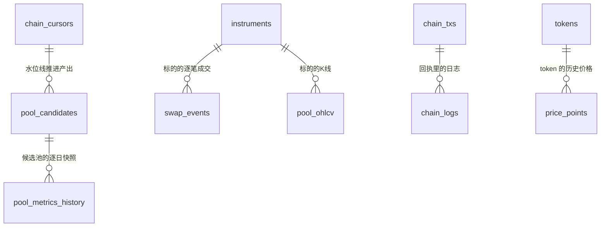

# research 表结构文档

本文档是 `research/` 工作区关系库表结构的唯一文档真相。只保留当前最新完整结构，不记录历史迁移过程；
改表（新增/删除/重命名表或字段、类型/可空/默认值/约束/索引/业务语义变化）必须在同一改动中同步本文档。

正式迁移脚本位于 [`packages/storage/src/alpha_storage/migrations/versions/`](packages/storage/src/alpha_storage/migrations/versions/)。

## 0. 通用约定

- 主键统一用 `BIGSERIAL`（`BigInteger` + `primary_key=True`）自增；天然有业务主键的缓存类表（第 10 节起）直接用联合主键。
- 链上地址统一小写存储。第 3~9 节的历史表用定长 `CHAR(42)`；**第 10 节起的新表一律用 `VARCHAR`**
  （`CHAR(N)` 读出来会带尾部空格，只在 SQL `where` 里比较安全，在 Python 里比较或序列化会出错）。
- 新表里的地址、交易哈希、topic、data 一律小写且带 `0x` 前缀；原始整数金额用 `NUMERIC(78,0)`（放得下 uint256）。
- 时间统一 `TIMESTAMPTZ`（UTC）；自然日字段（如逐日快照的日期）用 `DATE`。
- 枚举取值统一存文本（历史表 `CHAR(N)`，新表 `VARCHAR(N)`），不用数据库原生 enum 类型，方便新增取值不改表结构。

## 1. 表总览

| 表名 | 分类 | 用途一句话 |
|---|---|---|
| `pool_candidates` | 候选池发现 | Factory `PoolCreated` 全量扫描落库的候选池目录 |
| `pool_metrics_history` | 历史快照 | 候选池逐日 TVL/24h volume/收盘价快照，波动率等指标计算的时间序列基础 |
| `chain_cursors` | 扫描水位线 | 按 (chain, dex) 维护 Factory 扫描进度，支持增量扫描 |
| `instruments` | 标的目录 | 跨资产类型的标的登记表，字段命名对齐 `alpha-research-engine` 的 envelope 约定 |
| `swap_events` | 实时数据 | PancakeSwap V3 池子的逐笔 `Swap` 事件，WebSocket 订阅落库的最细粒度原始数据 |
| `pool_ohlcv` | 实时数据 | 链上池子的 K 线（本期只有 1 分钟粒度），字段命名同样对齐 `alpha-research-engine` 的约定；表名带 `pool_` 前缀是因为以后 CEX/股票的 OHLCV 会是各自独立的表，不混进这张 |
| `tokens` | 元数据缓存 | token 元数据（decimals、symbol、name、标准、风险标记）的永久缓存，避免重复 `eth_call` 查不可变值 |
| `block_times` | 链数据缓存 | 区块出块时间，懒加载，严禁全量回填 |
| `chain_txs` | 链数据缓存 | 交易基本信息（来自地址索引源或回执），记录回执是否已入库 |
| `chain_logs` | 链数据缓存 | 回执里的日志，只存和已分析钱包相关的交易 |
| `abi_cache` | 链数据缓存 | 合约 ABI、函数/事件签名的查询结果，含"查不到"的负缓存 |
| `price_points` | 链数据缓存 | token 历史价格，只缓存已收盘的时间桶 |
| `external_call_ledger` | 运维 | 外部调用（RPC、HTTP API）按天汇总的额度账本 |
| `chain_state_cache` | 运维 | 可变链上状态（余额、slot0 等）的短时缓存 |
| `contract_registry` | 协议识别 | 合约地址的识别结果（属于哪个家族、实例、角色），永久缓存 |

## 2. 关系概览

`chain_logs.(chain, tx_hash)` → `chain_txs`、`price_points.(chain, token_address)` → `tokens` 都是逻辑外键，不加数据库约束：
回执可能先于索引源到达，价格可能先于 token 元数据写入，不希望被写入顺序卡住。`block_times`、`abi_cache`、
`external_call_ledger`、`chain_state_cache` 是独立的缓存/运维表，与其他表没有关联。

`pool_candidates.pool_address` 与 `pool_metrics_history.pool_address` 是逻辑外键（同 `chain` 下的池子地址一一对应），
本期未加数据库外键约束——候选池发现（1a）与历史快照抓取（1a 内的独立步骤）允许乱序补数据，不希望被外键顺序卡住。
`swap_events.instrument_id`/`pool_ohlcv.instrument_id` 与 `instruments.instrument_id` 同样是逻辑外键，不加数据库约束，
原因一致。

`instruments`/`swap_events`/`pool_ohlcv` 是独立于 `pool_candidates`/`pool_metrics_history`/`chain_cursors` 的
第二套体系（`instrument_id` 主键 vs `chain`+`pool_address` 组合键）——1a-1f 已经验证过的三张表这次不做
retrofit，见 [`docs/live-signal-system-设计方案.md`](docs/live-signal-system-设计方案.md)"范围边界"一节。

## 3. pool_candidates

Factory 全量扫描的落库结果。与 `products/alpha-lp` 的 `pools` 表是两回事：
alpha-lp 那张表只存"已确认关联仓位/钱包"的池子；这张表存"Factory 里存在过的全部候选池"，
服务于池子发现打分场景（对应 [`pool-discovery-metrics-v1.md`](docs/pool-discovery-metrics-v1.md) 第 0 节
"全量扫描发现"的架构决策）。

| 字段 | 类型 | 可空 | 默认值 | 说明 |
|---|---|---|---|---|
| id | BIGSERIAL | 否 | 自增 | 主键 |
| chain | CHAR(10) | 否 | 无 | 链标识，取值见下方枚举说明 |
| dex_id | CHAR(30) | 否 | 无 | DEX 标识，取值见下方枚举说明 |
| pool_address | CHAR(42) | 否 | 无 | 池子合约地址，小写 |
| token0_address | CHAR(42) | 否 | 无 | Factory 事件里字典序较小的一侧 token，小写 |
| token1_address | CHAR(42) | 否 | 无 | 另一侧 token，小写 |
| fee_pips | INTEGER | 否 | 无 | 手续费费率，单位 1e-6（如 2500 = 0.25%） |
| tick_spacing | INTEGER | 否 | 无 | 池子 tick 间距，由 fee_pips 在 Factory 里唯一决定 |
| created_at_block | BIGINT | 否 | 无 | `PoolCreated` 事件所在区块号 |
| created_at | TIMESTAMPTZ | 是 | NULL | 区块出块时间；懒加载补齐，未回填前为 NULL（不可全量预拉，见钱包链上行为分析设计方案 7.4） |
| status | CHAR(10) | 否 | 无 | 候选池生命周期状态，取值见下方枚举说明 |
| asset_class | CHAR(15) | 否 | `crypto_native` | 资产类型，取值见下方枚举说明；决定 RWA 专属特征/模型要不要跑 |
| discovered_at | TIMESTAMPTZ | 否 | 无 | 本系统首次发现该池子的时间 |
| updated_at | TIMESTAMPTZ | 否 | 无 | 最后一次状态变更时间 |

**约束**：`UNIQUE(chain, pool_address)`；索引 `(chain, status)` 加速按状态筛选候选池。

### 枚举说明

#### chain

| 值 | 含义 |
|---|---|
| `bsc` | BNB Chain，chainId 56；`pool_candidates` 等 lp-backtest 的表目前只有这条链 |
| `ethereum` | 以太坊主网，chainId 1；钱包分析使用 |
| `base` | Base（OP Stack L2），chainId 8453；钱包分析使用 |

#### dex_id

| 值 | 含义 |
|---|---|
| `pancakeswap-v3-bsc` | PancakeSwap V3（BSC），本期唯一支持的协议；取值对齐 GeckoTerminal 的 dex id |

#### status

| 值 | 含义 |
|---|---|
| `discovered` | 已通过 Factory 事件发现，尚未判定是否达到准入门槛 |
| `qualified` | 已过硬性准入门槛（TVL/volume/池龄/token 白名单），参与后续指标计算与打分 |
| `rejected` | 未达门槛，不产生分数、不纳入历史快照采集范围 |

#### asset_class

| 值 | 含义 |
|---|---|
| `crypto_native` | 加密原生资产对（如 BTC/USDT），不需要任何 RWA 专属模块 |
| `rwa` | 锚定真实世界资产的代币化凭证（如 QQQB），需要参考价数据源等专属处理 |

## 4. pool_metrics_history

候选池逐日历史快照，是波动率等指标（1b 阶段，`apps/lp-backtest/features/`）计算的时间序列基础。
本表只存"原始数据"，不冗余存储 FeeAPR/σ_price/CompositeScore 等派生指标。

**GeckoTerminal 的已知局限**：免费 API 对 TVL/24h volume 只暴露当前值，没有历史时间序列——
`tvl_usd`/`volume_24h_usd` 单靠它只能从系统首次采集当天开始逐日积累；`close_price`
（来自 OHLCV 日线）可以一次性回填约 30 天历史。

**历史 TVL/volume 现在还有第二个来源**：`alpha_datasources.pancakeswap_subgraph`（PancakeSwap
官方 V3 Subgraph，需要 `THEGRAPH_API_KEY`，见 `.env.example`），按天真实索引，不是快照——
但实测这个公开可查的 subgraph 部署本身有索引延迟（观测到约 13 天，不是文档/直觉认为的
"实时"），所以能补上"较早的历史"，补不上"最近一两周"，那段窗口仍然要靠逐日积累，
两个来源不冲突，见 `alpha_metrics.snapshots` 的模块文档。

| 字段 | 类型 | 可空 | 默认值 | 说明 |
|---|---|---|---|---|
| id | BIGSERIAL | 否 | 自增 | 主键 |
| chain | CHAR(10) | 否 | 无 | 链标识 |
| pool_address | CHAR(42) | 否 | 无 | 池子合约地址，小写 |
| snapshot_date | DATE | 否 | 无 | 快照所属自然日（UTC） |
| tvl_usd | FLOAT | 是 | NULL | 当日 TVL（USD）；NULL 表示当天未取到，不能当 0 处理 |
| volume_24h_usd | FLOAT | 是 | NULL | 截至当日的滚动 24h 交易量（USD） |
| close_price | FLOAT | 是 | NULL | 当日收盘价（token0/token1 汇率，口径与 OHLCV 数据源一致） |
| data_source | CHAR(20) | 否 | 无 | 数据来源标识：`geckoterminal`/`subgraph`/`gt+subgraph`（收盘价和 TVL/volume 来源不同时两者都标） |
| fetched_at | TIMESTAMPTZ | 否 | 无 | 实际抓取时间，用于判断数据新鲜度 |

**约束**：`UNIQUE(chain, pool_address, snapshot_date)`；索引 `(chain, pool_address, snapshot_date)` 加速按池子拉取时间序列。

## 5. chain_cursors

按 (chain, dex_id) 维护 Factory 扫描水位线（对应钱包链上行为分析设计方案 6.1 `chain_cursors` 的设计，
这里额外加了 `dex_id` 维度，因为同一条链上不同协议的 Factory 各自独立扫描）。

| 字段 | 类型 | 可空 | 默认值 | 说明 |
|---|---|---|---|---|
| id | BIGSERIAL | 否 | 自增 | 主键 |
| chain | CHAR(10) | 否 | 无 | 链标识 |
| dex_id | CHAR(30) | 否 | 无 | DEX 标识 |
| last_scanned_block | BIGINT | 否 | 无 | 已扫描到的最后一个（已终结）区块号 |
| updated_at | TIMESTAMPTZ | 否 | 无 | 最后一次推进时间 |

**约束**：`UNIQUE(chain, dex_id)`。

## 6. instruments

跨资产类型（本期只有链上 DEX 池子，未来可能扩展 CEX/股票）的标的登记表。字段命名对齐
`alpha-research-engine`（一个专门的离线行情研究平台，路径 `alpha-research-engine`）的 `instruments`
目录约定，`instrument_id` 用 `{venue}:{market_type}:{symbol_raw}` 这个字符串本身做主键，不加自增 id——
这是跨系统都会直接引用的自然键。`chain` 是本表相对对方 catalog 的唯一新增字段（对方管的都是链下市场，
没有"链"这个概念）。详见 [`docs/live-signal-system-设计方案.md`](docs/live-signal-system-设计方案.md)。

| 字段 | 类型 | 可空 | 默认值 | 说明 |
|---|---|---|---|---|
| instrument_id | TEXT | 否 | 无 | 主键，`{venue}:{market_type}:{symbol_raw}`；用 TEXT 而非 CHAR(N)——变长自然键会被读回 Python 后原始比较/JSON 序列化，CHAR(N) 的尾随空格 padding 不会被 SQLAlchemy/psycopg 自动 strip（已验证），SQL 层比较不受影响但脱离 SQL 上下文会静默出错 |
| venue | CHAR(30) | 否 | 无 | 如 `pancakeswap-v3-bsc`，本期取值对齐 `dex_id` 枚举 |
| market_type | CHAR(20) | 否 | 无 | 本期只有 `dex_pool`；开放字符串，以后加新值不改表结构 |
| base | CHAR(42) | 否 | 无 | base token 地址（链上场景：字典序较小的一侧） |
| quote | CHAR(42) | 否 | 无 | quote token 地址 |
| settle | CHAR(42) | 是 | NULL | 结算资产；链上 AMM 没有独立结算概念，恒为 NULL，字段保留是为了和其他 venue（如永续合约）同构 |
| symbol_raw | CHAR(42) | 否 | 无 | 链上场景下就是池子地址 |
| chain | CHAR(10) | 否 | 无 | 链标识 |
| listed_at | TIMESTAMPTZ | 是 | NULL | 暂不回填 |
| delisted_at | TIMESTAMPTZ | 是 | NULL | 暂不使用 |
| meta_json | JSONB | 是 | NULL | 预留（fee_pips/tick_spacing 等链上专属元数据），本期不填 |

**约束**：主键即 `instrument_id`，天然唯一，不需要额外 UNIQUE 约束。

### 枚举说明

#### market_type

| 值 | 含义 |
|---|---|
| `dex_pool` | 链上 DEX 池子，本期唯一取值；开放字符串，以后扩展 CEX/股票时加新值 |

## 7. swap_events

PancakeSwap V3 池子的逐笔 `Swap` 事件，WebSocket 订阅落库的最细粒度原始数据。只服务链上场景，
不需要跨资产类型通用化——CEX/股票没有"链上 swap 事件"这个概念，以后各自会有自己的逐笔成交表，
不共用这张表。

| 字段 | 类型 | 可空 | 默认值 | 说明 |
|---|---|---|---|---|
| id | BIGSERIAL | 否 | 自增 | 主键 |
| chain | CHAR(10) | 否 | 无 | 链标识 |
| pool_address | CHAR(42) | 否 | 无 | 池子地址，小写 |
| instrument_id | TEXT | 否 | 无 | 逻辑外键 -> `instruments.instrument_id`；TEXT 理由见第 6 节 |
| tx_hash | CHAR(66) | 否 | 无 | 交易哈希 |
| log_index | INTEGER | 否 | 无 | 同一笔交易内的日志序号 |
| block_number | BIGINT | 否 | 无 | 区块号 |
| sender | CHAR(42) | 否 | 无 | `Swap` 事件的 sender（通常是 Router 合约） |
| recipient | CHAR(42) | 否 | 无 | 接收方地址 |
| amount0 | NUMERIC(78,0) | 否 | 无 | token0 变动量，带符号（池子视角：正=流入，负=流出） |
| amount1 | NUMERIC(78,0) | 否 | 无 | token1 变动量，带符号 |
| sqrt_price_x96_after | NUMERIC(78,0) | 否 | 无 | 成交后的 √价格（Q64.96 定点数） |
| tick_after | INTEGER | 否 | 无 | 成交后所在的 tick |
| fetched_at | TIMESTAMPTZ | 否 | 无 | 实际捕获时间（WebSocket 收到/补拉到的时间，不是这笔交易真实发生的时间） |
| block_time | TIMESTAMPTZ | 是 | 无 | 出块时间，K 线聚合分桶用这个。WebSocket 订阅路径从推送 payload 免费拿到；HTTP 回填路径额外调 `get_block_timestamp` 补齐。可空是因为这一列是后加的，加列之前落库的历史行没有值（`aggregate_candles` 遇到时会现查一次并写回，见该模块文档），新写入的行恒有值 |

**约束**：`UNIQUE(chain, tx_hash, log_index)`，幂等写入；索引 `(chain, pool_address, block_number)`
加速按池子拉取区块区间。

## 8. pool_ohlcv

链上池子的 K 线。字段命名对齐 `alpha-research-engine` 的 envelope + ohlcv 专属字段约定
（`ts_event`/`tf`/`volume`/`quote_volume`/`trade_count`），物理存储仍是 Postgres（不是对方用的
Parquet）——WebSocket 实时写入 + HTTP 接口查最新一分钟这个访问模式，Postgres 更合适，字段/命名对齐
是为了以后互通/归档时不用重新设计表结构。

表名带 `pool_` 前缀（不叫 `ohlcv`）——这张表只存链上池子的 K 线，以后接 CEX/股票的 OHLCV
会是各自独立的表（如 `cex_ohlcv`/`stock_ohlcv`），不会混进这张表，表名直接体现这个边界。

`dataset` 字段恒为 `'ohlcv'`，描述的是"这行数据是什么类型"（信封约定），跟表名是两个不同维度，
不需要跟着表名改——`trade`/`quote`/`funding` 以后是各自独立的表，不会塞进这张表。

| 字段 | 类型 | 可空 | 默认值 | 说明 |
|---|---|---|---|---|
| id | BIGSERIAL | 否 | 自增 | 主键 |
| dataset | CHAR(10) | 否 | `ohlcv` | 恒为 `'ohlcv'` |
| instrument_id | TEXT | 否 | 无 | 逻辑外键 -> `instruments.instrument_id`；TEXT 理由见第 6 节 |
| venue | CHAR(30) | 否 | 无 | 冗余存一份，避免每次查询都要 join `instruments` |
| tf | CHAR(4) | 否 | 无 | K 线粒度，本期只有 `'1m'`，预留 `'5m'`/`'1h'` 等 |
| ts_event | TIMESTAMPTZ | 否 | 无 | K 线**开盘时间**（不是收盘时间） |
| ts_ingest | TIMESTAMPTZ | 否 | 无 | 聚合脚本写入时间 |
| open | NUMERIC | 否 | 无 | 开盘价，token0/token1 汇率（不是 USD） |
| high | NUMERIC | 否 | 无 | 最高价 |
| low | NUMERIC | 否 | 无 | 最低价 |
| close | NUMERIC | 否 | 无 | 收盘价 |
| volume | NUMERIC | 否 | 无 | base（token0）成交量绝对值之和 |
| quote_volume | NUMERIC | 是 | NULL | quote（token1）成交量绝对值之和 |
| trade_count | INTEGER | 是 | NULL | 该分钟内成交笔数 |

**约束**：`UNIQUE(instrument_id, tf, ts_event)`。

## 9. tokens

token 元数据的永久缓存。`decimals()`、`symbol()`、`name()` 在 ERC20 里都是不可变值，一经查到永久有效——
之前每次 `aggregate_candles` 调用都现场 `eth_call` 重新查一遍（NodeReal 按 20 CU/次计费，真实跑过才发现
这是纯浪费），这张表让"同一个 token 只查一次链"落到实处，不是进程内存缓存（那样每次新起 CLI 进程缓存都清零）。
钱包分析（迁移 0006）给它补了 symbol/name/标准/风险标记，并允许元数据来自地址索引源的返回值（零 RPC）。

| 字段 | 类型 | 可空 | 默认值 | 说明 |
|---|---|---|---|---|
| chain | CHAR(10) | 否 | 无 | 链标识；联合主键之一 |
| token_address | CHAR(42) | 否 | 无 | 统一小写存储；联合主键之一 |
| decimals | INTEGER | 否 | 无 | ERC20 `decimals()` 的返回值；NFT（erc721/erc1155）记 0 |
| fetched_at | TIMESTAMPTZ | 否 | 无 | 首次查到并落库的时间 |
| symbol | VARCHAR(64) | 是 | NULL | 代币符号；读不出来时为 NULL（兼容把 symbol 定义成 bytes32 的老代币） |
| name | VARCHAR(128) | 是 | NULL | 代币名称；读不出来时为 NULL |
| standard | VARCHAR(8) | 是 | NULL | 代币标准，取值见下方枚举说明；迁移 0006 之前写入的行为 NULL，按 erc20 理解 |
| source | VARCHAR(16) | 否 | `'rpc'` | 元数据来源：`rpc`（链上查询）/ `indexer`（地址索引源返回值） |
| risk_flag | VARCHAR(16) | 否 | `'normal'` | 风险标记，取值见下方枚举说明 |
| updated_at | TIMESTAMPTZ | 是 | NULL | 元数据最后一次补全的时间；只写过 decimals 的历史行为 NULL |

**约束**：主键 `(chain, token_address)`。`decimals` 不可变，冲突时不覆盖（见 `TokenRepository.upsert`）；
symbol/name/standard 只在原值为 NULL 时补上（见 `TokenRepository.upsert_metadata`）。

### 枚举说明

- `standard`：`erc20`（同质化代币）/ `erc721`（NFT）/ `erc1155`（多代币标准）。
- `risk_flag`：`normal`（正常）/ `spam`（垃圾空投代币）/ `impersonator`（冒充知名代币）/ `hacked`（已被攻击、价格不可信）。

## 10. block_times

区块出块时间的永久缓存。区块时间不可变，**只在需要时懒加载写入，严禁全量回填**（BSC 出块 0.45 秒，一年约
7000 万个区块，全量灌入是几个 GB 的无用数据）。优先从地址索引源返回值、WebSocket payload 免费获得；
只有拿不到时才用 `eth_getBlockByNumber` 查询。由 `EvmChainAdapter` 通过注入的 `BlockTimeStore` 读写。

| 字段 | 类型 | 可空 | 默认值 | 说明 |
|---|---|---|---|---|
| chain | VARCHAR(16) | 否 | 无 | 链标识；联合主键之一 |
| block_number | BIGINT | 否 | 无 | 区块号；联合主键之一 |
| block_time | TIMESTAMPTZ | 否 | 无 | 出块时间（UTC） |
| source | VARCHAR(16) | 否 | 无 | 时间的来源：`rpc` / `indexer` / `wss` / `receipt` |

**约束**：主键 `(chain, block_number)`。冲突时保留已有值（不可变）。

## 11. chain_txs

交易基本信息。一笔交易可能先由地址索引源写入（带原生币数量、方法选择器），之后取回执时补全状态和 gas，
并把 `receipt_fetched` 置为 true；不同来源给的字段互相补齐，已有值不被 NULL 覆盖。

| 字段 | 类型 | 可空 | 默认值 | 说明 |
|---|---|---|---|---|
| chain | VARCHAR(16) | 否 | 无 | 链标识；联合主键之一 |
| tx_hash | VARCHAR(66) | 否 | 无 | 交易哈希；联合主键之一 |
| block_number | BIGINT | 否 | 无 | 所在区块 |
| tx_index | INTEGER | 是 | NULL | 块内序号；未知时为 NULL |
| from_address | VARCHAR(42) | 否 | 无 | 发起地址 |
| to_address | VARCHAR(42) | 是 | NULL | 目标地址；创建合约的交易为 NULL |
| value_raw | NUMERIC(78,0) | 否 | 0 | 原生币数量（wei） |
| method_selector | VARCHAR(10) | 是 | NULL | 调用数据前 4 字节（如 `0xa9059cbb`）；普通转账或未知时为 NULL |
| status | SMALLINT | 是 | NULL | 执行结果：1 成功 / 0 失败 / NULL 未知（尚未取回执） |
| gas_used | BIGINT | 是 | NULL | 实际消耗的 gas |
| effective_gas_price | NUMERIC(78,0) | 是 | NULL | 实际 gas 单价（wei） |
| contract_address | VARCHAR(42) | 是 | NULL | 创建合约的交易所创建的地址；其他交易为 NULL |
| input_data | TEXT | 是 | NULL | 完整调用数据（0x 开头）；部分解码规则要读调用参数。只拿到方法选择器时为 NULL |
| tx_type | SMALLINT | 是 | NULL | EIP-2718 交易类型：0 legacy / 1 EIP-2930 / 2 EIP-1559 / 126（0x7e）OP Stack 存款交易等；未知为 NULL |
| mint_raw | NUMERIC(78,0) | 是 | NULL | OP Stack 存款交易在 L2 上铸造给 `from_address` 的原生币（wei），不产生日志；其他交易为 NULL |
| l1_fee | NUMERIC(78,0) | 是 | NULL | OP Stack 等 L2 回执里的 L1 数据费（wei），实际 gas 成本 = gas_used × effective_gas_price + l1_fee；其他链为 NULL |
| receipt_fetched | BOOLEAN | 否 | false | 回执和日志是否已入库；入库后不再重复拉取 |
| source | VARCHAR(16) | 否 | 无 | 该行最初来源：`indexer`（地址索引源）/ `rpc` |
| first_seen_at | TIMESTAMPTZ | 否 | `now()` | 首次写入时间 |

**约束**：主键 `(chain, tx_hash)`；索引 `(chain, block_number)`；部分索引 `(chain) WHERE receipt_fetched = false`
（快速找出待取回执的交易）。

## 12. chain_logs

回执里的日志。只存和已分析钱包相关的交易，不做全链归档。与对应回执在同一个事务里写入。

| 字段 | 类型 | 可空 | 默认值 | 说明 |
|---|---|---|---|---|
| chain | VARCHAR(16) | 否 | 无 | 链标识；联合主键之一 |
| tx_hash | VARCHAR(66) | 否 | 无 | 所属交易；联合主键之一 |
| log_index | INTEGER | 否 | 无 | 在整个区块内的日志序号；联合主键之一 |
| block_number | BIGINT | 否 | 无 | 所在区块 |
| address | VARCHAR(42) | 否 | 无 | 发出日志的合约 |
| topic0 | VARCHAR(66) | 是 | NULL | 事件签名哈希；匿名事件为 NULL |
| topic1 ~ topic3 | VARCHAR(66) | 是 | NULL | indexed 参数；不存在时为 NULL |
| data | TEXT | 否 | 无 | 非 indexed 参数的 ABI 编码，带 `0x` 前缀 |

**约束**：主键 `(chain, tx_hash, log_index)`；索引 `(chain, address, topic0)`、`(chain, topic0)`。

## 13. abi_cache

合约 ABI 和函数/事件签名的查询结果，包括"查不到"的负缓存：到 `retry_after` 之前不重复查询，避免反复请求
Sourcify、签名库。临时错误（网络、限流）不写入，避免把"暂时查不到"误记成"查不到"。

| 字段 | 类型 | 可空 | 默认值 | 说明 |
|---|---|---|---|---|
| chain | VARCHAR(16) | 否 | 无 | 链标识；签名类查询与链无关，记 `*`；联合主键之一 |
| key_type | VARCHAR(16) | 否 | 无 | 查询键类型：`address` / `function` / `event`；联合主键之一 |
| key | VARCHAR(66) | 否 | 无 | 合约地址、4 字节函数选择器或事件 topic0；联合主键之一 |
| status | VARCHAR(16) | 否 | 无 | 查询结果，取值见下方枚举说明 |
| source | VARCHAR(32) | 是 | NULL | 命中的来源：`sourcify` / `openchain` / `4byte`；未命中时为 NULL |
| name | VARCHAR(256) | 是 | NULL | 合约名（地址类）或首选签名文本（签名类） |
| abi | JSONB | 是 | NULL | 地址类：ABI 数组；签名类：全部候选签名文本数组（签名碰撞时不在这一层挑选）；非 success 时为 NULL |
| fetched_at | TIMESTAMPTZ | 否 | 无 | 查询时间 |
| retry_after | TIMESTAMPTZ | 是 | NULL | 负缓存到期时间；success 时为 NULL |

**约束**：主键 `(chain, key_type, key)`。负缓存到期后重查的结果覆盖旧记录。

### 枚举说明

- `status`：`success`（查到，永久有效）/ `not_found`（所有来源都明确没有；按地址查 7 天后可重查，按签名查 30 天后可重查）/
  `invalid`（来源返回了数据但无法解析；30 天后可重查）。

## 14. price_points

token 历史价格。**只缓存已经完全过去的时间桶**（未收盘的桶还会变）。取价策略（稳定币按 1、同笔交易隐含价格等）
不在这里，由上层定价器决定；这张表只缓存数据源的原始结果。

| 字段 | 类型 | 可空 | 默认值 | 说明 |
|---|---|---|---|---|
| chain | VARCHAR(16) | 否 | 无 | 链标识；联合主键之一 |
| token_address | VARCHAR(42) | 否 | 无 | token 地址；联合主键之一 |
| granularity | VARCHAR(8) | 否 | 无 | 时间桶粒度：`1h` / `1d`；联合主键之一 |
| bucket_start | TIMESTAMPTZ | 否 | 无 | 时间桶起点（UTC）；联合主键之一 |
| price_usd | NUMERIC(38,18) | 否 | 无 | 该时间桶收盘价（美元） |
| source | VARCHAR(32) | 否 | 无 | 数据源：`geckoterminal` / `coingecko` |
| source_ref | VARCHAR(128) | 是 | NULL | 取价用的池子地址（geckoterminal）或 coin id（coingecko） |
| confidence | VARCHAR(8) | 否 | 无 | 可信度：`high`（深池或主流聚合价）/ `medium` / `low`（浅池或推导价，只作参考） |
| reference_price_usd | NUMERIC(38,18) | 是 | NULL | 链下参考价（链上合成资产用于交叉校验）；一般为 NULL |
| fetched_at | TIMESTAMPTZ | 否 | 无 | 写入时间 |

**约束**：主键 `(chain, token_address, granularity, bucket_start)`。冲突时保留已有值（过去的价格不变）。

## 15. external_call_ledger

外部调用额度账本，按天汇总。所有 RPC 和外部 HTTP 调用先在进程内存里按维度累加（`alpha_core.metering.InMemoryCallMeter`），
由调用方在任务结束或定时调用 `ExternalCallLedgerRepository.flush` 叠加写入，不在每次调用时写库。
用来回答"额度花在哪个应用、哪个任务、哪个方法上"，也为取数规划器提供实测单价。

| 字段 | 类型 | 可空 | 默认值 | 说明 |
|---|---|---|---|---|
| day | DATE | 否 | 无 | UTC 日期；联合主键之一 |
| app | VARCHAR(32) | 否 | 无 | 发起调用的应用，如 `wallet-analyzer` / `lp-backtest` / `live-signal` / `oneoff`；联合主键之一 |
| provider | VARCHAR(32) | 否 | 无 | 数据源供应商，如 `nodereal` / `publicnode` / `ankr` / `sourcify` / `geckoterminal`；联合主键之一 |
| method | VARCHAR(64) | 否 | 无 | RPC 方法名或 HTTP 接口路径；联合主键之一 |
| job_ref | VARCHAR(64) | 否 | `''` | 关联的任务或会话，如 `job:12`、`session:3`；空串表示无关联（不用 NULL，避免主键失效）；联合主键之一 |
| status | VARCHAR(16) | 否 | 无 | 调用结果：`ok` / `rate_limited`（限流或配额耗尽）/ `error`；联合主键之一 |
| call_count | BIGINT | 否 | 0 | 调用次数 |
| est_cu | BIGINT | 是 | NULL | 估算的计费单位合计；只要有一次调用单价未知就为 NULL，表示合计不完整 |
| updated_at | TIMESTAMPTZ | 否 | `now()` | 最后一次累加时间 |

**约束**：主键 `(day, app, provider, method, job_ref, status)`；写入时累加 `call_count` 和 `est_cu`。

## 16. chain_state_cache

可变链上状态（余额、池子 slot0 等）的短时缓存。有效期由读取方决定（默认 60 秒），过期的值视为不存在；
同一个键重复写入时覆盖。

| 字段 | 类型 | 可空 | 默认值 | 说明 |
|---|---|---|---|---|
| chain | VARCHAR(16) | 否 | 无 | 链标识；联合主键之一 |
| key | VARCHAR(256) | 否 | 无 | 缓存键，如 `balance:<token>:<owner>`、`slot0:<pool>`；联合主键之一 |
| value | JSONB | 否 | 无 | 缓存值（可 JSON 序列化） |
| block_number | BIGINT | 是 | NULL | 读取时的区块号；未知时为 NULL |
| fetched_at | TIMESTAMPTZ | 否 | 无 | 读取时间，用于判断是否过期 |

**约束**：主键 `(chain, key)`。

## contract_registry

合约识别结果，每个地址一行，永久缓存（钱包分析 M2 步骤 12）。识别方式由浅到深：实例配置写明的角色地址、
注册表发现（例如 Comptroller.getAllMarkets）、已有表（pool_candidates）、CREATE2 本地校验、字节码判断 EOA；
第二阶段起还有签名匹配、LLM 判断、人工确认。人工确认（`confirmed`）的行不会被任何自动流程覆盖。

| 字段 | 类型 | 可空 | 默认值 | 说明 |
|---|---|---|---|---|
| chain | VARCHAR(16) | 否 | 无 | 链标识；联合主键之一 |
| address | VARCHAR(42) | 否 | 无 | 地址，小写带 0x；联合主键之一 |
| kind | VARCHAR(24) | 否 | 无 | 实例角色名（`factory`、`router`、`position_manager`、`comptroller`、`market`……）、`pool` / `pair`，或 `eoa` / `unknown` |
| family | VARCHAR(32) | 是 | NULL | 协议家族键（`uniswap_v3_like` 等）；EOA、未知合约为 NULL |
| instance_key | VARCHAR(64) | 是 | NULL | 协议实例键，对应 `alpha_protocols/instances/<instance_key>.yaml`；未命名分叉为 NULL |
| code_hash | VARCHAR(66) | 是 | NULL | 运行时字节码的 keccak；没查过字节码为 NULL |
| implementation_address | VARCHAR(42) | 是 | NULL | 代理合约的实现地址；第二阶段填写 |
| source | VARCHAR(16) | 否 | 无 | 识别方式，取值见下方枚举 |
| confidence | DOUBLE PRECISION | 否 | 1.0 | 0~1；确定性识别为 1.0 |
| review_status | VARCHAR(16) | 否 | `'auto'` | 复核状态，取值见下方枚举 |
| evidence | JSONB | 否 | `'{}'` | 识别依据，例如 CREATE2 的输入（token0、token1、fee）、注册表调用的返回 |
| identified_at | TIMESTAMPTZ | 否 | `now()` | 第一次识别时间 |
| updated_at | TIMESTAMPTZ | 否 | `now()` | 最近更新时间 |

**约束**：主键 `(chain, address)`；索引 `(chain, family, instance_key)`；部分索引 `(chain) WHERE review_status = 'pending_review'`（复核队列）。
`instance_key` 与实例配置文件是逻辑关联，不建表（实例配置以仓库里的 YAML 为唯一真相）。

#### source

| 值 | 含义 |
|---|---|
| `static_roles` | 实例配置里写明的角色地址 |
| `registry_call` | 调用注册表函数发现（例如 Venus Comptroller 的 `getAllMarkets()`） |
| `known_table` | 查已有表（V3 的 `pool_candidates`） |
| `create2` | 读出盐的组成部分后用 CREATE2 本地算地址，与该地址一致 |
| `code` | 只查了字节码：为空是 EOA，非空但没有其他识别结果是 unknown |
| `llm` | LLM 判断（第二阶段起） |
| `manual` | 人工录入 |

#### review_status

| 值 | 含义 |
|---|---|
| `auto` | 自动识别，直接生效，可被新的自动结果刷新 |
| `pending_review` | LLM 判断，报告中标注"待复核" |
| `confirmed` | 人工确认，任何自动流程都不能覆盖 |
