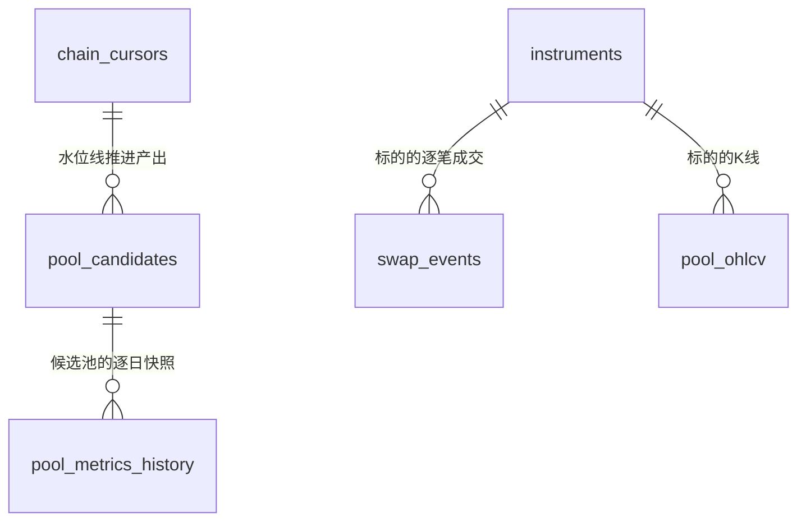

# research 表结构文档

本文档是 `research/` 工作区关系库表结构的唯一文档真相。只保留当前最新完整结构，不记录历史迁移过程；
改表（新增/删除/重命名表或字段、类型/可空/默认值/约束/索引/业务语义变化）必须在同一改动中同步本文档。

正式迁移脚本位于 [`packages/storage/src/alpha_storage/migrations/versions/`](packages/storage/src/alpha_storage/migrations/versions/)。

## 0. 通用约定

- 主键统一用 `BIGSERIAL`（`BigInteger` + `primary_key=True`）自增。
- 链上地址统一小写存储，定长 `CHAR(42)`（`0x` + 40 位十六进制）。
- 时间统一 `TIMESTAMPTZ`（UTC）；自然日字段（如逐日快照的日期）用 `DATE`。
- 枚举取值统一存文本（`CHAR(N)`），不用数据库原生 enum 类型，方便新增取值不改表结构。

## 1. 表总览

| 表名 | 分类 | 用途一句话 |
|---|---|---|
| `pool_candidates` | 候选池发现 | Factory `PoolCreated` 全量扫描落库的候选池目录 |
| `pool_metrics_history` | 历史快照 | 候选池逐日 TVL/24h volume/收盘价快照，波动率等指标计算的时间序列基础 |
| `chain_cursors` | 扫描水位线 | 按 (chain, dex) 维护 Factory 扫描进度，支持增量扫描 |
| `instruments` | 标的目录 | 跨资产类型的标的登记表，字段命名对齐 `alpha-research-engine` 的 envelope 约定 |
| `swap_events` | 实时数据 | PancakeSwap V3 池子的逐笔 `Swap` 事件，WebSocket 订阅落库的最细粒度原始数据 |
| `pool_ohlcv` | 实时数据 | 链上池子的 K 线（本期只有 1 分钟粒度），字段命名同样对齐 `alpha-research-engine` 的约定；表名带 `pool_` 前缀是因为以后 CEX/股票的 OHLCV 会是各自独立的表，不混进这张 |
| `tokens` | 元数据缓存 | ERC20 `decimals()` 的永久缓存，避免每次都现场 `eth_call` 重查不可变值 |

## 2. 关系概览

`pool_candidates.pool_address` 与 `pool_metrics_history.pool_address` 是逻辑外键（同 `chain` 下的池子地址一一对应），
本期未加数据库外键约束——候选池发现（1a）与历史快照抓取（1a 内的独立步骤）允许乱序补数据，不希望被外键顺序卡住。
`swap_events.instrument_id`/`pool_ohlcv.instrument_id` 与 `instruments.instrument_id` 同样是逻辑外键，不加数据库约束，
原因一致。

`instruments`/`swap_events`/`pool_ohlcv` 是独立于 `pool_candidates`/`pool_metrics_history`/`chain_cursors` 的
第二套体系（`instrument_id` 主键 vs `chain`+`pool_address` 组合键）——1a-1f 已经验证过的三张表这次不做
retrofit，见 [`docs/live-signal-system-设计方案.md`](docs/live-signal-system-设计方案.md)"范围边界"一节。

## 3. pool_candidates

Factory 全量扫描的落库结果。与 `products/alpha-lp` 的 `pools` 表是两回事：
alpha-lp 那张表只存"已确认关联仓位/钱包"的池子；这张表存"Factory 里存在过的全部候选池"，
服务于池子发现打分场景（对应 [`pool-discovery-metrics-v1.md`](docs/pool-discovery-metrics-v1.md) 第 0 节
"全量扫描发现"的架构决策）。

| 字段 | 类型 | 可空 | 默认值 | 说明 |
|---|---|---|---|---|
| id | BIGSERIAL | 否 | 自增 | 主键 |
| chain | CHAR(10) | 否 | 无 | 链标识，取值见下方枚举说明 |
| dex_id | CHAR(30) | 否 | 无 | DEX 标识，取值见下方枚举说明 |
| pool_address | CHAR(42) | 否 | 无 | 池子合约地址，小写 |
| token0_address | CHAR(42) | 否 | 无 | Factory 事件里字典序较小的一侧 token，小写 |
| token1_address | CHAR(42) | 否 | 无 | 另一侧 token，小写 |
| fee_pips | INTEGER | 否 | 无 | 手续费费率，单位 1e-6（如 2500 = 0.25%） |
| tick_spacing | INTEGER | 否 | 无 | 池子 tick 间距，由 fee_pips 在 Factory 里唯一决定 |
| created_at_block | BIGINT | 否 | 无 | `PoolCreated` 事件所在区块号 |
| created_at | TIMESTAMPTZ | 是 | NULL | 区块出块时间；懒加载补齐，未回填前为 NULL（不可全量预拉，见钱包链上行为分析设计方案 7.4） |
| status | CHAR(10) | 否 | 无 | 候选池生命周期状态，取值见下方枚举说明 |
| asset_class | CHAR(15) | 否 | `crypto_native` | 资产类型，取值见下方枚举说明；决定 RWA 专属特征/模型要不要跑 |
| discovered_at | TIMESTAMPTZ | 否 | 无 | 本系统首次发现该池子的时间 |
| updated_at | TIMESTAMPTZ | 否 | 无 | 最后一次状态变更时间 |

**约束**：`UNIQUE(chain, pool_address)`；索引 `(chain, status)` 加速按状态筛选候选池。

### 枚举说明

#### chain

| 值 | 含义 |
|---|---|
| `bsc` | BNB Chain，chainId 56，本期唯一支持的链 |

#### dex_id

| 值 | 含义 |
|---|---|
| `pancakeswap-v3-bsc` | PancakeSwap V3（BSC），本期唯一支持的协议；取值对齐 GeckoTerminal 的 dex id |

#### status

| 值 | 含义 |
|---|---|
| `discovered` | 已通过 Factory 事件发现，尚未判定是否达到准入门槛 |
| `qualified` | 已过硬性准入门槛（TVL/volume/池龄/token 白名单），参与后续指标计算与打分 |
| `rejected` | 未达门槛，不产生分数、不纳入历史快照采集范围 |

#### asset_class

| 值 | 含义 |
|---|---|
| `crypto_native` | 加密原生资产对（如 BTC/USDT），不需要任何 RWA 专属模块 |
| `rwa` | 锚定真实世界资产的代币化凭证（如 QQQB），需要参考价数据源等专属处理 |

## 4. pool_metrics_history

候选池逐日历史快照，是波动率等指标（1b 阶段，`apps/lp-backtest/features/`）计算的时间序列基础。
本表只存"原始数据"，不冗余存储 FeeAPR/σ_price/CompositeScore 等派生指标。

**GeckoTerminal 的已知局限**：免费 API 对 TVL/24h volume 只暴露当前值，没有历史时间序列——
`tvl_usd`/`volume_24h_usd` 单靠它只能从系统首次采集当天开始逐日积累；`close_price`
（来自 OHLCV 日线）可以一次性回填约 30 天历史。

**历史 TVL/volume 现在还有第二个来源**：`alpha_datasources.pancakeswap_subgraph`（PancakeSwap
官方 V3 Subgraph，需要 `THEGRAPH_API_KEY`，见 `.env.example`），按天真实索引，不是快照——
但实测这个公开可查的 subgraph 部署本身有索引延迟（观测到约 13 天，不是文档/直觉认为的
"实时"），所以能补上"较早的历史"，补不上"最近一两周"，那段窗口仍然要靠逐日积累，
两个来源不冲突，见 `alpha_metrics.snapshots` 的模块文档。

| 字段 | 类型 | 可空 | 默认值 | 说明 |
|---|---|---|---|---|
| id | BIGSERIAL | 否 | 自增 | 主键 |
| chain | CHAR(10) | 否 | 无 | 链标识 |
| pool_address | CHAR(42) | 否 | 无 | 池子合约地址，小写 |
| snapshot_date | DATE | 否 | 无 | 快照所属自然日（UTC） |
| tvl_usd | FLOAT | 是 | NULL | 当日 TVL（USD）；NULL 表示当天未取到，不能当 0 处理 |
| volume_24h_usd | FLOAT | 是 | NULL | 截至当日的滚动 24h 交易量（USD） |
| close_price | FLOAT | 是 | NULL | 当日收盘价（token0/token1 汇率，口径与 OHLCV 数据源一致） |
| data_source | CHAR(20) | 否 | 无 | 数据来源标识：`geckoterminal`/`subgraph`/`gt+subgraph`（收盘价和 TVL/volume 来源不同时两者都标） |
| fetched_at | TIMESTAMPTZ | 否 | 无 | 实际抓取时间，用于判断数据新鲜度 |

**约束**：`UNIQUE(chain, pool_address, snapshot_date)`；索引 `(chain, pool_address, snapshot_date)` 加速按池子拉取时间序列。

## 5. chain_cursors

按 (chain, dex_id) 维护 Factory 扫描水位线（对应钱包链上行为分析设计方案 6.1 `chain_cursors` 的设计，
这里额外加了 `dex_id` 维度，因为同一条链上不同协议的 Factory 各自独立扫描）。

| 字段 | 类型 | 可空 | 默认值 | 说明 |
|---|---|---|---|---|
| id | BIGSERIAL | 否 | 自增 | 主键 |
| chain | CHAR(10) | 否 | 无 | 链标识 |
| dex_id | CHAR(30) | 否 | 无 | DEX 标识 |
| last_scanned_block | BIGINT | 否 | 无 | 已扫描到的最后一个（已终结）区块号 |
| updated_at | TIMESTAMPTZ | 否 | 无 | 最后一次推进时间 |

**约束**：`UNIQUE(chain, dex_id)`。

## 6. instruments

跨资产类型（本期只有链上 DEX 池子，未来可能扩展 CEX/股票）的标的登记表。字段命名对齐
`alpha-research-engine`（一个专门的离线行情研究平台，路径 `alpha-research-engine`）的 `instruments`
目录约定，`instrument_id` 用 `{venue}:{market_type}:{symbol_raw}` 这个字符串本身做主键，不加自增 id——
这是跨系统都会直接引用的自然键。`chain` 是本表相对对方 catalog 的唯一新增字段（对方管的都是链下市场，
没有"链"这个概念）。详见 [`docs/live-signal-system-设计方案.md`](docs/live-signal-system-设计方案.md)。

| 字段 | 类型 | 可空 | 默认值 | 说明 |
|---|---|---|---|---|
| instrument_id | TEXT | 否 | 无 | 主键，`{venue}:{market_type}:{symbol_raw}`；用 TEXT 而非 CHAR(N)——变长自然键会被读回 Python 后原始比较/JSON 序列化，CHAR(N) 的尾随空格 padding 不会被 SQLAlchemy/psycopg 自动 strip（已验证），SQL 层比较不受影响但脱离 SQL 上下文会静默出错 |
| venue | CHAR(30) | 否 | 无 | 如 `pancakeswap-v3-bsc`，本期取值对齐 `dex_id` 枚举 |
| market_type | CHAR(20) | 否 | 无 | 本期只有 `dex_pool`；开放字符串，以后加新值不改表结构 |
| base | CHAR(42) | 否 | 无 | base token 地址（链上场景：字典序较小的一侧） |
| quote | CHAR(42) | 否 | 无 | quote token 地址 |
| settle | CHAR(42) | 是 | NULL | 结算资产；链上 AMM 没有独立结算概念，恒为 NULL，字段保留是为了和其他 venue（如永续合约）同构 |
| symbol_raw | CHAR(42) | 否 | 无 | 链上场景下就是池子地址 |
| chain | CHAR(10) | 否 | 无 | 链标识 |
| listed_at | TIMESTAMPTZ | 是 | NULL | 暂不回填 |
| delisted_at | TIMESTAMPTZ | 是 | NULL | 暂不使用 |
| meta_json | JSONB | 是 | NULL | 预留（fee_pips/tick_spacing 等链上专属元数据），本期不填 |

**约束**：主键即 `instrument_id`，天然唯一，不需要额外 UNIQUE 约束。

### 枚举说明

#### market_type

| 值 | 含义 |
|---|---|
| `dex_pool` | 链上 DEX 池子，本期唯一取值；开放字符串，以后扩展 CEX/股票时加新值 |

## 7. swap_events

PancakeSwap V3 池子的逐笔 `Swap` 事件，WebSocket 订阅落库的最细粒度原始数据。只服务链上场景，
不需要跨资产类型通用化——CEX/股票没有"链上 swap 事件"这个概念，以后各自会有自己的逐笔成交表，
不共用这张表。

| 字段 | 类型 | 可空 | 默认值 | 说明 |
|---|---|---|---|---|
| id | BIGSERIAL | 否 | 自增 | 主键 |
| chain | CHAR(10) | 否 | 无 | 链标识 |
| pool_address | CHAR(42) | 否 | 无 | 池子地址，小写 |
| instrument_id | TEXT | 否 | 无 | 逻辑外键 -> `instruments.instrument_id`；TEXT 理由见第 6 节 |
| tx_hash | CHAR(66) | 否 | 无 | 交易哈希 |
| log_index | INTEGER | 否 | 无 | 同一笔交易内的日志序号 |
| block_number | BIGINT | 否 | 无 | 区块号 |
| sender | CHAR(42) | 否 | 无 | `Swap` 事件的 sender（通常是 Router 合约） |
| recipient | CHAR(42) | 否 | 无 | 接收方地址 |
| amount0 | NUMERIC(78,0) | 否 | 无 | token0 变动量，带符号（池子视角：正=流入，负=流出） |
| amount1 | NUMERIC(78,0) | 否 | 无 | token1 变动量，带符号 |
| sqrt_price_x96_after | NUMERIC(78,0) | 否 | 无 | 成交后的 √价格（Q64.96 定点数） |
| tick_after | INTEGER | 否 | 无 | 成交后所在的 tick |
| fetched_at | TIMESTAMPTZ | 否 | 无 | 实际捕获时间（WebSocket 收到/补拉到的时间，不是这笔交易真实发生的时间） |
| block_time | TIMESTAMPTZ | 是 | 无 | 出块时间，K 线聚合分桶用这个。WebSocket 订阅路径从推送 payload 免费拿到；HTTP 回填路径额外调 `get_block_timestamp` 补齐。可空是因为这一列是后加的，加列之前落库的历史行没有值（`aggregate_candles` 遇到时会现查一次并写回，见该模块文档），新写入的行恒有值 |

**约束**：`UNIQUE(chain, tx_hash, log_index)`，幂等写入；索引 `(chain, pool_address, block_number)`
加速按池子拉取区块区间。

## 8. pool_ohlcv

链上池子的 K 线。字段命名对齐 `alpha-research-engine` 的 envelope + ohlcv 专属字段约定
（`ts_event`/`tf`/`volume`/`quote_volume`/`trade_count`），物理存储仍是 Postgres（不是对方用的
Parquet）——WebSocket 实时写入 + HTTP 接口查最新一分钟这个访问模式，Postgres 更合适，字段/命名对齐
是为了以后互通/归档时不用重新设计表结构。

表名带 `pool_` 前缀（不叫 `ohlcv`）——这张表只存链上池子的 K 线，以后接 CEX/股票的 OHLCV
会是各自独立的表（如 `cex_ohlcv`/`stock_ohlcv`），不会混进这张表，表名直接体现这个边界。

`dataset` 字段恒为 `'ohlcv'`，描述的是"这行数据是什么类型"（信封约定），跟表名是两个不同维度，
不需要跟着表名改——`trade`/`quote`/`funding` 以后是各自独立的表，不会塞进这张表。

| 字段 | 类型 | 可空 | 默认值 | 说明 |
|---|---|---|---|---|
| id | BIGSERIAL | 否 | 自增 | 主键 |
| dataset | CHAR(10) | 否 | `ohlcv` | 恒为 `'ohlcv'` |
| instrument_id | TEXT | 否 | 无 | 逻辑外键 -> `instruments.instrument_id`；TEXT 理由见第 6 节 |
| venue | CHAR(30) | 否 | 无 | 冗余存一份，避免每次查询都要 join `instruments` |
| tf | CHAR(4) | 否 | 无 | K 线粒度，本期只有 `'1m'`，预留 `'5m'`/`'1h'` 等 |
| ts_event | TIMESTAMPTZ | 否 | 无 | K 线**开盘时间**（不是收盘时间） |
| ts_ingest | TIMESTAMPTZ | 否 | 无 | 聚合脚本写入时间 |
| open | NUMERIC | 否 | 无 | 开盘价，token0/token1 汇率（不是 USD） |
| high | NUMERIC | 否 | 无 | 最高价 |
| low | NUMERIC | 否 | 无 | 最低价 |
| close | NUMERIC | 否 | 无 | 收盘价 |
| volume | NUMERIC | 否 | 无 | base（token0）成交量绝对值之和 |
| quote_volume | NUMERIC | 是 | NULL | quote（token1）成交量绝对值之和 |
| trade_count | INTEGER | 是 | NULL | 该分钟内成交笔数 |

**约束**：`UNIQUE(instrument_id, tf, ts_event)`。

## 9. tokens

ERC20 token 元数据的永久缓存，目前只有 `decimals`。`decimals()` 是 ERC20 标准里的不可变值，
一经查到永久有效——之前每次 `aggregate_candles` 调用都现场 `eth_call` 重新查一遍（NodeReal
按 20 CU/次计费，真实跑过才发现这是纯浪费），这张表让"同一个 token 只查一次链"落到实处，
不是进程内存缓存（那样每次新起 CLI 进程缓存都清零，等于没缓存）。

`alpha_core.models.Token` 这个领域对象在 1a 阶段就写好了、专门标注"decimals/symbol 应当永久
缓存"，但当时没有配套的存储层，这张表补上这个缺口。

| 字段 | 类型 | 可空 | 默认值 | 说明 |
|---|---|---|---|---|
| chain | CHAR(10) | 否 | 无 | 链标识；联合主键之一 |
| token_address | CHAR(42) | 否 | 无 | 统一小写存储；联合主键之一 |
| decimals | INTEGER | 否 | 无 | ERC20 `decimals()` 的返回值 |
| fetched_at | TIMESTAMPTZ | 否 | 无 | 首次查到并落库的时间 |

**约束**：主键 `(chain, token_address)`。冲突时保留已有值不覆盖（`decimals` 不可变，理论上
不会真的查出不同值，见 `TokenRepository.upsert`）。
