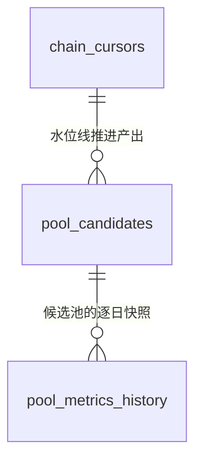

# research 表结构文档

本文档是 `research/` 工作区关系库表结构的唯一文档真相。只保留当前最新完整结构，不记录历史迁移过程；
改表（新增/删除/重命名表或字段、类型/可空/默认值/约束/索引/业务语义变化）必须在同一改动中同步本文档。

正式迁移脚本位于 [`packages/storage/src/alpha_storage/migrations/versions/`](packages/storage/src/alpha_storage/migrations/versions/)。

## 0. 通用约定

- 主键统一用 `BIGSERIAL`（`BigInteger` + `primary_key=True`）自增。
- 链上地址统一小写存储，定长 `CHAR(42)`（`0x` + 40 位十六进制）。
- 时间统一 `TIMESTAMPTZ`（UTC）；自然日字段（如逐日快照的日期）用 `DATE`。
- 枚举取值统一存文本（`CHAR(N)`），不用数据库原生 enum 类型，方便新增取值不改表结构。

## 1. 表总览

| 表名 | 分类 | 用途一句话 |
|---|---|---|
| `pool_candidates` | 候选池发现 | Factory `PoolCreated` 全量扫描落库的候选池目录 |
| `pool_metrics_history` | 历史快照 | 候选池逐日 TVL/24h volume/收盘价快照，波动率等指标计算的时间序列基础 |
| `chain_cursors` | 扫描水位线 | 按 (chain, dex) 维护 Factory 扫描进度，支持增量扫描 |

## 2. 关系概览

`pool_candidates.pool_address` 与 `pool_metrics_history.pool_address` 是逻辑外键（同 `chain` 下的池子地址一一对应），
本期未加数据库外键约束——候选池发现（1a）与历史快照抓取（1a 内的独立步骤）允许乱序补数据，不希望被外键顺序卡住。

## 3. pool_candidates

Factory 全量扫描的落库结果。与 `products/alpha-lp` 的 `pools` 表是两回事：
alpha-lp 那张表只存"已确认关联仓位/钱包"的池子；这张表存"Factory 里存在过的全部候选池"，
服务于池子发现打分场景（对应 [`pool-discovery-metrics-v1.md`](docs/pool-discovery-metrics-v1.md) 第 0 节
"全量扫描发现"的架构决策）。

| 字段 | 类型 | 可空 | 默认值 | 说明 |
|---|---|---|---|---|
| id | BIGSERIAL | 否 | 自增 | 主键 |
| chain | CHAR(10) | 否 | 无 | 链标识，取值见下方枚举说明 |
| dex_id | CHAR(30) | 否 | 无 | DEX 标识，取值见下方枚举说明 |
| pool_address | CHAR(42) | 否 | 无 | 池子合约地址，小写 |
| token0_address | CHAR(42) | 否 | 无 | Factory 事件里字典序较小的一侧 token，小写 |
| token1_address | CHAR(42) | 否 | 无 | 另一侧 token，小写 |
| fee_pips | INTEGER | 否 | 无 | 手续费费率，单位 1e-6（如 2500 = 0.25%） |
| tick_spacing | INTEGER | 否 | 无 | 池子 tick 间距，由 fee_pips 在 Factory 里唯一决定 |
| created_at_block | BIGINT | 否 | 无 | `PoolCreated` 事件所在区块号 |
| created_at | TIMESTAMPTZ | 是 | NULL | 区块出块时间；懒加载补齐，未回填前为 NULL（不可全量预拉，见钱包链上行为分析设计方案 7.4） |
| status | CHAR(10) | 否 | 无 | 候选池生命周期状态，取值见下方枚举说明 |
| discovered_at | TIMESTAMPTZ | 否 | 无 | 本系统首次发现该池子的时间 |
| updated_at | TIMESTAMPTZ | 否 | 无 | 最后一次状态变更时间 |

**约束**：`UNIQUE(chain, pool_address)`；索引 `(chain, status)` 加速按状态筛选候选池。

### 枚举说明

#### chain

| 值 | 含义 |
|---|---|
| `bsc` | BNB Chain，chainId 56，本期唯一支持的链 |

#### dex_id

| 值 | 含义 |
|---|---|
| `pancakeswap-v3-bsc` | PancakeSwap V3（BSC），本期唯一支持的协议；取值对齐 GeckoTerminal 的 dex id |

#### status

| 值 | 含义 |
|---|---|
| `discovered` | 已通过 Factory 事件发现，尚未判定是否达到准入门槛 |
| `qualified` | 已过硬性准入门槛（TVL/volume/池龄/token 白名单），参与后续指标计算与打分 |
| `rejected` | 未达门槛，不产生分数、不纳入历史快照采集范围 |

## 4. pool_metrics_history

候选池逐日历史快照，是波动率等指标（1b 阶段，`apps/lp-backtest/features/`）计算的时间序列基础。
本表只存"原始数据"，不冗余存储 FeeAPR/σ_price/CompositeScore 等派生指标。

**已知局限**：GeckoTerminal 免费 API 对 TVL/24h volume 只暴露当前值，没有历史时间序列——
`tvl_usd`/`volume_24h_usd` 只能从系统首次采集当天开始逐日积累，无法一次性回填过去的值；
只有 `close_price`（来自 OHLCV 日线）可以一次性回填约 30 天历史。见
[`apps/lp-backtest/README.md`](apps/lp-backtest/README.md) 的已知技术债。

| 字段 | 类型 | 可空 | 默认值 | 说明 |
|---|---|---|---|---|
| id | BIGSERIAL | 否 | 自增 | 主键 |
| chain | CHAR(10) | 否 | 无 | 链标识 |
| pool_address | CHAR(42) | 否 | 无 | 池子合约地址，小写 |
| snapshot_date | DATE | 否 | 无 | 快照所属自然日（UTC） |
| tvl_usd | FLOAT | 是 | NULL | 当日 TVL（USD）；NULL 表示当天未取到，不能当 0 处理 |
| volume_24h_usd | FLOAT | 是 | NULL | 截至当日的滚动 24h 交易量（USD） |
| close_price | FLOAT | 是 | NULL | 当日收盘价（token0/token1 汇率，口径与 OHLCV 数据源一致） |
| data_source | CHAR(20) | 否 | 无 | 数据来源标识，如 `geckoterminal` |
| fetched_at | TIMESTAMPTZ | 否 | 无 | 实际抓取时间，用于判断数据新鲜度 |

**约束**：`UNIQUE(chain, pool_address, snapshot_date)`；索引 `(chain, pool_address, snapshot_date)` 加速按池子拉取时间序列。

## 5. chain_cursors

按 (chain, dex_id) 维护 Factory 扫描水位线（对应钱包链上行为分析设计方案 6.1 `chain_cursors` 的设计，
这里额外加了 `dex_id` 维度，因为同一条链上不同协议的 Factory 各自独立扫描）。

| 字段 | 类型 | 可空 | 默认值 | 说明 |
|---|---|---|---|---|
| id | BIGSERIAL | 否 | 自增 | 主键 |
| chain | CHAR(10) | 否 | 无 | 链标识 |
| dex_id | CHAR(30) | 否 | 无 | DEX 标识 |
| last_scanned_block | BIGINT | 否 | 无 | 已扫描到的最后一个（已终结）区块号 |
| updated_at | TIMESTAMPTZ | 否 | 无 | 最后一次推进时间 |

**约束**：`UNIQUE(chain, dex_id)`。
