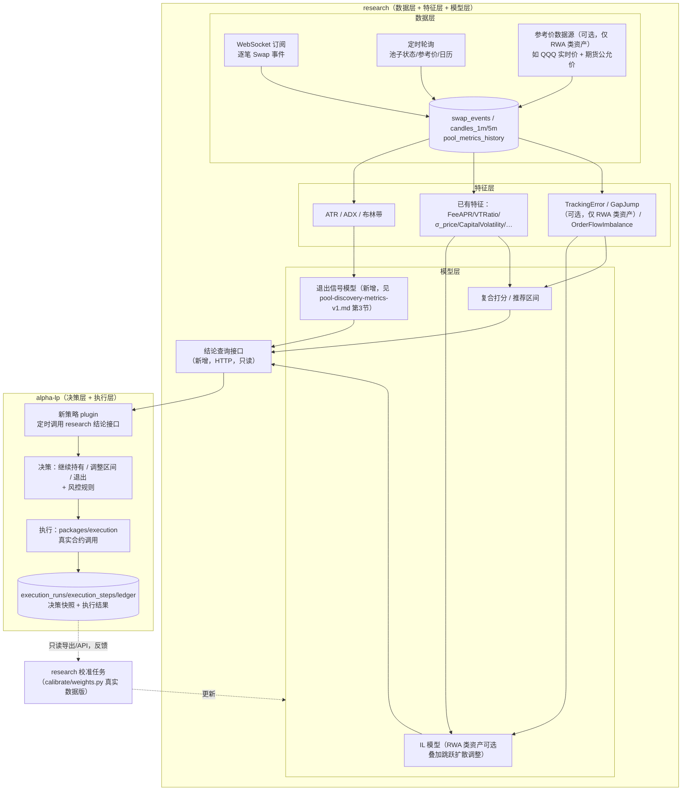

# 实时研究驱动决策系统 · 设计方案 v1

## 0. 文档定位

本方案回答：把 research 的数据层/特征层/模型层和 alpha-lp 的决策层/执行层串成一个闭环
（定时+WebSocket 采集数据 → 产出结论 → alpha-lp 消费结论、决策、执行、详细记录 → 执行结果反哺模型）——
这件事具体怎么落地。

**这是一个通用系统，不是只为某一个交易对做的**：架构上任何候选池（BSC/PancakeSwap V3，未来可扩展到
其他链/协议）都能接进来，差异只在配置（池子地址、是否需要 RWA 专属特征）。前期用
**QQQB/USDT** 或 **BTC/USDT** 中的一个（或两个都跑）作为第一个试跑对象，把整条链路跑通，
新增其他交易对之后只是加一行配置，不需要重新开发。

这不是凭空起一个新方向：pool-discovery-metrics-v1.md 3.3 节已经明确写"退出信号要不要接自动执行，
是比本版范围更大的信任跳跃，应该单独拉一次方案讨论"——**本文档就是那次讨论**。如果试跑标的选了
QQQB/USDT，还会命中同一份文档 4 节"RWA/锚定真实资产池"专门讨论、但 1a-1f 阶段明确排除的场景
（"参考价数据源未选型"），这部分在本方案里作为**可选模块**设计，不是核心链路的必需项——
BTC/USDT 这类加密原生资产对完全不需要这部分。

## 1. 试跑标的怎么选：QQQB/USDT vs BTC/USDT

在设计任何模型之前，先把候选的试跑对象摸清楚——这里的事实是约束条件，不是背景介绍。

### 1.0 两个候选的对比

| | QQQB/USDT | BTC/USDT（如 BTCB/USDT 或 BTCB/WBNB） |
|---|---|---|
| 资产类型 | RWA（代币化股票凭证） | 加密原生资产 |
| 历史数据 | 约 5 周，短 | 池子存在时间长，历史充分，能直接吃 1c/1d 已经跑过的数据 |
| 需要的专属能力 | 参考锚定价格数据源、跳空风险、发行方核实（第 4/5 章的可选模块） | 不需要任何 RWA 专属模块，用现有 `features/`/`models/` 就能跑 |
| 风险特征 | 发行方/托管方信用风险、锚定失效风险、促销驱动的虚高数据（见 1.2 节） | 标准的加密资产波动/IL 风险，我们已有的模型假设（GBM 无漂移）本来就是为这类资产设计的 |
| 适合验证什么 | RWA 专属特征/模型是否真的有用、参考价数据源选型是否合理 | 决策层/执行层/审计/反馈闭环这条主链路本身是否跑得通，不被 RWA 的额外复杂度干扰 |

**已确认：两个都跑**（见第 12 章问答）。落地顺序建议不变——先用 BTC/USDT 把主链路
（数据→特征→模型→结论→决策→执行→记录→反馈）跑稳，验证的是"链路本身对不对"；
QQQB/USDT 并行接入，专门验证 RWA 专属模块（参考价、TrackingError、GapJump）——
两者共用同一套池子无关的核心代码，差异只在配置里的 `asset_class`。

### 1.1 QQQB 已核实的基本事实（仅在选择或包含 QQQB/USDT 时相关）

| 项目 | 内容 | 来源 |
|---|---|---|
| 发行方 | Binance 关联的 **BTECH Holdings Ltd**，SPV 结构，FSRA 监管下发"代表金融工具的凭证"，品牌叫 **bStocks** | bnbchain.org 官方博客、bstocks.finance |
| 背书机制 | 号称 1:1 锚定真实 Invesco QQQ Trust 股票，托管在"受监管的美国券商"（未公开具体名称），每日"Proof of Collateral" | 同上（**均为发行方自我披露，未找到第三方审计**） |
| 主池子 | PancakeSwap V3，0.01% 费率，`0xe531fcb1f5a195de7608b9f4f9518544c2cdb693` | GeckoTerminal API 实测 |
| 主池 TVL / 24h volume | 约 $1.33M / 约 $37.5M（**VTRatio 约 28 倍**） | GeckoTerminal API 实测 |
| 池龄 | 2026-07-10 创建，约 5 周 | 同上 |
| Token 合约（BSC） | `0x205812cdbed920aff76c6580abd681a46d11efc7` | GeckoTerminal/DexScreener/CoinGecko/CMC 交叉核实一致 |

### 1.2 QQQB 直接影响设计的风险点（仅当选择 QQQB/USDT 时适用，必须写进约束，不是免责声明）

1. **当前 28 倍 VTRatio 极不具代表性**：Binance 在跑一个到 **2026-08-31 截止**的做市商零手续费 + VIP
   交易量倍增促销（据 CoinDesk 2026-08-01 报道，QQQB 一家占了 7 月全部代币化股票交易量的 82%）。
   现在距 8/31 只剩约 2 周。任何在当前数据上训练/校准的 FeeAPR、VTRatio 相关模型，promo 结束后大概率
   系统性失效——**设计上必须假设这个池子的"当前状态"是一个即将结束的特殊窗口，不是稳态**。
2. **池龄太短，历史数据不够**：5 周历史，勉强够 1b 现有 `MIN_CLOSE_OBSERVATIONS=30` 天的门槛，
   远不够 1c/1d 用的 90-180 天回测窗口。任何波动率/IL 模型的置信度在这个池子上天然偏低。
3. **同一 token 合约被配对进十几个可疑"meme 币"池子刷量**（如"牛来""豹拉"等，部分池子创建仅 1-2 天
   却有百万美元级"volume"）——**候选池发现不能只按 token symbol/name 识别，必须严格锁定已核实的
   合约地址和已核实的池子地址**，这一点本来就是 `qualify.py` 的白名单设计原则，这里再次印证其必要性。
4. **发行方身份出现矛盾信息**：调研中一份来源把 QQQB 归因于 Gate.io，与 Binance bStocks 的官方归因矛盾，
   没能用一手资料解决这个矛盾。**已确认（见第 12 章问答）：接受现状，暂不深究，按 Binance bStocks
   这个证据更充分的归因往下做**——但这个结论没有被第三方彻底证伪，如果后续出现锚定异常，
   应该第一时间重新核实这一点，不能假设它已经被排除。
5. **Tracking Error 不是理论风险，是已经在发生的事实**：交叉核实到的同期数据，QQQ 真实价约 $720.87
   （2026-08-11），QQQB 约 $732-737，溢价约 1.5-2%。pool-discovery-metrics-v1.md 4.2 节的 TrackingError
   指标不是"以防万一"，现在就有非零读数。
6. **供应量数据源互相矛盾**：CoinGecko 和 CoinMarketCap 报告的流通量相差近 12 倍（1,861 vs 22,515），
   不能盲信第三方聚合器的"circulating supply"，需要时应直接读链上 `totalSupply()`。
7. **24/7 交易 vs 锚定机制是否 24/7 有效，未经验证**：官方宣传"24/7 交易"，但套利/赎回机制是否在
   非美股交易时段同样有效没有第三方验证——4.1 节的"锚定真空窗口"假设应该当作待验证的经验问题，
   通过 TrackingError 时序特征去测，不要预先假定它存在或不存在。

## 2. 系统总览



边界不变：`research` 到"结论"为止；"要不要真的做、做多大、什么时候做"是 alpha-lp 的决策层；
"真的调合约"是 alpha-lp 的执行层。`research` 不碰私钥，不写 alpha-lp 生产库，反馈闭环走
alpha-lp 主动暴露的只读接口，不是 research 反向连生产数据库。

**池子无关设计**：图里每个节点都以"目标池子"为参数，不是写死某一个交易对。候选池配置里加一个
`asset_class` 字段（`crypto_native` | `rwa`），网络中标"可选，仅 RWA 类资产"的分支（参考价数据源、
TrackingError/GapJump、跳跃扩散调整）只在 `asset_class=rwa` 时才会被调用；`crypto_native` 的池子
（如 BTC/USDT）直接跳过这些分支，走已有的 `features/`/`models/`。

## 3. 数据层设计

### 3.1 市场数据（你已列的 + 缺口）

| 数据 | 已列 | 采集方式 | 缺口/补充说明 |
|---|---|---|---|
| K线 1m/5m | ✓ | **自建**：订阅逐笔 Swap 事件本地聚合，不依赖第三方分钟级 API | GeckoTerminal 有 minute OHLCV 但会撞免费层限流，且口径不受我们控制；自建才能保证和后面 tick/价格计算口径一致，第三方数据只作历史回填/交叉验证 |
| 最新价格 | ✓ | WebSocket 订阅 Swap 事件解出 sqrtPriceX96 | — |
| 成交量 | ✓ | 同上聚合 | — |
| 逐笔 swap | ✓ | WebSocket 订阅 | 需要新表 `swap_events`（tx_hash, log_index, block, amount0/1, sender, recipient, sqrtPriceX96_after, tick_after, timestamp） |
| **区块时间戳映射** | 缺 | 懒加载，按需写入 | 沿用钱包分析方案 7.4 节的 `blocks` 表设计，不预热 |
| **Gas price 历史** | 缺 | 每次读取区块时顺带记录 | 执行成本估算、"这次调仓划不划算"要用 |
| **Token 精度/元数据缓存** | 缺 | 一次性缓存 | 目标池子两侧 token 的 decimals，避免每次重新查 |

### 3.2 池子数据（你已列的 + 缺口）

| 数据 | 已列 | 补充说明 |
|---|---|---|
| TVL / 当前 tick / tickSpacing / 费率档位 | ✓ | 复用现有 `PancakeswapV3Plugin` 链上读取 |
| 每分钟手续费收入 / swap 量 | ✓ | 从自建 `swap_events` 聚合，而不是 GeckoTerminal 的 24h 快照（那个只有"当前值"，见 1a 已知限制） |
| 当前附近流动性分布 | ✓ | 需要 TickLens 批量读取当前活跃 tick 区间的流动性，pool-discovery-metrics-v1.md 已知局限里提过"只能拿当前快照，没有历史 TickLens 分布"——这里同样只能做"当前快照"，不做历史重建 |
| **协议抽成 feeProtocol** | 缺 | 已有 `read_fee_protocol`，直接复用 |
| **CAKE farm 相关** | 缺 | 需要先查这个池子是否挂了 MasterChef farm（`read_cake_emission` 现成方法一查便知，大概率没挂，因为这不是 PancakeSwap 官方重点扶持池） |
| **tick 流动性时间序列** | 缺 | 只做"当前快照"按分钟落库，不重建历史（成本过高，和 TickLens 已知局限一致） |
| **大额 deposit/withdraw 事件流** | 缺 | 从 `Mint`/`Burn` 事件识别大额 LP 进出，RWA 场景下这个比一般池子更重要——如果发行方/做市商自己是最大 LP，他们撤资本身就是最强的锚定失效前兆信号 |

### 3.3 仓位数据（你已列的 + 缺口）

| 数据 | 已列 | 补充说明 |
|---|---|---|
| 建仓时间/价格/上下 tick/投入金额/两种币数量 | ✓ | alpha-lp `positions` 表已有大部分字段 |
| 累计手续费 | ✓ | alpha-lp `ledger`（`FEE_COLLECTED` 事件）+ `position_metrics.fees_owed*` |
| 当前 IL | ✓ | 需要开仓时价格快照——**这正是 pool-discovery-metrics-v1.md 3.2 节已经点出的缺口**："`positions` 表目前没有存开仓时的价格快照"，需要新增字段或从 `execution_runs`/`execution_steps` 历史回溯，这是 alpha-lp 侧的改动，不是 research 侧 |
| 当前是否出区间 | ✓ | alpha-lp `positions.range_state` 已有 |
| **仓位当前市值（mark-to-market）** | 缺 | `position_metrics.position_value_usd` 已有，复用 |
| **每次调仓的 gas 成本** | 缺 | `execution_steps.gas_used`/`effective_gas_price` 已有，复用，不新增 |
| **执行滑点** | 缺 | `execution_steps.receipt_payload.swap.slippageUsd` 已有，复用 |
| **大户/发行方持仓集中度** | 缺 | pool-discovery-metrics-v1.md 原文档标"v2 暂缺数据源"，加密原生资产可以先不做；**RWA 类资产优先级应该提前**——如果发行方自己是最大 LP 或最大持币地址，这是核心风险，不是锦上添花 |
| **发行方储备透明度核实**（仅 RWA 类资产） | 缺 | 4.4 节说的"定性门槛，不是打分项"——这不是能自动化采集的数据，需要人工定期核实一次并记录结论（如"最后核实日期：2026-08-16，结论：未发现第三方审计"），进准入门槛判断；加密原生资产没有这个概念 |
| 桥接层风险 | — | 视具体资产而定：QQQB 是 SPV 凭证不是跨链包装资产（风险类型是发行方/托管方信用风险，不适用 4.6 节的桥风险框架）；如果试跑对象里出现真正的跨链包装资产（如 wBTC 类），需要单独套用 4.6 节 |

### 3.4 参考锚定价格数据源（可选模块，仅 RWA 类资产需要；BTC/USDT 这类加密原生资产可以跳过整节）

TrackingError（4.2 节）和判断"锚定真空窗口"都需要一个独立于链上池子价格的真实世界参考价
（QQQB 场景下是 QQQ 真实价）。当前系统完全没有这类数据源，是本方案唯一的**外部新增付费依赖**，
只有当试跑标的包含 RWA 类资产时才需要选型：

| 方案 | 覆盖 | 大致成本 | 备注 |
|---|---|---|---|
| Polygon.io / Twelve Data 等美股行情 API | QQQ 实时/历史报价 | 有免费层，实时/低延迟需付费 | 只覆盖美股开盘时段 |
| 期货数据源（如 NQ/MNQ 迷你纳指期货） | 近 24/5 覆盖，含盘后 | 通常需要期货行情授权，成本更高 | 覆盖 4.1 节说的"锚定真空窗口其实很窄"这个论点需要的数据 |
| 只用 QQQ 现货，不接期货 | 美股时段 | 最低成本 | 无法验证非美股时段锚定是否有效，1.2 节第 7 条的开放问题会一直悬着 |

**已确认（见第 12 章问答）：先接现货 API**（成本可控），把 TrackingError 的美股时段部分先跑起来；
期货数据源作为"验证非美股时段锚定是否失效"这个具体问题的后续增强，不阻塞第一版上线——
也就是说 1.2 节第 7 条"24/7 锚定是否真的有效"这个开放问题，第一版**只能验证美股开盘时段这部分**，
盘后/周末窗口暂时仍是未知，`risk_flags.gap_jump_risk` 在样本积累到足够置信度之前应该一直标
`unavailable`，不能因为"暂时没测到问题"就当作"已验证没问题"。

### 3.5 WebSocket 订阅设计

现有 `alpha_chains.EvmChainAdapter` 是纯 HTTP（`web3.HTTPProvider`），没有订阅能力，需要新增：

- 新增 `alpha_chains.evm_websocket.EvmWebSocketSubscriber`，用 `web3.py` 的
  `AsyncWeb3(WebSocketProvider(...))` 订阅目标池子的 `Swap` 事件 topic。
- 断线重连：订阅本身不保证不丢消息，重连后需要用 `eth_getLogs` 回填断线期间的区块区间
  （水位线机制复用 `chain_cursors` 现有设计，不用另起一套）。
- 落库：`swap_events` 表按 `(chain, tx_hash, log_index)` 幂等写入，和 `pool_metrics_history`
  同一套"不可变数据只拉一次"原则。
- K 线聚合：`candles_1m`/`candles_5m` 由 `swap_events` 定时（如每分钟）聚合生成，不是订阅时实时计算——
  避免订阅进程本身承担聚合逻辑，职责分开。

## 4. 特征层设计（新增部分，已有的直接复用）

| 特征 | 状态 | 说明 |
|---|---|---|
| FeeAPR/CakeAPR/NominalAPR/VTRatio/σ_price/CapitalVolatility/AgePenalty/DepthTier | 已有 | 直接复用 `features/`，无需改动 |
| **ATR**（Average True Range） | 新增 | 标准 TA 指标，基于 1m/5m K 线的 high/low/close，衡量短周期真实波幅，和 σ_price（基于日线收盘价的对数收益率）是两个不同粒度的波动率信号，互补不替代 |
| **ADX**（Average Directional Index） | 新增 | 判断趋势强弱，用于模型层的"要不要收窄区间/提前退出"决策，弱趋势（震荡市）适合窄区间吃手续费，强趋势（单边行情）应该放宽区间或直接退出 |
| **TrackingError** | 新增 | pool-discovery-metrics-v1.md 4.2 节，`\|链上价格 − 参考价\| / 参考价`，依赖 3.4 节的参考价数据源 |
| **GapJump** | 新增 | 4.3 节，锚定真空窗口的跳空幅度分布，样本量天然小（一年约 50 个周末），需要和 σ_price 一样做"样本不足则 unavailable"处理 |
| **OrderFlowImbalance** | 新增 | 从逐笔 swap 的买卖方向统计，衡量资金流方向性，辅助判断"当前的高 volume 是真实双向交易还是单边资金进出" |

## 5. 模型层设计（新增部分，已有的直接复用）

| 模型 | 状态 | 说明 |
|---|---|---|
| ExpectedIL_ref / 推荐区间 / 复合打分 | 已有 | 直接复用 `models/`，但见下面"RWA 调整" |
| **RWA 跳跃扩散调整** | 需要改造，不能直接复用 | 现有 `il_model.py` 假设纯 GBM 无漂移，4.3 节明确说 RWA 资产需要在正常时段用 `σ_intraday`（连续模型）之外叠加 `GapJump`（离散跳跃项），"两者不应该用同一个 σ 描述"——这是本方案里**对现有模型的实质性扩展**，不是新增一个独立模块，需要单独实现 `models/rwa_il_model.py` 或给 `il_model.py` 加一个可选跳跃项参数 |
| **退出信号模型**（新增，目前完全没实现） | 新增 | 对应 pool-discovery-metrics-v1.md 第 3 节，5 条信号：NetEdge<0、CAKE 激励撤出（大概率不适用，见 3.2 节）、VTRatio_MA(7日) 相比开仓时下降超阈值、CompositeScore 相对排名坍塌、**累计已实现 IL 超过累计手续费收入**（文档原文说这条"权重应该最高""可以考虑升级为自动触发候选"） |
| **趋势/波动率状态模型** | 新增 | 基于 ADX/ATR 的简单状态机（趋势强/弱 × 波动高/低 四象限），决定用哪一档推荐区间（1d 已实现的三档 3/7/30 天）更合适，不是新公式，是"选哪个已有推荐档位"的规则 |

## 6. "结论"契约设计——research 与 alpha-lp 的边界

你说"alpha-lp 会定时循环 research"，意味着调用方向是 **alpha-lp 主动拉取**，不是 research 主动推送。
命令行 CLI 不适合被生产系统实时调用（没有稳定的返回码/超时/并发语义），需要新增一个轻量只读 HTTP 服务：

- 新增 `research/apps/live-signal/`（一个新的 `apps/` 成员，不是塞进 `lp-backtest`——`lp-backtest`
  定位是"历史回测校准"，这个是"实时运行、服务生产决策"，运行形态不同，遵循设计方案 2 章"域相关代码放各自
  apps"的既有约定；池子无关设计，服务同一批已配置的候选池，不是每个交易对起一个 app）。
- 暴露一个端点，如 `GET /conclusion?chain=bsc&pool=0x...&as_of=latest`，`pool` 是必填参数，
  返回结构化 JSON：

```jsonc
{
  "model_version": "live-signal-v0.1.0",   // 新增概念，alpha-lp 目前完全没有"模型版本"字段
  "as_of": "2026-08-16T12:00:00Z",
  "chain": "bsc",
  "pool_address": "0x...",
  "asset_class": "rwa",                   // "crypto_native" | "rwa"，决定下面哪些字段有意义
  "recommended_action": "hold",           // hold | rebalance | exit | no_signal
  "recommended_range": {                   // recommended_action=rebalance 时才有意义
    "profile": "balanced",                 // 主动型/平衡型/被动型，见 recommended_range.py
    "tick_lower": -12345, "tick_upper": -11000
  },
  "exit_signals": {                        // 对应第 3 节 5 条信号，每条独立布尔+数值，池子无关
    "net_edge_negative": false,
    "vtratio_ma7_drop_pct": -0.12,
    "composite_rank_percentile": 0.63,
    "cumulative_realized_il_exceeds_fees": false
  },
  "risk_flags": {
    // 以下三项仅 asset_class="rwa" 时出现，crypto_native 的池子这个对象只会是 {}
    "tracking_error_pct": 0.017,
    "gap_jump_risk": "unavailable",        // 样本不足，如实标注
    "issuer_disclosure_status": "unaudited_custodian",  // 人工核实结论，见 1.2 节
    "promo_expiry_risk": "high",           // 如果试跑对象有类似促销到期风险
    "whale_concentration_flag": null       // 数据源待补，见 3.3 节（两类资产都适用）
  },
  "composite_score": 0.31,
  "confidence": 0.6,                       // 参与打分分项数/总分项数，沿用 MetricValue 三态约定
  "rationale": ["近 5 周历史不足以支撑标准置信度", "促销即将到期，当前 FeeAPR 不具代表性"]
}
```

- `research` 侧只读、无副作用，不需要鉴权穿透生产权限（读的是 research 自己的库），可以放在
  内网或简单 token 鉴权。

## 7. alpha-lp 决策层设计

现有 `StrategyPlugin.decideRange(config, context)` 接口（`packages/strategies/src/contract.ts`）
只产出一个目标区间，不够表达"退出"这个动作，也不感知"结论"里的 `risk_flags`。建议：

- 新增一个策略 plugin（如 `research-signal`），内部调用第 6 章的结论接口，把 `recommended_action`
  映射成：
  - `hold` → 不产生新 `execution_intents`
  - `rebalance` → 按 `recommended_range` 走现有 `decideRange` 同款路径，复用 `execution_intents`/
    `execution_runs` 全套现有状态机，`trigger` 字段可以复用 `MANUAL` 或新增一个枚举值（如
    `RESEARCH_SIGNAL`，需要在 alpha-lp `SCHEMA.md` 里加）
  - `exit` → 走现有 `executeClose` 路径（`packages/execution/src/position-ops.ts` 已有）
- 决策层叠加的风控规则（这部分**必须由 alpha-lp team 定义，research 不该替你们决定**，这里只列出
  需要覆盖的问题）：
  - gas 成本 vs 预期收益比较——`recommended_action=rebalance` 但 gas 成本超过预期手续费收益时应该拒绝
  - `confidence` 低于某阈值时是否降级为"只提醒不自动执行"（沿用 3.3 节"累计已实现 IL"之外都先只提醒的建议）
  - **仅 `asset_class="rwa"` 的池子**：`risk_flags.promo_expiry_risk=high` 时是否要求更保守的仓位上限、
    `risk_flags.issuer_disclosure_status=unaudited_custodian` 是否应该设一个硬性仓位上限（不管模型多看好）——
    加密原生资产（如 BTC/USDT）没有这两个字段，不需要这两条规则

## 8. 执行层

不新建执行能力，复用 `packages/execution/src/position-ops.ts` 现有函数
（`executeDecrease`/`executeClose`/`executeMintPosition` 等）和 `packages/signer` 的签名端口。

**关键缺口**：调研发现 `execution_intents` 在 `mode='ACTIVE'` 时目前
**没有任何执行器去 claim 并真正广播交易**——只有 `DRY_RUN` 模式的模拟流程是完整的
（`evaluateStrategies` 里 5 步全部标记 `dryRun:true`、零金额）。

**已确认（见第 12 章问答）：现在就规划/实现"claim ACTIVE intent 并调用 `packages/execution`
真实函数"的执行器代码**，但——这是**动真实资金的新代码**，按系统规则，代码写完之后，
**上线（真正切到 `ACTIVE` 模式跑真实资金）仍需要你最终明确批准**，不会因为代码写完了就默认可以上线。
具体建议：

- 执行器实现时默认接入一个"总开关"（如环境变量或 `strategies.mode` 本身就是这个开关——保持
  `DRY_RUN` 直到你明确切换），代码可以先在 `DRY_RUN` 模式下跑，验证"claim → 调用真实函数的参数拼装
  → 幂等/重试逻辑"这些工程正确性，但不广播真实交易。
- 初始仓位上限、gas 预算上限、失败重试策略这些具体参数，等你确认要切 `ACTIVE` 时再拍板，
  不在这次设计阶段预先写死。
- 建议保留一个人工"kill switch"（`strategies.mode='PAUSED'`/`'KILLED'` 已经存在，直接复用），
  上线初期出现任何异常能立即暂停，不需要等一个新发布周期。

## 9. 执行审计记录设计

不新建平行的记录体系——alpha-lp 已有的 `execution_runs.request_payload`/`result_payload`
（JSONB）就是这次"决策快照 + 执行结果"该落的地方，复用而不是重造：

- **决策快照**（写入 `execution_runs.request_payload`，在创建 run 时）：第 6 章结论 JSON 全文、
  触发时的市场状态摘要（当前价格/tick/TVL/ADX/ATR 读数）。
- **执行结果**（写入 `execution_runs.result_payload`，run 结束时）：已有的
  `execution_steps.gas_used`/`effective_gas_price`/`receipt_payload.swap.slippageUsd` 直接引用，
  不重复存一份；额外记录"这次持仓从上次调仓到这次隔了多久""期间实际收了多少手续费"（可由
  `ledger` 聚合算出，不需要新字段）。
- **需要新增的字段**：`model_version`（alpha-lp 目前完全没有这个概念，`strategy_configs.version`
  只版本化策略参数，不是模型代码/算法版本）——建议在 `execution_intents` 或 `execution_runs`
  加一个 `model_version TEXT` 字段，这是 alpha-lp `SCHEMA.md` 需要同步的改动。

## 10. 反馈闭环设计

- **不建议** research 直接读 alpha-lp 生产 Postgres——即便 `AGENTS.md` 没有逐字禁止"读"，
  跨服务直接读生产库会把两边的表结构锁死耦合，改一次 alpha-lp 的表就要同步改 research 的查询，
  且和"research 只通过公开纯策略接口消费"的既有原则精神不符。
- 建议 alpha-lp 暴露一个只读的"decision outcomes 导出"接口（或定时导出到一个双方都能访问的
  只读视图/文件），字段对应第 9 章记录的内容：决策快照 + 实际结果。
- `research` 侧新增一个"用真实数据校准"的任务，是 `calibrate/weights.py` 的真实数据版本——
  现在 1e 只能用"当前快照"校准，跑通反馈闭环后，可以用"预测 vs 实际发生"的真实样本重新校准
  `composite_score` 权重，这比 1c/1d 用历史价格路径回测更进一步，是用真实交易结果校准。
- 模型迭代产出新的 `model_version`，决策层可以按 `model_version` 做灰度/回滚，这也是第 9 章
  要新增该字段的原因。

## 11. 分阶段落地建议

| 阶段 | 目标 | 是否碰真实资金 |
|---|---|---|
| 0 | 同时接入 BTC/USDT 和 QQQB/USDT（已确认，见第 12 章）；打通数据链路：WebSocket 订阅 + 自建 K 线 + 已有特征/模型跑通，产出结论接口，alpha-lp 侧只读展示不决策 | 否 |
| 1 | 补齐 ATR/ADX + 退出信号模型（第 3 节 5 条信号）——两类资产都要做，池子无关 | 否 |
| 2 | QQQB/USDT 专属：接入美股现货参考价 API（已确认选型），补齐 TrackingError/GapJump；BTC/USDT 跳过这一阶段 | 否 |
| 3 | alpha-lp 新策略 plugin 接入结论接口，**DRY_RUN 模式**跑决策全流程 | 否 |
| 4 | **与阶段 1-3 并行**：规划并实现"claim ACTIVE intent → 调用 `packages/execution` 真实函数"的执行器代码（已确认现在就做），代码写完后默认仍跑在 `DRY_RUN`，不自动上线 | 否（写代码本身不碰真实资金） |
| 5 | 观察 DRY_RUN 决策质量一段时间后，**你明确批准**才把 `strategies.mode` 切到 `ACTIVE`，初始仓位上限单独拍板 | **是，需要明确批准** |
| 6 | 反馈闭环：真实结果导出 → research 校准任务 → 新 `model_version` | 视阶段 5 是否已开始而定 |
| 7 | 接入更多候选池——按第 0 章的设计，这一步只是新增配置（池子地址 + `asset_class`），不是重新开发 | 否 |

## 12. 决策记录

第 1-4 条已经通过问答确认，结论如下（各章节已经同步更新）：

| # | 问题 | 决定 |
|---|---|---|
| 1 | 试跑标的选哪个（第 1 章） | **两个都跑**（QQQB/USDT + BTC/USDT），BTC/USDT 验证主链路，QQQB/USDT 验证 RWA 专属模块 |
| 2 | 参考价数据源（3.4 节） | **先接美股现货 API**（如 Polygon.io/Twelve Data），期货数据源作为后续增强，不阻塞第一版 |
| 3 | 发行方身份矛盾信息（1.2 节第 4 条） | **接受现状暂不深究**，按 Binance bStocks 归因往下做；如后续出现锚定异常需重新核实 |
| 4 | `ACTIVE` 真实执行推进节奏（第 8 章） | **现在就规划/实现执行器代码**，但代码写完后默认仍跑 `DRY_RUN`，切到 `ACTIVE` 跑真实资金需要单独明确批准 |

以下仍待你们内部进一步细化，不阻塞本方案的架构设计：

5. **仓位上限和风控阈值**（第 7 章）：gas/收益比阈值、`confidence` 低于多少降级为提醒——这些是业务
   决策，research 不该替你们定数字。
6. **结论查询接口的鉴权/部署形态**（第 6 章）：内网直连、简单 token，还是需要接入现有网关？
