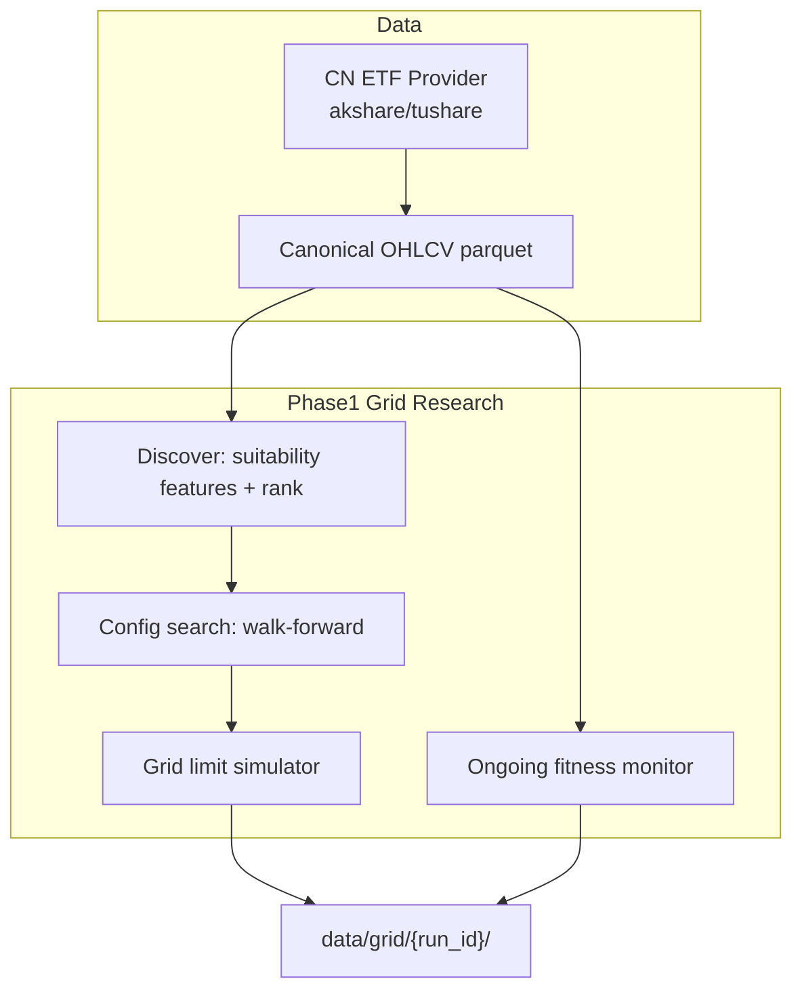

# A股ETF网格策略一期：方案评估与设计

## 结论：想法整体正确，但有 3 处必须先钉死

你的四期能力拆分是合理、可落地的研究闭环：

```text
Universe 发现 → 配置评估 → 回测复现 → 适性监控
      ↑__________________________________|
```

这比「先对全市场暴力调参再回测」更稳。需要修正的不是方向，而是**实现边界**与**可证伪指标**：

| 观点 | 判定 | 说明 |
|------|------|------|
| 先做网格标的发现 | 正确 | 网格是区间 + 均值回复策略，先筛「振得动、趋势不极端、流动性够」的 ETF，比全市场调参更省且更少过拟合 |
| 再做最佳配置评估 | 正确但易翻车 | 必须 **样本内搜索 + 样本外验证**；否则「最佳网格」几乎一定过拟合历史宽幅震荡 |
| 按配置回测 | 正确但现有引擎不够用 | 现有 [`src/alpha/backtest/core.py`](../../src/alpha/backtest/core.py) 是 **target_weight → 下一 bar open 市价再平衡**，无法表达挂单网格 |
| 持续检测是否仍适合网格 | 正确且重要 | 适配失效通常先于收益耗尽；应输出 **适性分数/告警**，而非只看累计收益 |

**核心正确性约束（一期默认）：**

1. **A 股现货 ETF 网格 = 做多网格（long-only）**：T+1 下卖出当日买入仓位受限；空头网格一期不做。
2. **日线可做发现与粗选，配置回测至少用 30m/60m**（或 5m 若数据可得）：挂单价触及需要 intraday 路径；仅用日线会系统性高估成交次数、低估趋势单边扫货。
3. **费用与规则按 ETF 实盘简化建模**：佣金 + 冲击/滑点；**不做印花税**（股票卖出特征）；买卖最小单位按 100 份；T+1 在网格成交引擎里生效。
4. **配置优化必须 walk-forward 或 holdout**，不以单段全样本最优参数当结论。

---

## 与当前仓库的关系

本仓已有：数据湖 + Feature/Strategy 协议 + YAML 研究流水线 + 市价型 bar 回测（见 [`ARCHITECTURE.md`](../../ARCHITECTURE.md)、[`src/alpha/strategies/core.py`](../../src/alpha/strategies/core.py)）。

**缺口（网格一期必建）：**

- A 股/ETF 数据接入（无 tushare/akshare/东方财富适配）
- 网格专用 **限价触价成交模拟器**
- 标的筛选 / 适性评分 / 参数搜索管线
- 现有 Strategy 协议只产 `target_weight`，网格应是 **独立仿真对象**（位置、挂单、库存），不宜硬塞进 MA-cross 那套权重再平衡

建议：网格一期作为 **research 子域** 挂靠现有 lake，不改坏现有 crypto/US 回测契约。



---

## 一期功能设计

### 1. 网格标的发现（Discovery）

**目标：** 从 A 股 ETF 宇宙输出「可候选网格标的」排序表，而不是直接给一套交易网格。

**宇宙门槛（硬过滤）：**

- 上市满 N 交易日（建议 ≥ 250）
- 近 60 日日均成交额 ≥ 阈值（建议先 5000 万，可配置）
- 排除杠杆/反向、流动性极差的主题小 ETF（一期可用列表规则 + 成交额）
- 有完整日线/优选分钟线

**适性特征（软评分，滚动窗口如 60/120 日）：**

| 维度 | 推荐指标 | 直觉 |
|------|----------|------|
| 非强趋势 | ADX 低、Er（Kaufman 效率比）低 | 网格怕单边趋势 |
| 均值回复 | 收益自相关（滞后 1）偏负、方差比、半寿命（OU 粗估） | 价格易拉回网格中轴 |
| 可交易振幅 | ATR/价格、布林带宽度、日内振幅中位数 | 太静挣不到费；太暴容易打穿 |
| 费用覆盖 | 「理论半网格利润 / 双边费率」粗 proxy | 振幅盖不住成本则剔除 |
| 流动性 | 成交额、（若有）冲击估计 | 保证挂单真实性 |

**综合：`grid_fit_score`（0–100）= 加权分位数打分**，输出：

- `instrument_id`, `score`, `rank`, 关键特征、`hard_pass`、时间戳
- 产物：`data/grid/discovery/{asof_date}/candidates.parquet`

**验证该模块想法：**  
「发现」应定义为 **regime + 成本可交易性**，不是「历史上网格赚最多」。历史上赚最多的往往是刚好遇到宽幅横盘的幸存者，不适合作选股标签。

---

### 2. 网格最佳配置评估（Config Evaluation）

**参数空间（一期收敛，避免组合爆炸）：**

- `range_mode`: `rolling_quantile`（推荐）或 `fixed_pct`
- `lookback`: 区间估计窗口（如 60/90 日）
- `n_grids`: 10 / 20 / 30
- `spacing`: `arithmetic`（一期只做等差；等比二期）
- `total_capital` / `per_grid_qty` 二选一
- `rebalance_center`: 是否随滚动中轴缓慢上移（true/false）
- `stop_or_pause`: 价格离开 `[lower, upper]` 超 X% 则暂停（研究用）

**评估协议（防过拟合，强制）：**

```text
对每个候选 ETF:
  for fold in walk_forward(train=180d, test=60d, step=60d):
    train 上搜索/评分 top-K 参数
    test 上只跑这 K 套，记录 OOS 指标
  汇总: 中位 OOS、最差 OOS、参数稳定性（top 参数是否跨 fold 漂移）
```

**目标函数（多目标，不只看收益）：**

1. OOS 夏普 / 收益回撤比  
2. 年化换手与费用占比  
3. 最大库存占用、库存单边时长  
4. 网格「触达利用率」（有成交的层级 / 总层）  
5. 跌破下沿 / 突破上沿次数与时间占比  

**选出的「最佳配置」定义：**  
在 OOS 稳健性约束下（最差 fold 不过度亏损、参数稳定）的帕累托优胜或综合 `utility`——**不是**全样本最大收益那一组。

产物：`data/grid/configs/{symbol}/{run_id}/best.json` + `search_ledger.parquet`。

---

### 3. 按配置回测（Config Backtest）

**独立 `GridSimulator`（新增），不要复用现价权重引擎。**

**成交规则（日线/分钟 bar 触价，一期可用）：**

- 网格 long-only：跌破某买单价位且低点触及 → 以 **限价** 成交（可选：需 close 穿越确认以更保守）
- 卖单：涨破对应网格卖价且高点触及 → 卖出（受 **T+1：可卖数量 ≤ 昨日末持仓**）
- 费用、最小 100 份、现金不足跳过买单
- 输出：成交明细、持仓路径、权益、库存、网格层状态

**必须报告的网格特有指标：**

- 已实现网格价差利润 vs 未实现持仓浮动  
- 平均持仓天数、最大持仓市值/权益  
- 单边扫货条数（连续同向成交）  
- 空仓/满仓时间占比  

与现有 `BacktestResult.write` 对齐风格：写入 `data/grid/backtests/{run_id}/`。

**重要：正确性验证看法**  
若仍用「目标仓位 + next open」，回测会把网格伪装成定时再平衡，**结果不可信**——必须限价触价 + T+1。

---

### 4. 检测标的是否仍适合网格（Ongoing Fitness）

**不是重新全量 discovery，而是对「在管标的 + 当前配置」做滚动体检。**

| 信号 | 触发含义 |
|------|----------|
| `trend_risk`：ADX / 效率比升破阈值 | 进入趋势市，网格库存风险上升 |
| `range_break`：价格相对网格上下沿突破并持续 | 当前配置失效，需暂停或重估区间 |
| `vol_collapse`：ATR 过低 | 收益盖不住成本 |
| `vol_spike`：波动骤升 | 易一次扫多层，库存激增 |
| `inventory_risk`：仓位长期贴单边 | 配置或市况不匹配 |
| `liquidity_drop`：成交额下滑 | 真实成交变差 |
| `fit_score` 相对发现期下降 Δ | 综合降级 |

输出：`suitable | watch | unsuitable` + 原因码；建议动作仅研究层：`pause` / `rebuild_range` / `drop_universe`。

刷新频率：日终一批即可（一期）。

---

## 推荐模块落点（实现时）

| 模块 | 路径建议 | 职责 |
|------|----------|------|
| CN ETF 数据 | `src/alpha/integrations/providers/cn_etf.py` + source YAML | 日线/分钟 OHLCV → canonical |
| 发现/适性特征 | `src/alpha/grid/features.py` | ADX、ER、ATR%、半寿命等 |
| 发现 job | `src/alpha/grid/discover.py` | 硬过滤 + 打分排序 |
| 配置搜索 | `src/alpha/grid/search.py` | walk-forward + ledger |
| 网格引擎 | `src/alpha/grid/simulator.py` | 限价触价、T+1、库存 |
| 适性监控 | `src/alpha/grid/monitor.py` | 在管标的 regime 告警 |
| CLI | `alpha grid discover|search|backtest|monitor` | 挂 [`src/alpha/cli.py`](../../src/alpha/cli.py) |
| 配置 | `configs/research/grid_*.yaml` | 宇宙、费率、搜索空间、阈值 |

一期默认数据源：**AkShare（免 token，研究友好）**，接口抽象成 Provider，后续可换 Tushare/券商。

---

## 想法正确性：常见误区对照

| 误区 | 更正确的做法 |
|------|----------------|
| 用「历史网格收益最高」选标的 | 用 **fit score + 流动性**；收益只在 OOS 验证 |
| 网格层数越多越好 | 层多换手升、费高、单层利润变薄；用 OOS 联合优化 |
| 固定上下沿永不调 | 缓慢滚动中轴或定期 recreate；突破则 pause |
| 日线回测等同实盘 | 至少分钟路径触价；否则当 **上界乐观估计** |
| 适合一次永远适合 | 适性是 **状态机**，要持续监控 |
| 复用 target_weight 回测就够 | 网格是 **离散挂单状态机**，必须专用引擎 |

**你的四功能拆分本身可验证且闭环完整**；正确性取决于：筛选标签是否反过拟合、回测是否忠实挂单、监控是否先于爆仓库存告警。

---

## 一期交付边界与二期留白

**一期做：** 数据接入、发现、walk-forward 配置评估、限价网格回测、日终适性监控、YAML/CLI、单测（触价、T+1、费用）。

**一期不做：** 实盘/券商下单、空头网格、等比网格精细优化、盘口 L2 撮合、组合级多 ETF 资金分配优化（可用等权/单标的先跑通）。

---

## 建议验证路径（证明方案可用）

1. 人工选定 2–3 只公认宽基（如沪深300/中证500/创业板 ETF），目测横盘段 vs 单边段。  
2. Discovery 应对横盘段 `fit_score` 更高；单边段偏低（**符号正确性**）。  
3. Search：全样本最优参数在随后趋势段应显著恶化；walk-forward 排名应更稳（**防过拟合**）。  
4. Simulator：构造人造「三角震荡 + 单边突破」序列，断言震荡有网格利润、突破触发 `range_break` 且库存升高（**引擎正确性**）。  
5. Monitor：把历史适性序列与事后回撤对齐，要求 `unsuitable` 常出现在大回撤前（召回率，不必完美）。

---

## 实施顺序（确认后执行）

1. CN ETF Provider + 配置/catalog，日线优先、分钟可选  
2. `grid/features` + `discover`  
3. `grid/simulator`（T+1 + 触价）+ 合成数据单测  
4. `grid/search` walk-forward  
5. `grid/monitor` + CLI 串联  
6. 文档：研究用 YAML 示例 + 指标字典（写入 ARCHITECTURE 一小节即可）

该顺序保证：**先有可信成交引擎，再谈最佳配置**，避免「用错误回测挑出好参数」。
