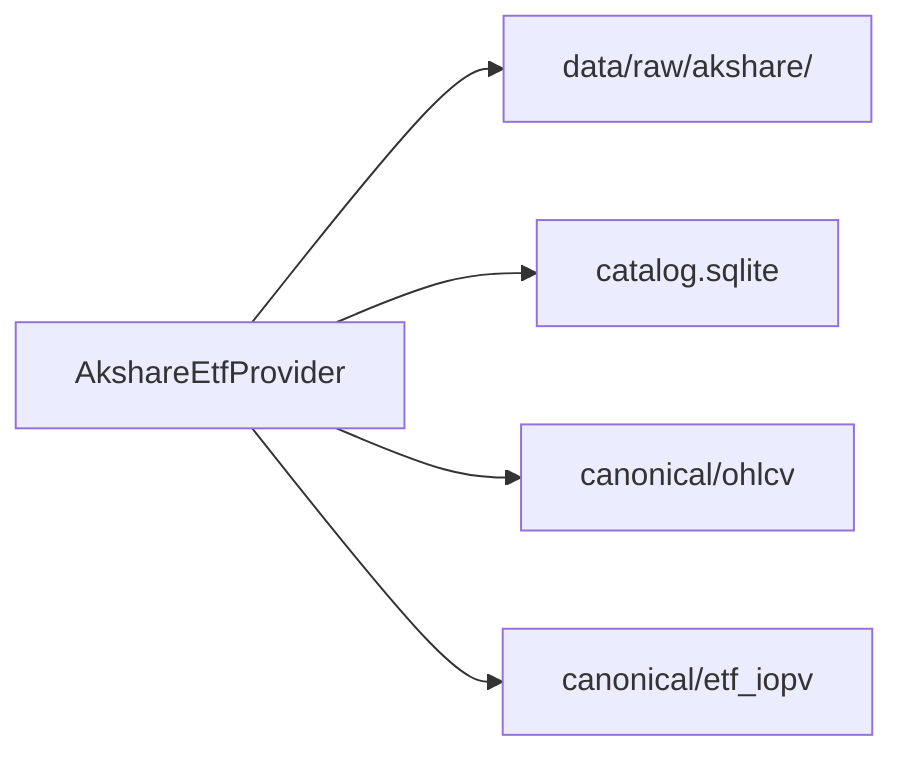

# ETF 溢价策略 — 数据获取一期

父计划：[ETF 溢价阈值策略](./etf-溢价阈值策略.md)。本计划**只做数据面**，策略/回测/告警后续再开。

## 目标与边界

**做：**

- 免费源 **AkShare** 适配器（可换东财 HTTP，接口抽象）
- 默认标的：QDII（配置可写死 `513300`、`413520` 等）
- 能力：ETF 列表/注册、日线 OHLCV、日终 NAV、实时最新价 + 官方 IOPV（及溢价若源直接给）
- 落湖：复用现有 raw + canonical；新增 `etf_iopv`（含日终 NAV 标注）
- CLI：`refresh-instruments` / `backfill ohlcv` / `backfill etf_iopv` / `sync etf_iopv`（实时快照）
- 质量门禁：IOPV≤0、缺字段丢弃；限频+重试

**不做：** FairIOPV、策略、库存回测、告警、QMT、付费数据、分钟历史 IOPV。

## 与现有架构对齐

沿用 [`VenueAdapter`](../../src/alpha/integrations/market_data.py) + provider 模式（参考 [`alpaca.py`](../../src/alpha/integrations/providers/alpaca.py)）：

| 现有 | 新增 |
|------|------|
| `OhlcvBar` + `write_ohlcv` | 直接复用，`venue=akshare`，`market_type=etf`，`tf=1d` |
| 无 IOPV/NAV 模型 | 新增 `EtfIopvPoint` + `write_etf_iopv` / `load_etf_iopv` |
| `MARKET_DATA_ADAPTERS` | 注册 `akshare` |
| [`configs/collection/sources/*.yaml`](../../configs/collection/sources/) | 新增 `akshare.yaml`，写入 [`collect.yaml`](../../configs/collect.yaml) |



## Schema：`etf_iopv`

在 [`schema.py`](../../src/alpha/schema.py) 增加（字段可微调，语义固定）：

```text
dataset=etf_iopv
venue, market_type=etf, instrument_id, symbol_raw
ts_event_ms, ts_ingest_ms
iopv: float          # 官方 IOPV；日终可用 NAV
price: float | null  # 同时刻市价（实时有；纯 NAV 回填可空）
premium: float | null  # (price-iopv)/iopv，源有则用，否则入库时算
source: str          # iopv_realtime | nav_eod | ...
```

分区：`data/canonical/etf_iopv/venue=akshare/date=YYYY-MM-DD/part-000.parquet`  
业务去重键：`(instrument_id, ts_event_ms, source)`。

日频 L0：对每个交易日写一条 `source=nav_eod`（`iopv=NAV`，`price=close` 可来自同日 OHLCV join 或同次拉取）。

## Provider 设计

文件：[`src/alpha/integrations/providers/akshare_etf.py`](../../src/alpha/integrations/providers/akshare_etf.py)

```text
AkshareEtfProvider
  venue = "akshare"
  market_type = "etf"
  list_instruments() -> Instrument[]   # 配置 symbols 优先；可选全市场 ETF 表过滤 QDII
  fetch_ohlcv(symbol, tf=1d, start, end) -> OhlcvBar[]
  fetch_nav_eod(symbol, start, end) -> EtfIopvPoint[]   # source=nav_eod
  fetch_iopv_realtime(symbols) -> EtfIopvPoint[]      # source=iopv_realtime
```

实现注意：

- AkShare 多为**同步** API → `asyncio.to_thread` 包一层，保持与现有 async adapter 一致
- `akshare` 作 **optional 依赖**（`pyproject.toml` extra 如 `cn`），避免拖垮默认安装
- 限频：请求间隔可配置（如 0.3–0.5s）；`tenacity` 重试
- 代码映射：`513300` → 东财/新浪符号规则在 adapter 内集中处理

配置 [`configs/collection/sources/akshare.yaml`](../../configs/collection/sources/akshare.yaml)：

```yaml
venue: akshare
market_type: etf
timeframes: [1d]
symbols:
  - "513300"
  - "413520"
request_interval_sec: 0.5
```

## CLI / 存储改动面

| 位置 | 改动 |
|------|------|
| [`registry.py`](../../src/alpha/integrations/registry.py) | 注册 `akshare` |
| [`cli.py`](../../src/alpha/cli.py) | `_MARKET_SOURCES` 含 akshare；`backfill etf_iopv`；`sync etf_iopv`（拉实时写湖） |
| [`canonical.py`](../../src/alpha/collection/storage/canonical.py) | `write_etf_iopv` |
| [`query.py`](../../src/alpha/collection/storage/query.py) | `load_etf_iopv` |
| [`SCHEMA.md`](../../SCHEMA.md) / [`ARCHITECTURE.md`](../../ARCHITECTURE.md) | 短文记录 dataset |

示例命令（实现后）：

```bash
pip install -e ".[cn]"
alpha collect catalog refresh-instruments --venue akshare
alpha collect backfill ohlcv --venue akshare --tf 1d --days 365
alpha collect backfill etf_iopv --venue akshare --days 365   # NAV EOD
alpha collect sync etf_iopv --venue akshare                  # 实时快照
```

## 验收标准

1. 配置内 `513300`、`413520` 能写入 catalog  
2. 日线 OHLCV parquet 可读，字段齐全  
3. `etf_iopv` 含 `nav_eod` 历史；实时 sync 写出 `iopv_realtime` 且 `iopv>0`、`price>0`  
4. 无 AkShare 时 import/安装路径清晰（extra），不破坏现有 binance/alpaca 测试  
5. 单测：用**假 DataFrame** mock AkShare 返回，测解析与去重（不依赖外网 CI）

## 实施顺序

1. schema + CanonicalStore/query + SCHEMA 文档  
2. `AkshareEtfProvider`（OHLCV + NAV + realtime IOPV）+ YAML + registry  
3. CLI backfill/sync  
4. mock 单测 + 本地联调两只 QDII  
5. 回写父计划：数据层勾选完成，策略仍待做  

## 文档落点

确认本计划后，同步保存为 [`docs/plans/etf-溢价-数据获取.md`](./etf-溢价-数据获取.md)，并在 [`docs/plans/README.md`](./README.md) 挂链接。

---

## 实现状态（仓库）

已落地：

- [`src/alpha/schema.py`](../../src/alpha/schema.py) `EtfIopvPoint`
- [`src/alpha/integrations/providers/akshare_etf.py`](../../src/alpha/integrations/providers/akshare_etf.py)
- [`configs/collection/sources/akshare.yaml`](../../configs/collection/sources/akshare.yaml)
- CLI：`backfill etf_iopv` / `sync etf_iopv`
- 单测：[`tests/test_akshare_etf.py`](../../tests/test_akshare_etf.py)

依赖：`pip install -e ".[cn]"`。东财接口偶发断连时 provider 内建 3 次重试；`hist` 失败时 NAV 仍可入库（price 可空）。
