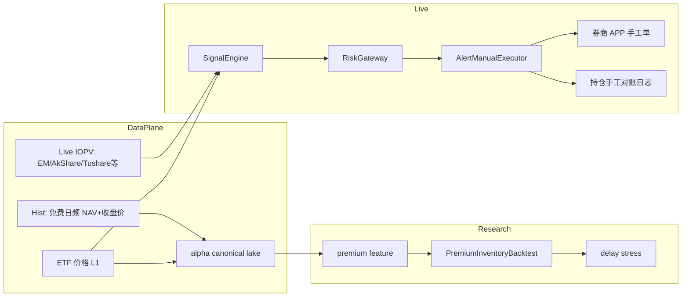

# A股 ETF 溢价阈值策略：生产级回测与执行设计

## 策略本质（先校正预期）

信号定义：

\[
\text{premium} = \frac{P_{\text{market}} - \text{IOPV}}{\text{IOPV}}
\]

- `premium > 9%` → **卖出** ETF  
- `premium < 2%` → **买入** ETF  

这不是经典「一二级无风险套利」（那需要申购/赎回篮子），而是 **溢价均值回复 + 库存管理**：

| 点 | 含义 |
|----|------|
| 高溢价卖 | 需要**已有仓位**；普通账户多数不能裸空 ETF |
| 低溢价买 | 建库存，等待下一次高溢价卖出 |
| 9% 阈值 | 宽基 ETF 极少触发；**QDII / 跨境 / 小众主题**在外围休市、汇率、额度时更常见 |
| T+1 | 当日买不能当日卖，回测与实盘必须建模 |

**已确认约束与默认：**

1. **仅二级市场**买卖，无申赎通道  
2. **无 QMT**：资产达不到券商量化门槛 → 实盘不依赖 QMT/miniQMT  
3. 一期：**研究湖 + 回测 + Paper**；实盘落地为 **信号告警 + APP 手工下单**（半自动）  
4. 架构预留 `BrokerAdapter`；将来资产达标可再挂 QMT，不必重写策略  
5. **数据来源：免费优先**（AkShare / 东财公开接口等）；付费源不进一期依赖，仅作文档中的可选升级  

若以后有申赎权限，再加 `CreateRedeemAdapter`；与是否有 QMT 正交。

---

## 总体架构（无 QMT）



与本仓关系：继续用 [`ARCHITECTURE.md`](../../ARCHITECTURE.md) 的 raw→canonical→研究读取；策略在 [`src/alpha/strategies/`](../../src/alpha/strategies/)；回测用专用库存引擎（限价/对手价 + T+1）。

---

## 一、数据来源（重点）

### 1. 你真正需要的字段

| 字段 | 用途 | 频率建议 |
|------|------|----------|
| ETF 最新价 / 买卖一价 | 可成交参考价 | tick 或 3s |
| **IOPV** | 溢价分母 | 交易所约 **15s** 一更（非逐笔） |
| 日终 NAV | 校验、盘后对账 | 日频 |
| 成交量/买卖档 | 冲击与能否成交 | L1 至少 |
| 交易日历、停牌、涨跌停 | 风控 | 日/实时 |
| ETF 类型标签 | QDII/股票/债券过滤 | 静态+日更 |

溢价计算必须用 **同时刻对齐** 的 \(P\) 与 IOPV；IOPV 慢于 tick 时，应用「最新 IOPV + 对应时间戳」并对齐到事件时钟，回测里要做 **IOPV 延迟敏感度**（0/15/30s）。

### 2. 实时数据（免费优先）

| 优先级 | 来源 | 费用 | 评价 |
|--------|------|------|------|
| **P0** | **AkShare**（东财/新浪等）：ETF 最新价 + IOPV/溢价 | 免费 | **一期默认**；限频、重试、脏点过滤 |
| **P0 备** | 自写 HTTP 调东财公开行情 | 免费 | 少一层依赖，自维护 |
| P2 | Tushare 免费积分档（若已有） | 免费额度 | 可选补 NAV/列表；非必须 |
| 不做一期 | 掘金/米筐/Wind、QMT | 付费/有门槛 | 仅文档升级项 |

无 QMT + 免费源：信号源 ≠ APP 成交。宽阈值 + 门禁 + 人工确认。告警展示溢价、价格、IOPV、时间戳。

**质量门禁：**

- IOPV ≤ 0 / 超时 → 禁止新信号  
- 溢价跳变异常 → 熔断该标的  
- 日终免费 NAV 与收盘价量级校验  
- 下单前看券商 APP  

### 3. 历史数据（免费路径）

免费几乎无可靠**盘中分钟 IOPV 长历史**，一期降级：

| 层级 | 免费做法 | 能证明什么 |
|------|----------|------------|
| **L0（一期主回测）** | AkShare：**日频收盘价 + 日终 NAV** | 规则、库存/T+1、极端日触发；**非**盘中绩效结论 |
| **L0+** | 公开分时仅做「最近交易日」回放 | 验证当日链路 |
| L1 付费分钟 IOPV | **out of scope** | 有预算再开 |

入库：

- `dataset=etf_iopv`（日频可用 NAV，标注 `source=nav_eod`）  
- `dataset=ohlcv`  
- 特征：`premium` + `premium_freq=daily|intraday`  

**诚实约束：** 免费一期先把系统与告警跑通；不宣称多年盘中 9% 策略已回测可盈利。

### 4. 标的宇宙（已确认为 QDII 为主）

一期聚焦跨境 QDII，例如 **纳指类（513300 等）、日经类（413520 等）**；宽基 A 股 ETF 不作主战场。  
硬过滤：日均成交额、可取得价与参考净值、非停牌。

### 4.1 QDII 的 IOPV：官方 vs 自己算

**可以自己算「公允参考价」，但那通常不是交易所推送的官方 IOPV，而是另一套信号。**

| 口径 | 含义 | 适不适合你 |
|------|------|------------|
| **官方 IOPV** | 管理人/授权商按 PCF+规则算，经交易所推送；外盘休市时常用**昨收/陈旧成分价** | APP/东财上的「溢价」多半是这个；**免费可直接拉，不必自己复刻官方公式** |
| **自算 FairIOPV（推荐作增强）** | 用外盘期货/指数现货 + 汇率，估「若外盘此刻开着，净值大概多少」 | QDII 在 A 股交易时段（美股常休市）**更贴近真实贵贱**；免费源可近似 |

为什么 QDII 值得自算：

- A 股开盘时，纳指成分多半还没开（或已收盘），**官方 IOPV 更新慢**，市价却已抢跑 → 容易出现你看到的 **高溢价**。  
- 完全复刻官方 IOPV：需要完整申赎清单、现金差额、估值汇率、停牌替代规则 → **免费一期不划算，也难 1:1**。  
- 自算 FairIOPV 目标不是咬死官方数字，而是回答：「相对外盘公允价，A 股贵了多少」。

**纳指类（如 513300）免费近似示例：**

```text
FairIOPV_t ≈ NAV_{T-1} × (1 + r_NQ) × (1 + r_FX) × 调整系数
```

- `NAV_{T-1}`：昨日日终净值（AkShare/基金公告，免费）  
- `r_NQ`：自昨 NAV 时点以来，纳指期货（或 QQX 相关）涨跌幅（免费行情）  
- `r_FX`：美元兑人民币中间价/离岸人民币变动（免费）  
- 调整系数：可先用 1，或用历史 `ETF收盘/官方口径` 校准一点跟踪差  

**日经类（如 413520）：** 同理，用日经期货/指数 + 日元兑人民币。

**和你阈值策略的接法（计划默认）：**

1. **P0 信号**：`premium_official = P / IOPV_official - 1`（免费拉官方 IOPV）——与盘面一致，实现简单。  
2. **P1 增强（QDII 强烈建议后续加）**：`premium_fair = P / FairIOPV - 1`；可与官方溢价并列展示，告警写清用的是哪一种。  
3. 不要把「自算 Fair」硬叫成官方 IOPV，回测/日志字段分开：`iopv_official` vs `iopv_fair`。

**结论：**  
- **官方 IOPV：不用自己算，免费拉。**  
- **公允净值：可以、也值得自己用期货+汇率近似算**——尤其做 513300 / 413520 这类；公式是近似，要门禁和人工确认，但比死抄陈旧官方 IOPV 更贴近 QDII 真相。

---

## 二、可交易平台（无 QMT 路径）

### 现实选项

| 平台 | 下单 | IOPV | 你现在能不能用 | 建议 |
|------|------|------|----------------|------|
| **券商手机/电脑 APP** | 手动 | APP 里常能看溢价/IOPV | **能** | **实盘成交 P0** |
| **本仓 Signal + 飞书/企微/系统通知** | 不下单，只推「买/卖+数量建议」 | 独立拉公开源 | **能** | **半自动生产主路径** |
| 聚宽等研究平台免费档 | 研究/仿真 | 视平台 | 可用则作对照 | **非必须依赖** |
| 券商条件单/网格单 | 半自动 | 无策略 IOPV 逻辑 | 看券商 | 仅辅助，难实现 9%/2% |
| 同花顺/通达信自动下单插件 | 程序化 | 有 | 技术上可能 | **不推荐主路径**（协议/稳定/合规风险） |
| QMT / miniQMT | 程序化 | 最好 | **资产不够 → 暂不可用** | 预留适配器，达标再启用 |
| PTrade / 机构柜台 | 程序化 | 看权限 | 普通人通常无 | 忽略 |

**推荐组合（按你当前约束）：**

```text
研究/回测:  AkShare 免费日频 OHLCV + NAV → 本仓 lake + L0 PremiumBacktest
仿真:      PaperAdapter
实盘:      免费实时 IOPV/价 → Alert → 券商 APP
对账:      本地账本 + 日终对齐
```

这仍是「生产可用」的半自动系统：策略与风控在代码里，**成交在人可控的 APP 里**，避开资产门槛和灰产自动下单。

---

## 三、策略执行系统设计

### 1. 信号状态机（避免抖动）

不要每个 tick 裸阈值；建议：

- 买入区：`premium < 2%` 且持续 \(N\) 秒（如 15–45s，覆盖 1–3 个 IOPV）  
- 卖出区：`premium > 9%` 且持续 \(N\) 秒  
- 中间带 `[2%, 9%]`：**持有不动**  
- 冷却：同标的成交后 \(M\) 分钟不再反向刷单  
- 告警文案带：建议限价、参考 IOPV、源时间戳、是否可卖（T+1）  

### 2. 库存与风控（二级市场必做）

- `max_position_value` / `max_lots`  
- 卖出数量 ≤ **T+1 可卖**（策略侧维护；与 APP 持仓日终对齐）  
- 单日最多买入次数 / 名义金额  
- 涨跌停、停牌、IOPV 失效 → 禁止告警开仓  
- **高溢价但无仓**：告警「机会但无库存」，不假装能卖  

### 3. 执行适配层（无 QMT）

```text
BrokerAdapter (Protocol)
  - get_iopv / get_quote   # 可由 PublicIopvProvider 实现
  - place_order           # Alert 实现为「发通知 + 记 pending」
  - report_fill           # 人工回填成交
  - positions / sellable  # 本地账本 + 日终对账

PublicQuoteProvider | PaperAdapter | AlertManualExecutor
(可选未来) QmtAdapter
```

订单带 `client_oid`；告警与回填落 `data/execution/…`，便于复盘。

### 4. 时钟与会话

- 仅连续竞价时段发买入/卖出告警  
- 开盘/尾盘溢价噪声大，可降权或关闭  
- QDII：外盘休市时 IOPV 更新变慢，高溢价可能粘住——标的级开关  

---

## 四、回测系统设计

### `PremiumInventoryBacktest`

输入：对齐的 `(ts, price, iopv, bid, ask, volume)`  
规则：阈值触发 → 以 ask 买 / bid 卖（或 last±滑点）→ 扣佣金 → T+1 可卖库存  
输出：权益、成交、持仓、触发次数、**有信号无仓错失次数**、费用占比  

**必须报告的指标：**

- 触发频率（按标的/年份）— 验证 9% 是否过稀  
- 平均持有期、库存占用  
- 溢价分布直方图（买入时/卖出时）  
- 最大回撤（库存市值下跌，不只溢价收敛失败）  
- 延迟假设敏感性  

Walk-forward：阈值 9%/2% 可先 **固定为业务阈值**（少调参，降过拟合）；若要优化，只允许小幅网格且 OOS 验证。

---

## 五、落在本仓的模块切分

**策略逻辑放在 [`src/alpha/strategies/`](../../src/alpha/strategies/)**（与现有 MA 策略同级），例如 `premium_threshold.py` → `PremiumThresholdStrategy`。

注意：当前 [`Strategy`](../../src/alpha/strategies/core.py) 协议是 `target_weights(bars, features)`。溢价策略可以：

1. **信号层仍实现该协议**：把「买/持/卖」映射成目标权重（如满仓权重 / 0），供统一 CLI 调度；  
2. **库存、T+1、可卖数量** 不塞进 strategies，而由专用回测/执行消化（否则 strategies 会依赖券商账户状态）。

| 模块 | 路径建议 | 职责 |
|------|----------|------|
| **溢价策略** | **`src/alpha/strategies/premium_threshold.py`** | 9%/2% 阈值、确认窗、冷却 → 目标仓位/动作 |
| 溢价特征 | `src/alpha/features/`（如 `premium.py`） | 由 price+IOPV 算 `premium` |
| CN ETF + IOPV provider | `integrations/providers/cn_etf_iopv.py`（**AkShare 优先**） | 免费行情/IOPV/NAV 落湖与轮询 |
| 回测 | `src/alpha/backtest/premium_inventory.py` | 库存+T+1+买卖价撮合 |
| 实盘（无 QMT） | `src/alpha/execution/alert_manual.py` + `paper.py` | 告警、回填、纸面；**预留** `qmt.py` |
| 配置 | `configs/research/etf_premium_threshold.yaml` | 阈值、标的池、时段 |
| CLI | 扩展现有 `alpha backtest` / 新增 `premium` 子命令 | 运维入口 |

一期不改坏现有 crypto/US MA 回测。

---

## 五附、QMT / miniQMT / xtquant 是什么、贵不贵

| 名称 | 是什么 |
|------|--------|
| **QMT** | 迅投（Thinktrader）给**券商**用的量化终端：行情 + 策略 + 下单，嵌在券商通道里 |
| **miniQMT** | QMT 的轻量客户端，常开在后台，供外部 Python 连本地下单/取数 |
| **xtquant** | 连 miniQMT 的 **Python SDK**（`xtdata` 行情、`xttrader` 交易） |

**收费大致结构（以开户券商为准，会变）：**

- **不是**像 Wind 那样按年买一个「QMT 会员」那么简单；一般是 **开支持 QMT 的券商账户** → 向客户经理开通量化/QMT 权限。  
- **交易通道 / 基础 QMT**：不少券商对达标客户**免软件费**或仅收交易佣金；常见门槛是资产（例如几十万级，以券商公示为准）。  
- **投研/高级行情包**：部分 Level-2、增值数据可能**另计费**。  
- **xtquant / miniQMT**：通常随券商 QMT 权限附带，**不单独向迅投网购**；没有券商权限则无法实盘。  
- **历史盘中 IOPV**：免费源基本没有长历史 → 一期只用日频 L0，不把付费数据写进依赖。

---

## 六、正确性与风险说明（验收标准）

1. **免费 L0 回测不能当盘中盈利证明**，只验证系统与极端日逻辑。  
2. **9% 卖出依赖库存**：绩效含建仓期市场风险。  
3. **无 QMT + 免费源**：与 APP 价可能不一致 → 人工确认 + 宽阈值 + 门禁。  
4. 先用常高溢价 QDII 做链路验证；宽基作负例。  
5. 不引入通达信/同花顺自动打单；不引入付费数据作为一期阻塞项。

---

## 七、实施顺序（免费 + 无 QMT）

1. AkShare provider：ETF 列表、日线、日终 NAV、实时价/IOPV  
2. `PremiumThresholdStrategy` + L0 库存回测 + 单测  
3. Paper + AlertManual  
4. 盘中告警小资金半自动验证  
5. （可选很久以后）付费分钟 IOPV 或 QMT

---

## 当前状态

- 交易模式：二级市场  
- 通道：无 QMT → 半自动告警 + 券商 APP  
- 数据：**免费优先（AkShare / 东财公开）**；付费不进一期
