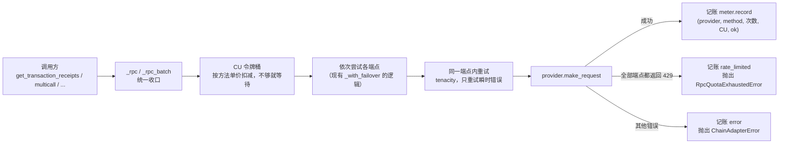
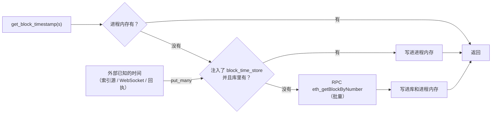
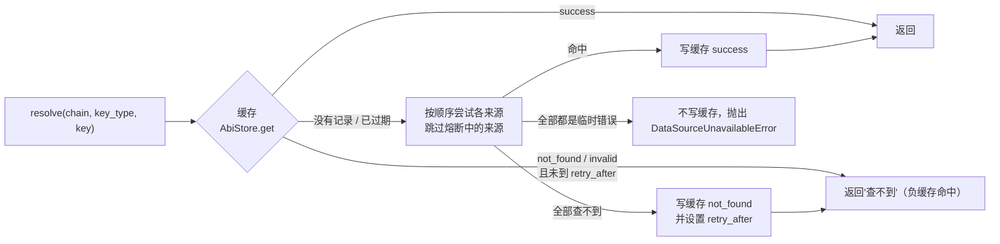
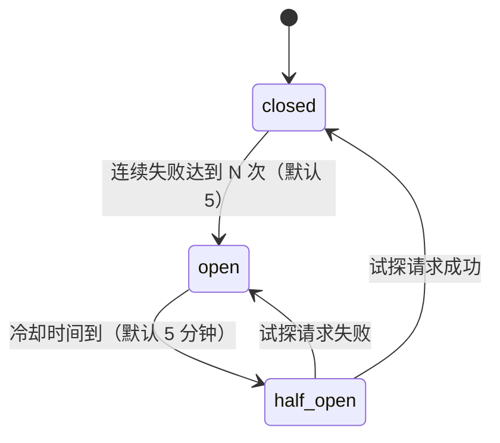

# M1 数据基建 · 实施规划

> 所属：钱包链上行为分析系统第一版的第 1 个开发里程碑，见设计文档 `research/docs/钱包链上行为分析系统设计方案.md` 12.1。
> 本规划批准后，先原样存入 `research/docs/wallet-analyzer-M1-数据基建实施规划.md`，再按第 7 节的顺序开发。

## 实施进度（2026-09-26）

| 步骤 | 状态 | 说明 |
|---|---|---|
| 1 alpha_core | ✅ | `metering.py`、`ports.py`、`chain_data.py`（回执/日志/交易值对象，原计划放在 alpha_chains，因存储层也要用而下沉到 core，`alpha_chains.base` 重新导出）、两个新异常、`EVM_CHAIN_IDS` |
| 2 统一调用路径 | ✅ | `_rpc`/`_rpc_batch` 走自己实现的 JSON-RPC（web3 HTTPProvider 自带对 429 的隐藏重试，既不记账又浪费额度）；历史方法输出不变 |
| 3 新 RPC 能力 | ✅ | 另加了 `raw_call`：执行错误立即抛出，不重试（历史方法 `call` 会对确定性错误重试 5 次） |
| 4 Multicall3 | ✅ | 部署地址和两个函数选择器已用 eth_getCode 核实 |
| 5 存储 | ✅ | 迁移 0006 已应用到本地库，往返迁移验证通过；`SCHEMA.md` 已同步；另加 `stores.py`（端口的数据库实现，每次调用一个短事务） |
| 6a ABI 来源、价格源 | ✅ | 接口格式已实测：4byte 结果按时间倒序、真签名通常是最早那条；openchain 带 filtered 标记 |
| 6b 地址索引源 | ⏸ 等 M0 | 新发现：research 的 `BNB_RPC_URLS` 实际是 Ankr，Ankr 的 Advanced API 应纳入候选 |
| 7 冒烟脚本 | 🟡 部分 | `scripts/oneoff/2026-09-26_m1-smoke.py` 已跑通（回执、区块时间、token 元数据、BNB 余额、ABI、历史价格），第二次运行不可变数据外部调用为 0；"从索引源拉交易清单"等 6b 完成后补上 |
| 8 文档 | ✅ | 设计文档 12.1、6.1、7.4、5.1、5.2 已更新；`.env.example` 已补新环境变量 |

**实施中的新发现**：
- PublicNode 免费 HTTP 端点**不提供回执**（返回"Archive requests require a personal token"），回执只能走付费 RPC。
- `alembic check` 报告的模型与数据库差异都来自历史表（`chain_cursors`、`pool_candidates` 等），新表无偏差。
- 冒烟时发现：只能从 ERC20 `Transfer` 事件（3 个 topic）里取 token 地址，不能把所有发出日志的合约都当 token，否则读不出 decimals 的合约每次都会重查。M3 取 token 时沿用这个口径；如仍有读不出元数据的 token，需要在 M3 补负缓存。

## 1. 背景与目标

钱包分析系统（第一版）的所有上层功能（解码、持仓、盈亏、报告）都要依赖一组可靠、省额度的数据读取能力。research 现有的 `alpha_chains`、`alpha_datasources`、`alpha_storage` 是为池子发现（lp-backtest、live-signal）写的，缺少以下能力：

| 缺什么 | 后果 |
|---|---|
| 取回执、取交易、`get_code`、nonce、批量 JSON-RPC | 无法按交易哈希精确取数据，只能扫区块 |
| Multicall3 | 估值和元数据读取要逐个 `eth_call` |
| 区块时间缓存只在进程内存 | 每起一个新进程就重新查 RPC（lp-backtest 已踩过） |
| 外部调用记账、CU 限速 | 看不到额度花在哪里；NodeReal 月度额度被打光过；免费版每秒 300 CU 的限速没有保护 |
| 配额耗尽时和普通故障没有区分 | 上层无法"暂停任务、保存断点"，只能看到一个笼统的 `ChainAdapterError` |
| 地址索引源、ABI 来源（负缓存 + 熔断）、按时间点查价格 | 无法零 RPC 拿到钱包交易清单，也无法识别合约和给历史事件计价 |
| 对应的缓存表 | 不可变数据无法"只拉一次" |

**M1 的交付**：在 `research/packages` 里补齐上述能力，并配好测试。不涉及任何钱包级业务逻辑，那是 M3 的事。

**验收标准**：
1. 对基准钱包 `0x05BB…`，用一个 oneoff 冒烟脚本完成以下读取并全部落库：交易清单（索引源）、一批回执、区块时间、token 元数据、合约字节码、一组 Multicall 余额、若干合约的 ABI、若干历史价格点。
2. **同样的脚本第二次运行，不可变数据的外部调用为 0**，额度账本里能看到第一次运行按方法统计的调用次数和 CU。
3. 模拟 429 配额耗尽时，抛出的是 `RpcQuotaExhaustedError`，不会原地重试。
4. lp-backtest、live-signal、protocols、metrics 的现有测试全部通过；它们的调用代码不用改。

## 2. 范围

**做**：`alpha_core`（端口和异常）、`alpha_chains`（RPC 能力 + 记账 + 限速）、`alpha_datasources`（地址索引源、ABI 来源、价格源）、`alpha_storage`（第 5 节列出的 8 张表及对应仓储）、`SCHEMA.md` 同步、oneoff 冒烟脚本。

**不做**：
- 钱包级编排（取数规划器、回填任务、覆盖区间）→ M3；
- 解码、协议识别、估值解包 → M2；
- 免费端点兜底读取、WebSocket 改造 → 第三阶段；
- 把 lp-backtest、live-signal 切换到新的区块时间持久化缓存：接口已经留好，但默认不启用，不在本次改它们的行为。

**对设计文档 12.1 的两处调整**（本次一并更新设计文档）：

1. **表的建立时机**：`wallets`、`wallet_sync_ranges`、`wallet_transfers`、`wallet_sync_jobs` 挪到 M3 建；`contract_registry`、`protocol_instances` 挪到 M2 建；`wallet_events` 挪到 M2/M3 建。原因是这些表的字段取决于 M2 的事件分类和 M3 的编排细节，现在建容易反复改结构。研究区的一贯做法也是"不提前搭没有调用方的东西"（见 `alpha_datasources/__init__.py`）。M1 只建通用链数据缓存和运维表。
2. **去掉 `chain_internal_transfers` 表**：索引源返回的内部交易本来就是"某个地址视角"的数据，和 `wallet_transfers` 中 `kind=internal` 的记录重复。统一由 M3 的 `wallet_transfers` 承载。

**前置依赖 M0**：`AddressHistorySource` 的具体供应商实现（第 7 节步骤 6b）要等 M0 选型结果；其余步骤可以先做。M0 的实测脚本放在 `research/scripts/oneoff/`，不在本规划范围内。

## 3. 现有模块的认知与上下游影响

| 模块 | 现状 | 上游调用方 | 本次改动与兼容性 |
|---|---|---|---|
| `alpha_chains.base.ChainAdapter` | 抽象接口：`get_latest_block`、`get_logs`（单地址）、`get_block_timestamp`、`call`、`find_block_by_timestamp` | protocols 插件、metrics `chain_reads`、lp-backtest、live-signal | **只新增方法**，现有方法签名不变。测试里的假适配器都是鸭子类型，没有继承 ABC，新增抽象方法不会让它们失效 |
| `alpha_chains.evm_common.EvmChainAdapter` | web3 `HTTPProvider`；`_with_failover` 依次尝试各端点；tenacity 重试；时间戳只缓存在进程内存 | `bsc.build_bsc_adapter()` 被 lp-backtest（discover/ingest/qualify/aggregate_candles/metrics/seed_whitelist/calibrate）和 live-signal（main/subscribe）调用 | 所有 RPC 调用收口到一条统一路径（限速 → 故障切换 → 重试 → 记账）。**`get_logs` 的输出格式保持不变**：现有 `LogEntry.topics` 和 `transaction_hash` 是用 `HexBytes.hex()` 生成的、不带 `0x` 前缀，下游 `swap_events` 依赖这个格式。构造参数只新增可选项，默认行为不变 |
| `alpha_chains.bsc.build_bsc_adapter` | 读 `BNB_RPC_URLS`、`BNB_LOG_CHUNK_SIZE` | 同上 | 新增可选参数 `meter`、`block_time_store`；新增环境变量 `BNB_RPC_MAX_CUPS`（不配置则不限速，保持现状） |
| `alpha_chains.erc20.read_decimals` | 单次 `eth_call` | metrics `read_decimals_cached` | 保留不动；新增批量元数据读取函数 |
| `alpha_storage.models.TokenRow` / `TokenRepository` | 只有 `decimals`；主键列是 `CHAR` 类型 | metrics `read_decimals_cached` | 新增若干可空列；现有 `get_decimals`、`upsert` 的行为不变 |
| `alpha_datasources` 的 GeckoTerminal / CoinGecko 客户端 | 只能查当前值或最近 N 天 | lp-backtest、live-signal、metrics snapshots | 新增方法，不改现有方法 |
| Alembic | 已有 0001~0005 | — | 新增 `0006_chain_data_cache` |

**顺带发现的现有问题（本次不修）**：`swap_events.tx_hash` 是 `CHAR(66)`，但写入的哈希不带 `0x`，只有 64 位，数据库会用空格补足到 66 位。这正是 memory 里记录的 CHAR 尾部空格问题。M1 的新表一律用 `VARCHAR`，哈希统一带 `0x` 前缀。

## 4. 设计

### 4.1 RPC 调用的统一路径（数据流）



- 新方法走原始 JSON-RPC（`provider.make_request` / 批量请求），自己解析返回的十六进制，统一输出**小写、带 `0x`** 的字符串。
- 现有方法（`get_logs`、`call`、`get_block`）仍走 web3 的类型化接口，只是外面套上限速和记账，保证输出格式不变。
- 批量请求：每批默认 50 个（`BNB_RPC_BATCH_SIZE` 可以覆盖）。批量里单项失败的，单独重试一次；仍失败的放进结果的 `failed` 列表，不静默丢弃。
- **配额耗尽的判定**：HTTP 429，或者 JSON-RPC 错误信息里含 quota/limit 字样，并且**所有端点都这样**，才抛 `RpcQuotaExhaustedError`（它是 `ChainAdapterError` 的子类，所以现有的 `except ChainAdapterError` 照样能接住）。
- **（2026-09-29 修订）429 分两类**：M2 冒烟时发现 Ankr 的 429 是每秒限速（原文 "call rate limit exhausted, retry in 10s"），几秒后就恢复，和 NodeReal 的月额度耗尽（"You've reached your monthly quota limit"）完全不同，原来的判定把两者混为一谈，限速时整个任务直接失败。现在由 `providers.classify_limit` 按厂商原文分类（规则与 alpha-lp `rpc-vendor.ts` 的 `isPlanQuotaExhausted` 一致；任何厂商原文带 monthly 一律算额度耗尽；PublicNode 没有计划额度）：
  - **短时限速**：在同一端点按提示时间（原文的 "retry in Ns"、Retry-After 头，没有则 1、2、4、8 秒）退避重试，单次最多等 30 秒、最多 4 次，用尽再切换端点；全部端点都被拒绝且其中有限速时抛 `RpcRateLimitedError`（调用方可稍后重试），记账 `rate_limited`；
  - **计划额度用完**：不重试，切换端点；全部端点都是额度用完才抛 `RpcQuotaExhaustedError`，记账 `quota_exhausted`；
  - Multicall 遇到这两种异常都不对半拆批（拆小只会成倍增加调用）；历史路径（web3 自带 429 重试）放弃后用同一个分类器决定抛哪种异常。

### 4.2 区块时间的持久化缓存



`alpha_chains` 不能依赖 `alpha_storage`（依赖方向约束），所以在 `alpha_core` 里定义 `BlockTimeStore` 协议（Protocol），由 `alpha_storage` 的仓储按结构实现。这样 storage 也不需要 import chains。新增批量版本 `get_block_timestamps(blocks)`。

### 4.3 Multicall3

- 地址 `0xcA11bde05977b3631167028862bE2a173976CA11`。在步骤 4 的测试里用 `eth_getCode` 核实它在 BSC 上确实部署了。
- 用 `tryAggregate(false, calls)`：返回每个子调用的 `(success, return_data)`，调用方逐个处理，**失败的子调用不会被当成 0**。
- **批次大小自适应**：从默认 400 开始（`BNB_MULTICALL_CHUNK` 可以覆盖）。整批失败（gas 超限、返回过大、超时）就把这一批对半拆开重试，最小拆到 1；单个子调用还失败，就标记为失败。
- 内置的辅助函数：
  - `get_eth_balances(addresses)`：走 Multicall3 自带的 `getEthBalance`；
  - `erc20.read_metadata_batch(tokens)`：批量读 decimals、symbol、name，兼容把 symbol 定义成 `bytes32` 的老代币；
  - `erc20.read_balances(pairs)`：批量读 `(token, owner)` 余额。

### 4.4 额度记账和限速

- `alpha_core.metering`：
  - `CallMeter` 协议：`record(provider, method, *, count=1, cu=None, status="ok")`；
  - `InMemoryCallMeter`：线程安全，按 `(日期, app, provider, method, job_ref, status)` 在内存里累加，`drain()` 取出累计值；
  - `NullCallMeter`：什么都不做，是默认值，保证不注入时行为不变。
- `alpha_storage` 的 `ExternalCallLedgerRepository.flush(meter)`：把内存里的累计值用 `ON CONFLICT DO UPDATE` 叠加进 `external_call_ledger`。由调用方在任务结束时或定时调用，**不在每次 RPC 时写库**。
- `alpha_chains.providers`：
  - 根据 URL 的域名识别供应商（例如包含 `nodereal.io`）；
  - 维护 NodeReal 各方法的 CU 单价表（取自设计文档 5.1）；
  - 表里没有的方法记 `cu=None` 并在日志里告警，由 M0 补齐。
- `alpha_chains.rate_limit.CuTokenBucket(max_cups)`：
  - 桶容量等于每秒允许的 CU，每秒补满；
  - 取令牌时，余额不够就等待；单次请求的 CU 超过桶容量时，等桶满后放行；
  - 批量请求按各子项 CU 之和扣减；
  - 进程内只有一个桶，多线程共享。

### 4.5 地址索引源（`alpha_datasources.address_history`）

- **端口** `AddressHistorySource`：
  - `iter_transfers(chain, address, *, from_block, to_block, kinds) -> Iterator[TransferPage]`
  - `TransferPage` 包含 `items: list[AddressTransfer]` 和 `reached_block`（数据源实际返回到的区块，M3 用它截断覆盖区间，避免索引源落后造成永久空洞）。
- **标准记录** `AddressTransfer`（pydantic，冻结不可变）：
  - 定位：`tx_hash`、`block_number`、`block_time`（数据源给了才有）、`transfer_key`（日志序号或内部调用路径，用于去重）；
  - 内容：`kind`（external / internal / erc20 / erc721 / erc1155）、`token_address`（原生币为 None）、`token_id`、`amount_raw`（int）、`from_address`、`to_address`；
  - 附带信息：`token_symbol`、`token_decimals`（数据源给了才有）、`tx_method_selector`、`tx_gas_used`、`tx_gas_price`（external 类型才有）。
- **实现**：M0 选定的主源实现一个。每个实现都**只做字段映射**，任何业务判断都不放在这一层；配合用真实返回录制的 JSON 夹具做测试。
- 每次请求都记账，`provider` 记为供应商名，`cu` 按该供应商的计价口径记（NodeReal 的 `nr_getAssetTransfers` 是 250 CU/次）。

### 4.6 ABI 与合约元数据来源（`alpha_datasources.abi_sources`）



- **来源顺序**：
  - 按地址查：Sourcify v2 API；
  - 按签名查：openchain → 4byte。
- `AbiStore` 协议定义在 `alpha_core`，由 `alpha_storage` 的 `abi_cache` 仓储实现。
- 每个来源都有：限流（沿用现有 GeckoTerminal 客户端的 `_throttle` 写法）、超时、tenacity 重试、`CircuitBreaker`。
- 签名查询可能返回多个候选签名（碰撞），全部保存在 `abi` 字段的数组里，不在这一层挑选。

### 4.7 价格源（`alpha_datasources.prices`）

- **端口** `TokenPriceSource.get_price_at(chain, token, at, granularity) -> PricePoint | None`
  - `PricePoint` 包含：价格、来源、`source_ref`（用的是哪个池子或哪个 coin id）、可信度。
- **GeckoTerminal 实现**：
  1. 用 `/networks/bsc/tokens/{addr}/pools` 找流动性最大的、和基础资产组成的池子；
  2. 用 OHLCV 接口的 `before_timestamp` 参数取对应时间桶的收盘价；
  3. token → 池子的对应关系在进程内缓存。
- **CoinGecko 实现**：`/coins/binance-smart-chain/contract/{addr}/market_chart/range`。
- **本层不做**"稳定币按 1、同一笔交易里的 swap 隐含价格"这类取价策略，那是 M3 定价器的职责。本层只负责取数，并通过 `price_points` 缓存已经过去的时间桶。

### 4.8 状态机

**来源熔断器 `CircuitBreaker`**（按来源分别维护，只在进程内存）：



**`abi_cache.status`**：
- `success`：永久有效；
- `not_found`：按地址查的 7 天后可以重查（合约可能之后才验证源码），按签名查的 30 天后可以重查；
- `invalid`：来源返回的数据无法解析，30 天后可以重查；
- 临时错误：不写缓存。

**配额耗尽**：不是状态机，只抛 `RpcQuotaExhaustedError`。暂停任务、保存断点由 M3 的任务层处理。

### 4.9 公式

```text
单次调用 CU      = 单价[provider][method] × 调用次数        # 未知方法记 None
批量请求 CU      = Σ 各子项单价                            # 按 NodeReal 文档口径，批量不打折
Multicall CU     = 单价[eth_call] × 1                      # 待 M0 核实：子调用很多时是否仍按一次计费
令牌桶           = 容量 max_cups，每秒补 max_cups；余额 < 需要的 CU 时等待 (需要 − 余额) / max_cups 秒
Multicall 批次   = 整批失败时对半拆分：size → ceil(size/2)，直到 1
not_found 重查时间 = fetched_at + 7 天（地址）/ 30 天（签名）
```

## 5. 表结构（迁移 `0006_chain_data_cache`，同步 `SCHEMA.md`）

共同约定：
- 新表的 `chain` 列用 `VARCHAR(16)`，地址用 `VARCHAR(42)`，哈希和 topic 用 `VARCHAR(66)`，一律**小写、带 `0x`**；
- 原始整数金额用 `NUMERIC(78,0)`；
- 时间一律 `TIMESTAMPTZ`（UTC）。

**block_times**：区块时间，懒加载，严禁全量回填。

| 字段 | 类型 | 可空 | 默认 | 说明 |
|---|---|---|---|---|
| chain | VARCHAR(16) | 否 | — | 链标识 |
| block_number | BIGINT | 否 | — | 区块号 |
| block_time | TIMESTAMPTZ | 否 | — | 出块时间 |
| source | VARCHAR(16) | 否 | — | rpc / indexer / wss / receipt |

主键 `(chain, block_number)`。

**tokens**（已有表，只加列；原有的 `CHAR` 列不动，避免影响现有调用方）：

| 新增字段 | 类型 | 可空 | 默认 | 说明 |
|---|---|---|---|---|
| symbol | VARCHAR(64) | 是 | NULL | 代币符号；读不出来时为 NULL |
| name | VARCHAR(128) | 是 | NULL | 代币名称 |
| standard | VARCHAR(8) | 是 | NULL | erc20 / erc721 / erc1155；老数据为 NULL，按 erc20 理解。NFT 的 decimals 记 0 |
| source | VARCHAR(16) | 否 | 'rpc' | rpc / indexer |
| risk_flag | VARCHAR(16) | 否 | 'normal' | normal / spam / impersonator / hacked |
| updated_at | TIMESTAMPTZ | 是 | NULL | 元数据最后一次补全的时间 |

**chain_txs**：交易基本信息。

| 字段 | 类型 | 可空 | 默认 | 说明 |
|---|---|---|---|---|
| chain | VARCHAR(16) | 否 | — | |
| tx_hash | VARCHAR(66) | 否 | — | |
| block_number | BIGINT | 否 | — | |
| tx_index | INTEGER | 是 | NULL | 块内序号 |
| from_address | VARCHAR(42) | 否 | — | |
| to_address | VARCHAR(42) | 是 | NULL | 创建合约的交易为 NULL |
| value_raw | NUMERIC(78,0) | 否 | 0 | 原生币数量（wei） |
| method_selector | VARCHAR(10) | 是 | NULL | 调用数据的前 4 字节；未知时为 NULL |
| status | SMALLINT | 是 | NULL | 1 成功，0 失败，NULL 未知 |
| gas_used | BIGINT | 是 | NULL | |
| effective_gas_price | NUMERIC(78,0) | 是 | NULL | wei |
| contract_address | VARCHAR(42) | 是 | NULL | 创建合约的交易所创建的地址 |
| receipt_fetched | BOOLEAN | 否 | false | 回执和日志是否已经入库 |
| source | VARCHAR(16) | 否 | — | indexer / rpc |
| first_seen_at | TIMESTAMPTZ | 否 | now() | |

主键 `(chain, tx_hash)`；索引 `(chain, block_number)`；部分索引 `(chain) WHERE receipt_fetched = false`。

**chain_logs**：回执里的日志，只存和已分析钱包相关的交易。

| 字段 | 类型 | 可空 | 默认 | 说明 |
|---|---|---|---|---|
| chain | VARCHAR(16) | 否 | — | |
| tx_hash | VARCHAR(66) | 否 | — | |
| log_index | INTEGER | 否 | — | 在整个区块内的日志序号 |
| block_number | BIGINT | 否 | — | |
| address | VARCHAR(42) | 否 | — | 发出日志的合约 |
| topic0 ~ topic3 | VARCHAR(66) | 是 | NULL | |
| data | TEXT | 否 | — | 带 `0x` 前缀 |

主键 `(chain, tx_hash, log_index)`；索引 `(chain, address, topic0)`、`(chain, topic0)`。回执和它的日志在同一个事务里写入，写完再把 `chain_txs.receipt_fetched` 置为 true。

**abi_cache**：ABI 和签名查询结果，包括"查不到"（负缓存）。

| 字段 | 类型 | 可空 | 默认 | 说明 |
|---|---|---|---|---|
| chain | VARCHAR(16) | 否 | — | 签名查询和链无关，记 `*` |
| key_type | VARCHAR(16) | 否 | — | address / function / event |
| key | VARCHAR(66) | 否 | — | 地址、4 字节选择器或 topic0 |
| status | VARCHAR(16) | 否 | — | success / not_found / invalid |
| source | VARCHAR(32) | 是 | NULL | sourcify / openchain / 4byte |
| name | VARCHAR(256) | 是 | NULL | 合约名或签名文本 |
| abi | JSONB | 是 | NULL | 地址类：ABI 数组；签名类：候选签名数组 |
| fetched_at | TIMESTAMPTZ | 否 | — | |
| retry_after | TIMESTAMPTZ | 是 | NULL | 负缓存到期时间；success 时为 NULL |

主键 `(chain, key_type, key)`。

**price_points**：历史价格，只缓存已经过去的时间桶。

| 字段 | 类型 | 可空 | 默认 | 说明 |
|---|---|---|---|---|
| chain | VARCHAR(16) | 否 | — | |
| token_address | VARCHAR(42) | 否 | — | |
| granularity | VARCHAR(8) | 否 | — | 1h / 1d |
| bucket_start | TIMESTAMPTZ | 否 | — | 时间桶起点 |
| price_usd | NUMERIC(38,18) | 否 | — | |
| source | VARCHAR(32) | 否 | — | geckoterminal / coingecko |
| source_ref | VARCHAR(128) | 是 | NULL | 取价用的池子地址或 coin id |
| confidence | VARCHAR(8) | 否 | — | high / medium / low |
| reference_price_usd | NUMERIC(38,18) | 是 | NULL | 链下参考价（合成资产用）；一般为 NULL |
| fetched_at | TIMESTAMPTZ | 否 | — | |

主键 `(chain, token_address, granularity, bucket_start)`。

**external_call_ledger**：外部调用额度账本，按天汇总。

| 字段 | 类型 | 可空 | 默认 | 说明 |
|---|---|---|---|---|
| day | DATE | 否 | — | UTC 日期 |
| app | VARCHAR(32) | 否 | — | wallet-analyzer / lp-backtest / live-signal / oneoff |
| provider | VARCHAR(32) | 否 | — | nodereal / publicnode / sourcify / geckoterminal …… |
| method | VARCHAR(64) | 否 | — | RPC 方法名或接口路径 |
| job_ref | VARCHAR(64) | 否 | '' | 关联的任务或会话，如 `job:12`、`session:3`；空串表示没有关联（不用 NULL，避免唯一键失效） |
| status | VARCHAR(16) | 否 | — | ok / rate_limited / error |
| call_count | BIGINT | 否 | 0 | |
| est_cu | BIGINT | 是 | NULL | 估算的 CU；单价未知时为 NULL |
| updated_at | TIMESTAMPTZ | 否 | now() | |

主键 `(day, app, provider, method, job_ref, status)`；`flush` 时累加 `call_count` 和 `est_cu`。

**chain_state_cache**：可变状态的短时缓存。

| 字段 | 类型 | 可空 | 默认 | 说明 |
|---|---|---|---|---|
| chain | VARCHAR(16) | 否 | — | |
| key | VARCHAR(256) | 否 | — | 如 `balance:<token>:<owner>`、`slot0:<pool>` |
| value | JSONB | 否 | — | |
| block_number | BIGINT | 是 | NULL | 读取时的区块号 |
| fetched_at | TIMESTAMPTZ | 否 | — | |

主键 `(chain, key)`。有效期由读取方传入（默认 60 秒），过期的值视为不存在。

## 6. 各包的新增接口一览

| 包 | 新增 |
|---|---|
| `alpha_core` | `metering.py`：`CallMeter`、`InMemoryCallMeter`、`NullCallMeter`<br/>`ports.py`：`BlockTimeStore`、`AbiStore`、`PriceStore`、`StateCache`（Protocol）<br/>`errors.py`：`RpcQuotaExhaustedError(ChainAdapterError)`、`SourceRateLimitedError(DataSourceUnavailableError)` |
| `alpha_chains` | `base.py`：`TxReceipt`、`TxInfo`、`BatchResult`（包含 ok 和 failed 两部分）；`ChainAdapter` 新增 `get_transaction_receipts`、`get_transactions`、`get_codes`、`get_storage_at`、`get_transaction_count`、`get_block_timestamps`、`multicall`；`get_logs` 的 `address` 参数放宽为可以传列表，`topics` 的每个位置可以传 OR 数组（向后兼容）<br/>`providers.py`、`rate_limit.py`、`multicall.py`<br/>`erc20.py`：`read_metadata_batch`、`read_balances`<br/>`bsc.py`：`build_bsc_adapter(meter=None, block_time_store=None)`，新增环境变量 `BNB_RPC_MAX_CUPS`、`BNB_RPC_BATCH_SIZE`、`BNB_MULTICALL_CHUNK` |
| `alpha_datasources` | `address_history/`（端口 + 标准记录 + M0 选定的实现）<br/>`abi_sources/`（Sourcify、openchain、4byte、解析器、`CircuitBreaker`）<br/>`prices.py`（端口 + GeckoTerminal、CoinGecko 实现；GeckoTerminal 客户端新增 `get_ohlcv_before` 和 `get_token_pools`） |
| `alpha_storage` | 迁移 `0006_chain_data_cache`；ORM；仓储：`BlockTimeRepository`、`TokenRepository`（新增 `get_many` 和 `upsert_metadata`）、`ChainTxRepository`（批量 upsert、写入回执和日志、`list_missing_receipts`）、`AbiCacheRepository`、`PricePointRepository`、`ExternalCallLedgerRepository`、`ChainStateCacheRepository` |

## 7. 实施步骤（每一步是一个可以单独评审的改动）

| 步骤 | 内容 | 依赖 |
|---|---|---|
| 1 | `alpha_core`：计量协议和内存实现、各存储端口、两个新异常，以及单元测试 | — |
| 2 | `alpha_chains` 统一调用路径：`_rpc`、`_rpc_batch`、CU 令牌桶、供应商识别和单价表、配额耗尽识别；现有方法套上限速和记账，**输出不变**。测试：用假的 provider 验证故障切换、429 判定、记账数值、令牌桶等待时间 | 1 |
| 3 | `alpha_chains` 新能力：回执、交易、字节码、存储槽、nonce、批量区块时间（接 `BlockTimeStore`）、`get_logs` 支持多地址和 OR 数组。测试：用录制的真实 JSON-RPC 返回做夹具 | 2 |
| 4 | Multicall3 模块和 ERC20 批量辅助函数。测试：编码解码的已知样本；整批失败时对半拆分；单个子调用失败的上报；`bytes32` 类型的 symbol | 2 |
| 5 | `alpha_storage`：迁移 0006、ORM、7 个仓储，同步 `SCHEMA.md`。测试：需要数据库，没配 `RESEARCH_DATABASE_URL` 时跳过；每个测试在事务里执行、结束回滚 | 1 |
| 6a | `alpha_datasources`：ABI 来源和熔断器、价格源，配录制夹具的测试 | 1、5（仓储实现各端口） |
| 6b | `alpha_datasources`：`AddressHistorySource` 端口和 M0 选定的实现 | **M0 结论**、1 |
| 7 | oneoff 冒烟脚本 `research/scripts/oneoff/2026-09-XX_m1-smoke.py`：对基准钱包完整跑一遍，并打印额度账本。删除条件：M3 的回填任务完成后删除 | 3~6b |
| 8 | 更新设计文档 12.1 和 6.1（第 2 节的两处调整）；`.env.example` 补充新环境变量的说明 | — |

步骤 1 做完后，步骤 2~4 和步骤 5 可以并行开发。

## 8. 验证

1. **单元测试**：`cd research && uv run pytest packages/core packages/chains packages/datasources packages/storage`。storage 的测试需要本地 Postgres，按 README 用 docker compose 起库。
2. **回归**：`uv run pytest`，全部现有测试通过，包括 protocols、metrics、lp-backtest、live-signal。
3. **冒烟**：`uv run python scripts/oneoff/2026-09-XX_m1-smoke.py --wallet 0x05BB… --limit 200` 连续运行两次，检查：
   - 第二次运行时，不可变数据（回执、字节码、区块时间、token 元数据、ABI、历史价格）的外部调用为 0；
   - `external_call_ledger` 里第一次运行的各方法调用次数和 CU，与脚本自己打印的统计一致；
   - 把 `BNB_RPC_MAX_CUPS` 设为 300 时，回执阶段的实际速率不超过限速。
4. **配额耗尽**：用假 provider 在测试里返回 429，确认抛出 `RpcQuotaExhaustedError`、没有原地重试、账本里记了一条 `rate_limited`。
5. **静态检查**：`uv run ruff check` 和 pyright，保持零新增告警。

## 9. 风险与应对

| 风险 | 应对 |
|---|---|
| 统一调用路径改动影响 lp-backtest 和 live-signal | `get_logs`、`call`、`get_block_timestamp` 保持输出格式不变；不注入新参数时行为和现在一致；回归测试全跑。live-signal 的 WebSocket 订阅器不在本次改动范围内 |
| NodeReal 的批量请求上限、Multicall 计费方式未知 | 批量大小和 Multicall 批次都做成可配置；M0 实测后回填默认值和单价表 |
| 公共签名库、Sourcify 限流或不稳定 | 每个来源都有熔断和负缓存；临时错误不写缓存，避免把"暂时查不到"误记成"永久查不到" |
| M0 选型结果延迟 | 步骤 6b 是唯一依赖 M0 的步骤，其他步骤照常推进 |
