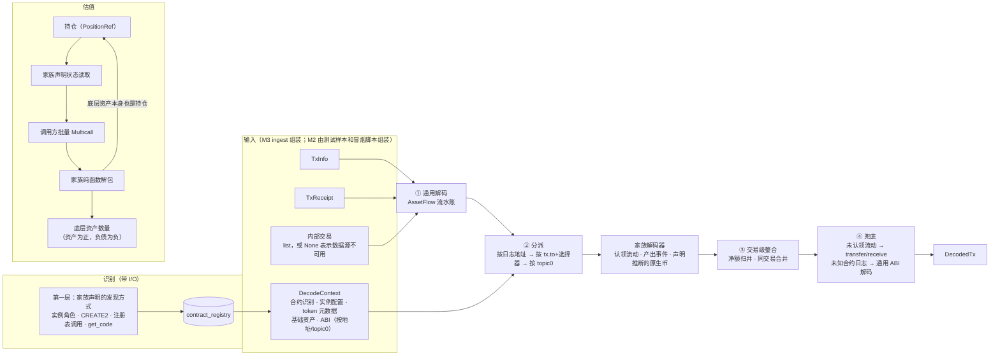
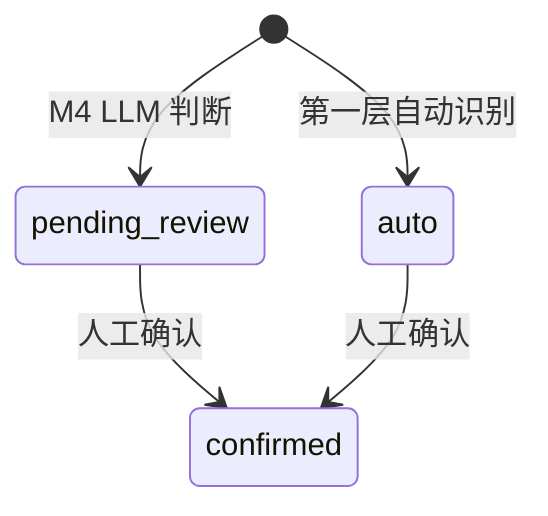

# M2 协议解码核心 · 实施规划

> 所属：钱包链上行为分析系统第一版的第 2 个开发里程碑，见设计文档 `research/docs/钱包链上行为分析系统设计方案.md` 12.1。
> 状态：**草案 v2，待评审**（2026-09-29）。v1 的框架被基准钱包的交易构成带偏了：首批家族全是 DEX，估值接口只为 V3 设计。v2 改为以"协议形态覆盖"为目标。批准后按第 8 节的顺序开发。

## 实施进度

| 步骤 | 状态 | 说明 |
|---|---|---|
| 1 金标准样本 | ✅ 2026-09-29 | 42 个样本（通用 12、WBNB 2、V2 7、V3 6、Venus 13、聚合器 5），清单 `tests/golden/cases.json`，脚本 `scripts/oneoff/2026-09-29_m2-golden-samples.py`。为此给 `alpha_chains` 补了按区块读取（`raw_call`、`get_storage_at`、`get_transaction_count` 的 `block` 参数）和批量余额 `get_balances`。所有样本的余额差都能归因到本笔交易，推断规则逐 wei 验证通过（见 5.5） |

**实施中的新发现**：
- 基准钱包的 V3 退出全部是 `decreaseLiquidity + collect`，没有 `unwrapWETH9`，也没有付 BNB 开仓；这两类样本改用公开交易。
- Venus 同一个实例里两种事件变体并存（vUSDT 新版 4 字段、vBNB 原版 3 字段），因此取消了实例级的 `event_variant` 配置项，改为按 topic0 识别（见 5.7）。
- vBNB 的存入几乎都经过 gateway `0x4d2e…5dca`，事件当事人是 gateway 而不是用户；家族要以资产流水判断视角（见 5.8）。
- 地址投毒的仿冒 token 转账大多是"从钱包转出"方向。
- Ankr `eth_getLogs` 的区块跨度上限与过滤的地址个数有关，5 个地址时 5 万区块会报错。

## 1. 目标与原则

M2 交付的是一个**能解析任意协议的解码框架**，加上一批首发家族，用来证明这个框架的抽象是对的。它不是一个"能解析 LP 的解码器"。

**原则**：

1. **任何交易都有正确的资产流动（T0）**，不管协议认不认识。框架层不含任何具体协议的知识；
2. **新协议的接入成本和它与已有家族的相似度成正比**：
   - 已有家族的分叉：只加一份 YAML 和测试样本；
   - 新家族：只改 `families/<family>/`、在家族注册表里加一行、补测试样本；
   - 碰到 `decoding/`、`valuation/` 的框架代码，说明抽象有问题，要回头调整抽象，不能打补丁（设计文档 10.4）；
3. **首批家族按"持仓形态"挑选**：每个家族至少验证一种其他家族验证不到的形态。钱包里常见哪些协议不是挑选依据；
4. **不认识的协议也要留下可读的线索**：用 M1 的 ABI 来源解出事件名和参数，交给 M4 的 AI 识别，并作为人工复核的上下文。

**两类验收，互不替代**：

| 验收 | 样本来源 | 证明什么 |
|---|---|---|
| **形态验收** | 链上公开交易，按家族和形态挑选 | 框架对每种持仓形态都成立，新增家族不改框架 |
| **端到端验收** | 基准钱包 `0x05BB…` 的全部 2496 笔交易 | 真实钱包跑下来覆盖率高、对账能闭合（M3 再用基准答案校验盈亏） |

## 2. 形态覆盖矩阵（决定首批家族）

| 持仓形态 | 首批家族 | 这个形态特有、别的家族验证不到的点 |
|---|---|---|
| 包装凭证 | `wrapped_native`（WBNB） | 资产和凭证 1:1 互换；原生币不产生日志 |
| 可替代份额：按储备 | `uniswap_v2_like`（PancakeSwap V2） | 按份额从储备里拆出底层资产；协议费（`kLast`）会稀释份额 |
| 可替代份额：按汇率 | `compound_v2_like`（Venus 存款） | 汇率随时间增长；凭证 token（vToken）和底层资产的数量关系不固定 |
| NFT 仓位 | `uniswap_v3_like`（PancakeSwap V3） | 用整数 tick 数学算本金；未领手续费靠 feeGrowth 推算 |
| **负债** | `compound_v2_like`（Venus 借款） | **没有资产流动的状态事件**（利息累积、被清算时负债减少）；估值为负 |
| 清算 | `compound_v2_like` | 同一事件对借款人和清算人含义不同；抵押品被强制转走 |
| 待领奖励 | `compound_v2_like`（XVS）、`uniswap_v3_like`（手续费） | 奖励没领之前不在余额里，要单独读取 |
| 路由交换 | `uniswap_v2_like` 路由、`dex_aggregator` | 路由细节不可见，按钱包在这笔交易里的净收支归并成交换，由框架提供共用的归并原语 |
| 质押锁仓 | 只登记类型，家族在第二阶段做（`masterchef_like`） | — |
| 完全未知的协议 | 通用 ABI 解码 | 只有 T0 资产流动和可读的事件，不猜语义 |

`compound_v2_like` 是首批里形态最丰富、与 LP 差异最大的家族。它能暴露只围绕 LP 设计会漏掉的抽象问题：负债、没有资产流动的状态事件、视角相关的事件、依赖时间的估值。

**基准钱包的构成**（端到端验收用，不决定框架范围）：

| 交互 | 数量 |
|---|---|
| 聚合器 `0xb300000b…`（EIP-2535 Diamond） | 1664 笔（占发出交易的 69%） |
| PancakeSwap V3 NPM | 254 笔，涉及 124 个仓位 NFT |
| 其他 | 直接转账、授权、签到、领空投 |
| 仿冒稳定币转入 | 200 多条 |
| 内部交易净流入 | 约 74.5 BNB |
| V2、Venus | 0 |

## 3. 范围

**做**：
- **框架**：
  - `decoding/`：模型、完整的事件分类表、第一段通用解码、第二段分派、认领机制、交易级整合原语（净额归并、同交易多事件合并）、推断原生币的钩子、通用 ABI 解码、token 风险标记；
  - `families/base.py`：`ProtocolFamily` 接口；
  - `valuation/`：持仓形态、状态读取声明、嵌套解包调度；
  - `identification/`：第一层识别，按家族声明的方式发现合约；
  - 实例配置的加载和校验；
- **首批家族**：`wrapped_native`、`uniswap_v2_like`、`uniswap_v3_like`、`compound_v2_like`、`dex_aggregator`；
- **实例**：`pancakeswap-v2`、`pancakeswap-v3`、`venus-core`、`wbnb`、`aggregator-b300`，以及基础资产清单 `assets/bsc.yaml`；
- **存储**：`contract_registry`（迁移 `0007`）和对应端口；
- **样本与冒烟**：形态金标准样本、基准钱包全量解码冒烟、M0 的"抓取回执样本"一并完成；
- **迁移**：现有 `pancakeswap_v3` 插件迁入 `families/uniswap_v3_like/`，原路径只做重新导出。

**不做**：
- `wallet_events`、`wallet_event_overrides`、重新解码任务 → M3（调用方在 M3）；
- 持仓引擎、跨交易的本金和手续费结转、记账规则 → M3；
- 识别第二层（签名匹配 + 工厂校验）、字节码指纹、代理识别 → 第二阶段。M2 的 `ProtocolFamily` 接口先把"特征事件签名"字段留出来，第二层到时候直接用，不改接口；
- 第四层 LLM 识别 → M4（依赖 MCP 工具）；
- `protocol_instances` 表 → M4（仓库里的 YAML 是唯一真相，这张表只供 MCP 查询）；
- 内部交易的真实数据接入 → 等 M0 NodeReal 实测和 M1 步骤 6b。

**对设计文档 12.1 的调整**（批准后同步更新设计文档）：
- 首批家族加入 `compound_v2_like` 和 `dex_aggregator`；
- 通用 ABI 解码和 token 风险标记挪进 M2；
- `protocol_instances` 表和 LLM 识别挪到 M4；
- `contract_registry` 用 `instance_key` 关联实例，不用 `protocol_instance_id`。

## 4. 现有模块的认知与上下游影响

**`alpha_protocols` 现状**：
- 只有一个插件 `plugins/pancakeswap_v3.py`（`PancakeswapV3Plugin`，继承 `base.FactoryDiscoveryPlugin`），负责 Factory 发现、Pancake 变体 Swap 解码（比 Uniswap V3 多两个协议费字段）、`getPool`、`slot0`、协议费、CAKE 排放读取；
- 另有 `identification/factory_discovery.py`（`iter_discover_pools`）和浮点版的 `tick_math.py`；
- 没有注册表，调用方直接实例化插件。

**兼容面**（必须保持原路径可导入、行为不变）：

| 调用方 | 用到的符号 |
|---|---|
| `apps/lp-backtest`：`discover.py`、`seed_whitelist.py`、`metrics.py`、`calibrate/weights.py` | `PancakeswapV3Plugin`（`chain`、`dex_id`、`launch_date_hint_utc`、`find_pool_by_tokens`）、`FEE_TIER_TICK_SPACING`、`iter_discover_pools` |
| `apps/live-signal`：`background/subscribe.py`、`main.py` | `swap_topic0`、`decode_swap_event`、`tick_math.price_to_tick`、`round_to_tick_spacing` |
| `packages/metrics`：`chain_reads.py`、`assemble.py`、`scoring.py` | `read_fee_protocol`、`read_cake_emission`、`read_slot0_price_and_tick`，类型注解也用到类名 |

**影响评估**：
- 插件迁移只移动实现，原模块改为重新导出。调用方不改代码；`packages/protocols/tests` 下现有 4 个测试文件不改，全部通过即可证明行为不变；
- 新代码只依赖 `alpha_core.chain_data`（`TxInfo`、`TxReceipt`、`RawLog`，统一小写、带 0x 前缀）。旧的 `LogEntry` 只留在旧插件里；
- 新增依赖：`alpha-protocols` 加 `pyyaml`；
- 存储层新增 1 张表，不改已有表。

**已核实的链上常量**（2026-09-29）：

| 实例 | 常量 | 核实方式 |
|---|---|---|
| `pancakeswap-v2` | factory `0xca14…0c73`，init code hash `0x00fb7f63…9bd5` | 用 CREATE2 计算 WBNB/USDT 交易对地址，与 `getPair` 返回值一致 |
| `pancakeswap-v3` | pool deployer `0x41ff…71c9`，init code hash `0x6ce8eb47…f7e2` | 用 CREATE2 计算 WBNB/USDT 0.05% 池地址，与 `getPool` 返回值一致 |
| `venus-core` | Comptroller `0xfd36…8384`，`getAllMarkets()` 返回 55 个市场；vUSDT 和 vBNB 的 `comptroller()` 都指向它 | 直接调用合约 |
| `venus-core` 事件 | **同一个实例里两种变体并存**：vUSDT 的 `Mint`、`Redeem` 是 4 个字段的 Venus 新版（多一个 `accountBalance`），vBNB（更早部署）是 3 个字段的 Compound 原版；`Borrow`、`RepayBorrow` 与 Compound 一致 | vUSDT、vBNB 最近 2 万个区块的日志统计 |
| `venus-core` 中间合约 | vBNB 的存取几乎都经过中间合约 `0x4d2e…5dca`，事件里的 `minter`/`redeemer` 是中间合约，不是用户 | vBNB 的 `Mint` 日志和对应交易 |

## 5. 框架设计

### 5.1 数据流



**纯度约束**（设计文档 10.2）：
- `decoding/`、各家族的 `decoder.py`、各家族估值里的解包函数都是纯函数：不依赖 `alpha_storage`，不发 RPC；
- 识别和状态读取的**执行**放在带 I/O 的 `identification/runner.py` 和调用方；
- 持久化通过 `alpha_core.ports` 里的端口，沿用 M1 的 `AbiStore` 模式。

**架构测试**（`tests/test_architecture.py`，扫描 import 做静态检查），把可扩展性约束变成自动化测试：
- `decoding/`、`valuation/` 不能 import `families/`；
- `families/<a>/` 不能 import `families/<b>/`；只能 import `decoding`、`valuation` 的公开接口和 `families/_shared/`；
- `decoding/`、`valuation/`、各家族的 decoder 和 valuer 不能 import `alpha_storage`、`requests`、`web3`。

### 5.2 核心模型（`decoding/models.py`，frozen dataclass）

**`AssetFlow`**：第一段产出的资产流水，是后续一切的基础。

| 字段 | 类型 | 含义 |
|---|---|---|
| `flow_id` | int | 交易内的流水序号，按（`log_index`，交易级流水排在 −1）排序后编号，同一输入重复解码结果相同 |
| `kind` | 枚举 | 见下表 |
| `asset` | str | token 地址；原生币用常量 `NATIVE = "native"` |
| `token_id` | int \| None | NFT 的 tokenId；非 NFT 为空 |
| `amount_raw` | int | 原始整数数量，≥0，不做精度换算（G3） |
| `from_address`、`to_address` | str | 小写、带 0x |
| `log_index` | int \| None | 来自日志时有值 |
| `source` | 枚举 | `tx` / `log` / `internal` / `inferred` |

`kind` 的取值：

| 取值 | 含义 |
|---|---|
| `native` | 交易本身的 value |
| `internal` | 数据源给出的内部原生币转移 |
| `inferred_native` | 家族依据自己的事件确定性推断出的原生币转移，见 5.5 |
| `erc20` / `erc721` / `erc1155` | 对应标准的转账日志 |
| `gas` | gas 费 |

WBNB 的 `Deposit`/`Withdrawal` 不单独算一种流水。它交给 `wrapped_native` 家族，拆成"原生币 ↔ WBNB"两条流水，所以框架里不存在 WBNB 特判。

**`NormalizedEvent`**：字段与设计文档 3.3 的标准事件表一致，并补充以下字段：

| 字段 | 类型 | 含义 |
|---|---|---|
| `seq` | int | 交易内序号，同一输入稳定，M3 的人工修正按它定位 |
| `claimed_flow_ids` | tuple[int, ...] | 这条事件认领的流水。**可以为空**，此时是没有资产流动的状态事件，例如被清算时负债减少、利息累积 |
| `amount_raw` | int \| None | 状态事件的数量，例如负债的减少额，由家族填写；流动事件时等于被认领流水的合计 |
| `coverage_tier` | `T0`~`T3` | 覆盖等级 |
| `confidence` | `exact` / `inferred` | 是否依赖推断 |
| `decoder_version` | str | 格式为 `<family>@<整数版本>`；兜底部分为 `generic@1` |

**`DecodedTx`**：
- `tx_hash`、`subject_wallet`、`status`、`events`；
- `unclaimed_flow_ids`：理论上为空，兜底会把它们转成事件，这里用于断言；
- `unknown_contracts`；
- `warnings`：例如 `internal_unavailable`、`abi_missing`。

**`PositionRef`**：一个持仓的引用，估值的输入。

| 字段 | 含义 |
|---|---|
| `instance_key` | 实例键，例如 `venus-core` |
| `kind` | 持仓形态，见 5.6 |
| `id` | 形态内的标识：share 是凭证 token 地址，nft 是 tokenId，debt 是市场地址 |
| `owner` | 持有人 |

`position_key` 就是它的字符串形式 `<instance_key>:<kind>:<id>`，例如 `venus-core:debt:0xfd58…`、`pancakeswap-v3:nft:123456`。

### 5.3 事件分类表（`decoding/taxonomy.py`，一次写全）

分类表覆盖所有家族，包括第二阶段才实现的质押、跨链等；M2 实现的家族只用到其中一部分。统一采用"资产 ↔ 凭证"的对称写法：存入协议的一侧是 `deposit/deposit_asset`，拿到凭证的一侧是 `receive/receive_wrapped`。WBNB、V2 LP、vToken、ERC4626 份额都按这个形态处理，M3 不用为每个家族写特殊记账。

| event_type | event_subtype | direction | 语义 | M2 由谁产出 |
|---|---|---|---|---|
| `transfer` | `none` | in / out | 未被认领的普通转账 | 兜底 |
| `receive` | `airdrop` / `spam` | in | 不请自来的转入 | 兜底 + 风险标记 |
| `receive` | `receive_wrapped` | in | 拿到凭证（WBNB、LP、vToken） | wrapped_native、V2、Venus |
| `spend` | `return_wrapped` | out | 交回凭证 | 同上 |
| `deposit` | `deposit_asset` | out | 资产存入协议 | wrapped_native、V2、V3、Venus |
| `withdrawal` | `remove_asset` | in | 从协议取回资产 | 同上 |
| `trade` | `spend` / `receive` | out / in | 交换的付出腿和收到腿 | V2 路由、聚合器 |
| `borrow` | `generate_debt` | in | 借入，负债增加 | Venus |
| `repay` | `payback_debt` | out | 还款，负债减少 | Venus |
| `repay` | `liquidate` | neutral | 被清算时负债减少（状态事件，无资产流动） | Venus |
| `spend` | `liquidate` | out | 被清算时抵押凭证被转走 | Venus |
| `trade` | `liquidate` | in / out | 清算人视角：付出还款资产，得到抵押凭证 | Venus |
| `claim` | `reward` | in | 领取协议奖励（XVS 等） | Venus |
| `claim` | `lp_fee` | in | 领取 LP 手续费 | V3 |
| `claim` | `interest` | in | 领取利息（存款类协议单独发利息时用） | 第二阶段 |
| `mint` / `burn` | `none` | in / out | 仓位 NFT 的铸造和销毁 | V3 |
| `stake` / `unstake` | `deposit_asset` / `remove_asset` | out / in | 质押和解押 | 第二阶段 |
| `bridge` | `deposit_asset` / `remove_asset` | out / in | 跨链转出和转入 | 第二阶段 |
| `fee` | `none` / `protocol_fee` | out | gas 费；协议另外收取的费用 | 通用 / 家族 |
| `informational` | `approve` / `decoded_log` / `none` | neutral | 授权；未知合约的可读事件；其他不动资产的交互 | 通用 / 兜底 |

测试会遍历全部家族的输出，出现不在表里的组合就直接失败。

### 5.4 解码流程

**① 通用解码**（对所有交易执行，与协议无关）：
- gas：交易发起人是 `subject_wallet` 时，记 `gas_used × effective_gas_price`，交易失败也记；
- 交易失败（`status=0`）时只保留 gas；
- 原生币：交易成功时的 value，加上内部交易中和钱包相关的记录；
- 日志：只看 from 或 to 等于钱包的 `Transfer`（3 个 topic 是 ERC20，4 个 topic 是 ERC721）、`TransferSingle`/`TransferBatch`（ERC1155）；
- 授权：owner 是钱包的 `Approval`；
- 不看金额大小，不丢弃任何金额（G3：有一笔真实转账曾被误判成 dust）。

**② 分派**（设计文档 3.3）：
1. 按日志的发出地址查识别结果，找到家族；
2. 按 `tx.to` 加方法选择器，查实例登记的路由规则；
3. 按 topic0 的通用规则，数量尽量少；
4. 都没命中的留给兜底。

同一个家族在同一笔交易里只调用一次，一次拿到所有分派给它的日志。家族需要看整笔交易上下文，例如 V3 的 multicall 或 Venus 的清算。

**认领**：家族通过 `FlowLedger.claim(flow_ids)` 认领流水并产出事件。两个家族认领同一条流水时抛出 `DecodeConflictError`，在测试里暴露，不在运行时静默选一个。

**③ 交易级整合原语**（`decoding/consolidate.py`，供家族调用，本身不含协议知识）：
- `net_by_asset(flows, wallet)`：按资产计算钱包净额；
- `trade_from_net(...)`：把净额转成 trade 的付出腿和收到腿。V2 路由和聚合器共用这个原语；
- `group_by(flows, key)`：同交易多事件合并用，例如 V3 multicall 按 tokenId 分组。

**④ 兜底**：
- 未认领的流水：普通转账记 `transfer`；不请自来的转入记 `receive/airdrop`，风险 token 记 `receive/spam`；
- 未识别合约发出的日志：如果 `DecodeContext` 里有它的 ABI（按地址，或按 topic0 查签名），解码成 `informational/decoded_log`，`extra` 里写事件名、参数、ABI 来源；没有 ABI 就记告警 `abi_missing`；
- ABI 的**获取**由调用方在解码前完成：调用方用 M1 的 `default_resolver` 批量解析，结果放进 `DecodeContext`。解码器本身不发请求。

通用 ABI 解码**不单设覆盖等级**，仍然是 T0。覆盖等级衡量的是资金语义，事件名不带语义；`extra.abi_decoded=true` 用来统计这部分的覆盖。

### 5.5 原生币推断钩子

原生币的内部转移不产生日志，而 Ankr 不提供内部交易。有些家族的事件本身就能精确证明原生币的数量，框架给家族一个统一的钩子：家族返回 `InferredNativeFlow(to, amount_raw, evidence_log_index)`，框架据此生成 `inferred_native` 流水，再交给正常的认领流程。

| 家族 | 情形 | 依据 |
|---|---|---|
| `wrapped_native` | 钱包直接调用 WBNB 解包 | `Withdrawal(src=钱包, wad)`：WBNB 合约把 `wad` 数量的原生币转给调用者 |
| `uniswap_v3_like` | NPM multicall 里有 `unwrapWETH9(min, recipient)` | 由 NPM 发出的 `Withdrawal` 金额合计，全部转给 `recipient` |
| `uniswap_v3_like`、`uniswap_v2_like` | 付 BNB 时退回多余部分（NPM `refundETH`；V2 路由 `addLiquidityETH`、`swapETHForExactTokens`） | 合约只把实际用到的 BNB 包装成 WBNB，所以退款 = 交易 value − 该合约的 WBNB `Deposit` 金额 |
| `uniswap_v2_like` | 路由的 `*ForETH`、`removeLiquidityETH*` | 路由的 `Withdrawal` 金额全部转给调用参数里的 `to` |
| `compound_v2_like` | vBNB 的 `Redeem`、`Borrow` | 事件里的 `redeemAmount`、`borrowAmount` 就是转给钱包的原生币数量 |
| `dex_aggregator` | 路由内部走向不透明 | **不推断**，记告警 `internal_unavailable`。样本 `swap_810c705b` 里聚合器解包了 0.003118 WBNB，钱包却没有收到任何 BNB，证明"解包量 = 钱包收到量"不成立 |

**实测验证**（2026-09-29，金标准样本的区块前后余额差）：以上每条可推断规则都有样本，推断值与余额差逐 wei 相等（V3 `exit_multicall_unwrap`、`mint_native`，V2 `remove_liquidity_eth`、`swap_tokens_for_eth`，WBNB `unwrap`，Venus `redeem_vbnb`、`borrow_vbnb`）。

**规则**：
- 内部交易列表不为空（数据源可用）时，推断钩子一律不生效，以数据源为准，避免重复计算；
- 冒烟脚本对基准钱包逐笔做原生币对账（见 7.3），用来量化推断之后还剩多少缺口。

### 5.6 持仓形态与估值接口（`valuation/`）

**持仓形态 `PositionKind`**（枚举，每个值都有中文语义）：

| 取值 | 含义 | 估值符号 |
|---|---|---|
| `share` | 可替代份额：持有凭证 token，可按规则换回底层资产（V2 LP、vToken、ERC4626 份额） | + |
| `nft` | NFT 仓位：每个仓位参数不同（V3） | + |
| `debt` | 负债：借入的资产，随利息增长 | − |
| `staked` | 质押或锁仓：资产在合约里，归属于钱包（第二阶段） | + |
| `claimable` | 待领奖励：尚未到账的奖励和手续费 | + |

**家族估值接口**：

```python
class PositionValuer(Protocol):
    def plan_reads(self, positions: Sequence[PositionRef], ctx: ValuationContext) -> list[StateRead]: ...
    def unwrap(self, position: PositionRef, reads: ReadResults) -> list[UnderlyingAmount]: ...
```

- `StateRead(to, calldata, decode)`：一次 `eth_call` 的声明。允许调用非 view 函数的**静态调用**，例如 Venus 的 `balanceOfUnderlying`、`borrowBalanceCurrent`，它们会先计息再返回，比用存储值手算更准；
- `UnderlyingAmount(asset, amount_raw, sign, source_kind)`：`sign` 取 +1 表示资产、−1 表示负债；`source_kind` 区分本金、未领手续费、待领奖励；
- **嵌套解包**：`valuation/dispatch.py` 检查每个底层资产。如果它本身又是某个已识别家族的凭证（例如金库里装的是 LP），就递归解包，最多 3 层，按层批量读取。首批家族没有嵌套的真实样本，用合成样本测试调度逻辑。

**调用方**：M2 的冒烟脚本和测试负责执行 `StateRead`；M3 由 ingest 执行，做法相同。

### 5.7 家族接口（`families/base.py`）

```python
class ProtocolFamily(Protocol):
    key: str                                  # 家族键，例如 "compound_v2_like"
    version: int                              # 解码器版本
    options_model: type[BaseModel]            # 实例 options 的 pydantic 模型，未知字段报错
    roles: frozenset[str]                     # 允许的角色名，例如 {"comptroller", "market"}
    signature_topics: frozenset[str]          # 特征事件的 topic0，第二层签名匹配使用（第二阶段）
    def discovery(self, instance: Instance) -> DiscoveryPlan: ...   # 第一层怎么发现本实例的合约
    def decoder(self, instance: Instance) -> FamilyDecoder: ...
    def valuer(self, instance: Instance) -> PositionValuer | None: ...
```

家族注册表是 `families/__init__.py` 里的一个字典 `FAMILIES`，新增家族时加一行。

**事件变体**：同一家族的不同部署（甚至同一实例里的不同合约，例如 Venus 的 vUSDT 和 vBNB）事件签名可能不同。家族把所有已知签名都登记下来，按 topic0 分派到同一套语义，**不用实例配置项区分变体**：变体是事实，不是选择，写成配置反而会配错。topic0 不同就能区分；只有 topic0 相同、字段含义却不同时，才需要配置项，目前没有这种情况。

**发现方式 `DiscoveryPlan`**：由家族声明，框架执行。每种方式都是通用的，家族只填参数：

| 方式 | 含义 | 使用者 |
|---|---|---|
| `static_roles` | 实例 YAML 里直接写死的角色地址 | 全部家族 |
| `create2` | 给定地址，先读出盐的组成部分（例如 `token0`、`token1`、`fee`），再用 CREATE2 本地计算，结果相等即确认 | V2、V3 |
| `registry_call` | 调用一次注册表函数，返回全部子合约（例如 Comptroller 的 `getAllMarkets()`） | Venus |
| `known_table` | 查已有的表，零 RPC（V3 的 `pool_candidates`） | V3 |

### 5.8 首批家族要点

**`wrapped_native`**
- WBNB 的 `Deposit`（钱包 → WBNB）：原生币流出记 `deposit/deposit_asset`，WBNB 流入记 `receive/receive_wrapped`；
- `Withdrawal`：反过来，同时用推断钩子补上原生币的流入。

**`uniswap_v2_like`**（PancakeSwap V2）
- 添加流动性：两种 token 流出记 `deposit/deposit_asset`，LP 流入记 `receive/receive_wrapped`，`position_key=<instance>:share:<pair>`；
- 移除流动性：反过来；
- 路由交换：用 `trade_from_net`；
- 估值：

  ```text
  L_mint = 协议费稀释（instance options 里的 fee_numerator/fee_denominator，Pancake V2 取 8/17）
    rootK = isqrt(r0·r1)，rootKLast = isqrt(kLast)
    若 kLast≠0 且 rootK>rootKLast：
      L_mint = totalSupply·(rootK−rootKLast)·fee_numerator / (rootK·fee_denominator + rootKLast·fee_numerator)
  amount_i = balance · reserve_i / (totalSupply + L_mint)        （整数，向下取整）
  ```

  公式按合约 `_mintFee` 移植，常数在实施时对照合约源码核实，再用真实的 `Burn` 事件校验（见 7.2）。

**`uniswap_v3_like`**（PancakeSwap V3，NPM 视角）
- `mint`：NFT 从零地址转给钱包，记 `mint`；tick 区间和 token 对写进 `extra`；
- `IncreaseLiquidity`：记 `deposit/deposit_asset`；
- `DecreaseLiquidity` + `Collect`：同一个 tokenId、同一笔交易里：

  ```text
  fee_i = collect_i − Σ decrease_i
  ```

  `fee_i ≥ 0` 时，拆成 `withdrawal/remove_asset`（本金）和 `claim/lp_fee`（手续费）。`fee_i < 0` 说明本金在更早的交易里就挂起了，要跨交易结转，这里标 `extra.split_deferred=true`，由 M3 处理；
- 估值：
  - 本金用整数 `TickMath`（逐位移植合约的位运算，不用浮点）和 `SqrtPriceMath` 公式计算；
  - 未领手续费：

    ```text
    below = tick ≥ tickLower ? outsideLower : global − outsideLower
    above = tick < tickUpper ? outsideUpper : global − outsideUpper
    inside = global − below − above                       （全部 mod 2²⁵⁶）
    owed = tokensOwed + L · (inside − insideLast) / 2¹²⁸
    ```

- 旧插件迁到 `families/uniswap_v3_like/pool.py`。Pancake 变体和 Uniswap 变体的 Swap 事件 topic0 不同，家族同时认识两种，不需要配置项（原则见 5.7 的"事件变体"）。

**`compound_v2_like`**（Venus 核心池）
- 事件变体：Venus 新版的 `Mint`、`Redeem` 多一个 `accountBalance` 字段，vBNB 仍是 Compound 原版，**同一个实例里两种并存**。家族同时登记两种签名，按 topic0 分派到同一套语义；
- **经中间合约操作**：事件里的当事人（`minter`、`redeemer`、`borrower`）可能是中间合约而不是用户（vBNB 的存取几乎都这样）。家族以资产流水为准判断钱包视角：钱包付出底层资产、收到 vToken，就是存入，不要求事件当事人等于钱包；
- 映射：

  | 链上事件 | 标准事件 |
  |---|---|
  | `Mint(minter, mintAmount, mintTokens, …)` | 底层资产流出记 `deposit/deposit_asset`；vToken 流入记 `receive/receive_wrapped`，`position_key=venus-core:share:<vToken>` |
  | `Redeem(redeemer, redeemAmount, redeemTokens, …)` | vToken 流出记 `spend/return_wrapped`；底层资产流入记 `withdrawal/remove_asset` |
  | `Borrow(borrower, amount, accountBorrows, totalBorrows)` | `borrow/generate_debt`，`position_key=venus-core:debt:<vToken>`；`extra.account_borrows` 记录借款后的负债余额 |
  | `RepayBorrow(payer, borrower, amount, accountBorrows, …)` | payer 视角：`repay/payback_debt`（有资产流出）；替别人还款时，借款人视角记状态事件 `repay/payback_debt`（无资产流动） |
  | `LiquidateBorrow(liquidator, borrower, repayAmount, vTokenCollateral, seizeTokens)` | 借款人视角：`repay/liquidate`（状态事件）+ `spend/liquidate`（抵押 vToken 被转走）；清算人视角：`trade/liquidate` |
  | XVS 从 Comptroller 转给钱包 | `claim/reward` |

  vBNB 的原生币流动用推断钩子补齐；
- 发现：`registry_call` 调用 `getAllMarkets()`，再批量读每个市场的 `underlying()`（vBNB 没有这个函数，实例里写死为原生币）；
- 估值：
  - `share` 静态调用 `balanceOfUnderlying(owner)`；
  - `debt` 静态调用 `borrowBalanceCurrent(owner)`；
  - `claimable`（XVS）读 `venusAccrued(owner)`。这是已结算但未领取的部分，最后一次结算之后新产生的奖励不含在内，所以标为下限，`extra.lower_bound=true`；
  - 健康度读 Comptroller 的 `getAccountLiquidity(owner)`，写进 `extra`；
- 利息：负债在两次事件之间会增长，但不产生事件。解码层不生成利息事件，由 M3 用"估值时的负债 − 事件累计的负债"算出利息。

**`dex_aggregator`**
- 触发条件：`tx.to` 是实例登记的 `router`，选择器在 `options.swap_selectors` 里，交易成功，且 `tx.from == subject_wallet`；
- 归并：调用 `trade_from_net`，风险 token 不参与归并；
- 只有付出腿、没有收到腿时，记告警 `internal_unavailable`，事件带 `extra.incomplete=true`；
- 实例的协议名先写 `unknown-aggregator-b300`。

### 5.9 token 风险标记（`decoding/risk.py`，纯函数）

| 标记 | 规则 |
|---|---|
| `impersonator` | 把 symbol 做 NFKC 规范化、去掉零宽字符和空白、把常见同形字符映射到拉丁字母（西里尔 `Ѕ`→`S`、`Т`→`T`、`О`→`O`，数字 `5`→`S`、`0`→`O`）后，等于基础资产清单里某个 symbol，但合约地址不同 |
| `spam` | 不请自来的 NFT 转入且名称里含网址；或者从钱包转出的金额为 0 的 `transferFrom`（地址投毒的典型手法） |
| `normal` | 其他情况；地址在基础资产清单里的 token 一律为 `normal` |

风险标记只改变事件的子类型，不删除事件。标记结果由 M3 回写到 `tokens.risk_flag`。

### 5.10 实例配置（`instances/<chain>/*.yaml`）

```yaml
# instances/bsc/venus-core.yaml
instance_key: venus-core
chain: bsc
family: compound_v2_like
protocol: Venus
version: core-pool
roles:
  comptroller: ["0xfd36e2c2a6789db23113685031d7f16329158384"]
options:
  native_market: "0xa07c5b74c9b40447a954e1466938b865b6bbea36"   # vBNB，底层资产为原生币
  reward_token: "<XVS 地址，实施时核实>"
```

```yaml
# instances/bsc/pancakeswap-v2.yaml
instance_key: pancakeswap-v2
chain: bsc
family: uniswap_v2_like
protocol: PancakeSwap
version: v2
roles:
  factory: ["0xca143ce32fe78f1f7019d7d551a6402fc5350c73"]
  router:  ["<实施时核实>"]
options:
  pair_init_code_hash: "0x00fb7f630766e6a796048ea87d01acd3068e8ff67d078148a3fa3f4a84f69bd5"
  fee_numerator: 8          # _mintFee 常数，实施时对照源码核实
  fee_denominator: 17
```

`pancakeswap-v3.yaml`、`wbnb.yaml`、`aggregator-b300.yaml` 的格式相同。V3 的 `pool_deployer` 和 `pool_init_code_hash` 已经核实（见第 4 节）。

**加载时的校验**：
- `family` 必须已注册；
- 角色名必须属于家族声明的 `roles`；
- `options` 用家族的 `options_model` 校验，未知字段报错；
- 同一条链上 `instance_key` 唯一；
- 同一个地址不能出现在两个实例里。

### 5.11 状态机

**`contract_registry.review_status`**（沿用设计文档 6.2）：



写入规则：`confirmed` 的记录不会被任何自动流程覆盖；`auto` 的记录可以被新的自动结果刷新（例如实例 YAML 的角色地址变了）。

**覆盖等级**（每条事件）：T0 → T1（发出合约有识别结果）→ T2（家族解码，带 `position_key`；交换事件也算）→ T3（对应的持仓能估值）。

解码本身无状态。跨交易的状态（挂起本金、负债利息）由 M3 处理。

## 6. 表结构（迁移 `0007_contract_registry`，同步 `SCHEMA.md`）

**`contract_registry`**：合约识别结果。每个地址一行，永久缓存。

| 字段 | 类型 | 可空 | 默认 | 含义 |
|---|---|---|---|---|
| `chain` | String(16) | 否 | — | 链，主键之一 |
| `address` | String(42) | 否 | — | 地址，小写带 0x，主键之一 |
| `kind` | String(24) | 否 | — | 角色名（`factory`、`router`、`pool`、`pair`、`market`、`comptroller`、`position_manager`……），或 `eoa` / `token` / `unknown` |
| `family` | String(32) | 是 | NULL | 家族键；EOA、未知合约为空 |
| `instance_key` | String(64) | 是 | NULL | 实例键；未命名的分叉为空（第二阶段第二层识别产出） |
| `code_hash` | String(66) | 是 | NULL | 运行时字节码的 keccak；调用 `get_code` 时顺便填 |
| `implementation_address` | String(42) | 是 | NULL | 代理合约的实现地址（第二阶段） |
| `source` | String(16) | 否 | — | `static_roles` / `create2` / `registry_call` / `known_table` / `code` / `llm` / `manual` |
| `confidence` | Float | 否 | 1.0 | 0~1；第一层的确定性结果为 1.0 |
| `review_status` | String(16) | 否 | `auto` | `auto` / `pending_review` / `confirmed` |
| `evidence` | JSONB | 否 | `{}` | 识别依据，例如 CREATE2 的输入、注册表调用的返回值 |
| `identified_at` | TIMESTAMPTZ | 否 | now() | 第一次识别时间 |
| `updated_at` | TIMESTAMPTZ | 否 | now() | 最近更新时间 |

- 主键：`(chain, address)`；
- 索引：`(chain, family, instance_key)`；`review_status = 'pending_review'` 的部分索引，供 M4 的复核队列使用。

**端口**：`alpha_core.ports.ContractRegistryStore`，提供 `get_many(chain, addresses)` 和 `upsert_many(records)`。`upsert_many` 在数据库层保证 `confirmed` 的记录不被覆盖。数据库实现是 `alpha_storage.stores.DbContractRegistryStore`。

## 7. 样本与验证

### 7.1 金标准样本

放在 `packages/protocols/tests/golden/bsc/<family>/<case>.json`。每个样本包含交易、回执、区块时间，以及需要的前后区块状态读数；期望事件列表手写在测试里。写之前先人工核对回执，并在注释里写明核对方法。

| 家族 | 用例 | 来源 |
|---|---|---|
| 通用 | 普通转账（收、发）、approve、失败交易、外部转入 BNB、仿冒 token、金额为 0 的 transferFrom、ERC1155 空投、未知合约（有 ABI / 没有 ABI） | 基准钱包 |
| `wrapped_native` | 包装、解包 | 链上公开交易 |
| `uniswap_v2_like` | 添加 / 移除流动性（各含一笔 ETH 版本）、路由交换（token→token、token→BNB） | 链上公开交易 |
| `uniswap_v3_like` | mint（付 token）、multicall 退出（decrease + collect）、单独 collect | 基准钱包 |
| `uniswap_v3_like` | 付 BNB 开仓、multicall 退出含 `unwrapWETH9`（验证推断钩子） | 链上公开交易（基准钱包没有这两种） |
| `compound_v2_like` | 存入 / 取出（vUSDT、vBNB 各一）、借款 / 还款（vBNB 借款要验证推断钩子）、替别人还款、清算（借款人视角和清算人视角）、领 XVS | 链上公开交易，从各市场的事件日志里挑 |
| `dex_aggregator` | 四种选择器各一笔、换成 BNB（缺口告警） | 基准钱包 |

公开交易的挑选脚本写在 `scripts/oneoff/` 里：按事件签名在最近的区块区间用 `eth_getLogs` 找候选交易，按规则取第一笔，脚本可以复现。

### 7.2 估值校验（冒烟脚本，对照链上真值）

| 家族 | 对照真值 |
|---|---|
| V3 | 以 owner 身份静态调用 NPM `collect(tokenId, owner, max, max)` 得到链上真实可领数量，要求和 `owed` 完全相等；本金和静态调用 `decreaseLiquidity` 全部流动性的返回值比较 |
| V2 | 取一笔真实的 `Burn` 交易，用区块 N−1 的状态（归档读取）算出 `amount_i`，要求和 `Burn` 事件的数量完全相等 |
| Venus | `balanceOfUnderlying` 和 `borrowBalanceCurrent` 本身就是链上真值；校验的是"凭证余额 × `exchangeRateCurrent` / 1e18"的手算结果和前者一致，证明汇率的精度处理正确 |

### 7.3 端到端冒烟（基准钱包）

`scripts/oneoff/2026-09-29_m2-decode-smoke.py`：
- 对基准钱包的全部交易解码，统计：
  - 各覆盖等级的占比；
  - `unclaimed_flow_ids` 必须为 0；
  - 告警的分类计数；
  - 未知合约清单，按"交易数 × 金额"排序；
  - 通用 ABI 解码的覆盖率；
- 原生币对账：只在区块内只有这一笔钱包交易时，用 `getBalance(N) − getBalance(N−1)` 和解码结果的原生币合计比较，统计缺口；
- 当前 V3 仓位按 7.2 的方法做估值交叉验证。

### 7.4 命令

- `cd research && uv run pytest packages/protocols packages/storage apps/lp-backtest apps/live-signal`；
- `ruff check`；
- 迁移 0007 往返：`alembic upgrade head` → `downgrade -1` → `upgrade head`。

## 8. 实施步骤（每一步是一个可以单独评审的改动）

| # | 内容 | 验证 |
|---|---|---|
| 1 | 样本抓取脚本（基准钱包样本 + 按事件挑选的公开交易样本），生成 `tests/golden/` | 可以复现，不含 key |
| 2 | `decoding/models.py`、`taxonomy.py`、`test_architecture.py` | 分类表合法组合测试；架构测试 |
| 3 | 通用解码 + 兜底（含通用 ABI 解码）+ `risk.py` | 通用样本逐条断言 |
| 4 | 实例配置的 schema 和加载器（加 `pyyaml`）、`families/base.py`、家族注册表、`assets/bsc.yaml` | 各种配置错误都能报出来 |
| 5 | 分派、认领、整合原语、推断钩子 + `wrapped_native` | 认领冲突测试；WBNB 样本 |
| 6 | 旧插件迁入 `families/uniswap_v3_like/pool.py`，原路径重新导出 | 现有 4 个测试不改、全部通过；lp-backtest、live-signal 测试通过 |
| 7 | `uniswap_v3_like` 解码 | V3 样本 |
| 8 | `valuation/`（持仓形态、`StateRead`、嵌套调度）+ 整数 `TickMath` + V3 估值 | 合约测试向量；合成的嵌套样本 |
| 9 | `uniswap_v2_like`：解码 + 估值 | V2 样本；`Burn` 对照 |
| 10 | `compound_v2_like`：解码 + 发现 + 估值 | Venus 样本；估值对照 |
| 11 | `dex_aggregator` | 聚合器样本 |
| 12 | 识别第一层 runner + `ContractRegistryStore` + 迁移 0007 + 仓储 + `SCHEMA.md` | 往返迁移；4 种发现方式各一个测试 |
| 13 | 端到端冒烟，结果写进本文档的实施进度 | 7.3 |
| 14 | 更新设计文档（12.1 的调整、3.3 的分类表、10.4 的架构测试） | — |

**可扩展性检查点**：步骤 7 之后的每个家族（步骤 9、10、11），评审时都要看 diff 是否只落在 `families/<family>/`、实例 YAML、家族注册表的一行和测试样本里。如果改动碰到了框架，先单独提交一个"调整抽象"的改动，说明原抽象漏了什么，再继续做家族。

步骤 1 与步骤 2~4 可以并行；步骤 6 独立，可以随时插入。

## 9. 风险与应对

| 风险 | 应对 |
|---|---|
| 首批家族仍不足以暴露抽象问题（例如质押、跨链） | 分类表和持仓形态一次登记完整；第二阶段接入 `masterchef_like`、`erc4626` 时同样执行可扩展性检查点，发现问题先调整抽象 |
| 内部交易缺失导致原生币不完整 | 用推断钩子补上能精确推断的情形；其余告警并单列统计；接入 NodeReal 后以数据源为准 |
| 净额归并误把无关转账算进 trade | 只在路由触发条件满足时归并；风险 token 不参与；样本覆盖同一笔交易里夹带空投的情形 |
| 同一家族内存在多种事件变体 | 家族同时登记所有已知签名，按 topic0 分派；两种变体都有样本；遇到新变体只改家族内部，不加配置项 |
| XVS 待领奖励只能拿到下限 | 标为 `lower_bound`；精确值（Venus Lens 的 `pendingRewards`）放到第二阶段 |
| V2 协议费常数写错 | 用真实 `Burn` 交易对照，要求完全相等 |
| 旧插件迁移破坏 lp-backtest / live-signal | 原路径重新导出，现有测试不改，单独评审 |
| 工作量比 v1 多 | 估计多三到四成；步骤 9~11 相互独立，可以按顺序单独交付 |

## 10. 需要你提供或确认的

1. **基准答案**：当年人工分析的净投入、盈亏、年化、那笔伪装成 dust 的转账（交易哈希）、持仓区间。M2 不依赖它们，但那笔 dust 转账最好放进通用样本；M3 的验收要用全部基准答案；
2. **`0xb300000b…` 是哪家聚合器**（不知道的话先用 `unknown-aggregator-b300`）。
