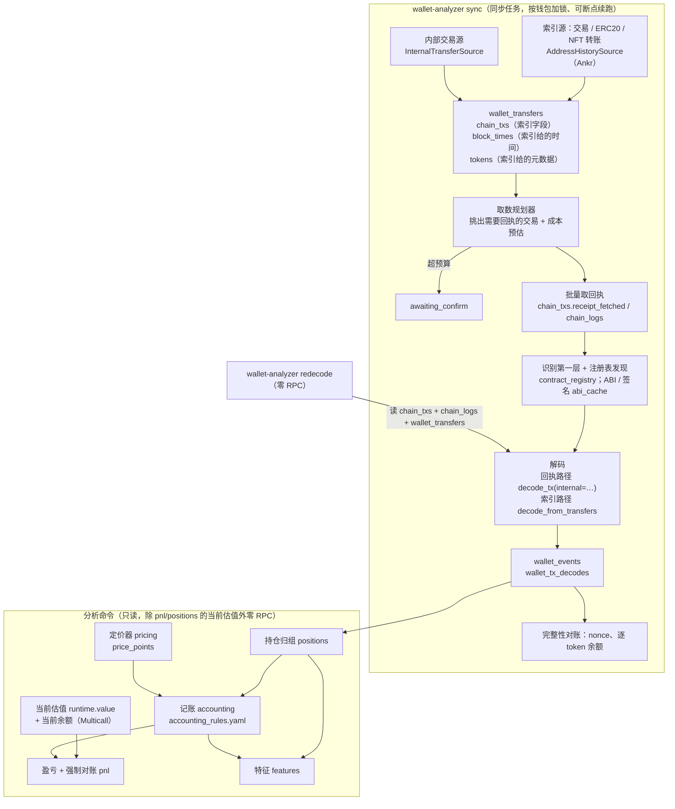
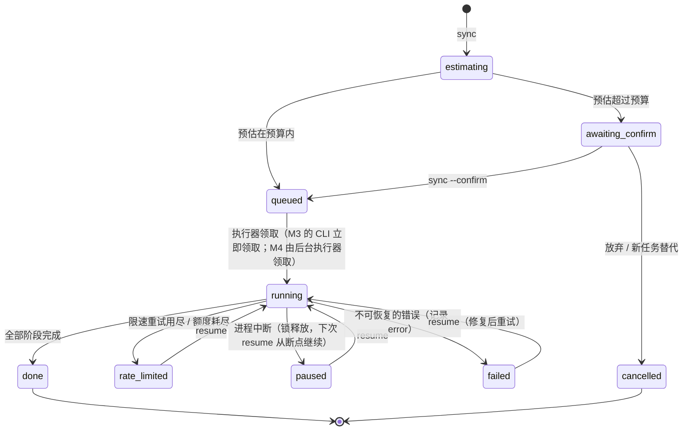
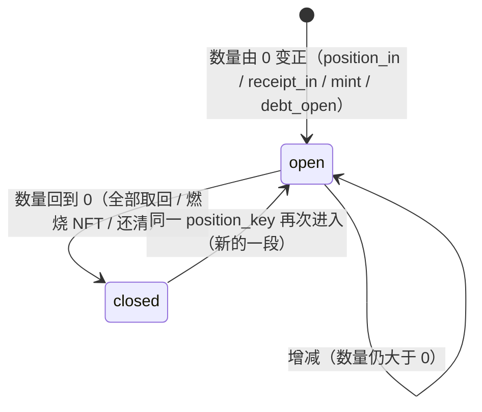

# M3 分析引擎 · 实施规划

> 所属：钱包链上行为分析系统第一版的第 3 个开发里程碑，见设计文档 `research/docs/钱包链上行为分析系统设计方案.md` 12.1。
> 状态：**草案 v1，待评审**（2026-09-30）。批准后按第 8 节的顺序开发，每一步是一个可以单独评审的改动。
> 依赖：M1（数据基建）、M2（协议解码核心，2026-09-30 验收补齐）。内部交易数据源取决于 M0 的 NodeReal 补测（10 月 1 日额度重置后）。

## 实施进度

| 步骤 | 状态 | 说明 |
|---|---|---|
| — | 未开始 | 规划待评审 |

## 1. 目标与原则

M3 交付 `apps/wallet-analyzer`：**给一个钱包地址，用 CLI 拉齐数据、解码、归组持仓、记账、算盈亏和特征，并证明数据是完整的**。M4 的 MCP 工具和服务进程只是在 M3 的服务层外面加一层入口，不再写业务逻辑。

**原则**：

1. **成本和交易数成正比，不和区块数成正比**（设计文档 7.1）：交易清单只来自地址索引源；只给"需要协议解码"的交易取回执；不可变数据只拉一次；解码器升级后从已存的日志重新解码，零 RPC。
2. **派生数据可以整体重建**：`wallet_events` 带 `decoder_version`，随时能从 `chain_txs` + `chain_logs` + `wallet_transfers` 重建；持仓、记账、盈亏、特征每次从事件现算，不落库。
3. **记账是恒等式，不是估算**：盈亏拆解的各项加起来必须等于总盈亏；对不上的部分只来自"数据缺口"和"没有价格"，并逐项列出来源（见 5.6）。
4. **协议扩展不碰分析层**：
   - 记账规则按 `(event_type, event_subtype)` 给出通用处理，家族只在语义不同时覆盖（例如 WBNB 包装是"同一资产换形态"）；
   - 持仓类型由家族声明（`ProtocolFamily.position_categories`），分析层不认识任何具体家族；
   - 第二阶段加 `masterchef_like`、`erc4626` 时，只要事件落在分类表里，分析层不改代码。
5. **多链同样只加配置**：所有键都带 `chain`，CLI 的 `--chain` 默认 `bsc`；链与链之间的差异（gas 模型、基础资产、供应商链标识）继续由 M2 的链画像声明。M3 用 BSC 基准钱包验收，另用一个以太坊或 Base 小钱包做冒烟，证明分析路径与链无关。
6. **诚实地标出不完整**：内部交易缺失、索引源落后、没有价格的 token、未识别协议里的资金，都在结果的 `coverage` 里写明，不静默吞掉。

## 2. 现状与输入

| 已有 | 状态 | M3 怎么用 |
|---|---|---|
| Ankr Advanced API（交易、ERC20、NFT 转账） | M0 实测可用，一页返回基准钱包全部记录 | 地址索引主源（M1 步骤 6b 在 M3 第 1 步落地） |
| 内部交易 | ❌ Ankr 不提供；NodeReal 10 月 1 日补测 | 单独的内部交易源（第 2 步），见 10.2 |
| `alpha_chains` | 回执、交易、余额、nonce、Multicall、指定区块读取；429 已分成短时限速和额度耗尽 | 取回执、完整性对账、当前估值 |
| `alpha_storage` | `chain_txs`、`chain_logs`、`block_times`、`tokens`、`abi_cache`、`price_points`、`external_call_ledger`、`contract_registry`（迁移到 0008） | 全部复用；新增 0009 |
| `alpha_datasources` | ABI 来源、`CachingPriceFetcher`（GeckoTerminal → CoinGecko，按单个时间桶取价） | ABI 解码；价格需要补"按区间批量取"（5.5） |
| `alpha_protocols` | `runtime.decode_tx / decode_context / value / valuers_for`、识别第一层 | 解码、识别、估值 |
| M2 冒烟脚本 | 已经把"拉清单 → 取回执 → 识别 → 两遍解码 → 对账 → 估值"串通一遍 | M3 ingest 的原型；M3 完成后按期限删除 |
| 基准答案 | ❌ **仍未提供** | 阶段验收的唯一外部标准，见 10.1 |

**M2 冒烟暴露、M3 要解决的问题**：
- 原生币总账缺口 74.495 BNB，其中约 72.7 BNB 来自"只有内部调用、没有日志"的转入（交易所批量提币合约之类），只能靠内部交易数据补；
- 聚合器 23 笔"换成原生币只有付出腿"：有了内部交易，解码框架会用内部交易替代推断，收到腿自然补齐；
- 别人发起、落到钱包上的交易约 1500 笔（投毒、空投、批量打款），它们对钱包只有转账，取回执是浪费。

## 3. 范围

**做**：
- **数据源**（M1 遗留的 6b）：`AddressHistorySource` 端口 + Ankr 实现；内部交易源实现（NodeReal 或备选，见 10.2）；价格源补区间批量取数；
- **存储**：迁移 `0009_wallet_data`：`wallets`、`wallet_sync_ranges`、`wallet_transfers`、`wallet_events`、`wallet_tx_decodes`、`wallet_sync_jobs`，同步 `SCHEMA.md`；
- **`alpha_protocols` 小补充**：
  - `ProtocolFamily.position_categories`：家族声明持仓形态对应的持仓类型；
  - `decode_from_transfers`：只凭索引源转账解码第三方交易（T0，不需要回执），与回执路径共用流水账和兜底；
- **`apps/wallet-analyzer`**：
  - `ingest/`：取数规划器（回执路径 + 成本预估 + 预算闸门）、带断点的同步任务（按钱包加锁）、重新解码、完整性对账；
  - `pricing/`：定价器（稳定币 → 同笔交易隐含价 → GeckoTerminal → CoinGecko）；
  - `analysis/`（纯函数）：持仓归组、记账规则表、盈亏和强制对账、特征（LP、交易、资金三类）；
  - `service.py` + `entry/cli.py`：全部分析命令做成 CLI，支持 `--json`；
- **验收**：基准钱包的 CLI 结果与基准答案一致；一个以太坊或 Base 小钱包跑通冒烟。

**不做**：
- MCP、服务进程、后台任务执行器、工作台表 → M4（M3 的同步任务在 CLI 进程里同步执行，状态照样落库，M4 直接换成后台执行）；
- 日志扫描取数路径：只在钱包每天超过约 380 笔待解码交易时才更省（设计文档 8.1）。规划器留出扩展点，实现推迟到真正遇到这种钱包时，见 9；
- `wallet_event_overrides`（事件人工修正）→ 第二阶段；
- 监控字段（`wallets.watch_status`、`watch_private`）→ 第三阶段再加列；
- 多钱包归并为同一主体（`entity_group` 只建列，不参与计算）→ 第二阶段；
- `trace_funds` 的多跳追踪 → M4 做工具时再定（M3 只算一跳的资金对手方统计）；
- 第三方持仓 API → 第二阶段评估。

## 4. 现有模块的认知与上下游影响

| 模块 | 改动 | 影响面 |
|---|---|---|
| `alpha_core.ports` | 新增 `AddressHistorySource`、`InternalTransferSource`、`AddressTransfer`、`TransferPage`；`TokenPriceSource` 加可选的区间方法 | 只新增；已有端口签名不变 |
| `alpha_datasources` | 新增 `address_history/`（Ankr、内部交易源）；`GeckoTerminalPriceSource`、`CachingPriceFetcher` 加区间取数 | 现有单桶取价的调用方（lp-backtest 没用到钱包价格）不受影响 |
| `alpha_storage` | 迁移 0009（只新增表）、仓储、`stores.py` 适配器；新增 advisory lock 辅助函数 | 不改已有表；`alembic check` 继续只报历史表的差异 |
| `alpha_protocols` | `families/base.py` 加 `position_categories`（有默认值）；`decoding/evm/` 加 `decode_from_transfers`；`decoding/models.py` 加 `PositionCategory` 枚举 | 架构测试继续约束：新函数只依赖框架，不依赖家族；五个家族各补一行声明；已有 488 个测试不变 |
| `alpha_chains` | 适配器接入 `BlockTimeStore`（M1 规划过，但调用方没接） | 只在 wallet-analyzer 里注入；lp-backtest、live-signal 不注入，行为不变 |
| 根 `pyproject.toml` | workspace 成员已经是 `apps/*`；pyright `extraPaths` 加新 app | 无 |
| M2 冒烟脚本 | M3 第 14 步用 CLI 替代，脚本按期限删除 | 无调用方 |

上游调用方：M3 本身没有；M4 的 MCP 工具和 API 调用 `service.py`。下游：M1 的数据源和存储、M2 的解码和估值。

## 5. 设计

### 5.1 数据流



**同步深度**（设计文档 7.2）：

| `depth` | 做什么 | RPC |
|---|---|---|
| `transfers` | 索引源 + 内部交易源，写 `wallet_transfers`；第三方交易直接走索引路径解码 | 0（只消耗索引源额度） |
| `decoded` | 加上需要解码的交易的回执、识别、ABI、全部解码、完整性对账 | ≈ 需要回执的交易数 + 识别用的少量调用 |
| `full` | 加上当前估值（持仓 + 余额） | 若干次 Multicall |

### 5.2 取数规划器（`ingest/planner.py`）

**哪些交易需要回执**（其余走索引路径，只产生 T0 事件；待定需求 10.5）：

| 交易 | 取回执 | 理由 |
|---|---|---|
| 钱包发起、调用数据非空（合约调用，包括 approve） | ✅ | 协议语义、授权、gas 都要从回执来 |
| 钱包发起的普通原生币转账（调用数据为空） | 只在链画像 `gas_model = op_stack` 时取 | 标准 gas 模型下索引源给的 `gasUsed × gasPrice` 就是全部 gas；OP Stack 还有 L1 数据费，只在回执里 |
| 第三方发起，钱包这一侧的转账涉及已识别协议的合约（对手方是协议合约，或 token 是某个持仓的凭证：vToken、LP、NPM 的 NFT） | ✅ | 例如别人代还款、别人清算这个钱包：负债减少是状态事件，只在回执里 |
| 第三方发起的其他交易（投毒、空投、批量打款、交易所提币） | ❌ | 钱包这一侧只有转入转出，索引源已经给全；这类交易动辄上千条日志，和钱包无关 |

**成本预估**（按供应商计价口径，再折成美元统一比较）：

```text
回执数       = |需要回执的交易 − chain_txs.receipt_fetched 已为 true 的|
索引页数     = 各类记录的预估页数（Ankr 一页 10000 条；未知总数时按 1 页估，拉完后用实际页数更新）
预估成本_usd = Σ_供应商 (调用数 × 单价_单位) × 单位价格_usd
             # 单价来自 external_call_ledger 的实测均值；没有实测时用配置里的标价
             # Ankr：Advanced API 700 credits/次、RPC 200 credits/次，0.10 美元 = 100 万 credits
             # NodeReal：回执 15 CU/次、nr_getAssetTransfers 250 CU/次
```

**预算闸门**：`--max-usd`（默认 0.5 美元，配置可改；默认值见待定需求 10.9）。预估超过预算时任务停在 `awaiting_confirm`，加 `--confirm` 重跑才执行。额度账本里本月已用加上预估超过月度上限时直接拒绝。用美元而不是 CU，是因为 Ankr 和 NodeReal 的计价单位不同，折成同一口径才能比较。

**扩展点**：规划器的输出是"取数计划"（要调用的方法和参数列表 + 成本），执行器按计划跑。以后加日志扫描路径时，规划器多产出一种计划、按成本二选一，执行器和下游不变。

### 5.3 同步任务（`ingest/jobs.py`、`ingest/backfill.py`）

- **锁**：同一个 `(chain, address)` 同时只能有一个进行中的任务：
  - 数据库层：`wallet_sync_jobs` 上的部分唯一索引（`state` 属于进行中的状态时唯一）；
  - 执行层：执行器在自己的连接上持有 `pg_try_advisory_lock(hash(chain, address))`，拿不到就报"已有任务在跑"并返回那个任务的编号；进程崩溃时连接断开，锁自动释放。
- **断点**：`checkpoint` 记录当前阶段和阶段内游标（已取到哪一批回执、已解码到哪一笔）。每个阶段的写入都是幂等的（按主键 upsert），重跑同一阶段不会产生重复数据。
- **限速和额度**：适配器抛出 `RpcRateLimitedError`（同一端点退避重试已用尽）或 `RpcQuotaExhaustedError` 时，任务保存断点、进入 `rate_limited`，不硬扛。`wallet-analyzer resume <job>` 从断点继续。
- **覆盖区间**：索引源一次请求返回后，按"数据源实际返回到的区块"（`TransferPage.reached_block`）写 `wallet_sync_ranges`，不用请求的终点，避免索引源落后造成永久空洞（设计文档 5.3）。下次同步只请求没覆盖的区间。
- **M3 的执行方式**：CLI 进程里同步执行，任务状态照样落库；M4 把执行器挪到服务进程的后台任务里，任务表和状态机不变。

### 5.4 解码与重新解码（`ingest/decode.py`、`ingest/redecode.py`）

- **回执路径**：`runtime.decode_tx(chain, tx, receipt, wallet, ctx=…, internal=该交易的内部转账)`。内部交易源可用时传列表（可能为空），不可用时传 `None`，框架据此决定推断还是匹配（M2 已实现）。
- **索引路径**：`decode_from_transfers(tx 索引字段, 该交易钱包侧的全部转账, wallet, ctx, rules)`：
  - 把索引转账转成 `AssetFlow`（`source=indexer`），进同一个流水账和兜底、风险标记，产出 T0 事件；
  - 钱包发起的普通转账带 gas 流水（索引给的 `gasUsed × gasPrice`）；
  - 与回执路径的等价性用测试证明：拿 M2 冒烟缓存里已有回执的第三方交易，两条路径产出的钱包侧流水逐条相同。
- **上下文组装**：token 元数据（`tokens`）、识别结果（`contract_registry` + 注册表发现）、ABI 和签名（`abi_cache`，第一遍解码后只为未识别合约查询，沿用 M2 冒烟的做法）。
- **写入**：一笔交易的事件整体替换（先删 `(chain, tx_hash, subject_wallet)` 的旧事件，再写新的），和 `wallet_tx_decodes` 同一事务。
- **重新解码**：`wallet-analyzer redecode <addr>` 只读库里的 `chain_txs`、`chain_logs`、`wallet_transfers`，零 RPC；可以只重解 `decoder_version` 落后的交易（`--stale-only`，默认）。家族版本号升级后跑一次即可。

### 5.5 定价器（`pricing/`）

**取价顺序**（每个价格都带来源和可信度）：

| 顺序 | 来源 | 适用 | 可信度 |
|---|---|---|---|
| 1 | 锚定资产按 1 美元 | 资产目录里标了 `peg: usd` 的（USDT、USDC、BUSD……） | high |
| 2 | 同一笔交易的交换隐含价 | 这笔交易有交换，且另一腿全部是 high 可信度的资产 | high |
| 3 | GeckoTerminal 小时 K 线 | 有和基础资产组成的池子 | 按池子深度 high / medium / low |
| 4 | CoinGecko | 前面都没有 | medium |
| — | 无价 | 全部取不到，或 token 风险标记不是 normal | 记为未定价，金额按 0 参与汇总，并单独列出 |

- **资产目录** `pricing/assets.yaml`：按 M2 链画像里的跨链 `asset_id`（`bnb`、`usdt`、`eth`……）登记 `peg` 和 CoinGecko id。包装原生币和原生币同一个 `asset_id`，价格共用。链画像只描述"链上有哪些基础资产"，定价知识放在定价器里。
- **交换隐含价**：

```text
p_隐含(资产 X) = Σ 另一腿的美元价值 / X 的数量          # 只用于这笔交易里的事件，不写 price_points
```

- **批量取数**：GeckoTerminal 限速约每分钟 30 次，逐个时间桶取价太慢。定价器先汇总所有需要价格的 `(token, 小时桶)`，再按 token 分组、每次取最多 1000 根小时 K 线（`get_usd_ohlcv_before` 已支持 `limit`），一次写入 `price_points`。基准钱包约 20 个 token、跨度一年左右，预计几百次请求以内。需要在 `alpha_datasources` 补：
  - `TokenPriceSource.get_bucket_series(chain, token, start, end, granularity)`（可选方法，没实现的来源退回逐桶）；
  - `CachingPriceFetcher.prefetch(chain, token, buckets)`：只取缓存里缺的桶。
- **时间桶**：事件用所在区块的时间落到 1 小时桶，取该桶收盘价；小时桶取不到时退回日桶（可信度降一级）。
- **当前价格**：用最近一个已收盘的小时桶；不走实时接口。

### 5.6 持仓、记账与盈亏（`analysis/`，纯函数）

**持仓归组**（`positions.py`）：
- 按 `position_key` 把事件串起来。持仓类型由家族声明：

| 家族 | 持仓形态 → 持仓类型 |
|---|---|
| `uniswap_v3_like` | `nft` → `concentrated_lp` |
| `uniswap_v2_like` | `share` → `fungible_lp` |
| `compound_v2_like` | `share` → `lending_supply`、`debt` → `lending_debt`、`claimable` → `claimable_reward` |
| `wrapped_native`、`dex_aggregator` | 没有持仓 |

- 数量跟踪：
  - `share` 按凭证 token 的进出（`receive_wrapped` / `return_wrapped`、被清算没收的 `spend/liquidate`）累加；
  - `nft` 按事件里的流动性增减（`extra.liquidity`）累加，`burn` 结束；
  - `debt` 取事件 `extra.account_borrows`（链上给出的借款后负债余额），没有时按借入减偿还累加。
- **未识别协议**（待定需求 10.4）：钱包和未识别合约之间的 T0 转账，按对手方合约归成伪持仓 `unknown:<chain>:<合约地址>`。它们不算外部资金进出（否则会把"存进某个没认出来的协议"当成提现），也无法估值；结果里单独列出"未识别协议净流出"，作为总盈亏可能被低估的上限提示。

**持仓生命周期**（见 5.7 状态机）：数量从 0 变正开启一段（episode），回到 0 结束这一段。同一个 `position_key` 可能先后开关多次（V2 同一交易对反复进出），盈亏按持仓累计，持有时长、调仓频率等特征按段计算。

**记账规则表**（`analysis/accounting_rules.yaml`）：按 `(event_type, event_subtype, family)` 查找，找不到时退回 `(event_type, event_subtype)`。在设计文档 3.4 的处理方式基础上，增加两种，用来避免重复计算：

| 处理方式 | 含义 | 默认规则（M2 分类表） |
|---|---|---|
| `external_flow` | 外部资金进出，计入净投入 | `transfer/none`，且对手方是 EOA |
| `unattributed` | 和未识别协议之间的资金进出，归到伪持仓 | `transfer/none`，且对手方是合约 |
| `position_in` / `position_out` | 钱包和自己的持仓之间挪动资产 | `deposit/deposit_asset`、`withdrawal/remove_asset`（含多付的退款） |
| `receipt_in` / `receipt_out` | **新增**：持仓凭证的进出，只改持仓数量，不计价值（凭证的价值由持仓估值计入，不再算进钱包余额） | `receive/receive_wrapped`、`spend/return_wrapped`、`spend/liquidate` |
| `convert` | **新增**：同一资产换形态，不产生盈亏 | `wrapped_native` 家族覆盖上面两类为 `convert`（BNB ⇄ WBNB） |
| `swap` | 一种资产换成另一种 | `trade/spend`、`trade/receive`、`trade/liquidate` |
| `income` | 收益 | `claim/*`、`receive/airdrop` |
| `expense` | 支出 | `fee/none`（gas）、`fee/protocol_fee` |
| `debt_open` / `debt_close` | 负债的产生和偿还 | `borrow/generate_debt`、`repay/payback_debt` |
| `debt_relief` | 负债被别人减少（没有钱包资金流）：负债持仓记 +v，同一笔交易里被没收凭证的抵押持仓记 −v，是两个持仓之间的内部转移，合计为 0 | `repay/liquidate`（被清算时清算人代还的部分） |
| `ignore` | 不计入 | `receive/spam`、`informational/*`、`mint/none`、`burn/none` |

- 规则表只描述"是什么"，计算写在 `accounting.py` 里，与家族无关；测试会遍历分类表的全部组合，每个组合都必须能查到规则。
- 清算不需要专门的回调：被清算方的抵押持仓少了凭证（`receipt_out`，没有收回资金，估值随之下降），负债持仓少了负债（`debt_relief`）。`debt_relief` 把被代还的价值从抵押持仓转给负债持仓，于是负债持仓不会因为"负债凭空变少"而虚增盈亏，抵押持仓剩下的负盈亏正好是清算罚金，在拆解里单列为 `loss`。
- 借款利息同理：负债持仓的盈亏 = 借入价值 − 偿还价值 − 当前负债价值，利息体现为负的盈亏，不需要按区块计提。Venus 样本对账如果对不上，再补带状态的回调（设计文档 3.4 允许）。

**gas 归属**：一笔交易的事件只涉及一个持仓 → 计入该持仓的支出；只有交换 → 计入交易；其他（授权、多个持仓、未识别合约） → 未归属 gas。

**核心公式**（v_e = 事件数量 × 事件时间的价格；p_now = 当前价格；全历史口径，窗口口径见后）：

```text
净投入           = Σ external_flow 转入 v − Σ external_flow 转出 v
当前权益(链上)   = Σ_资产 链上余额 × p_now（不含风险 token、不含持仓凭证）
                 + Σ 未平持仓估值 − Σ 负债估值
                   # 待领收益已在持仓估值里：V3 的未领手续费含在 NFT 估值中，Venus 的待领 XVS 是 claimable 持仓
总盈亏           = 当前权益(链上) − 净投入

单持仓盈亏       = Σ position_out v + Σ income v − Σ position_in v − 归属的 gas
                 + 未平时的当前估值 ± Σ debt_relief v      # 抵押持仓 −，负债持仓 +
                 # 负债持仓：Σ debt_open v − Σ debt_close v + Σ debt_relief v − 当前负债估值
未识别协议净流出 = Σ unattributed 转出 v − Σ unattributed 转入 v   # 只提示，不进盈亏（无法估值）
交易盈亏         = Σ_交易 (Σ swap 收到腿 v − Σ swap 付出腿 v)
持有价格变动     = Σ_资产 (账本余额 × p_now − Σ 钱包层转入 v + Σ 钱包层转出 v)
                   # 账本余额 = 钱包层事件的数量累计；"钱包层"指除 receipt_* 以外、改变钱包资产数量的事件
其他收益         = 不属于任何持仓的 income（空投）
```

**恒等式和强制对账**：把钱包层每一笔进出都按事件价格计价时，下式在账本上严格成立（推导见附录 A）：

```text
账本总盈亏 = Σ 单持仓盈亏 + 交易盈亏 + 持有价格变动 + 其他收益 − 未归属 gas − 未识别协议净流出
残差       = 总盈亏(链上) − 账本总盈亏
           = Σ_资产 (链上余额 − 账本余额) × p_now          # 数据缺口：缺内部交易、索引源漏记
           + 未定价事件带来的差额                          # 按 0 计价的流动
```

- 容差：`|残差| ≤ max(1% × Σ external_flow 转入 v, 10 美元)` 时 `reconciled = true`；否则 `false`，并按资产列出数量缺口和未定价事件，作为差额来源候选。
- **交易盈亏的含义**：用了同笔交易隐含价时，被隐含定价的那一腿和另一腿价值相等，这笔交换的交易盈亏为 0。买入之后的涨跌落在"持有价格变动"里。只有两腿都有独立市价时，交易盈亏才反映执行价和市场价之差（滑点、手续费）。报告里按这个含义解释，不把它当成"交易赚了多少"。
- **T0 资金**：只进"外部资金进出""持有价格变动""未识别协议"三栏，不会被错算成某个持仓的盈亏（设计文档 3.4）。

**年化**（改用 Modified Dietz，替代设计文档里的"∫ 权益(t) dt"，理由见 10.3）：

```text
平均投入资本 = Σ_i F_i × (T − t_i) / T          # F_i：第 i 笔外部资金进出的美元价值（转入为正、转出为负）
                                                # t_i：距窗口起点的时间；T：窗口长度
年化         = 总盈亏 / 平均投入资本 × 365 / T天  # 线性外推，不做复利；平均投入资本 ≤ 0 时不给年化
```

**窗口口径**（`--window 30d` 等）：窗口起点的权益用"起点区块的链上余额 + 起点区块的持仓估值"计算（指定区块的 Multicall 读取，M1 已支持）；起点之前的事件只用来确定起点时有哪些持仓。窗口内净投入、各项拆解只统计窗口内的事件。起点估值要消耗 RPC，预估纳入 `pnl` 命令的 `rpc_used`。

### 5.7 状态机

**同步任务 `wallet_sync_jobs.state`**（沿用设计文档 6.2，补上失败）：



"进行中"= `estimating / awaiting_confirm / queued / running / rate_limited / paused`，同一钱包只能有一个。进程被杀时状态停在 `running`，下次 `resume` 或新的 `sync` 发现拿得到锁、状态却是 `running`，就把它当作 `paused` 接着跑。

**任务阶段**（`checkpoint.phase`，按顺序；`depth` 决定跑到哪一步）：

```text
transfers → internal → plan → receipts → identify → decode → integrity → valuation
└── depth=transfers ──┘
└──────────────────── depth=decoded ─────────────────────────┘
└───────────────────────────── depth=full ──────────────────────────────────┘
```

**持仓的一段（episode）**：



**解码状态 `wallet_tx_decodes`**：每笔交易只有"已解码（带 `decoder_version`）"一种状态；`decoder_version` 落后于当前家族版本时，`redecode --stale-only` 会重解它。

### 5.8 完整性对账（`ingest/integrity.py`）

| 检查 | 做法 | RPC | 不一致时 |
|---|---|---|---|
| 发出交易数 | `eth_getTransactionCount(wallet)` 对比索引源里 `from = wallet` 的交易数 | 1 次 | `coverage.transactions = incomplete` |
| 逐 token 余额 | Multicall 批量读 `balanceOf`（含原生币余额），对比账本余额 | 1~2 次 | 列出每个 token 的数量缺口和美元价值 |
| 内部交易 | 内部交易源不可用 | 0 | `coverage.internal = unavailable`，原生币余额缺口标注"预期内" |
| 索引源落后 | `reached_block` 落后链头超过阈值（默认 10 分钟的区块数） | 0 | `coverage.freshness` 给出落后的区块数 |

结果写进任务的 `checkpoint.integrity`，并随每个分析命令的 `coverage` 返回。

### 5.9 特征（`analysis/features.py`，纯函数）

只做三类，每个特征都附计算口径和样本数：

| 类别 | 特征 |
|---|---|
| LP | 区间宽度分布（按 tick 区间相对当时价格的百分比）、每段持有时长、调仓频率（平仓到下一次开仓的间隔）、在区间内的时间占比、手续费收入 / gas 之比 |
| 交易 | 交易频率（按天）、同区块多次交易的次数、最常交易的 token、单笔规模分布、聚合器 / 路由的使用占比 |
| 资金 | 外部资金对手方排行（一跳）、交易所往来（按地址标签）、疑似跨链（`unrecognized_call` 等）次数、活跃时段分布（UTC 小时） |

- **在区间内的时间占比**需要池子的价格历史：用 GeckoTerminal 池子小时 K 线（和定价器同一个客户端，缓存在 `price_points` 之外的进程内），池子地址用 CREATE2 本地计算。只算钱包实际开过仓的池子。
- **地址标签** `labels/<chain>.yaml`：人工整理的交易所热钱包等少量地址，来源见 10.6。标签是数据，不是规则，增补不改代码。

### 5.10 CLI 与服务层（`service.py`、`entry/cli.py`）

- CLI 用 click（和 lp-backtest 一致），入口 `wallet-analyzer`；每个命令都支持 `--json`，输出结构和 M4 MCP 工具的返回值一致。
- 业务都在 `service.py`：CLI 只做参数解析和渲染；M4 的 MCP 工具和 API 直接调用同一批函数。
- 每个分析结果都附带 `as_of_block`、`coverage`（数据完整度 + 各覆盖等级的资金占比）、`rpc_used`；`evidence_id` 到 M4 加。

| 命令 | 作用 | RPC |
|---|---|---|
| `sync <addr> [--chain] [--depth] [--max-usd] [--confirm]` | 建任务、预估、执行 | 见 5.1 |
| `status <job>` / `resume <job>` | 任务进度、从断点继续 | 否 / 是 |
| `redecode <addr> [--all]` | 重新解码 | 否 |
| `overview <addr>` | 时间跨度、交易数、按类别和协议的交互、覆盖等级分布、未识别资金占比 | 否 |
| `activity <addr> [--protocol] [--event-type] [--window]` | 分页事件 | 否 |
| `transfers <addr> [--window] [--kind] [--min-usd]` | 带分类的资金流 | 否 |
| `positions <addr> [--kind] [--status]` | 持仓生命周期；`--value` 时加当前估值 | 仅 `--value` |
| `pnl <addr> [--window] [--group-by]` | 净投入、盈亏拆解、年化、对账结果 | 当前估值、窗口起点估值 |
| `features <addr>` | 特征 | 否（池子 K 线走 GeckoTerminal） |
| `decode-tx <hash> [--subject]` | 单笔交易的两段解码明细 | 最多 1 次回执（有缓存） |
| `rpc-usage [--since]` | 额度账本 | 否 |

### 5.11 目录结构

```text
apps/wallet-analyzer/
├── pyproject.toml                  # 入口 wallet-analyzer；依赖 alpha-core/chains/datasources/storage/protocols
├── README.md
├── src/wallet_analyzer/
│   ├── ingest/                     # planner / jobs / backfill / receipts / decode / redecode / integrity
│   ├── pricing/                    # pricer.py、assets.yaml
│   ├── analysis/                   # 纯函数：positions / accounting / pnl / features、accounting_rules.yaml
│   ├── labels/                     # <chain>.yaml：地址标签
│   ├── service.py                  # 业务入口（CLI、M4 的 MCP / API 共用）
│   └── entry/cli.py
└── tests/                          # 纯函数测试 + 用 M2 冒烟缓存录制的夹具；需要库的测试沿用 storage 的回滚夹具
```

`analysis/` 纯函数的约束加进 wallet-analyzer 自己的架构测试：不 import 数据库、HTTP、链适配器，不依赖任何具体家族模块。

## 6. 表结构（迁移 `0009_wallet_data`，同步 `SCHEMA.md`）

约定沿用设计文档第 6 章：地址和哈希用小写 `VARCHAR`，金额用 `NUMERIC(78,0)` 存原始整数。

**`wallets`**：分析过的钱包。

| 字段 | 类型 | 可空 | 默认值 | 说明 |
|---|---|---|---|---|
| chain | VARCHAR(16) | 否 | 无 | 链标识；联合主键之一 |
| address | VARCHAR(42) | 否 | 无 | 钱包地址；联合主键之一 |
| label | VARCHAR(128) | 是 | NULL | 人工备注 |
| entity_group | VARCHAR(64) | 是 | NULL | 同一主体的钱包分组；M3 只存不算 |
| created_at | TIMESTAMPTZ | 否 | `now()` | 首次同步时间 |

**`wallet_sync_ranges`**：已覆盖的区块区间集合（不是单一水位线）。

| 字段 | 类型 | 可空 | 默认值 | 说明 |
|---|---|---|---|---|
| chain | VARCHAR(16) | 否 | 无 | 联合主键之一 |
| address | VARCHAR(42) | 否 | 无 | 联合主键之一 |
| layer | VARCHAR(16) | 否 | 无 | `transfers`（索引源的交易和代币转账）/ `internal`（内部交易源）/ `receipts`（区间内需要的回执已取齐）；联合主键之一 |
| from_block | BIGINT | 否 | 无 | 区间起点（含）；联合主键之一 |
| to_block | BIGINT | 否 | 无 | 区间终点（含），截到数据源实际返回到的区块 |
| source | VARCHAR(32) | 否 | 无 | 数据源：`ankr` / `nodereal` 等 |
| synced_at | TIMESTAMPTZ | 否 | `now()` | 写入时间 |

**约束**：主键 `(chain, address, layer, from_block)`。写入时和相邻、重叠区间合并成一条。

**`wallet_transfers`**：地址视角的转账（索引源和内部交易源的原始结果，字段映射后的标准形态）。

| 字段 | 类型 | 可空 | 默认值 | 说明 |
|---|---|---|---|---|
| chain | VARCHAR(16) | 否 | 无 | 联合主键之一 |
| wallet_address | VARCHAR(42) | 否 | 无 | 从哪个钱包的视角查到的；联合主键之一 |
| tx_hash | VARCHAR(66) | 否 | 无 | 所属交易；联合主键之一 |
| transfer_key | VARCHAR(64) | 否 | 无 | 交易内去重键：代币转账为 `log:<日志序号>`，内部转账为 `internal:<调用路径或序号>`，外部交易本身为 `tx`；联合主键之一 |
| kind | VARCHAR(16) | 否 | 无 | `external`（交易本身的原生币）/ `internal`（内部调用的原生币）/ `erc20` / `erc721` / `erc1155` |
| token_address | VARCHAR(42) | 是 | NULL | 代币合约；原生币为 NULL |
| token_id | NUMERIC(78,0) | 是 | NULL | NFT 编号；同质化代币为 NULL |
| amount_raw | NUMERIC(78,0) | 否 | 无 | 数量（最小单位）；ERC721 为 1 |
| from_address | VARCHAR(42) | 否 | 无 | 转出方 |
| to_address | VARCHAR(42) | 否 | 无 | 转入方 |
| direction | VARCHAR(8) | 否 | 无 | 相对 `wallet_address`：`in` / `out` / `self`（自己转给自己） |
| block_number | BIGINT | 否 | 无 | 所在区块 |
| source | VARCHAR(32) | 否 | 无 | 数据源 |
| fetched_at | TIMESTAMPTZ | 否 | `now()` | 写入时间 |

**约束**：主键 `(chain, wallet_address, tx_hash, transfer_key)`；索引 `(chain, wallet_address, block_number)`。与设计文档 6.1 的差异：主键加了 `wallet_address`，因为两个被分析的钱包之间的同一笔转账要各存一份视角。

**`wallet_events`**：标准事件（物化的派生数据，可整体重建）。

| 字段 | 类型 | 可空 | 默认值 | 说明 |
|---|---|---|---|---|
| chain | VARCHAR(16) | 否 | 无 | 联合主键之一 |
| tx_hash | VARCHAR(66) | 否 | 无 | 联合主键之一 |
| seq | INTEGER | 否 | 无 | 交易内序号（同一输入稳定）；联合主键之一 |
| subject_wallet | VARCHAR(42) | 否 | 无 | 视角钱包；联合主键之一 |
| block_number | BIGINT | 否 | 无 | 所在区块（排序、窗口过滤用） |
| event_type | VARCHAR(24) | 否 | 无 | 分类表的事件类型 |
| event_subtype | VARCHAR(24) | 否 | 无 | 分类表的子类型 |
| direction | VARCHAR(8) | 否 | 无 | `in` / `out` / `neutral` |
| asset | VARCHAR(42) | 是 | NULL | 资产地址；原生币为 `native`；不涉及资产的状态事件为 NULL |
| amount_raw | NUMERIC(78,0) | 是 | NULL | 数量（最小单位）；纯状态且无数量时为 NULL |
| token_id | NUMERIC(78,0) | 是 | NULL | NFT 编号 |
| counterparty_address | VARCHAR(42) | 是 | NULL | 对手方 |
| family | VARCHAR(32) | 是 | NULL | 协议家族；兜底事件为 NULL |
| instance_key | VARCHAR(64) | 是 | NULL | 协议实例；未识别或未命名分叉为 NULL |
| position_key | VARCHAR(160) | 是 | NULL | 持仓键 `<chain>:<instance>:<kind>:<id>` |
| coverage_tier | VARCHAR(2) | 否 | 无 | `T0`~`T3` |
| confidence | VARCHAR(8) | 否 | 无 | `exact` / `inferred` |
| claimed_flow_ids | INTEGER[] | 否 | `'{}'` | 认领的流水序号；空表示状态事件 |
| extra | JSONB | 否 | `'{}'` | 家族特有字段（tick 区间、流动性、负债余额……） |
| decoder_version | VARCHAR(32) | 否 | 无 | `<family>@<版本>` 或 `generic@<版本>` |

**约束**：主键 `(chain, tx_hash, seq, subject_wallet)`；索引 `(chain, subject_wallet, block_number)`、`(chain, subject_wallet, position_key)`。

**`wallet_tx_decodes`**：每笔交易的解码结果摘要（覆盖率统计、重新解码的依据）。设计文档 6.1 没有这张表：告警和未识别合约是交易级信息，放在事件行里会重复，放在任务 checkpoint 里又无法按交易查询。

| 字段 | 类型 | 可空 | 默认值 | 说明 |
|---|---|---|---|---|
| chain | VARCHAR(16) | 否 | 无 | 联合主键之一 |
| tx_hash | VARCHAR(66) | 否 | 无 | 联合主键之一 |
| subject_wallet | VARCHAR(42) | 否 | 无 | 联合主键之一 |
| block_number | BIGINT | 否 | 无 | 所在区块 |
| path | VARCHAR(8) | 否 | 无 | `receipt`（回执路径）/ `index`（索引路径） |
| succeeded | BOOLEAN | 否 | 无 | 交易是否成功 |
| internal_available | BOOLEAN | 否 | 无 | 解码时是否有内部交易数据 |
| decoder_versions | JSONB | 否 | `'{}'` | 参与解码的各家族版本（`{"uniswap_v3_like": 2, "generic": 1}`），判断是否落后 |
| unclaimed_flows | INTEGER | 否 | 0 | 未认领流水条数（应为 0） |
| unknown_contracts | VARCHAR(42)[] | 否 | `'{}'` | 未识别合约 |
| warnings | JSONB | 否 | `'[]'` | 告警列表 `[{code, detail}]` |
| decoded_at | TIMESTAMPTZ | 否 | `now()` | 解码时间 |

**约束**：主键 `(chain, tx_hash, subject_wallet)`；索引 `(chain, subject_wallet, block_number)`。

**`wallet_sync_jobs`**：同步和重新解码任务。

| 字段 | 类型 | 可空 | 默认值 | 说明 |
|---|---|---|---|---|
| id | BIGSERIAL | 否 | 自增 | 主键 |
| chain | VARCHAR(16) | 否 | 无 | 链 |
| address | VARCHAR(42) | 否 | 无 | 钱包 |
| kind | VARCHAR(16) | 否 | 无 | `backfill`（同步）/ `redecode`（重新解码） |
| depth | VARCHAR(16) | 否 | 无 | `transfers` / `decoded` / `full`；重新解码记 `decoded` |
| state | VARCHAR(20) | 否 | 无 | 见 5.7 |
| checkpoint | JSONB | 否 | `'{}'` | `{phase, cursor, integrity, …}` |
| budget_usd | NUMERIC(12,4) | 否 | 无 | 本次预算（美元） |
| estimated_usd | NUMERIC(12,4) | 是 | NULL | 预估成本；预估前为 NULL |
| used_usd | NUMERIC(12,4) | 否 | 0 | 已消耗（由额度账本按 `job_ref` 汇总） |
| error | TEXT | 是 | NULL | 最近一次失败原因 |
| session_id | BIGINT | 是 | NULL | 发起的会话；M3 恒为 NULL，M4 使用 |
| created_at | TIMESTAMPTZ | 否 | `now()` | 创建时间 |
| updated_at | TIMESTAMPTZ | 否 | `now()` | 最后更新时间 |
| finished_at | TIMESTAMPTZ | 是 | NULL | 进入 `done` / `cancelled` 的时间 |

**约束**：部分唯一索引 `(chain, address) WHERE state IN ('estimating','awaiting_confirm','queued','running','rate_limited','paused')`；索引 `(chain, address, created_at)`。与设计文档 6.1 的差异：唯一性按钱包而不是按 `(钱包, depth)`，因为不同深度的任务写的是同一批表，不能并行；成本字段用美元（见 5.2）。

额度账本 `external_call_ledger` 已有 `job_ref` 字段，任务执行时把 `job_ref` 设为 `wallet_sync_jobs.id`。

## 7. 验证

| 层 | 验证 |
|---|---|
| 数据源 | Ankr、内部交易源用真实返回录制的 JSON 夹具做字段映射测试；分页、`reached_block` 截断 |
| 规划器 | 基准钱包的交易按 5.2 分类的数量；成本预估与实际账本误差在 20% 内 |
| 同步任务 | 中途杀进程后 `resume` 结果与一次跑完相同（行数、事件哈希）；两个进程同时同步同一钱包，后一个拿不到锁；限速时进入 `rate_limited` 并保存断点 |
| 索引路径 | 与回执路径的钱包侧流水逐条相同（用 M2 冒烟缓存里的第三方交易） |
| 重新解码 | 零外部调用（额度账本不增加）；结果与首次解码逐行相同 |
| 定价器 | 稳定币、隐含价、K 线、CoinGecko 四级各有测试；批量取数的请求数 |
| 记账 | 每条分类表组合都有规则；手工构造的小账本（开仓、调仓、领手续费、平仓、借款、被清算）逐项核对公式；恒等式在随机生成的账本上严格成立 |
| 对账 | 基准钱包：接入内部交易后原生币余额缺口从 74.495 BNB 降到容差内；nonce 一致 |
| 端到端 | 基准钱包 CLI 结果与基准答案一致（10.1）；以太坊或 Base 小钱包跑通 `sync --depth full` + `pnl` |

## 8. 实施步骤（每一步是一个可以单独评审的改动）

| 步骤 | 内容 | 依赖 |
|---|---|---|
| 0 | M0 补测 NodeReal：`nr_getAssetTransfers` 的内部交易类别、分页、历史深度、单价；定内部交易源（10.2） | 10 月 1 日额度 |
| 1 | `AddressHistorySource` 端口 + Ankr 实现（M1 步骤 6b） | — |
| 2 | 内部交易源实现 | 步骤 0 |
| 3 | 迁移 0009、仓储、stores、advisory lock 辅助函数，同步 `SCHEMA.md` | — |
| 4 | `alpha_protocols`：`PositionCategory`、`position_categories` 声明；`decode_from_transfers` + 等价性测试 | — |
| 5 | app 骨架、`transfers` 阶段（写 `wallet_transfers`、`chain_txs`、`block_times`、`tokens`、覆盖区间） | 1、3 |
| 6 | 规划器、成本预估、预算闸门、任务状态机、锁、断点续跑 | 5 |
| 7 | 回执、识别、ABI、解码写库；`redecode` | 4、6 |
| 8 | 完整性对账 | 7 |
| 9 | 定价器 + 价格源区间取数 | — |
| 10 | 持仓归组 + 记账规则表 | 4 |
| 11 | 盈亏、恒等式对账、当前估值（`depth=full`）、窗口口径 | 8、9、10 |
| 12 | 特征 + 地址标签 | 10 |
| 13 | CLI 全部命令、`--json` | 11、12 |
| 14 | 验收：基准钱包对照基准答案；以太坊 / Base 小钱包冒烟；删除 M2 冒烟脚本 | 13、10.1 |
| 15 | 设计文档同步（12.1、6.1、3.4 的调整） | 14 |

步骤 1、3、4、9 互相独立，可以先做；步骤 2 只卡在 NodeReal 补测上，内部交易源没定下来时，步骤 5~13 照样推进（内部交易源不可用时按 `internal=None` 解码，对账如实报缺口）。

## 9. 风险与应对

| 风险 | 应对 |
|---|---|
| NodeReal 补测后仍拿不到内部交易 | 备选 Etherscan V2（BscScan 的 `txlistinternal`），见 10.2；实在没有时原生币对账如实报缺口，盈亏的残差说明主要来自内部交易 |
| 基准答案迟迟没有 | 阶段验收降为"恒等式对账闭合 + 余额和 nonce 对账通过 + 与 M2 冒烟结果一致"，并标明未经外部校验 |
| 长尾 token 没有可靠价格 | 未定价事件按 0 计入并单独列出；残差里能看出影响有多大；可信度 low 的价格不参与汇总 |
| GeckoTerminal 限速 | 按区间批量取、结果永久缓存；第二次运行零请求 |
| 窗口起点估值需要归档节点 | M2 已在固定区块读取过估值样本，Ankr 支持；不支持的供应商报错时退回"只给全历史口径" |
| 钱包过于活跃（机器人） | 规划器预估超预算时停下确认；日志扫描路径按 5.2 的扩展点再加 |
| 索引路径和回执路径结果不一致 | 等价性测试不过就先对所有交易取回执（只多花钱，不影响正确性），修好再切回 |
| 读不出元数据的 token 每次重查 | M1 已发现：token 只从 3 个 topic 的 `Transfer` 取；索引源自带 decimals。仍有重查时再给 `tokens` 加负缓存（需要改 `decimals` 可空，影响 lp-backtest 的读取方，届时单独评估） |

## 10. 待定需求（实现对应步骤前确认）

以下需求现在不定，**实现到"最晚确认"那一步之前逐条确认**，确认结果回填"状态"列（写明日期和结论），并同步修改正文。未确认前按"默认做法"推进，默认做法都可以在确认后低成本改掉。

| 编号 | 待定需求 | 建议 | 未确认前的默认做法 | 最晚确认 | 状态 |
|---|---|---|---|---|---|
| 10.1 | **基准答案**：当年人工分析的净投入、总盈亏、年化、伪装成 dust 的转账哈希、主要持仓区间（M0 起一直在等） | 由你提供；这是 M3 唯一的外部验收标准 | 验收降为"恒等式对账闭合 + 余额和 nonce 对账通过 + 与 M2 冒烟一致"，并标明未经外部校验（见 9） | 步骤 14 | 待确认 |
| 10.2 | **内部交易源**：NodeReal 补测不理想时用什么 | NodeReal `nr_getAssetTransfers` 优先；不行时用 Etherscan V2（BscScan `txlistinternal`，需申请 API key，免费档每秒 5 次） | 步骤 5~13 按"内部交易不可用"推进（`internal=None`，对账如实报缺口） | 步骤 2 | 待确认（10 月 1 日补测后） |
| 10.3 | **年化口径**：Modified Dietz 替代设计文档的"∫ 权益(t) dt" | 采用 Modified Dietz：只用外部资金进出的时间和金额，零 RPC；"∫ 权益"要在历史区块反复估值，成本和交易数成正比。差别是它不反映期间权益涨跌对占用资本的影响 | 按 Modified Dietz 实现（5.6） | 步骤 11 | 待确认 |
| 10.4 | **未识别协议的资金**是否单列、不算外部资金进出 | 按对手方是不是合约区分：EOA 算外部资金进出，未识别合约归到伪持仓单列（5.6）。按设计文档原写法，存进没认出来的协议会被当成提现 | 按建议实现 | 步骤 10 | 待确认 |
| 10.5 | **第三方交易不取回执**，只凭索引源解码成 T0 | 采用；基准钱包约 1500 笔，靠等价性测试保证正确（5.2、5.4） | 按建议实现；等价性测试不过就对全部交易取回执 | 步骤 6 | 待确认 |
| 10.6 | **交易所地址标签**的来源 | 先人工整理 BSC 上几家主流交易所的热钱包地址（几十个），格式参考 spellbook `labels` | 标签文件先留空，"交易所往来"特征显示"无标签数据" | 步骤 12 | 待确认 |
| 10.7 | **`0xb300000b…` 是哪家聚合器**（M2 遗留） | 由你提供；只影响报告里的协议名 | 继续用 `aggregator-b300` / `unknown-aggregator-b300` | 步骤 14 | 待确认 |
| 10.8 | **钱包分析是否单独开 NodeReal key**（设计文档 12.1 遗留） | 单独开，避免和 research 其他 app 互相挤占额度；账本按 app 区分已支持 | 与现有 key 共用，账本里 `app=wallet-analyzer` 单独统计 | 步骤 2 | 待确认 |
| 10.9 | **默认参数**：同步预算 `--max-usd` 0.5 美元、月度上限、对账容差 max(1% × 外部转入, 10 美元)、价格用 1 小时桶、索引源落后阈值 10 分钟 | 按括号内的值 | 按括号内的值，全部放配置 | 步骤 6（预算）、步骤 11（容差） | 待确认 |


## 附录 A：恒等式推导

记钱包层事件（除 `receipt_*` 外改变钱包资产数量的事件）的转入价值之和为 IN、转出为 OUT，按处理方式拆开：

```text
IN  = 外部转入 + swap 收到 + position_out + income + debt_open + unattributed 转入
OUT = 外部转出 + swap 付出 + position_in + expense + debt_close + unattributed 转出
```

对每个资产，持有价格变动的定义给出：

```text
Σ_资产 账本余额 × p_now = 持有价格变动 + IN − OUT
```

账本权益 = 账本余额价值 + 未平持仓估值 − 负债估值（持仓估值来自链上读取，账本和链上一致；待领收益含在持仓估值里）。代入：

```text
账本总盈亏 = 账本权益 − 净投入
           = 持有价格变动 + (swap 收到 − swap 付出)
             + Σ_资产类持仓 (position_out + 持仓 income − position_in − 归属 gas + 未平估值)
             + (debt_open − debt_close − 负债估值)
             + 其他收益 − 未归属 gas − (unattributed 转出 − unattributed 转入)
```

`debt_relief` 不是钱包层事件，上式里没有它。拆解到持仓时，在负债持仓加 +v、在同一笔交易被没收凭证的抵押持仓加 −v，两项合计为 0，各持仓盈亏之和不变。整理后即 5.6 的账本总盈亏公式。链上总盈亏与账本总盈亏的差只剩"链上余额 − 账本余额"和按 0 计价的事件，这就是残差的全部来源。
