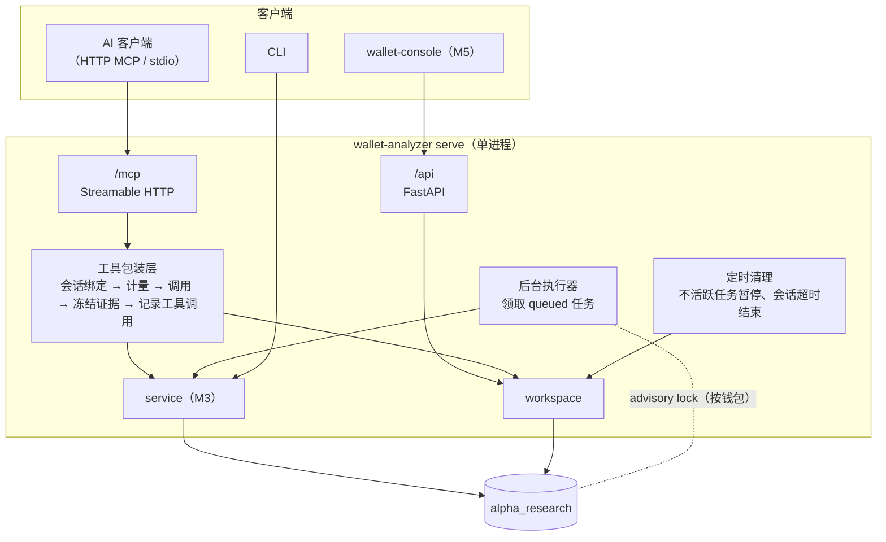
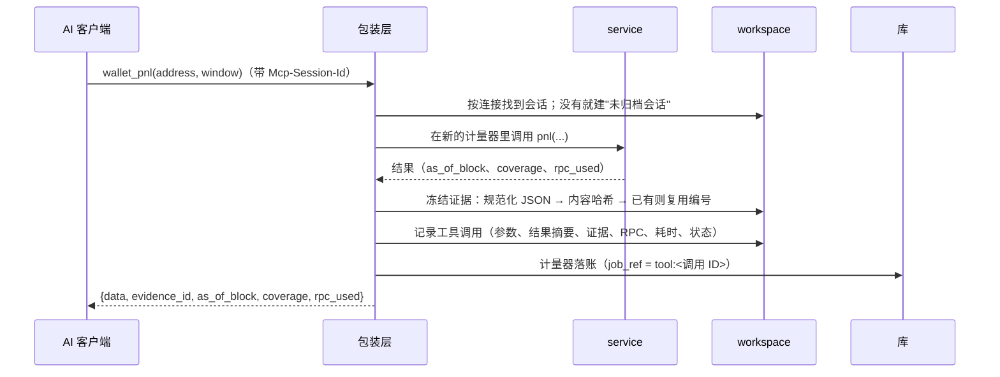
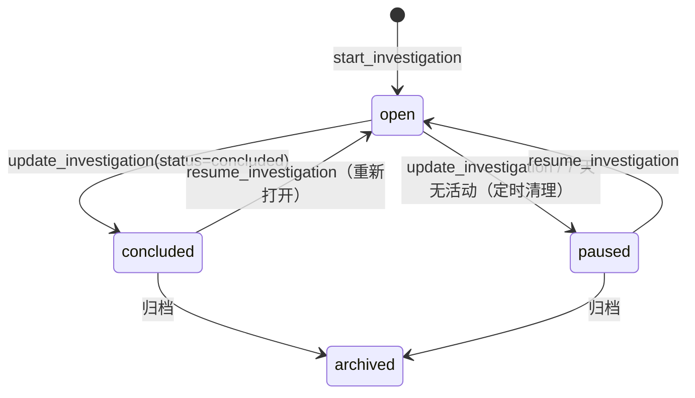
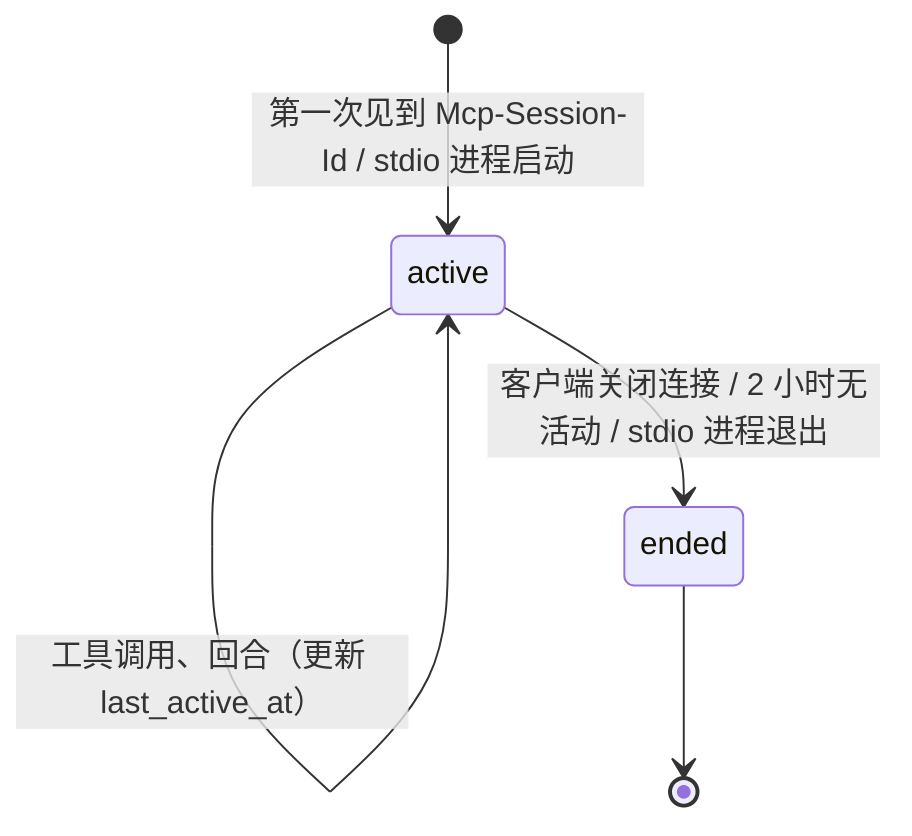
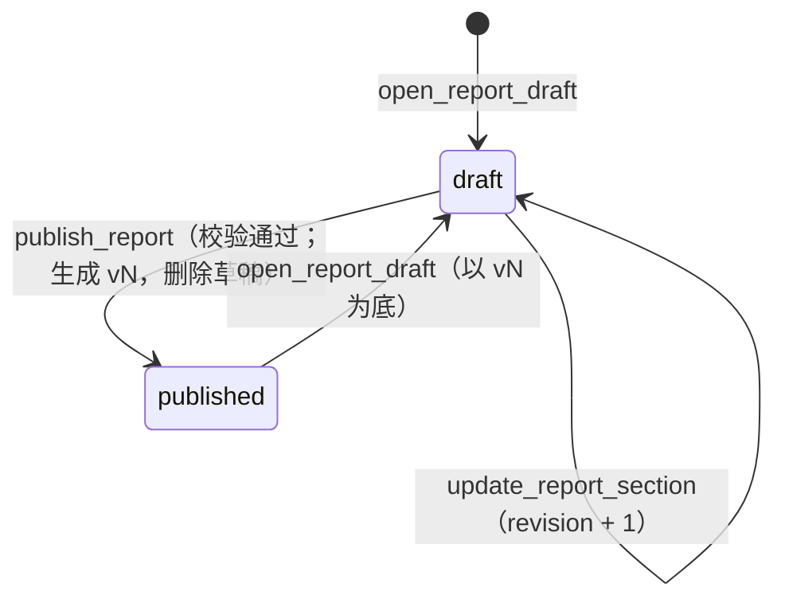

# M4 工作台 + 服务进程 · 实施规划

> 所属：钱包链上行为分析系统第一版的第 4 个开发里程碑，见设计文档 `research/docs/钱包链上行为分析系统设计方案.md` 12.1。
> 状态：**草案 v1，待评审**（2026-09-30）。批准后按第 8 节的顺序开发，每一步是一个可以单独评审的改动。
> 依赖：M3（分析引擎的 `service.py`、同步任务表和状态机）。M5 界面、M6 Skill 在 M4 的接口定下来之后开始。

## 实施进度

| 步骤 | 状态 | 说明 |
|---|---|---|
| — | 未开始 | 规划待评审 |

## 1. 目标与原则

M4 让 AI 客户端通过 MCP 完成一次调研："开任务 → 同步和分析钱包 → 记录发现 → 写报告并发布"，并且**隔天在另一个客户端里能接着做**。

M4 交付三样东西：
- **服务进程** `wallet-analyzer serve`：FastAPI 提供 `/api`（给 M5 界面），同一进程挂 HTTP MCP 端点 `/mcp`，加后台任务执行器；
- **MCP 工具**：分析类（包一层 M3 的服务层）和工作台类；stdio 入口 `wallet-analyzer-mcp` 作为兜底；
- **工作台最小集**：任务、会话、回合、工具调用自动记录、证据冻结、发现（只记录）、报告的草稿 / 发布 / 版本。

**原则**：

1. **入口层薄**：MCP 工具、REST 接口、CLI 只做参数解析、会话绑定和结果包装；分析逻辑全在 M3 的 `service.py`，工作台逻辑全在 `workspace/`。同一个能力只实现一次，三种入口共用。
2. **数字只来自证据**：分析工具的每个结果冻结成证据（不可变、按内容去重）。报告里的数据区块只存"证据编号 + 展示参数"，不存数字；发现必须引用证据或报告。这样报告永远能复现，数据更新后旧报告也不会悄悄变。
3. **服务端自动记录，不依赖 AI 自觉**：工具调用、RPC 消耗、证据由服务端在包装层记录；AI 只需要上报回合（`log_turn`）和结论（`record_finding`）。
4. **跨客户端继续**：调研任务、上下文包、报告草稿都在服务端，任何支持 MCP 的客户端都能用 `resume_investigation` 接上；不支持 HTTP MCP 的用 stdio，不支持 MCP 的用 CLI。
5. **额度闸门在服务端**：`wallet_sync` 先返回预估，超过预算必须带 `confirm=true` 再调一次；AI 绕不过去。
6. **不为以后的阶段预建**：引用反向索引、撤回、版本对比、发现确认流程、会话回放都在第二阶段；M4 只把数据结构留成它们能直接接上的形状（例如引用标记已经在正文里，第二阶段只需解析建索引）。

## 2. 现状与输入

| 已有 | 来源 | M4 怎么用 |
|---|---|---|
| `service.py` 的全部分析函数，输出带 `as_of_block`、`coverage`、`rpc_used` | M3 | 分析类工具直接调用 |
| `wallet_sync_jobs` 表和状态机（含 `queued`） | M3 | 后台执行器领取 `queued` 的任务 |
| 按钱包的 advisory lock、断点续跑 | M3 | 执行器和 stdio 进程同时写库时的一致性 |
| `InMemoryCallMeter(app, job_ref)`、`ExternalCallLedgerRepository` | M1 | 统计每次工具调用的 `rpc_used` 并落账 |
| `contract_registry`（`source`、`review_status` 字段已包含 `llm`、`pending_review`） | M2 | `label_contract` 写回 LLM 识别结论 |
| FastAPI、uvicorn | workspace 已有（live-signal 在用） | 服务进程 |
| MCP Python SDK | **新增依赖** `mcp` | HTTP（Streamable HTTP）和 stdio 两种传输；具体版本和挂载方式落地时核实 |

## 3. 范围

**做**：
- **存储**：迁移 `0010_workspace`：`wallet_investigations`、`wallet_investigation_subjects`、`wallet_sessions`、`wallet_turns`、`wallet_tool_calls`、`wallet_evidence`、`wallet_findings`、`wallet_reports`、`wallet_report_versions`、`wallet_report_drafts`，以及 4 个编号序列，同步 `SCHEMA.md`；
- **`workspace/`**：调研任务和上下文包、会话和回合、证据冻结、发现、报告（模板、区块校验、草稿乐观锁、发布校验、版本）、引用标记解析（只校验，不建索引）；
- **服务进程**：FastAPI 应用、`/mcp` 挂载、后台任务执行器（领取、并发上限、重启恢复、限速后自动续跑）、调研任务不活跃自动暂停；
- **MCP 工具**：设计文档 12.1 列出的 13 个分析类和 11 个工作台类，外加第四层识别所需的 `contract_info` 返回内容；
- **REST API**：M5 界面最小集要用的只读接口，加报告页、调研详情需要的聚合接口；OpenAPI 描述供 M5 生成类型；
- **安全**：默认只监听 `127.0.0.1`；监听其他地址时强制 Bearer Token；
- **入口**：`wallet-analyzer serve`、`wallet-analyzer-mcp`（stdio）。

**不做**：
- 界面 → M5；Skill、`.mcp.json` 和各客户端的发现配置 → M6（M4 只在 README 里写手动配置方法，用于验收）；
- `wallet_citations` 引用反向索引、"被引用"提示 → 第二阶段（M4 发布时校验引用标记能解析，界面先渲染成链接）；
- 报告撤回、版本对比、界面上人工编辑草稿、发现的人工确认、会话回放、导入客户端聊天记录 → 第二阶段；
- `unknown_protocols`、`dry_run_instance`、`protocol-adapter-author` Skill → 第二阶段（设计文档 12.1 "第一版明确不做"）；
- 合约识别复核队列的界面 → 第二阶段（M4 只保证 `pending_review` 的记录能查出来）；
- 监控、告警 → 第三阶段；
- `protocol_instances` 表：建议不建，见 10.2。

## 4. 现有模块的认知与上下游影响

| 模块 | 改动 | 影响面 |
|---|---|---|
| `apps/wallet-analyzer` | 新增 `workspace/`、`jobs.py`（执行器）、`server.py`、`entry/{mcp_tools.py,api/}`；`service.py` 的函数签名不变，只在需要时补分页参数 | CLI 行为不变；M3 的测试不变 |
| `wallet_sync_jobs` | 不改表；执行器按 M3 已定义的状态机领取和推进 | CLI 和服务进程可以同时存在：CLI 的 `sync` 在自己进程里立即领取，服务进程的执行器领取其余 `queued` 的任务，二者靠 advisory lock 互斥 |
| `contract_registry` | 不改表；新增写入路径 `label_contract`（`source=llm`、`review_status=pending_review`） | 仓储已保证 `confirmed` 的记录不被覆盖；解码上下文按现有规则读取（`pending_review` 的记录参与解码，报告中标注"待复核"） |
| `alpha_storage` | 迁移 0010（只新增表和序列）、仓储 | 不改已有表 |
| `alpha_core.metering` | 不改；每次工具调用新建一个 `InMemoryCallMeter`，`job_ref` 记为 `tool:<tool_call_id>` | 额度账本可以按工具调用汇总 |
| 根 `pyproject.toml` / `uv.lock` | wallet-analyzer 新增 `mcp`、`fastapi`、`uvicorn` 依赖 | 其他 app 不受影响 |

上游调用方：AI 客户端（MCP）、M5 界面（REST）。下游：M3 的 `service.py`、`alpha_storage`。依赖方向按设计文档 10.2：`workspace` 不依赖 `analysis` 和 `ingest`；入口层只调 `workspace` 和 `service`。这两条加进 wallet-analyzer 的架构测试。

## 5. 设计

### 5.1 数据流



**一次分析类工具调用**（例如 `wallet_pnl`）：



### 5.2 MCP 工具

**返回信封**（所有分析类工具一致）：

```text
{ data, evidence_id, as_of_block, coverage, rpc_used }
  # data：M3 服务层的结果（与 CLI --json 相同）
  # evidence_id：EV-xxxx；wallet_sync / sync_status / rpc_usage 这类不产生分析结论的工具为 null
  # rpc_used：本次调用的外部调用次数和美元成本，按供应商分列
```

**分析类**（参数和含义沿用设计文档 3.6，下表只列 M4 的实现要点）：

| 工具 | 实现要点 | 证据 |
|---|---|---|
| `wallet_sync(chain, address, depth, max_usd?, confirm?)` | 建任务并同步预估；在预算内进入 `queued` 由执行器执行，立即返回 `job_id`；超预算返回预估和"需要确认"，带 `confirm=true` 重调才入队。同一钱包已有进行中的任务时返回那个任务 | 否 |
| `sync_status(job_id)` | 状态、阶段、进度、已用成本、错误 | 否 |
| `wallet_overview` / `wallet_activity` / `wallet_transfers` / `wallet_positions` / `wallet_pnl` / `wallet_features` | 调 M3 同名服务函数；分页参数 `cursor`、`limit`（默认 100，上限 500）。数据未同步到对应深度时返回明确的错误和建议的 `wallet_sync` 参数，不自动触发同步 | 是 |
| `trace_funds(chain, address, token?, depth, min_usd)` | 见 5.3 | 是 |
| `contract_info(chain, address)` | 识别结果和来源、所在层级；未识别时附 ABI 摘要（事件和函数签名）、Sourcify 合约名、钱包与它的交互统计（次数、金额、方法选择器分布）、字节码是否为空。最多 1 次 `get_code` | 是 |
| `label_contract(chain, address, protocol, kind, rationale)` | 写 `contract_registry`：`source=llm`、`review_status=pending_review`、`evidence` 记理由和调用的证据编号；已是 `confirmed` 的拒绝写入 | 否（写入本身记在工具调用里） |
| `decode_tx(chain, tx_hash, subject?)` | 两段解码明细：流水、事件、告警、未识别合约；回执未缓存时取 1 次 | 是 |
| `rpc_usage(period?)` | 额度账本汇总：按供应商、方法、任务、工具调用 | 否 |

**工作台类**：

| 工具 | 实现要点 |
|---|---|
| `start_investigation(title, goal, wallets[])` | 建 `INV-xxxx`，把当前会话挂到任务下；返回编号和界面链接 |
| `resume_investigation(code)` | 把当前会话挂到任务下，任务是 `paused` / `concluded` 时改回 `open`；返回上下文包（5.4） |
| `list_investigations(wallet?, status?)` | 分页 |
| `update_investigation(code, status?, summary?, open_questions?)` | 按状态机校验转换 |
| `log_turn(user_message, answer_md)` | 当前会话追加回合；会话没挂到任务时照样记录 |
| `record_finding(statement_md, confidence, citations[])` | 至少一个引用（`EV-`、`F-` 或 `WR-…@vN`），全部要能解析；状态固定 `proposed` |
| `search_reports(wallet?, tag?, query?)` | 按主钱包、策略标签（版本的 `headline.tags`）、标题和摘要文字匹配；返回每份报告最新版本的摘要 |
| `get_report(ref, sections?)` | `ref` 形如 `WR-0003@v2`，省略版本取最新；数据区块附带所引证据的内容，AI 不用再逐个取证据 |
| `open_report_draft(report?, subject_wallet?)` | 已有报告：以最新版本为底建草稿（已有草稿则返回它）；新报告：建 `WR-xxxx` 和空草稿 |
| `update_report_section(draft, section, blocks, expected_revision)` | 整章替换；区块逐个校验（5.5）；`expected_revision` 不等于当前值时拒绝并返回最新内容 |
| `publish_report(draft, change_note)` | 发布校验通过后生成新版本，草稿删除；返回界面链接 |

**会话绑定**：
- HTTP：`Mcp-Session-Id` → `wallet_sessions.mcp_session_ref`。第一次见到这个 ID 时建会话（`client` 取 MCP 初始化握手里的客户端名）；
- stdio：一个进程一个会话；
- 没有调用 `start_investigation` / `resume_investigation` 的会话是"未归档会话"（`investigation_id` 为空），调用记录照样保存，之后可以挂到任务下；
- 一个会话同一时间只挂一个任务；在同一会话里 `resume` 另一个任务时，之后的调用归到新任务，之前的不动。

### 5.3 `trace_funds`（资金去向，一跳以上；展开规则见待定需求 10.3）

M3 只算一跳的资金对手方。M4 的工具按层展开：

```text
第 0 层 = 目标钱包
第 k+1 层 = 第 k 层每个节点、金额 ≥ min_usd 的对手方中，按金额取前 N 个（默认 N=5），
            跳过：已访问节点、合约（协议）、带交易所标签的地址（到交易所即终止，标记为"进入交易所"）
depth ≤ 3；每个新节点只需要一次索引源查询（transfers 深度，零 RPC），结果写 wallet_transfers
预估成本 = 预计新节点数 × 索引源单价；超过预算按 wallet_sync 的方式要求确认
```

结果是一张有向图（节点：地址、标签、类型；边：资产、金额、笔数、时间范围），整体冻结为一条证据。

### 5.4 上下文包（`resume_investigation` 的返回值）

| 部分 | 内容 |
|---|---|
| 任务 | 编号、标题、目标、状态、研究对象钱包 |
| 进展 | 最近一次总结、待解决问题 |
| 发现 | 全部发现（编号、陈述、置信度、状态、引用） |
| 报告 | 关联报告的最新版本号和摘要（`headline`）；是否有草稿及其 `revision` |
| 最近回合 | 最近 5 个回合的问题和回答的前 300 字 |
| 数据新鲜度 | 每个研究对象钱包：最近证据的 `as_of_block` 与当前区块的差、`wallet_sync_ranges` 的最新覆盖区块、解码器版本是否已升级（`wallet_tx_decodes` 里有落后版本的交易数）、覆盖等级变化（按当前事件统计的 T0~T3 资金占比，与最近一条 `wallet_overview` 证据比较） |
| 建议 | 规则生成的下一步提示，例如"数据落后 3 天，建议 wallet_sync(depth=transfers)"、"解码器已升级，建议重新解码" |

上下文包本身不冻结为证据（它是导航信息，不是分析结论）。

### 5.5 证据与报告

**证据冻结**：

```text
payload      = 工具结果的 data 部分 + as_of_block + coverage
content_hash = sha256(规范化 JSON(kind, chain, subject_address, payload, payload_schema_version, decoder_version))
               # 规范化：键排序、无空白、Decimal 和大整数按字符串输出
同一 content_hash 已存在 → 复用原证据编号，不新建
```

- `kind` = 产生它的工具名（`wallet_pnl`、`wallet_positions`……）；`payload_schema_version` 是该工具结果结构的版本号（服务层结果模型里的常量，结构变化时加一）；
- `decoder_version` 记当时参与解码的各家族版本摘要，界面用它判断"这份证据之后解码器已经升级"；
- 证据只增不改；结果很大时（`wallet_activity` 的一页）照样整体存，分页本身就限制了大小。

**报告模板 `wallet_profile`**（代码里定义，`template_version = 1`；必需章节见待定需求 10.6）：

| 章节 | 发布时必需 | 允许的区块 |
|---|---|---|
| `summary` | ✅ | `text`、`metric_grid`、`callout` |
| `protocols` | ✅ | `text`、`protocol_table`、`coverage_breakdown`、`callout` |
| `activity` | | `text`、`activity_timeline`、`callout` |
| `positions` | ✅ | `text`、`lp_positions_table`、`lp_range_timeline`、`lending_positions_table`、`callout` |
| `strategy` | | `text`、`feature_table`、`callout` |
| `capital` | | `text`、`cashflow_chart`、`callout` |
| `pnl` | ✅ | `text`、`pnl_breakdown`、`metric_grid`、`callout` |
| `fund_flow` | | `text`、`fund_flow_graph`、`callout` |
| `conclusion` | ✅ | `text`、`coverage_breakdown`、`callout` |
| `appendix` | 自动生成 | 发布时生成：引用的证据和发现、解码器版本、本调研的额度消耗 |

**区块结构**（pydantic 校验）：

```text
text        {block_id, type: "text", markdown}
callout     {block_id, type: "callout", level: info|warning, markdown}
数据区块     {block_id, type, evidence_id, params}
             # 每种数据区块声明它接受的证据 kind，例如 pnl_breakdown 只接受 wallet_pnl、
             # lp_positions_table 只接受 wallet_positions；params 由区块类型各自的 schema 校验
block_id    客户端不传时服务端生成（章节 key + 序号，如 pnl/b3），跨版本保持不变
```

**发布校验**：
1. 必需章节都有至少一个区块；
2. 每个数据区块的证据存在，且 kind 与区块类型匹配；
3. 正文里的引用标记全部能解析：`[[WR-0003@v2#pnl]]`、`[[WR-0003@v2#pnl/b7]]`、`[[F-0042]]`、`[[EV-0107]]`，可带 `|关系`；只能引用已发布版本；
4. `change_note` 非空（第一个版本可以写"首次发布"）；
5. 发布时生成 `headline`：从报告引用的最新一条 `wallet_overview` / `wallet_pnl` 证据取覆盖率、覆盖等级分布、对账状态、关键指标；策略标签取 `strategy` 章节 `feature_table` 区块的 `params.tags`。

**编号**：`INV-`、`WR-`、`F-`、`EV-` 各用一个 PostgreSQL 序列，格式 `前缀-%04d`（超过 9999 自然变长）。编号在创建时分配，不复用。

### 5.6 后台执行器（`jobs.py`）

- **领取**：轮询 `wallet_sync_jobs` 里 `state = queued` 的任务（按创建时间），用 `SELECT … FOR UPDATE SKIP LOCKED` 领取，再拿钱包的 advisory lock；拿不到锁（CLI 或 stdio 进程正在跑同一钱包）就放回，稍后再试；
- **并发**：线程池，默认 2 个任务同时执行（配置可改；待定需求 10.4）；同一钱包天然只有一个；
- **重启恢复**：启动时把 `running` 但拿得到锁的任务（进程被杀留下的）视为 `paused`，与 `paused` 的一起重新入队；
- **限速**：任务因短时限速进入 `rate_limited` 后，执行器按 5 分钟、15 分钟、1 小时退避自动续跑；因额度耗尽进入的（`checkpoint.reason = quota_exhausted`）不自动续跑，等人工 `resume`；
- **同步 I/O**：服务层是同步代码（SQLAlchemy、requests），在 FastAPI 和 MCP 的异步处理里统一放进线程池执行，不阻塞事件循环。

### 5.7 状态机

**调研任务 `wallet_investigations.status`**（沿用设计文档 6.2）：



"活动"= 该任务下任一会话有工具调用或回合。`archived` 是终态，`resume` 返回错误。

**会话 `wallet_sessions`**：



结束后同一个 `Mcp-Session-Id` 再出现时（客户端重连），重新打开这条会话，不新建。

**报告**：



一份报告至多一份草稿；已发布版本不可修改（撤回字段在第二阶段启用）。

**发现**：M4 只有 `proposed`。`confirmed`、`refuted` 在第二阶段随人工确认流程启用，字段现在就建好。

### 5.8 REST API（M5 最小集）

| 接口 | 用途 |
|---|---|
| `GET /api/investigations`、`GET /api/investigations/{code}` | 调研列表、详情（含发现、关联报告） |
| `GET /api/investigations/{code}/timeline` | 会话 → 回合 → 工具调用 → 证据 → 报告版本，按时间合并 |
| `GET /api/reports`、`GET /api/reports/{code}`、`GET /api/reports/{code}/versions/{n}` | 报告列表、最新版本（含版本列表）、指定版本；数据区块附带证据内容 |
| `GET /api/evidence/{code}` | 证据详情 |
| `GET /api/findings/{code}` | 发现详情（报告里 `[[F-0042]]` 的跳转目标） |
| `GET /api/tx/{chain}/{hash}?subject=` | 交易解码查看（同 `decode_tx`） |
| `GET /api/wallets/{chain}/{address}` | 钱包主页：相关调研、报告、最新关键指标 |
| `GET /api/usage` | 额度使用 |
| `POST /api/investigations/{code}/resume-prompt` | 生成"继续研究"按钮复制用的提示语（纯文本，不改状态） |

- 响应模型全部用 pydantic 声明，OpenAPI 描述由 FastAPI 生成，M5 据此生成 TypeScript 类型；
- M4 只做只读接口加一个生成提示语的接口；草稿编辑等写接口在第二阶段；
- 服务进程同时托管 M5 构建出的静态页面：`/api`、`/mcp` 以外的路径返回界面，前端路由找不到的路径回退到 `index.html`。

### 5.9 安全

- 默认监听 `127.0.0.1`；`--host` 不是回环地址时，必须配置 `WALLET_ANALYZER_TOKEN`，否则拒绝启动；配置了 Token 时 `/api` 和 `/mcp` 都校验 `Authorization: Bearer`；
- 日志不打印 Token 和 RPC 地址里的 key；
- 工具参数里的地址统一小写并校验格式，拒绝非法输入；报告正文按 Markdown 存储，渲染时的转义由 M5 负责。

### 5.10 目录结构（在 M3 的基础上新增）

```text
apps/wallet-analyzer/src/wallet_analyzer/
├── workspace/
│   ├── codes.py            # 编号序列
│   ├── investigations.py   # 任务、上下文包、不活跃暂停
│   ├── sessions.py         # 会话、回合、会话绑定
│   ├── evidence.py         # 规范化 JSON、内容哈希、冻结与去重
│   ├── findings.py
│   ├── citations.py        # 引用标记解析（M4 只校验）
│   ├── templates.py        # wallet_profile 模板、区块类型与证据 kind 的对应
│   └── reports.py          # 草稿、乐观锁、发布校验、版本、headline、附录生成
├── jobs.py                 # 后台执行器
├── server.py               # FastAPI 应用：/api + /mcp + 执行器 + 定时清理的生命周期
└── entry/
    ├── mcp_tools.py        # 工具注册 + 包装层（会话、计量、证据、调用记录）
    ├── mcp_stdio.py        # wallet-analyzer-mcp 入口
    └── api/                # REST 路由与响应模型
```

## 6. 表结构（迁移 `0010_workspace`，同步 `SCHEMA.md`）

**序列**：`wallet_investigation_code_seq`、`wallet_report_code_seq`、`wallet_finding_code_seq`、`wallet_evidence_code_seq`。

**`wallet_investigations`**

| 字段 | 类型 | 可空 | 默认值 | 说明 |
|---|---|---|---|---|
| id | BIGSERIAL | 否 | 自增 | 主键 |
| code | VARCHAR(16) | 否 | 无 | `INV-0007`；唯一 |
| title | VARCHAR(200) | 否 | 无 | 标题 |
| goal | TEXT | 否 | 无 | 研究目标 |
| status | VARCHAR(16) | 否 | `'open'` | `open` / `paused` / `concluded` / `archived` |
| summary_md | TEXT | 是 | NULL | 最近一次阶段性总结 |
| open_questions | JSONB | 否 | `'[]'` | 待解决问题列表（字符串数组） |
| last_activity_at | TIMESTAMPTZ | 否 | `now()` | 最近一次工具调用或回合的时间（不活跃暂停用） |
| created_at | TIMESTAMPTZ | 否 | `now()` | |
| updated_at | TIMESTAMPTZ | 否 | `now()` | |
| concluded_at | TIMESTAMPTZ | 是 | NULL | 进入 `concluded` 的时间；重新打开时清空 |

**约束**：`code` 唯一；索引 `(status, last_activity_at)`。

**`wallet_investigation_subjects`**

| 字段 | 类型 | 可空 | 默认值 | 说明 |
|---|---|---|---|---|
| investigation_id | BIGINT | 否 | 无 | 外键 `wallet_investigations.id`；联合主键之一 |
| chain | VARCHAR(16) | 否 | 无 | 联合主键之一 |
| address | VARCHAR(42) | 否 | 无 | 联合主键之一 |
| role | VARCHAR(16) | 否 | `'primary'` | `primary`（主研究对象）/ `related`（关联钱包） |

**约束**：主键 `(investigation_id, chain, address)`；索引 `(chain, address)`。

**`wallet_sessions`**

| 字段 | 类型 | 可空 | 默认值 | 说明 |
|---|---|---|---|---|
| id | BIGSERIAL | 否 | 自增 | 主键 |
| investigation_id | BIGINT | 是 | NULL | 外键；未归档会话为 NULL |
| transport | VARCHAR(8) | 否 | 无 | `http` / `stdio` |
| client | VARCHAR(64) | 是 | NULL | MCP 握手里的客户端名；未知为 NULL |
| mcp_session_ref | VARCHAR(128) | 是 | NULL | HTTP 的 `Mcp-Session-Id`；stdio 为 NULL |
| started_at | TIMESTAMPTZ | 否 | `now()` | |
| last_active_at | TIMESTAMPTZ | 否 | `now()` | |
| ended_at | TIMESTAMPTZ | 是 | NULL | 结束时间；进行中为 NULL |
| summary_md | TEXT | 是 | NULL | 会话总结（AI 通过 `update_investigation` 写入时同步记一份） |

**约束**：`mcp_session_ref` 部分唯一（非 NULL 时）；索引 `(investigation_id, started_at)`。与设计文档 6.1 相比去掉了 `transcript_attachment`（导入聊天记录在第二阶段，到时再加列），增加 `transport`。

**`wallet_turns`**

| 字段 | 类型 | 可空 | 默认值 | 说明 |
|---|---|---|---|---|
| session_id | BIGINT | 否 | 无 | 外键；联合主键之一 |
| seq | INTEGER | 否 | 无 | 会话内序号，从 1 开始；联合主键之一 |
| user_message | TEXT | 否 | 无 | 用户的问题 |
| answer_md | TEXT | 否 | 无 | AI 的回答 |
| created_at | TIMESTAMPTZ | 否 | `now()` | |

**`wallet_tool_calls`**

| 字段 | 类型 | 可空 | 默认值 | 说明 |
|---|---|---|---|---|
| id | BIGSERIAL | 否 | 自增 | 主键 |
| session_id | BIGINT | 否 | 无 | 外键 |
| tool | VARCHAR(48) | 否 | 无 | 工具名 |
| args | JSONB | 否 | `'{}'` | 调用参数 |
| result_digest | JSONB | 否 | `'{}'` | 结果摘要（条数、关键数字、错误信息），完整结果在证据里 |
| evidence_id | BIGINT | 是 | NULL | 外键 `wallet_evidence.id`；不产生证据的工具为 NULL |
| job_id | BIGINT | 是 | NULL | `wallet_sync` 建的任务 |
| rpc_calls | INTEGER | 否 | 0 | 本次调用的外部调用次数 |
| rpc_cost_usd | NUMERIC(12,6) | 否 | 0 | 本次调用的外部调用成本（美元） |
| duration_ms | INTEGER | 否 | 无 | 耗时 |
| status | VARCHAR(16) | 否 | 无 | `ok` / `error` / `needs_confirm`（预估超预算） |
| created_at | TIMESTAMPTZ | 否 | `now()` | |

**约束**：索引 `(session_id, created_at)`、`(evidence_id)`。与设计文档 6.1 的差异：`rpc_used` 拆成次数和美元成本两列（口径与 M3 一致）；加 `job_id`。

**`wallet_evidence`**（只增不改）

| 字段 | 类型 | 可空 | 默认值 | 说明 |
|---|---|---|---|---|
| id | BIGSERIAL | 否 | 自增 | 主键 |
| code | VARCHAR(16) | 否 | 无 | `EV-0107`；唯一 |
| content_hash | VARCHAR(64) | 否 | 无 | sha256 十六进制；唯一 |
| kind | VARCHAR(48) | 否 | 无 | 产生它的工具名 |
| chain | VARCHAR(16) | 是 | NULL | 链；与钱包无关的证据为 NULL |
| subject_address | VARCHAR(42) | 是 | NULL | 主体地址（钱包或合约） |
| payload | JSONB | 否 | 无 | 冻结的结果 |
| payload_schema_version | INTEGER | 否 | 无 | 结果结构版本 |
| decoder_version | JSONB | 否 | `'{}'` | 当时各家族的解码器版本 |
| as_of_block | BIGINT | 是 | NULL | 数据截止区块；与区块无关的为 NULL |
| as_of_time | TIMESTAMPTZ | 否 | 无 | 生成时间 |
| created_at | TIMESTAMPTZ | 否 | `now()` | |

**约束**：`code` 唯一、`content_hash` 唯一；索引 `(chain, subject_address, kind, created_at)`。

**`wallet_findings`**

| 字段 | 类型 | 可空 | 默认值 | 说明 |
|---|---|---|---|---|
| id | BIGSERIAL | 否 | 自增 | 主键 |
| code | VARCHAR(16) | 否 | 无 | `F-0042`；唯一 |
| investigation_id | BIGINT | 是 | NULL | 外键；在未归档会话里记录的为 NULL |
| session_id | BIGINT | 否 | 无 | 在哪个会话里提出 |
| statement_md | TEXT | 否 | 无 | 陈述，含引用标记 |
| confidence | VARCHAR(8) | 否 | 无 | `high` / `medium` / `low` |
| citations | JSONB | 否 | 无 | 解析后的引用列表 `[{target, relation}]`，至少一项 |
| status | VARCHAR(16) | 否 | `'proposed'` | `proposed`；`confirmed` / `refuted` 第二阶段启用 |
| reviewed_by | VARCHAR(64) | 是 | NULL | 第二阶段启用 |
| created_at | TIMESTAMPTZ | 否 | `now()` | |
| updated_at | TIMESTAMPTZ | 否 | `now()` | |

**`wallet_reports`**

| 字段 | 类型 | 可空 | 默认值 | 说明 |
|---|---|---|---|---|
| id | BIGSERIAL | 否 | 自增 | 主键 |
| code | VARCHAR(16) | 否 | 无 | `WR-0003`；唯一 |
| template_key | VARCHAR(32) | 否 | `'wallet_profile'` | 模板 |
| title | VARCHAR(200) | 否 | 无 | 标题 |
| primary_chain | VARCHAR(16) | 否 | 无 | 主研究钱包的链 |
| primary_address | VARCHAR(42) | 否 | 无 | 主研究钱包 |
| origin_investigation_id | BIGINT | 是 | NULL | 最初产出它的调研 |
| latest_version_no | INTEGER | 否 | 0 | 最新已发布版本号；0 表示还没发布过 |
| created_at | TIMESTAMPTZ | 否 | `now()` | |

**约束**：`code` 唯一；索引 `(primary_chain, primary_address)`。

**`wallet_report_versions`**（发布后不可修改）

| 字段 | 类型 | 可空 | 默认值 | 说明 |
|---|---|---|---|---|
| report_id | BIGINT | 否 | 无 | 外键；联合主键之一 |
| version_no | INTEGER | 否 | 无 | 从 1 开始；联合主键之一 |
| template_version | INTEGER | 否 | 无 | 发布时的模板版本 |
| sections | JSONB | 否 | 无 | 章节 → 区块列表 |
| change_note | TEXT | 否 | 无 | 改动说明 |
| author_kind | VARCHAR(8) | 否 | 无 | `llm` / `human` |
| session_id | BIGINT | 是 | NULL | 发布所在会话 |
| investigation_id | BIGINT | 是 | NULL | 发布所在调研 |
| headline | JSONB | 否 | 无 | 覆盖率、覆盖等级分布、对账状态、策略标签、关键指标 |
| content_hash | VARCHAR(64) | 否 | 无 | `sections` 规范化 JSON 的 sha256 |
| published_at | TIMESTAMPTZ | 否 | `now()` | |
| withdrawn_at | TIMESTAMPTZ | 是 | NULL | 第二阶段启用 |
| withdraw_reason | TEXT | 是 | NULL | 第二阶段启用 |

**`wallet_report_drafts`**

| 字段 | 类型 | 可空 | 默认值 | 说明 |
|---|---|---|---|---|
| report_id | BIGINT | 否 | 无 | 外键；主键（一份报告至多一份草稿） |
| base_version_no | INTEGER | 否 | 无 | 以哪个版本为底；新报告为 0 |
| sections | JSONB | 否 | `'{}'` | 章节 → 区块列表 |
| revision | INTEGER | 否 | 1 | 乐观锁版本，每次修改加一 |
| updated_by_kind | VARCHAR(8) | 否 | 无 | `llm` / `human` |
| updated_at | TIMESTAMPTZ | 否 | `now()` | |

## 7. 验证

| 层 | 验证 |
|---|---|
| 证据 | 相同结果两次冻结得到同一编号；规范化对键顺序、Decimal、大整数稳定；证据行没有更新路径（仓储不提供 update） |
| 报告 | 必需章节缺失、证据不存在、证据 kind 不匹配、引用草稿、引用标记写错、`change_note` 为空，各自被拒；乐观锁冲突返回最新内容；发布后草稿消失、版本号递增、`headline` 正确 |
| 状态机 | 调研任务、会话、报告的每条转换和非法转换都有测试；7 天不活跃自动暂停、2 小时会话超时 |
| 包装层 | 每次工具调用都有记录；`rpc_used` 与额度账本按 `job_ref` 汇总的值一致；工具报错时也有记录（`status=error`） |
| 执行器 | 同一钱包 CLI 和执行器同时跑时只有一个拿到锁；杀掉服务进程后重启，任务从断点继续；短时限速自动续跑、额度耗尽不自动续跑 |
| MCP | 用 MCP SDK 的客户端对 `/mcp` 和 stdio 做契约测试：工具列表、参数 schema、返回信封 |
| 端到端 | 在 Claude Code 里按设计文档 4.1 走通基准钱包：开任务 → `wallet_sync`（超预算要确认）→ 分析 → 记录发现 → 写报告 → 发布；**换一个客户端**（Codex 或 Cursor）`resume_investigation` 继续，修改报告发布 v2 |

## 8. 实施步骤（每一步是一个可以单独评审的改动）

| 步骤 | 内容 | 依赖 |
|---|---|---|
| 1 | 迁移 0010、仓储、编号序列，同步 `SCHEMA.md` | — |
| 2 | 证据冻结（规范化、哈希、去重）、服务层结果模型补 `payload_schema_version` | 1、M3 |
| 3 | 调研任务、会话、回合、发现、上下文包、引用标记解析 | 1 |
| 4 | 报告：模板、区块校验、草稿乐观锁、发布校验、headline、附录 | 2、3 |
| 5 | 后台执行器：领取、并发、重启恢复、限速续跑；定时清理 | M3 |
| 6 | MCP：工具注册、包装层、会话绑定、HTTP 挂载、stdio 入口；新增 `mcp` 依赖 | 2~5 |
| 7 | `trace_funds`、`contract_info` 的未识别合约信息、`label_contract` | 6 |
| 8 | REST API 最小集 + OpenAPI；Bearer Token | 3、4 |
| 9 | `serve` 命令、README（各客户端的手动配置方法）、架构测试（依赖方向） | 6、8 |
| 10 | 端到端验收（两个客户端）；设计文档同步（12.1、6.1、3.6 的调整） | 9 |

步骤 1~4 只依赖 M3 的服务层结果模型，可以和 M3 的后半段并行。

## 9. 风险与应对

| 风险 | 应对 |
|---|---|
| MCP SDK 的 Streamable HTTP 挂载方式、会话 ID 的取法随版本变化 | 步骤 6 先写一个最小的挂载验证，锁定版本；包装层只依赖"工具名 + 参数 + 会话 ID"三样，换 SDK 时只改注册代码 |
| 客户端不传或复用 `Mcp-Session-Id` | 取不到时按"每个连接一个会话"退化；会话只影响归档，不影响工具的正确性 |
| AI 不调用 `log_turn` | 时间线照样有工具调用；界面标出"有调用没有回合"的会话（设计文档 3.9 已预期） |
| 证据表增长快（`wallet_activity` 分页结果） | 内容去重；单条证据按页存；第二阶段再评估按 kind 设保留策略（被报告引用的永不删除） |
| 同步 I/O 阻塞事件循环 | 所有服务层调用进线程池；执行器独立线程池，不和请求处理抢 |
| stdio 进程和服务进程同时写库 | 写入幂等 + 按钱包 advisory lock（设计文档 3.8） |

## 10. 待定需求（实现对应步骤前确认）

以下需求现在不定，**实现到"最晚确认"那一步之前逐条确认**，确认结果回填"状态"列（写明日期和结论），并同步修改正文。未确认前按"默认做法"推进，默认做法都可以在确认后低成本改掉。

| 编号 | 待定需求 | 建议 | 未确认前的默认做法 | 最晚确认 | 状态 |
|---|---|---|---|---|---|
| 10.1 | **服务进程的部署方式**：只在本机运行，还是部署到内网多人访问 | 第一版只在本机（`127.0.0.1`）；内网部署时再定机器、数据库和 RPC key 的位置 | 只监听 `127.0.0.1`，Token 功能照做（5.9） | 步骤 9 | 待确认 |
| 10.2 | **`protocol_instances` 表是否建**（M2 挪到 M4 的） | 不建：实例配置的唯一真相是仓库 YAML，`instance_registry()` 已能直接读，同步到表里只多一个会过期的副本；设计文档删掉这张表 | 不建，`contract_info` 直接读 YAML | 步骤 1 | 待确认 |
| 10.3 | **`trace_funds` 的展开规则**：每层前 N 个对手方、最大层数、停止条件 | 每层前 5 个、最多 3 层，遇到交易所和合约停止（5.3） | 按建议实现，参数放配置 | 步骤 7 | 待确认 |
| 10.4 | **后台并发任务数** | 2 个（Ankr 同一端点限速会退避，并发再高也快不了多少） | 2，放配置 | 步骤 5 | 待确认 |
| 10.5 | **超时和保留**：调研任务 7 天无活动自动暂停、会话 2 小时无活动结束、上下文包带最近 5 个回合 | 按括号内的值 | 按括号内的值，全部放配置 | 步骤 3 | 待确认 |
| 10.6 | **报告模板的必需章节**：`summary`、`protocols`、`positions`、`pnl`、`conclusion`（5.5） | 按括号内；没有持仓的钱包在 `positions` 写一个 `callout` 说明 | 按建议实现 | 步骤 4 | 待确认 |
| 10.7 | **MCP SDK 版本和 Streamable HTTP 挂载方式** | 步骤 6 先做最小挂载验证再锁版本（9） | 实现时核实 | 步骤 6 | 待核实（技术项） |

