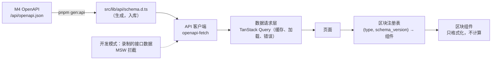

# M5 界面最小集 · 实施规划

> 所属：钱包链上行为分析系统第一版的第 5 个开发里程碑，见设计文档 `research/docs/钱包链上行为分析系统设计方案.md` 12.1、3.11。
> 状态：**草案 v1，待评审**（2026-09-30）。批准后按第 8 节的顺序开发，每一步是一个可以单独评审的改动。
> 依赖：M4 的 REST 接口和 OpenAPI 描述（接口定下来后即可对着录制的数据开发，不必等 M4 全部完成）。

## 实施进度

| 步骤 | 状态 | 说明 |
|---|---|---|
| — | 未开始 | 规划待评审 |

## 1. 目标与原则

M5 交付 `research/apps/wallet-console`：**让人能看报告、看调研过程**，并能一键把"继续研究"的提示语带回 AI 客户端。第一版的写入全部走 AI（MCP），界面只读。

**原则**：

1. **只走 HTTP**：界面只调 `/api`，不直接连库，不引用 alpha-lp、alpha-grid 的任何包（设计文档 10.2）；
2. **类型从后端生成**：请求和响应的 TypeScript 类型由 M4 的 OpenAPI 描述生成，不手写；后端改了接口，前端类型检查直接报错；
3. **数字从证据渲染**：报告的数据区块只有"证据编号 + 展示参数"，界面按证据内容渲染；前端不重新计算任何业务数字（盈亏、占比都用证据里的值），只做格式化；
4. **区块是插件**：每种区块类型一个组件，按 `(区块类型, 证据结构版本)` 注册。新增区块类型只加组件和注册一行；旧版本报告的证据结构保留渲染器（设计文档 3.10 的 G10）；
5. **金额不丢精度**：原始数量是大整数字符串，美元金额是十进制字符串，格式化用 `bigint` 和字符串运算，不转成 JS 浮点数；
6. **没做的就明说**：遇到还不支持的区块类型，显示"此区块类型暂未支持"并给出证据链接，不渲染成空白。

## 2. 现状与输入

| 已有 | 来源 | M5 怎么用 |
|---|---|---|
| REST 只读接口 + OpenAPI 描述 | M4 5.8 | 全部页面的数据 |
| 服务进程托管静态页面 | M4 5.8 | 构建产物由 `wallet-analyzer serve` 直接提供，不需要单独的 Node 服务 |
| 报告模板 `wallet_profile`、区块类型与证据 kind 的对应 | M4 5.5 | 区块注册表与之一一对应 |
| 仓库里的前端选型 | `products/alpha-grid/web`（最新）：Vite + React 19 + TypeScript + React Router + Tailwind 4 + shadcn/ui（Radix）+ echarts + lightweight-charts + oxlint；构建产物输出到后端的静态目录 | 沿用同一套选型（只沿用选型，不引用它的代码） |

**与设计文档的差异**：设计文档 3.11 写的是 Next.js。界面是只读的内部工具，不需要服务端渲染和 SEO；用 Vite 构建成静态页面、由 wallet-analyzer 服务进程托管，部署上只有一个进程，和 alpha-grid 的做法一致。详见 10.1。

## 3. 范围

**做**（设计文档 12.1 的 M5 清单，加上让链接能点通所需的两页，见待定需求 10.2）：

| 页面 | 路由 | 说明 |
|---|---|---|
| 首页 | `/` | 进行中的调研、最近发布的报告、未归档会话数、本月额度使用 |
| 调研列表 | `/investigations` | 按状态、钱包筛选 |
| 调研详情 | `/investigations/:code` | 目标、状态、研究对象、总结、待解决问题、发现列表、**时间线**、"继续研究"按钮 |
| 报告列表 | `/reports` | 按钱包、策略标签、标题搜索（**新增**：报告页的入口） |
| 报告页 | `/reports/:code`、`/reports/:code/v/:n` | 页头标记、章节目录、按模板渲染正文、版本列表 |
| 证据详情 | `/evidence/:code` | 证据的元信息和内容（**新增**：`[[EV-0107]]` 的跳转目标） |
| 交易解码查看 | `/tx/:chain/:hash?subject=` | 两段解码对照 |

**报告区块**（12.1 列出的 9 种，加 `callout` 和兜底）：`text`、`callout`、`metric_grid`、`coverage_breakdown`、`protocol_table`、`lp_positions_table`、`lp_range_timeline`、`cashflow_chart`、`pnl_breakdown`、`feature_table`；其余类型（`activity_timeline`、`lending_positions_table`、`fund_flow_graph`、`health_factor_chart`……）走兜底渲染。

**不做**：
- 任何写操作界面（草稿编辑、发现确认、合约识别复核、事件修正）→ 第二阶段；
- 会话回放页、版本对比页、钱包主页、协议覆盖页 → 第二阶段；
- 引用标记的悬浮预览、"被引用"栏、撤回横幅 → 第二阶段（依赖 M4 暂不建的引用反向索引和撤回）；
- 登录体系：只支持 M4 的 Bearer Token（见 5.7）；
- 多语言：界面只有中文；
- 移动端专门适配：保证窄屏不横向溢出即可。

## 4. 现有模块的认知与上下游影响

| 模块 | 改动 | 影响面 |
|---|---|---|
| `research/apps/wallet-console`（新增） | 独立的 pnpm 项目，自带 `package.json` 和锁文件 | 不加入任何已有的 JS 工作区 |
| `research/pyproject.toml` | uv 工作区的成员是 `apps/*`，会把没有 `pyproject.toml` 的 `wallet-console` 也当成成员而报错；在 `[tool.uv.workspace]` 加 `exclude = ["apps/wallet-console"]` | 只影响工作区成员解析，其他 app 不变 |
| `apps/wallet-analyzer` | 构建产物输出到 `src/wallet_analyzer/static/`（加入 `.gitignore`），由 M4 的静态托管提供；没有构建产物时 `serve` 照常启动，访问界面返回提示 | M4 已规划托管 |
| M4 的 REST 接口 | M5 开发中发现缺字段时，回到 M4 补接口和 OpenAPI，不在前端拼数据 | 接口变化由生成的类型暴露 |
| 根 `.gitignore` | 加 `node_modules/`、构建产物目录（若未覆盖） | 无 |

上游调用方：浏览器里的用户。下游：M4 的 `/api`。

## 5. 设计

### 5.1 数据流



- **类型生成**：`openapi-typescript` 从运行中的服务（或 M4 导出的 `openapi.json` 文件）生成 `schema.d.ts`，生成结果入库；CI 和本地测试里加一步"重新生成后无差异"检查，保证前后端一致；
- **客户端**：`openapi-fetch`（按生成的路径和参数类型调用）；所有请求自动带上 Token（配置了的话）；
- **数据请求层**：TanStack Query。报告版本、证据不可变，缓存设为永久有效；调研详情、首页每 30 秒刷新一次（后台任务在跑时能看到进度）；
- **开发数据**：M4 的服务跑过基准钱包后，用脚本把各接口的真实响应录成 JSON 夹具；开发模式下用 MSW 按路径返回，前端开发不依赖本地起后端。

### 5.2 报告页

```text
┌────────────────────────────────────────────────────────────────────┐
│ WR-0003 · v2 · 发布于 2026-10-20 · 数据截止区块 #6123…             │
│ 覆盖率 97%  覆盖等级 T3 12% / T2 40% / T0 48%  对账：已对平        │
│ 策略标签：窄区间 LP、高频调仓            [有更新版本 v3 →]         │
├──────────┬─────────────────────────────────────────────────────────┤
│ 章节目录  │  摘要                                                    │
│  摘要     │    text / metric_grid …                                  │
│  协议交互 │  协议交互                                                │
│  持仓     │    protocol_table / coverage_breakdown …                 │
│  盈亏     │  …                                                       │
│  结论     │                                                          │
│  附录     │  附录：本版引用了（报告、发现、证据）、解码器版本、额度    │
├──────────┴─────────────────────────────────────────────────────────┤
│ 版本列表：v3（最新） v2（当前） v1                                   │
└────────────────────────────────────────────────────────────────────┘
```

- 页头的每一项都取自版本的 `headline`；对账未对平时标红并说明残差；
- 章节按模板顺序渲染，只显示有区块的章节；锚点 `#<章节 key>`、`#<章节 key>/<block_id>`，与引用标记一致；
- "本版引用了"由前端解析正文里的引用标记得到（不依赖引用索引），列出目标和关系；
- 查看旧版本时页头显示"当前查看 v2，最新为 v3"。

**引用标记**：`text` 和 `callout` 的 Markdown 里的 `[[…]]` 解析成链接：

| 标记 | 跳转 |
|---|---|
| `[[WR-0003@v2#pnl]]`、`[[WR-0003@v2#pnl/b7]]` | `/reports/WR-0003/v/2#pnl`、`…#pnl/b7` |
| `[[F-0042]]` | 该发现所属调研的详情页 `#F-0042`（查 `GET /api/findings/{code}` 得到调研编号） |
| `[[EV-0107]]` | `/evidence/EV-0107` |
| 带关系 `…\|contradicts` | 链接旁显示关系标签（反驳、支持、扩展……） |

解析规则和 M4 `workspace/citations.py` 相同；用同一组测试样例（由 M4 导出成 JSON）在前后端各跑一遍，保证两边认同一套语法。

**Markdown 渲染**：`react-markdown` + `remark-gfm`，不渲染原始 HTML，链接只允许 `http(s)` 和站内路径。

### 5.3 区块组件

| 区块 | 证据 kind | 展示 | 用到的 params |
|---|---|---|---|
| `text` | — | Markdown | — |
| `callout` | — | 提示框（info / warning） | `level` |
| `metric_grid` | `wallet_pnl`、`wallet_overview` | 指标卡片（净投入、总盈亏、年化、交易数……） | `metrics`：要显示哪些指标的键 |
| `coverage_breakdown` | `wallet_overview` | 覆盖等级的资金占比条、未识别资金占比、数据完整度（nonce、余额、内部交易） | — |
| `protocol_table` | `wallet_overview` | 按类别和协议分组：交互次数、资金量、覆盖等级 | `group_by`、`top` |
| `lp_positions_table` | `wallet_positions` | LP 持仓：池子、区间、开平时间、持有时长、本金、手续费、盈亏、状态 | `status`、`sort` |
| `lp_range_timeline` | `wallet_positions` | 每个 LP 持仓的价格区间随时间的色带，叠加池子价格线（lightweight-charts） | `position_keys`（为空时取全部） |
| `cashflow_chart` | `wallet_pnl` | 按月外部资金流入流出和累计净投入（echarts） | `granularity` |
| `pnl_breakdown` | `wallet_pnl` | 盈亏拆解瀑布图：持仓、交易、持有价格变动、其他收益、gas、未识别协议、残差 | `group_by` |
| `feature_table` | `wallet_features` | 特征、取值、口径、样本数；策略标签 | `categories`、`tags` |
| 兜底 | 任意 | "此区块类型暂未支持" + 证据链接 + 可折叠的原始内容 | — |

- **注册表**：`blocks/registry.ts` 里登记 `{type, accepts: 证据 kind 列表, schemaVersions, component}`；渲染时先按区块类型找组件，再检查证据的 `payload_schema_version` 在支持范围内，不在就走兜底；
- **组件只格式化**：金额、百分比、时间、地址缩写都走 `lib/format.ts`；业务数字（占比、盈亏）直接取证据里的值；
- **图表**：echarts 按需引入需要的图表类型，控制包体积；lightweight-charts 只用于价格时间序列。

**`lp_range_timeline` 需要的价格序列**：M3 的 `wallet_positions` 证据里要带每个 LP 持仓池子的小时价格序列（M3 计算"在区间内的时间占比"时已经取过），前端不另外请求价格。这一点要回到 M3 / M4 确认证据结构里包含它（见 10.3）。

### 5.4 调研详情页的时间线

```text
2026-10-19 会话 #12（claude-code）                         10 次工具调用 · 3 个回合
  14:02 回合 1  用户：分析一下这个钱包……  AI：先看交易分布……
  14:02   └ wallet_sync(depth=transfers)   ok   rpc 0      任务 #31 done
  14:03   └ wallet_overview                ok   rpc 0      EV-0101
  ……
  14:40 发布 WR-0003 v1
2026-10-20 会话 #15（codex）                                ⚠ 有工具调用、没有回合记录
  ……
```

- 数据来自 M4 的 `GET /api/investigations/{code}/timeline`，前端只做分组和折叠；
- 工具调用行显示工具名、状态、RPC 消耗、关联证据和任务；证据编号可点；
- 有工具调用却没有回合的会话标出提示（设计文档 3.9）；
- **"继续研究"按钮**：调 `POST /api/investigations/{code}/resume-prompt` 拿提示语，复制到剪贴板，并提示"粘贴到任意 AI 客户端"。

### 5.5 交易解码查看

左右两栏对照：

| 左：资产流动（第一段，T0） | 右：标准事件（第二段） |
|---|---|
| 每条流水：类型、资产、数量、从 → 到、来源（日志 / 交易 / 内部 / 推断） | 每条事件：类型/子类型、方向、资产、数量、家族、实例、持仓键、覆盖等级、置信度 |

- 鼠标移到事件上高亮它认领的流水（`claimed_flow_ids`），反之亦然；未被认领的流水标红（正常情况下应该没有）；
- 底部列出告警、未识别合约（可点到区块浏览器）、解码器版本；
- `subject` 参数决定视角；不传时用发起地址。

### 5.6 格式化规则（`lib/format.ts`）

| 值 | 规则 |
|---|---|
| 原始数量 | `bigint` 除以 `10^decimals` 的字符串运算；显示 6 位有效数字，悬停显示完整值 |
| 美元 | 十进制字符串；≥ 1 万显示"1.23 万"，负数用红色和负号 |
| 百分比 | 证据给的是小数字符串，乘 100 保留 1~2 位 |
| 地址、哈希 | 前 6 后 4，点击复制，旁边链接到区块浏览器（按链从配置取浏览器地址） |
| 时间 | 本地时区显示，悬停显示 UTC 和区块号 |

### 5.7 访问控制

- M4 在本机监听时不需要 Token，界面直接用；
- M4 配置了 Token（部署到内网）时，接口返回 401，界面弹出输入框，Token 保存在 `sessionStorage`（关掉标签页即失效），之后每个请求带 `Authorization: Bearer`；
- 界面本身不做用户体系。

### 5.8 状态机

界面只读，不持有需要持久化的状态：**本次无**。页面上的"当前查看的版本""时间线折叠"等只是路由参数和组件内状态。

### 5.9 表结构

**本次无**（M5 不新增、不修改任何表）。

### 5.10 目录结构

```text
research/apps/wallet-console/
├── package.json            # 脚本：dev / build / typecheck / lint / test / gen:api
├── vite.config.ts          # /api 代理到本机 wallet-analyzer；build.outDir → ../wallet-analyzer/src/wallet_analyzer/static
├── components.json         # shadcn/ui
├── src/
│   ├── main.tsx、App.tsx    # 路由
│   ├── lib/
│   │   ├── api/            # schema.d.ts（生成）、client.ts、queries.ts
│   │   ├── citations.ts    # 引用标记解析
│   │   └── format.ts
│   ├── pages/              # Home、Investigations、InvestigationDetail、Reports、ReportPage、Evidence、TxView
│   ├── components/
│   │   ├── ui/             # shadcn/ui 生成的基础组件
│   │   ├── report/         # 页头、目录、章节、版本列表、引用列表
│   │   ├── blocks/         # 每种区块一个组件 + registry.ts + Fallback
│   │   └── timeline/
│   └── mocks/              # MSW 处理器 + 录制的接口夹具
└── tests/                  # 或与源码同目录的 *.test.ts(x)
```

## 6. 接口依赖清单（交给 M4 核对）

| 页面 | 接口 | 需要的字段（M4 定稿时核对） |
|---|---|---|
| 首页 | `GET /api/investigations?status=open`、`GET /api/reports?limit=5`、`GET /api/usage` | 未归档会话数 |
| 调研详情 | `GET /api/investigations/{code}`、`…/timeline`、`POST …/resume-prompt` | 时间线里每条工具调用的证据编号、任务编号、RPC |
| 报告页 | `GET /api/reports/{code}`、`…/versions/{n}` | 版本列表、`headline`、区块所引证据的内容和 `payload_schema_version` |
| 证据详情 | `GET /api/evidence/{code}` | 元信息、内容 |
| 发现跳转 | `GET /api/findings/{code}` | 所属调研编号 |
| 交易解码 | `GET /api/tx/{chain}/{hash}?subject=` | 流水、事件、告警、未识别合约、token 元数据（symbol、decimals） |

所有金额字段都是字符串（原始数量为十进制整数字符串，美元为十进制字符串），并附带 token 的 `symbol`、`decimals`，前端不另查 token 元数据。

## 7. 验证

| 层 | 验证 |
|---|---|
| 类型 | `tsc --noEmit`；`gen:api` 重新生成后无差异 |
| 格式化 | `format.ts` 单测：大整数、18 位小数、负数、0、极小值 |
| 引用标记 | 与 M4 共用的样例全部通过；错误标记渲染成原文并标红 |
| 区块 | 每种区块用录制的真实证据做渲染测试（Vitest + Testing Library）；证据结构版本不支持时走兜底 |
| 页面 | 开发模式（MSW）下每个页面的加载、空数据、接口报错三种状态 |
| 端到端 | 用 M4 验收时发布的基准钱包报告：`wallet-analyzer serve` 托管构建产物，浏览器打开报告页、调研详情、交易解码，检查控制台无报错、数字与 CLI `--json` 一致、窄屏无横向溢出；"继续研究"复制出的提示语在 AI 客户端里能接上调研 |
| 代码规范 | oxlint；不出现 `console.log`（错误走统一的错误提示组件） |

## 8. 实施步骤（每一步是一个可以单独评审的改动）

| 步骤 | 内容 | 依赖 |
|---|---|---|
| 1 | 项目骨架：Vite、React Router、Tailwind、shadcn/ui、oxlint、Vitest；`research/pyproject.toml` 排除该目录；构建输出到 wallet-analyzer 的静态目录 | — |
| 2 | API 层：类型生成、客户端、TanStack Query、Token 处理；MSW 和录制夹具的脚本 | M4 OpenAPI |
| 3 | `format.ts`、`citations.ts` 及其测试 | — |
| 4 | 布局、首页、调研列表、调研详情（时间线、继续研究按钮） | 2 |
| 5 | 报告列表、报告页框架（页头、目录、章节、版本列表、引用列表）、`text` / `callout` / 兜底区块 | 2、3 |
| 6 | 表格类区块：`metric_grid`、`coverage_breakdown`、`protocol_table`、`lp_positions_table`、`feature_table` | 5 |
| 7 | 图表类区块：`cashflow_chart`、`pnl_breakdown`、`lp_range_timeline` | 5 |
| 8 | 证据详情、交易解码查看 | 2 |
| 9 | 端到端验收（真实服务 + 基准钱包报告）；设计文档 3.11、12.1、10.1 同步 | 4~8、M4 验收 |

步骤 1、3 不依赖任何后端；步骤 2 只要 M4 的 OpenAPI 定稿（可以先用 M4 的接口草稿生成）。

## 9. 风险与应对

| 风险 | 应对 |
|---|---|
| M4 的接口在开发中还会变 | 类型从 OpenAPI 生成，变化立刻在类型检查里暴露；录制夹具随接口一起重录 |
| 证据结构升级后旧报告渲染不了 | 注册表按 `payload_schema_version` 分派；结构升级时保留旧版本的组件或适配函数，测试里保留旧版本夹具 |
| 精度丢失（JS 浮点） | 金额全程字符串 + `bigint`；格式化单测覆盖 18 位小数 |
| 图表库体积大 | echarts 按需引入；报告页按路由懒加载图表组件 |
| 大报告渲染慢（上百个 LP 持仓） | 表格分页或虚拟滚动；时间线按会话折叠 |

## 10. 待定需求（实现对应步骤前确认）

以下需求现在不定，**实现到"最晚确认"那一步之前逐条确认**，确认结果回填"状态"列（写明日期和结论），并同步修改正文。未确认前按"默认做法"推进，默认做法都可以在确认后低成本改掉。

| 编号 | 待定需求 | 建议 | 未确认前的默认做法 | 最晚确认 | 状态 |
|---|---|---|---|---|---|
| 10.1 | **用 Vite 静态页面代替 Next.js** | 采用：界面只读、不需要服务端渲染；由 wallet-analyzer 服务进程托管，部署只有一个进程，选型与 alpha-grid 一致。代价是以后要做需要服务端渲染的公开分享页时另起；设计文档 3.11 同步修改 | 按 Vite 实现 | 步骤 1 | 待确认 |
| 10.2 | **新增报告列表页和证据详情页**（12.1 清单外） | 做：报告页需要入口，`[[EV-…]]` 需要跳转目标，工作量很小 | 做 | 步骤 5 | 待确认 |
| 10.3 | **`lp_range_timeline` 的价格数据**是否放进证据 | 放进 `wallet_positions` 证据，必要时降采样到 4 小时；替代方案是界面单独请求价格，但图上的价格就不再是冻结的证据。需要同步改 M3 / M4 的证据结构 | 按放进证据设计，M3 步骤 12 产出价格序列 | M3 步骤 12 | 待确认 |
| 10.4 | **视觉风格** | shadcn/ui 默认浅色主题；或与 alpha-grid 保持一致 | shadcn/ui 默认浅色主题 | 步骤 4 | 待确认 |
| 10.5 | **首页展示内容**：进行中的调研、最近 5 份报告、未归档会话数、本月额度 | 按括号内 | 按括号内 | 步骤 4 | 待确认 |

