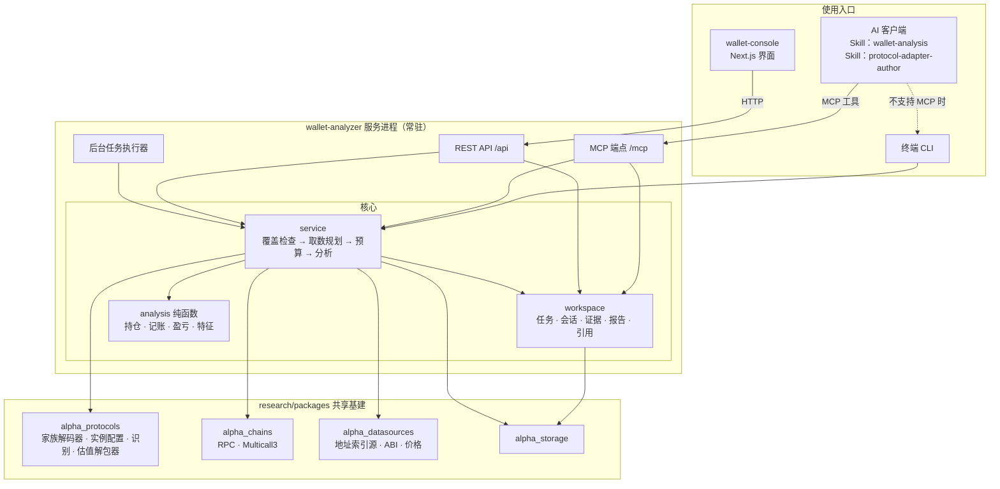
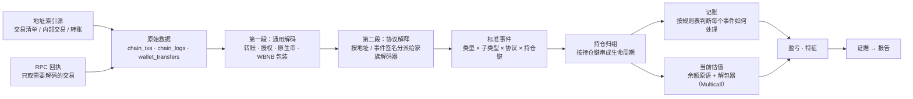
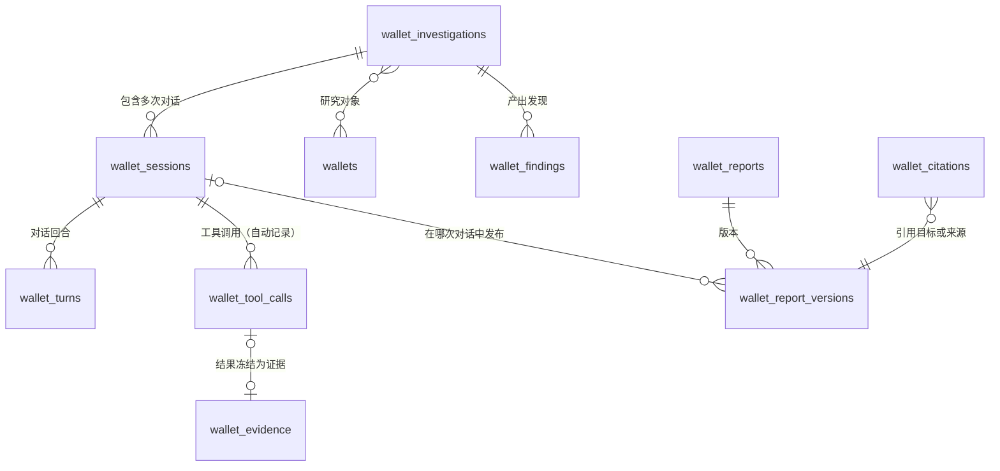
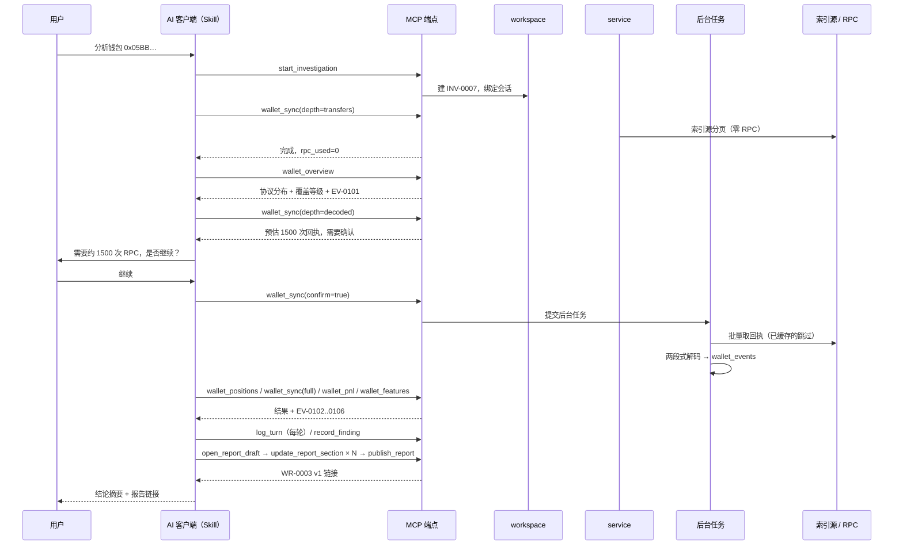
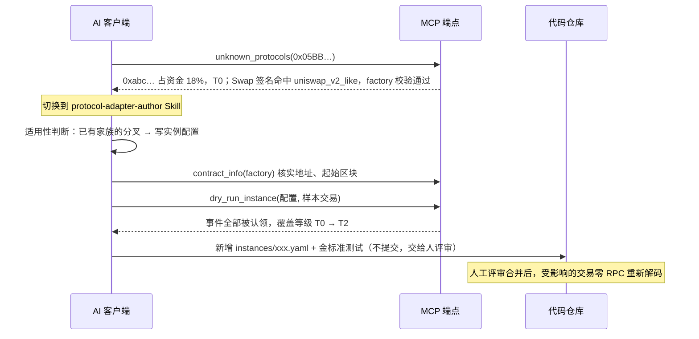
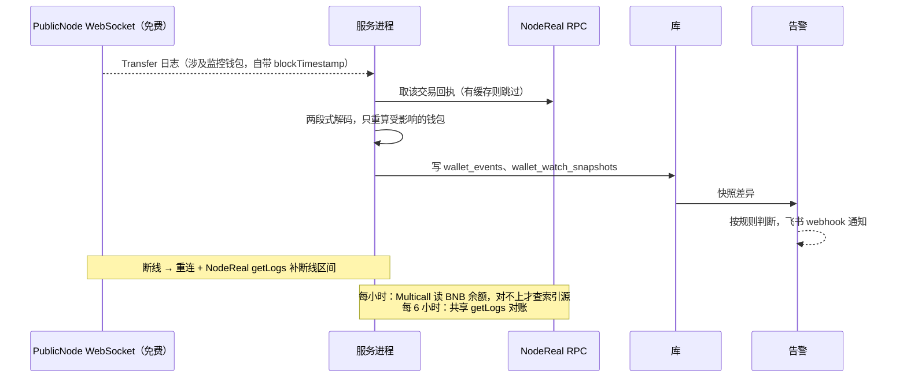
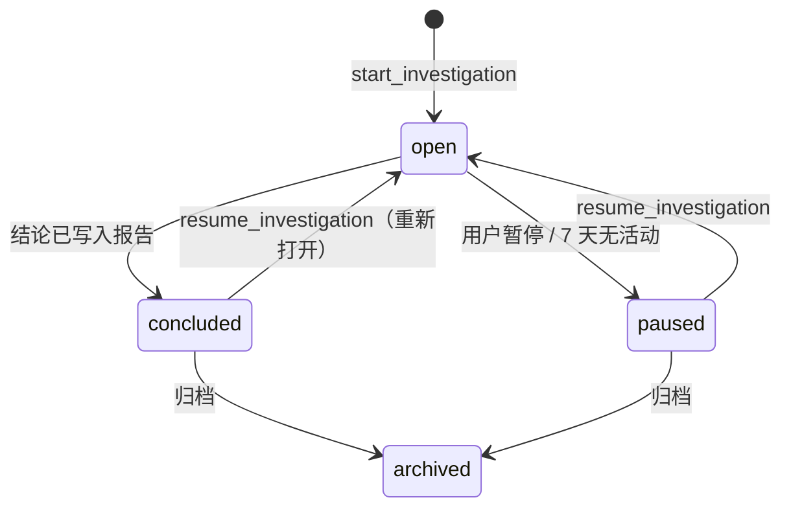
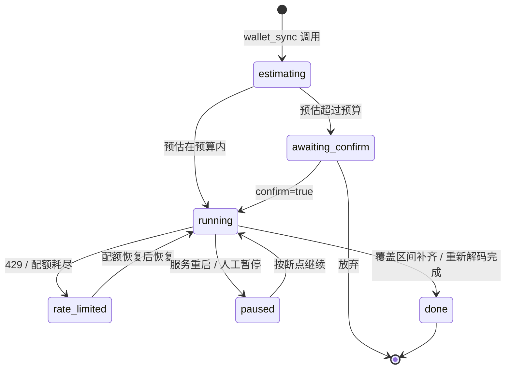
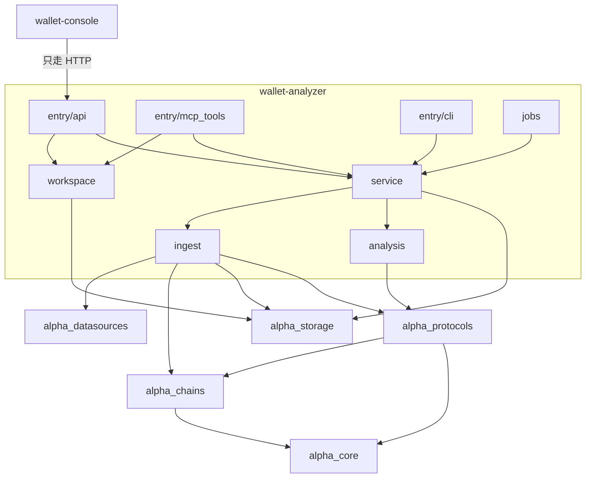
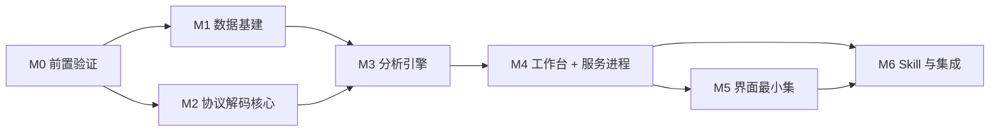

阅读说明：本文档在渲染 Mermaid 图的编辑器（VS Code、GitHub、Obsidian、Typora 等）中查看效果最佳。

> **v2（2026-09）起以本文件为唯一版本，不再与 Notion 同步。** v1（独立常驻分析系统）原文见 git 历史。

# 钱包链上行为分析系统 · 技术设计方案 v2

## 0. 文档定位

起点是一次人工分析：对钱包 `0x05BBf9032F4c829E31A1f1b0B725d77329fAD6be`，依次找地址、拉交易、识别协议、还原头寸生命周期、识别真实转账金额、算投入/盈亏/年化，最后归纳它的调区间逻辑。本方案把这个过程固化成一套系统，由两部分组成：

- **分析能力**：给定任意钱包地址，分析它在**链上所有协议**上的行为：DEX 交易、LP、借贷、质押和挖矿、金库、永续合约、跨链桥、空投，以及和交易所之间的资金往来。要回答五个问题：它和哪些协议交互、具体做了什么、用的什么策略、投入了多少钱、赚了还是亏了多少。
- **调研工作台**：每一次调研或问答都是一个**调研任务**，任务下可以有多次**对话**。过程可以回放、继续和复盘。调研的产出是**报告**：用固定页面展示，版本化，可以反复查看；后续调研可以修订它，也可以像论文那样**引用**它。

v2 相对 v1 的五处根本变化：

1. **形态**：主要使用场景是**偶尔深挖少数几个钱包**。所以对话入口放在 AI 客户端里：AI 通过 MCP 调用系统，按 Skill 给出的方法论工作。系统自带界面，用来浏览调研、阅读报告和做人工修订。长期盯一批钱包的监控能力放在第三阶段。
2. **分工**：算钱、解码、还原头寸这些**确定性计算全部由代码完成**；识别长尾协议、贴策略标签、写报告、**起草新协议的适配配置**这些需要判断的活交给 LLM。
3. **RPC 额度**：v1 默认用 `eth_getLogs` 按区块区间扫描，成本和时间跨度成正比。v2 改成**先用地址索引源拿到交易清单，再按交易哈希取回执**，成本改成和交易数成正比（见第 7、8 章）。
4. **全协议覆盖**：借鉴 rotki、DefiLlama、Dune spellbook、Zerion defi-sdk、llamafolio 等开源项目（见第 14 章），采用四套机制：
   - **协议家族 + 实例配置**：几千个协议大多是二十来个家族的分叉，新增一个分叉只需要加一行配置，不用写代码；
   - **两段式解码 + 统一事件模型**：先做和协议无关的通用解码，再由各协议的解码规则给事件打上语义；
   - **余额原语 + 解包器**：统一的余额读取方式，加上按家族拆解头寸的解包逻辑，用来给当前持仓估值；
   - **覆盖等级**：没有专门适配的协议也能做基础分析，报告里如实写明每个协议覆盖到了什么程度。
5. **过程和成果留存**：调研过程（任务、对话、证据）和成果（报告、版本、引用）都当作一等数据存储。

设计基调不变：**这是分析系统，不是交易系统**。只读不写链，不碰私钥，不追求秒级延迟。

## 1. 需求与目标

### 1.1 要回答的问题（分析能力的验收标准）

对任意一个分析过的钱包，要能给出：

1. **协议交互**：和哪些协议交互过（按类别分：DEX、借贷、质押、金库、永续、跨链桥……），频率和时间分布，**每个协议的覆盖等级**（见 3.3），以及未识别合约的资金占比。
2. **操作还原**：所有操作都统一成标准事件，并按持仓归组，形成各自的生命周期：
   - LP 头寸：开仓区间、加减仓、收手续费、平仓；
   - 借贷：存入、借出、还款、清算，以及健康度变化；
   - 质押和挖矿：质押、解押、领取奖励；
   - 以及交易、跨链、空投领取、和交易所之间的转账。
3. **策略画像**：策略标签，并附上支撑判断的统计特征和理由。标签示例："窄区间高频调仓""循环借贷加杠杆""收益聚合挖矿""撸空投""套利/MEV 机器人""纯持有"。
4. **资金投入**：任意时间窗口内的净投入本金（外部转入减外部转出，美元计价，包含被误判为 dust 的隐藏转账）。
5. **盈亏核算**：已实现盈亏、未实现盈亏（包括负债）、总盈亏、年化收益率，按协议和持仓拆解，以及资金最终流向。

### 1.2 调研工作台要满足的场景

| 场景 | 要求 |
|---|---|
| 发起调研 | 在 AI 客户端里说"分析钱包 0x…"，系统自动建立调研任务，之后的对话和工具调用都归到这个任务下 |
| 历史 | 界面上能按钱包、状态、时间查到所有调研任务和报告 |
| 回溯 | 能看到一次调研里问过什么、AI 调了哪些工具、当时看到的数据是什么、结论基于哪些证据 |
| 继续 | 隔天在任意 AI 客户端（Claude、Cursor、Codex）里说"继续 INV-0007"，AI 能拿到完整上下文接着做 |
| 复盘 | 过一段时间回头检验当初的结论是否成立：当初的数据已冻结可复现，可以拿新数据对照 |
| 报告 | 调研结束产出报告，存进系统，用固定页面展示，可以反复查看 |
| 修订 | 后续对话可以修改报告，每次修改产生一个新版本，并注明改了什么、为什么改 |
| 引用 | 新调研或新报告可以引用旧报告的某个版本、某个章节、某条发现，像论文引用一样。被引用方可以看到反向引用；被引用的版本修订或撤回时，引用方会得到提示 |

### 1.3 系统目标

- **G1 接入零代码**：新钱包只需填地址。
- **G2 协议扩展靠配置**：新增一个已知家族的分叉，只需要加一份实例配置（YAML，走代码评审）；只有新家族才需要写代码，而且只写在协议插件里，不改下游的事件、持仓、记账和报告。
- **G3 资金以真实事件金额为准**：资金计算只用事件日志或索引数据里的真实 `amount`（原始整数精确存储），禁止依赖"原生币数量为 0 就无关紧要"这类展示层判断。这是 v1 人工分析踩过的坑，是硬约束。
- **G4 RPC 额度优先**：每一次 RPC 调用都要能回答"这个数据能不能从缓存、索引源或已有事件推导出来"；不可变数据永不重拉；每次调用都记账；单次任务有预算上限（见第 7 章）。
- **G5 AI 可用且防失控**：MCP 工具返回聚合后的结构化结果，不把原始日志灌给模型；昂贵操作先报预估再执行。
- **G6 平滑扩展到持续监控**：以后加监控能力时，分析逻辑、MCP 工具和表结构都不用改；监控阶段外部请求量不随钱包数线性增长。
- **G7 工具无关**：Skill 和 MCP 不绑定 Claude，其他 AI 也能用；不支持 MCP 的环境走同名 CLI。
- **G8 过程可追溯**：工具调用由服务端自动记录，不依赖 AI 自觉；对话回合由 AI 按 Skill 协议上报。
- **G9 结论可复现**：报告里的每个数字都来自**冻结的证据快照**，不随链上数据变化。
- **G10 报告和引用稳定**：已发布的报告版本不可变；引用钉在具体版本上；报告模板升级后，旧版本仍能正常渲染。
- **G11 覆盖透明**：不认识的协议不瞎猜，按覆盖等级如实降级；报告里写明每一级覆盖的资金占比。
- **G12 解码可重放**：解码过程不发 RPC，只读已存储的原始数据。解码器升级后，全部历史可以零 RPC 重新解码。

### 1.4 非目标

- 不做交易执行，不碰私钥。Research 边界见仓库根 [`AGENTS.md`](../../AGENTS.md)。
- 第一版界面**不内置聊天**：对话入口在外部 AI 客户端。
- 不做多用户权限体系：面向个人或小团队，默认只在本机或内网部署。
- 不做税务口径的会计（rotki 的主要方向），关注的是投资分析口径的持仓盈亏。
- 不追求第一天覆盖全部协议：先保证每个协议都至少有基础覆盖（T0），重点协议逐步做深。
- 不维护链下真实价格源的准确性，只做接入并标注来源和可信度。

## 2. 总体架构

### 2.1 组成



| 组成部分 | 负责 | 不负责 |
|---|---|---|
| **Skill** | 分析方法论、会话协议、对账规则、策略分类表、报告写作规范；起草新协议适配配置的流程 | 任何数值计算 |
| **服务进程** | 一个常驻进程同时提供 MCP 端点、REST API 和后台任务执行，第一阶段就要有 | — |
| **MCP / REST / CLI** | 薄适配层：参数校验和序列化，只调 `workspace` 和 `service` | 业务逻辑 |
| **workspace** | 调研过程和成果：任务、会话、回合、工具调用记录、证据冻结、发现、报告、引用 | 链上数据分析 |
| **service + analysis** | 取数规划、解码编排、持仓归组、记账、估值、盈亏、额度控制 | 策略判断和叙述 |
| **alpha_protocols** | 两段式解码、事件分类表、协议家族解码器、实例配置、协议识别、估值解包器 | 钱包级业务（持仓盈亏等） |
| **wallet-console** | 浏览、阅读、版本对比、过程回放、人工修订 | 直接访问数据库；包含业务计算 |

### 2.2 数据主线



### 2.3 核心设计原则

1. **数据只从库里读**：分析路径只从 `alpha_research` 库读取数据，缺的由取数规划器补齐。上层不关心数据是谁写进去的（G6）。
2. **按交易数付费，不按区块数付费**：先用地址索引源拿到交易清单，再按交易哈希取回执（见 7.1~7.3）。
3. **解码不问链**：解码器是纯函数，只读已存储的回执和日志。需要的链上状态由规划器事先批量读取（G12；这一点是吸取 rotki 在解码时逐条调 `positions()` 的教训）。
4. **先通用、后协议**：第一段把所有资产流动解码出来，保证任何协议下的余额变化都是对的；第二段只是给这些流动打上协议语义。所以协议没适配时只会损失语义，不会把钱算错。
5. **家族写代码，分叉写配置**：协议语义写在家族解码器里（例如 `uniswap_v3_like`），具体协议只是一份地址配置（例如 PancakeSwap V3 在 BSC 上的地址）。
6. **记账规则是数据**：事件怎么记账，按"类型 + 子类型 + 协议"查规则表，只有带状态的协议（借贷利息、清算）才写回调代码。
7. **确定性和判断分离**：影响金额的计算全部在代码里完成并自检；LLM 只消费计算结果。
8. **证据冻结**：每次分析工具调用的结果都冻结成一条证据，报告只引用证据。
9. **过程自动记录，叙述由 AI 补充**：工具调用由服务端自动记录；AI 只上报对话回合。

## 3. 模块设计

### 3.1 数据采集

| 模块 | 位置 | 职责 | 状态 |
|---|---|---|---|
| 链适配器 | `alpha_chains` | 统一的 `get_logs`/`get_block_timestamp`/`call`，多 RPC 故障切换 | 已有；需补 `get_transaction_receipt`、`get_code`、`get_storage_at`（识别代理合约用）、`get_transaction_count`、JSON-RPC 批量、Multicall3 聚合读（`tryAggregate(false)`，允许单个子调用失败，失败要逐个上报，不能静默吞掉） |
| 地址索引源 | `alpha_datasources` | 按地址分页拉取普通交易、内部交易（原生币）、ERC20/721/1155 转账，返回值自带区块时间和 token 元数据 | 新增 `AddressHistorySource` 端口，具体供应商见第 5 章 |
| ABI / 合约元数据源 | `alpha_datasources` | 按优先级依次尝试多个来源（见 3.2 第三层），带负缓存和熔断 | 新增 |
| 价格源 | `alpha_datasources` | 按时间点查 token 美元价格 | 已有 GeckoTerminal/CoinGecko 客户端；需补"指定时间点"查询 |
| 取数规划器 | `wallet_analyzer.ingest` | 对缺失的数据选出最省的取数路径，预估消耗，执行，并写入覆盖区间；解码前把家族解码器声明需要的链上状态批量读好 | 新增，见 7.3 |

### 3.2 协议识别与协议注册表

**协议注册表分两层**（借鉴 DefiLlama `registries/` 和 Dune spellbook 的分叉宏）：

- **协议家族**：写代码，放在 `alpha_protocols/families/`。一个家族定义一类协议的共同语义：它有哪些合约角色（factory、pool、router、position_manager、comptroller、vToken、vault……）、事件签名、怎么解码、怎么估值、需要事先读哪些链上状态。
- **协议实例**：只是配置，放在 `alpha_protocols/instances/*.yaml`，走代码评审，启动时同步进 `protocol_instances` 表供查询。一个实例写明：属于哪个家族、协议名、版本、链、各角色的合约地址、起始区块、家族选项（例如 Algebra 分叉的 Swap 事件签名不同）。配置有类型化的 schema 校验（pydantic），不照搬 DefiLlama 那种松散的 JS 配置和魔法字段。

DefiLlama 里约一半的协议条目是"模板 + 纯配置"，剩下的也有 85% 复用了公共 helper；它的 `forkedFromIds` 数据显示分叉高度集中（Uniswap V2 系 767 个、V3 系 244 个、Compound V2 系 148 个、Solidly 106 个、Aave V3/V2 共约 100 个、Algebra 48 个……）。所以**第一批家族覆盖好，就能覆盖大部分长尾**；剩下约 15% 的定制协议确实需要单独写家族代码。

**识别一个地址属于哪个协议**，分四层逐级兜底，越靠前越便宜，结果都永久缓存到 `contract_registry`：

**第一层：工厂发现（零 RPC）。** 家族定义了"怎么从 factory 展开出所有子合约"：
- V3 系：`pool_candidates` 表已经存有 PancakeSwap V3 Factory 的全量扫描结果，由 `chain_cursors` 增量推进；给定 `token0/token1/fee`，还可以用 CREATE2 公式在本地算出池子地址。
- 其他家族：按同样的方式增量扫描自己的注册事件（V2 的 `PairCreated`、Compound 系的 `MarketListed`……），缓存采用追加式：只拉 `toBlock` 之后的增量，按 `(tx_hash, log_index)` 去重（借鉴 DefiLlama 的 `getLogs` 缓存）。
- **只扫描分析过的钱包实际接触过的家族**，不预先把所有家族的 factory 都扫一遍。

**第二层：签名匹配 + 工厂校验（发现未登记的分叉）。** 这一层借鉴 Dune spellbook 的分叉发现：
1. 日志的 `topic0` 命中某个家族的特征事件签名（例如 V2 的 Swap 签名），说明这个合约**可能**是该家族的分叉；
2. 用一次 Multicall 读它的 `factory()`、`token0()`、`token1()`；
3. 用字节码指纹或已登记实例，确认这个 factory 确实属于该家族。

校验通过的，登记为"某家族的未命名分叉"（`kind=pool, family=uniswap_v2_like, instance=null`）：**立刻可以按家族语义解码**，协议名留给 AI 或人工补。字节码指纹也放在这一层：同一家族部署的合约 code hash 相同，每个地址最多查一次 `eth_getCode`，批量执行，永久缓存；代码为空说明是 EOA。

**第三层：ABI 和元数据（零 RPC 为主）。** 借鉴 loop-decoder 的做法：
- **按优先级依次尝试多个来源**：先试按地址查的来源（区块浏览器、Sourcify），再试按签名片段查的来源（4byte、openchain）；
- **负缓存**：每次查询结果记为 `success`、`not_found` 或 `invalid`，带来源和重试时间，查不到的不会反复查；
- 每个来源有限流、超时、重试和熔断；同一地址的并发请求合并成一次；
- **代理合约**：先用字节码判断代理类型（EIP-1167、EIP-1967、Safe 等），再只读对应的那一个存储槽拿到实现合约地址，不盲目尝试。

**第四层：LLM 判断 + 未知如实标注。**
- 前三层都没命中的地址，由 `contract_info` 工具把 ABI 摘要、源码片段、交互模式、涉及金额交给 LLM 判断，结果通过 `label_contract` 写回（`source=llm`，状态为待复核）。
- 如果 LLM 判断出它属于某个已有家族，就按 `protocol-adapter-author` Skill 起草实例配置（见 3.7）。
- 判断不了的，报告里如实写"未知"并给出资金占比。
- 界面上有待复核队列，按"频次 × 金额"排序。

**种子数据和许可证**：
- 家族的特征签名和各协议的合约地址都是链上事实，由我们自己收集和核实。
- DefiLlama 的代码没有许可证，数据接口的条款限制商业使用，所以它的协议列表和 `forkedFromIds` **只作为选型参考**，不批量导入。
- 交易所地址标签自己整理维护，格式参考 spellbook `labels` 的 schema。

保留一条语义约束：同名事件在不同协议里含义不同，所以解码必须先确定合约所属的家族，不能只按事件名匹配。

### 3.3 两段式解码与标准事件（`alpha_protocols.decoding`，纯函数）

**第一段：通用解码（和协议无关）。**

输入：一笔交易的回执日志 + 索引源给的内部交易 + 交易本身（`from`、`to`、`value`、方法选择器、gas）。输出：`DecodedTx`，其中包括：
- 全部资产流动：ERC20/721/1155 转账、原生币转账、内部调用转账；
- **WBNB 的 `Deposit`/`Withdrawal` 也算资产流动**（loop-decoder 没把它当资产流动，导致解释层要打补丁）；
- 授权（approve）、gas 费。

这一段对任何协议都成立：**即使一个协议完全不认识，钱包的余额变化也是对的**。

**第二段：协议解释。** 分派顺序借鉴 rotki，并吸取 loop-decoder "一笔交易只能用一个解释器"的教训，改成按日志逐条分派：

1. **按日志发出合约的地址**，查 `contract_registry` 找到家族，交给对应的家族解码器（最精确，也最便宜）；
2. **按"方法选择器 + topic0"**，用于路由器、聚合器这类只能从调用方法判断语义的情况；
3. **按 topic0 的通用规则**：数量尽量少，因为每条日志都要跑一遍；
4. 都没命中：保留第一段的通用转账事件，协议记为空。

家族解码器可以"认领"第一段产生的转账：比如把"钱包转 USDT 给 vUSDT 合约"改标为"借贷存入"。这借鉴 rotki 的 ActionItem 机制，但我们简化成按 `log_index` 显式关联，不做隐式的顺序调整。整笔交易解码完之后，再按协议跑一次整合规则：把 Multicall 里打包的 decrease + collect + unwrap 合成一个操作；把一串连续的买入和卖出合并成一次多跳 swap。

**钱包视角是显式参数**：rotki 只从"被追踪的钱包"视角生成事件。我们要分析任意钱包、追踪资金去向，所以解码时显式传入 `subject_wallet`，同一笔交易可以从不同钱包的视角各解码一次。

**标准事件**（借鉴 rotki 的事件模型，加上我们需要的持仓键）：

| 字段 | 含义 |
|---|---|
| `chain`、`tx_hash`、`seq` | 定位；`seq` 是交易内的事件序号 |
| `subject_wallet` | 从哪个钱包的视角 |
| `event_type` | 约 15 种：trade、deposit、withdrawal、borrow、repay、stake、unstake、claim、transfer、spend、receive、bridge、mint、burn、fee、informational |
| `event_subtype` | 细分：deposit_asset、remove_asset、receive_wrapped、return_wrapped、generate_debt、payback_debt、liquidate、reward、interest、lp_fee、airdrop、spam、none…… |
| `family`、`protocol` | 协议家族和实例；未识别时为空 |
| `asset`、`amount_raw`、`direction` | 资产、原始整数数量、方向（in / out / neutral） |
| `counterparty_address` | 对手方地址 |
| `position_key` | **持仓键**，例如 `pcs-v3:nft:123456`、`venus:supply:vUSDT`、`venus:borrow:USDT`、`pcs-farm:pid:12`。rotki 没有这个字段，我们靠它把事件串成持仓 |
| `extra` | 家族特有字段，例如 tick 区间、健康度 |
| `decoder_version` | 用哪个版本的解码器生成的 |

`event_type × event_subtype` 的合法组合、方向和类别登记在一张分类表里（借鉴 rotki 的 `EVENT_CATEGORY_MAPPINGS`），不合法的组合在测试里直接失败。

**覆盖等级**（每个协议、每笔资金都会落在某一级上）：

| 等级 | 含义 | 需要什么 |
|---|---|---|
| **T0 通用** | 资产流动正确，但不知道是什么协议 | 无，所有合约都有 |
| **T1 已识别** | 知道是哪个协议、哪个家族 | `contract_registry` 有记录 |
| **T2 已解码** | 事件有协议语义（存入、借出、领奖励……），有持仓键 | 家族解码器 |
| **T3 可估值** | 有完整的持仓生命周期，也能给当前持仓估值 | 家族估值解包器 |

**人工修正可以保留**：人工或 LLM 修正过的事件，存为按 `(chain, tx_hash, seq, subject_wallet)` 定位的覆盖记录。重新解码后自动重新应用；如果对应的原事件已经变了，就标记冲突，交给人处理（借鉴 rotki 在重新解码时保留用户修改的做法）。

**重新解码**：标准事件会物化到 `wallet_events` 表，并记录 `decoder_version`。家族解码器升级后，受影响的交易会从已存储的原始日志重新解码，**零 RPC**。

### 3.4 持仓、记账与估值（`wallet_analyzer.analysis`，纯函数）

**持仓归组**：按 `position_key` 把事件串成持仓生命周期。持仓类型：

| 持仓类型 | 例子 | 生命周期要点 |
|---|---|---|
| `concentrated_lp` | V3 NFT 头寸 | tick 区间、流动性增减、手续费领取 |
| `fungible_lp` | V2 LP token、Curve 池 | LP token 数量、底层份额 |
| `lending_supply` | Venus vToken、Aave aToken | 存入本金、利息累计 |
| `lending_debt` | Venus 借款、Aave 债务 | **负资产**，利息累计，清算事件 |
| `stake_farm` | MasterChef、CAKE 质押 | 质押数量、奖励领取 |
| `vault` | ERC-4626 金库 | 份额、兑换率 |
| `perp` | 永续合约 | 保证金、开平仓、资金费（后续家族） |
| `vesting_lock` | 锁仓、线性释放 | 锁定期、已释放数量 |
| `bridge_transit` | 跨链在途资金 | 源链转出，等待目标链到账 |

**记账**（借鉴 rotki "规则是数据"的设计，但以持仓盈亏为目标，而不是税务口径的批次成本）：

规则表按 `(event_type, event_subtype, family)` 查找，找不到时退回到 `(event_type, event_subtype)`。每条规则给出一种处理方式：

| 处理方式 | 含义 | 例子 |
|---|---|---|
| `external_flow` | 外部资金进出，计入净投入 | 从交易所转入、转出到交易所 |
| `position_in` / `position_out` | 钱包和自己的持仓之间挪动资产，成本随之转移 | LP 开仓、借贷存入、质押 |
| `swap` | 一种资产换成另一种 | DEX 交易 |
| `income` | 收益 | LP 手续费、借贷利息收入、挖矿奖励、空投 |
| `expense` | 支出 | gas、协议手续费、借款利息 |
| `debt_open` / `debt_close` | 负债的产生和偿还 | 借款、还款 |
| `loss` | 损失 | 被清算的罚金 |
| `ignore` | 不计入 | spam、纯授权 |

规则表放在代码仓库里（YAML），和家族一起版本化；**只有带状态的家族**（借贷的利息计提、清算）才写回调代码。

**核心公式**：

```text
净投入(窗口)     = Σ external_flow 转入_usd − Σ external_flow 转出_usd
当前权益         = 钱包余额价值 + Σ 资产类持仓价值 − Σ 负债类持仓价值 + Σ 未领收益
总盈亏           = 当前权益 − 净投入(全历史)
单持仓盈亏       = Σ position_out 价值(当时价) + Σ income(当时价) − Σ position_in 价值(当时价) − Σ expense
                  （负债持仓：− Σ 借入价值 + Σ 偿还价值 − 利息 − 清算罚金）
gas             = Σ gasUsed × effectiveGasPrice × BNB 当时价
时间加权本金     = ∫ 权益(t) dt / T
年化             = 总盈亏 / 时间加权本金 × 365 / T天        # 线性外推，不做复利外推
```

**对账自检（强制）**：`Σ 各持仓盈亏 + 交易盈亏 + 持有价格变动 − 未归属的 gas` 必须和 `总盈亏` 在容差范围内（默认 1% 或 10 美元，取大者）一致。不一致时写 `reconciled=false` 并列出差额来源候选；报告页面显示对账状态，未对平的报告不能标记为"已对账"。T0 覆盖的资金只进入"持有价格变动"和"外部流动"，不会被错误地当成某个持仓的盈亏。

**当前估值：余额原语 + 解包器**（借鉴 DefiLlama 的 `sumTokens2`、Zerion defi-sdk 的成分拆解和 llamafolio 的持仓分类）：

1. **按事件发现要查什么**（借鉴 rotki 和 llamafolio）：只查这个钱包在事件里实际接触过的持仓和 token，不扫描所有协议、所有 token。钱包从没碰过的家族，一个调用都不发。
2. **余额原语**：把 `(token, owner)` 对去重后，用 Multicall3 批量读 `balanceOf`。每批的大小可以自适应：出现 gas 超限或返回过大时减半重试（rotki 实测每批约 460 个、DefiLlama 默认约 500 个）。
3. **解包器**：按家族拆解持仓，递归展开，直到得到基础 token：
   - V2 LP token → 按份额拆成两个底层 token；
   - V3 NFT → 用 tick 公式精确计算底层数量，并加上 `tokensOwed` 和未领手续费。DefiLlama 在这里用浮点数、也没算未领手续费，对总锁仓量无所谓，对钱包估值不行；
   - ERC-4626 份额 → `convertToAssets`；
   - vToken / aToken → 存款余额；
   - 债务 → 以负数计入。

   每个家族**声明**自己需要读哪些状态，由规划器合并成尽量少的 Multicall。
4. **计量和定价分离**（借鉴 DefiLlama）：
   - 解包器只输出"链 + token → 原始数量"，由统一的定价器计价；
   - 定价器维护一份可信基础资产清单；长尾 token 只通过和基础资产组成的池子推导价格；
   - 定价器维护骗局 token 和被黑 token 的黑名单；
   - 每个价格都带来源和可信度，可信度过低的价格不参与汇总，并在报告中列出。
5. **价格取值顺序**：稳定币按 1 → 同一笔交易里的 swap 隐含价格 → GeckoTerminal 历史 K 线 → CoinGecko。链上合成资产同时记录链上池子价格和链下参考价格。
6. **可选：第三方持仓 API**（例如 Zerion、DeBank 类），它们覆盖几千个协议，不消耗我们的 RPC。只用来对 T0/T1 覆盖的协议做估值参考，以及交叉校验我们自己的估值；结果标注来源，不作为主口径。

### 3.5 策略画像

1. `analysis.features` 按类别计算**可解释特征**：
   - LP：区间宽度分布、持仓时长、调仓频率、在区间内的时间占比、手续费和 gas 之比；
   - 借贷：杠杆倍数、健康度分布、循环借贷次数、清算次数；
   - 挖矿：换农场的频率、领取奖励后是卖出还是复投；
   - 交易：交易频率、同区块多次交易、夹子交易特征；
   - 资金：交易所往来、跨链频率、资金归集模式、活跃时段分布。
2. Skill 的 `references/strategy-taxonomy.md` 给出分类表：每个标签对应哪些特征、各特征的典型取值。
3. LLM 对照分类表给出标签和理由，写进报告的"策略画像"章节，并引用特征证据。

规则引擎保留，用于少数语义明确的硬标签；硬标签和 LLM 标签冲突时，在报告里标出来。样本积累到几十个钱包后，再评估是否加入聚类。

### 3.6 MCP 工具

**传输方式**：以服务进程托管的 Streamable HTTP（`/mcp`）为主，stdio 作为兜底。

**通用约定**：每个分析工具的结果都附带 `evidence_id`、`as_of_block`、`coverage`（数据完整度加各覆盖等级的资金占比）和 `rpc_used`；工具调用由服务端自动记录到当前会话。

**分析工具**（同名 CLI 子命令，例如 `uv run wallet-analyzer positions <addr> --json`）：

| 工具 | 作用 | 是否可能触发 RPC | 对应问题 |
|---|---|---|---|
| `wallet_sync(chain, address, depth, max_cu?, confirm?)` | 补齐数据。`depth` 取值：`transfers`（只用索引源，零 RPC）、`decoded`（加需要解码的交易的回执）、`full`（加当前估值）。**先返回预估消耗**，超过预算需要确认；确认后作为后台任务运行 | 是 | — |
| `sync_status(job_id)` | 后台任务进度 | 否 | — |
| `wallet_overview(address)` | 活跃时间跨度、交易数、按类别和协议分组的交互、覆盖等级分布、未识别资金占比 | 否 | 1 |
| `wallet_activity(address, protocol?, event_type?, window?)` | 分页返回标准事件 | 否 | 2 |
| `wallet_transfers(address, window?, kind?, min_usd?)` | 分页返回带分类的资金流 | 否 | 4 |
| `wallet_positions(address, kind?, status?)` | 各类持仓的生命周期（LP、借贷、质押……） | 否 | 2 |
| `wallet_pnl(address, window?, group_by?)` | 净投入、已实现/未实现盈亏、年化、对账结果，可以按协议或持仓拆解 | 当前状态缓存过期时刷新，Multicall | 5 |
| `wallet_features(address)` | 策略特征向量和含义 | 否 | 3 |
| `trace_funds(address, token?, depth, min_usd)` | 资金去向链路 | 只用索引源 | 5 |
| `contract_info(address)` | 识别结果、所在层级、签名匹配情况；识别不了时附 ABI、源码摘要、交互统计 | 最多 1 次 `get_code` | 1 |
| `unknown_protocols(address?)` | 按资金量排序的未识别或仅 T0/T1 覆盖的合约，附可能的家族（签名匹配结果） | 否 | 1 |
| `dry_run_instance(config_yaml, tx_hashes[])` | 用一份**未提交**的实例配置，对给定交易试解码，返回标准事件和覆盖等级变化；不写库 | 否（只读已存储回执） | — |
| `label_contract(address, protocol, kind, rationale)` | 写回 LLM 的识别结论，状态为待复核 | 否 | 1 |
| `decode_tx(tx_hash, subject?)` | 单笔交易的两段解码明细 | 最多 1 次回执（有缓存） | 2 |
| `rpc_usage(period?)` | 额度账本 | 否 | — |

**工作台工具**：

| 工具 | 作用 |
|---|---|
| `start_investigation(title, goal, wallets[])` | 新建调研任务，绑定当前会话，返回 `INV-xxxx` 和界面链接 |
| `resume_investigation(code)` | 继续一个任务，返回**上下文包**（见 3.9） |
| `list_investigations(wallet?, status?)` | 查历史调研 |
| `update_investigation(code, status?, summary?, open_questions?)` | 更新状态、阶段性总结、待解决问题 |
| `log_turn(user_message, answer_md)` | 上报一个对话回合 |
| `record_finding(statement_md, confidence, citations)` | 记录一条发现，必须引用证据或报告 |
| `search_reports(wallet?, tag?, query?)` | 查已有报告 |
| `get_report(ref, sections?)` | 读取报告的指定版本和章节，`ref` 形如 `WR-0003@v2` |
| `open_report_draft(report?, subject_wallet?)` | 为已有报告或新报告开草稿 |
| `update_report_section(draft, section, blocks, expected_revision)` | 修改草稿章节，乐观锁 |
| `publish_report(draft, change_note)` | 校验后发布为新的不可变版本 |

### 3.7 Skill

两份 Skill，正本都跟随所属模块放在项目目录里，各 AI 工具通过软链或 `AGENTS.md` 索引找到（见 10.3）。内容只引用 MCP 工具名和 CLI 命令，不写 Claude 专属的内容。

**`wallet-analysis`**（`research/apps/wallet-analyzer/skills/wallet-analysis/`）：

1. **会话协议**：
   - 开始时：新钱包调用 `start_investigation`；说"继续 INV-xxxx"时调用 `resume_investigation`，先读上下文包；
   - 每轮对话后：调用 `log_turn`；
   - 得出结论时：调用 `record_finding`；
   - 结束前：调用 `update_investigation`。
2. **分层深挖流程**：`wallet_sync(depth=transfers)` → `wallet_overview` → 按需 `wallet_sync(depth=decoded)` → `wallet_activity` / `wallet_positions` → `wallet_sync(depth=full)` → `wallet_pnl` → `wallet_features`。**能在浅层回答的问题，不往深层走。**
3. **覆盖规则**：先看 `coverage`。T0/T1 资金占比高时，先说明结论的局限；资金占比大的未知协议，考虑转入 `protocol-adapter-author` 流程。
4. **额度规则**：预估超过阈值时，先告诉用户，得到同意后才执行。
5. **数字规则**：金额必须原样引用工具结果并标注证据编号；对账失败时停下来报告。
6. **结论规则**：因果判断必须有证据支撑。
7. **引用规则**：引用旧报告时钉住版本；推翻旧结论时使用 `contradicts` 关系；修订报告时写清楚改动说明。
8. **报告规则**：按固定模板写（见 3.10）；数据区块只能引用证据；发布后把界面链接给用户。
9. 参考资料：`references/strategy-taxonomy.md`（策略分类表）、`references/report-writing.md`（报告写作规范）。

**`protocol-adapter-author`**（`research/packages/protocols/skills/protocol-adapter-author/`）：结构基本照搬 DefiLlama 仓库里的 `skills/adapter-author`，用来让 AI 起草新协议适配：

1. **适用性判断**：这个协议是已有家族的分叉（写实例配置），还是需要新家族（写代码，要求更严），还是根本不值得适配（资金量太小、已经停运）。
2. **一次只问一个问题**：先读仓库，再问用户；每个问题附上建议答案。
3. **模式对照表** `references/family-patterns.md`：协议长什么样 → 用哪个家族 → 要看哪些文件 → 常见错误。
4. **动手前写出理解检查点**：目标文件、家族、各角色的地址及来源、起始区块、要用哪些交易做测试、验证命令。
5. **验证**：
   - 先用 `dry_run_instance` 对真实交易试解码；
   - 再生成金标准测试样本：真实交易哈希加已存储的回执，断言**完整的标准事件列表**（借鉴 rotki 的测试方式）；
   - 最后运行指定的测试命令。
6. **解读结果**：覆盖等级有没有提升；有没有转账没被认领；资金流是否守恒。
7. **什么时候必须停下来问人**：地址来源不确定、事件语义有歧义、涉及记账规则变更。
8. **禁止事项**：不新增依赖；不用"允许失败"来掩盖错误；不自行合并或推送；地址必须能在链上核实，不能编造。
9. **测试证明不了什么**：测试只覆盖了样本交易，其他交易路径可能不同；估值正确还需要对照链上余额。

### 3.8 服务进程（`wallet-analyzer serve`）

第一阶段就常驻运行，承载：

| 组件 | 阶段 | 职责 |
|---|---|---|
| REST API | 一 | 给界面用 |
| MCP 端点 | 一 | 给 AI 客户端用 |
| 后台任务执行器 | 一 | 运行回填、重新解码任务；受额度闸门约束；遇到 429 立即暂停并保存断点 |
| 事件检测 | 三 | 走**免费的 PublicNode WebSocket**（`wss://bsc.publicnode.com`，实测见第 5 章），不消耗 NodeReal 额度。订阅两组 ERC20/ERC721 `Transfer`：topic1（转出方）和 topic2（接收方）分别放全部监控钱包组成的 OR 数组，不限定 token 合约。两个订阅覆盖全部钱包 |
| 断线补漏 | 三 | WebSocket 断开后自动重连，并用 NodeReal `eth_getLogs` 只补断线期间的区间。连续失败超过阈值时，切换到 NodeReal 的 WebSocket（按字节计费，只作为备用） |
| 原生币补漏 | 三 | 原生 BNB 转账**不产生日志**，WebSocket 抓不到。每小时用一次 Multicall3 `getEthBalance` 批量读取全部监控钱包的 BNB 余额，和"已知交易推算出的余额"比对；**只有对不上的钱包**才去查地址索引源 |
| 对账扫描 | 三 | 每 6 小时一次 NodeReal 共享 `eth_getLogs`，topic 用全部监控钱包地址组成 OR 数组，兜住免费端点漏推的事件。成本只和区块数有关，和钱包数无关 |
| 告警 | 三 | 比较监控快照差异，按规则通过飞书/IM webhook 通知 |

默认只监听 `127.0.0.1`；部署到内网时，MCP 和 API 需要 Bearer Token。服务重启后，未完成的任务按断点继续。stdio 模式的 MCP 进程和服务进程可能同时写库，靠幂等写入和按钱包加的 PostgreSQL advisory lock 保证一致。

**监控为什么这样设计**：NodeReal 的 WebSocket 按推送字节计费（0.04 CU/字节），实测一条转账日志约 753 字节，约 30 CU。50 个钱包每天约 9 万 CU，比轮询还贵。免费端点没有 SLA，所以靠"断线补漏 + 定期对账 + 余额对账"三层兜底，保证正确性不依赖它。

**隐私**：订阅参数里就是被监控的钱包地址，免费端点的运营方能看到监控名单。敏感钱包在 `wallets` 上标记，走 NodeReal 的付费端点。

### 3.9 调研工作台：任务、会话、证据、发现



**概念**：

| 概念 | 编号 | 含义 |
|---|---|---|
| 调研任务 | `INV-0007` | 一个研究问题，可以跨越多次对话、持续多天 |
| 会话 | 内部 ID | 一次 AI 对话（一次 MCP 连接），记录客户端类型、起止时间、总结 |
| 回合 | 会话内序号 | 一问一答，由 AI 通过 `log_turn` 上报 |
| 工具调用 | 内部 ID | 服务端自动记录：工具名、参数、结果摘要、耗时、RPC 消耗、关联证据 |
| 证据 | `EV-0107` | 冻结的工具结果：完整数据、区块高度、内容哈希、解码器版本。不可变，相同内容去重 |
| 发现 | `F-0042` | 一条原子结论，带置信度，必须引用证据或报告。状态：提出、确认、推翻 |

**会话绑定**：HTTP MCP 用 `Mcp-Session-Id` 标识连接。`start_investigation` 或 `resume_investigation` 会把连接绑定到我们的会话记录，之后的工具调用自动归档。AI 没开任务就直接调用分析工具时，服务端自动建一个"未归档会话"，照样记录；用户可以在界面上把它挂到某个任务下。

**上下文包**（`resume_investigation` 的返回值）：

- 任务目标、状态、研究对象钱包；
- 最近一次总结和待解决问题；
- 已确认和待确认的发现（带证据编号）；
- 关联报告的最新版本摘要，以及当前是否有草稿；
- 最近 N 个回合的摘要；
- 数据新鲜度：证据截止区块对比当前区块、解码器版本是否已经升级、覆盖等级是否有变化（例如新增了家族适配，之前 T0 的资金现在可以做到 T2）。

**对话完整度的边界**：MCP 服务端看不到 AI 客户端里的完整聊天记录，只能拿到工具调用（自动记录）和 AI 上报的回合。界面会标出"有工具调用但没有回合记录"的会话；也可以选择用 CLI 导入客户端的原始聊天记录作为会话附件。

### 3.10 报告与引用

**报告结构**：一份报告有一个编号（`WR-0003`），对应一个主研究钱包（可以附带关联钱包），有若干**已发布版本**（不可变）和**至多一份草稿**。

**固定模板 `wallet_profile`**：

| 章节 key | 章节 | 典型区块 |
|---|---|---|
| `summary` | 摘要 | 核心结论文字、策略标签、关键指标卡片 |
| `protocols` | 协议交互 | 按类别和协议分组的交互表、**覆盖等级分布**、未识别资金占比 |
| `activity` | 操作还原 | 标准事件时间线、按类别统计 |
| `positions` | 持仓 | 按持仓类型分组：LP 头寸表和区间时间线、借贷持仓和健康度曲线、质押和挖矿表…… |
| `strategy` | 策略画像 | 特征表、标签及理由、硬标签冲突说明 |
| `capital` | 资金投入 | 资金流图、按月净投入、交易所往来 |
| `pnl` | 盈亏核算 | 按协议和持仓拆解的盈亏、对账结果、年化 |
| `fund_flow` | 资金去向 | 资金去向链路图 |
| `conclusion` | 结论与置信度 | 数据覆盖率、覆盖等级、对账状态、待解决问题、和其他报告的关系 |
| `appendix` | 引用与证据 | 自动生成：引用的报告、发现、证据；解码器版本；本次消耗的额度 |

**区块类型**：

- `text`：Markdown 文字，可以包含引用标记；
- 数据区块：`metric_grid`、`coverage_breakdown`、`activity_timeline`、`protocol_table`、`lp_positions_table`、`lp_range_timeline`、`lending_positions_table`、`health_factor_chart`、`stake_positions_table`、`cashflow_chart`、`pnl_breakdown`、`fund_flow_graph`、`feature_table`。**数据区块只存"证据编号 + 展示参数"，不存数字本身**，界面从冻结的证据渲染；
- `callout`：提示、警告。

**持仓章节按持仓类型渲染**：一种持仓类型对应一组区块。新增一个家族时，只要它的持仓归入已有的持仓类型，报告就不用改；出现全新的持仓类型时，才需要新增区块类型。

每个区块有一个跨版本不变的 `block_id`，引用可以精确到区块，版本对比也按区块对齐。每个版本记录 `template_version`，证据记录 `payload_schema_version`，渲染器保留对旧版本的支持（G10）。

**编辑和发布**：

1. `open_report_draft`：以最新发布版本为基础建草稿。
2. `update_report_section`：按章节修改，带乐观锁。AI 和人工修改的是同一份草稿，冲突时拒绝写入并返回最新内容。
3. `publish_report`，发布前校验：
   - 必需章节齐全；
   - 数据区块引用的证据都存在；
   - 引用标记都能解析；
   - 必须填写改动说明。
   校验通过后生成不可变版本，并重建引用索引。
4. **撤回**：严重错误的版本可以标记为撤回并写明原因。不删除，页面显示红色横幅，引用方显示警告。

**引用**：

- **标记语法**：`[[WR-0003@v2#pnl]]`（报告某版本的某章节）、`[[WR-0003@v2#pnl/b7]]`（精确到区块）、`[[F-0042]]`（发现）、`[[EV-0107]]`（证据）；可以附加关系：`[[WR-0003@v2#strategy|contradicts]]`。
- **关系类型**：`references`（默认）、`supports`、`extends`、`contradicts`、`revises`、`reviews`（复盘）、`uses_data`。
- **钉住版本**：只能引用已发布版本，不能引用草稿。
- **引用索引**：标记是唯一真相；保存时解析标记，重建 `wallet_citations`。
- **界面提示**：
  - 被引用版本已有更新版本时，显示"引用的是 v2，当前最新为 v4"；
  - 被引用版本已撤回时，显示警告；
  - 引用关系为 `contradicts` 时，被引用报告上显示"有后续报告对此提出反驳"。

**复盘**：复盘是一次新的调研任务，它的报告用 `reviews` 关系引用被复盘的版本。被复盘的报告页面上显示"后续复盘"列表。

### 3.11 界面（`research/apps/wallet-console`）

Next.js 应用，只通过 REST API 读写，TypeScript 类型由 FastAPI 的 OpenAPI 描述自动生成。图表库沿用 alpha-lp web 的选型（echarts、lightweight-charts），但**不引用 alpha-lp 的任何包**。

| 页面 | 路由 | 内容 |
|---|---|---|
| 首页 | `/` | 进行中的调研、最近的报告、未归档会话、额度使用、待复核合约数 |
| 调研列表 | `/investigations` | 按状态、钱包、时间筛选 |
| 调研详情 | `/investigations/[code]` | 目标、状态、研究对象、总结和待解决问题；**时间线**（会话 → 回合 → 工具调用 → 证据 → 报告版本）；发现列表；"继续研究"按钮 |
| 会话回放 | `/investigations/[code]/sessions/[id]` | 回合和工具调用按时间交错展示 |
| 报告列表 | `/reports` | 按钱包、策略标签、协议、状态搜索 |
| **报告页（固定页面）** | `/reports/[code]`、`/reports/[code]/v/[n]` | 页头：编号、版本、数据截止区块、覆盖率、覆盖等级、对账状态、策略标签；左侧章节目录；正文按模板渲染；引用标记悬浮预览；右栏"引用了 / 被引用"；页脚：证据附录、版本历史 |
| 版本对比 | `/reports/[code]/diff?from=2&to=4` | 按 `block_id` 对齐逐区块对比 |
| 草稿编辑 | `/reports/[code]/draft` | 人工修改文字区块和区块顺序；数据区块只能改展示参数或替换证据 |
| 钱包主页 | `/wallets/[chain]/[address]` | 相关调研、报告，最新关键指标 |
| 证据详情 | `/evidence/[code]` | 原始数据、来源、被哪些报告引用 |
| 交易解码查看 | `/tx/[chain]/[hash]` | 两段解码结果对照：通用转账 → 协议事件；人工修正入口 |
| 协议覆盖 | `/protocols` | 已登记的家族和实例、各自的覆盖等级、分析过的钱包里未识别合约的排行（按资金量） |
| 合约识别复核 | `/contracts/review` | LLM 识别的待复核队列 |

## 4. 关键流程

### 4.1 发起一次调研并产出报告



### 4.2 隔天继续

1. 用户在任意 AI 客户端里说"继续调研 INV-0007"（可以从界面复制这句话）。
2. AI 调用 `resume_investigation`，拿到上下文包。
3. 如果数据落后，先 `wallet_sync(depth=transfers)`：只拉新区间，RPC 成本 ≈ 新增需要解码的交易数 + 2。
4. 继续分析，修改报告后发布 v2，写明改动说明。

### 4.3 遇到未适配的协议：由 AI 起草实例配置



### 4.4 新调研引用旧报告

1. 分析钱包 B 时，AI 调用 `search_reports(tag=循环借贷)`，找到 `WR-0003`。
2. AI 调用 `get_report("WR-0003@v2", sections=["strategy"])` 阅读相关章节。
3. 在钱包 B 的报告里写"与 [[WR-0003@v2#strategy|supports]] 的杠杆模式一致，但健康度更低 [[EV-0210]]"。
4. 发布后，`WR-0003` 的"被引用"栏里出现钱包 B 的报告。

### 4.5 复盘

1. 新开任务"复盘 WR-0003 的收益结论"。
2. AI 读取 `WR-0003@v2` 和它引用的证据（当时的数据保持冻结），同步最新数据，对比两者。
3. 产出复盘报告，以 `reviews` 引用原报告；结论被推翻时使用 `contradicts`。

### 4.6 持续监控（第三阶段）



## 5. 数据源与可行性

| 数据源 | 用途 | 额度/成本 | 结论 |
|---|---|---|---|
| **地址索引源**（候选：NodeReal 增强 API `nr_getAssetTransfers`、Etherscan V2、OKX Web3 钱包 API、Moralis、Covalent GoldRush） | 交易清单、内部交易、转账明细 | 各家不同 | **需要做一次选型验证（第一阶段第一步）**。已知情况：rotki 的代码注释写明 Blockscout 和 Routescan 不支持 BSC，Etherscan 在 BSC 上需要付费版；DefiLlama 用的是它自己的私有索引，我们用不了。所以要实测 NodeReal、OKX 等候选的完整性（内部交易、NFT 转账、分页上限、历史深度）和单价，选一个主源、一个校验源 |
| RPC（NodeReal，`BNB_RPC_URLS`） | 回执、当前状态、`get_code` | 按 CU 计费，月度配额；用完返回 429，下个计费周期才重置 | 只在索引源给不了的数据上使用，全部记账 |
| The Graph subgraph（`THEGRAPH_API_KEY`） | 可选的持仓历史来源 | 按 GRT 计费，不是免费的 | 确认 schema 可用之前不作为主路径 |
| GeckoTerminal / CoinGecko | 历史价格 | 免费，有频率限制 | 过去日期的价格落库后永不重拉 |
| 区块浏览器 / Sourcify / 4byte / openchain | ABI、源码、签名 | 免费为主 | 协议识别第三层，按优先级依次尝试 |
| 第三方持仓 API（Zerion、DeBank 类） | 可选：T0/T1 协议的估值参考、交叉校验 | 付费为主 | 第二阶段评估 |
| Dune | 地址标签一次性导入 | credits 很少 | 注意 spellbook 是 BSL 许可证，只参考 schema |

### 5.1 NodeReal 计费单价

> **注意**（2026-09-26 发现）：research 当前 `.env` 里 `BNB_RPC_URLS` 配置的是 **Ankr**，不是 NodeReal。下表只适用于 NodeReal；
> Ankr 的计费口径不同，代码里对未识别计价的供应商只记调用次数、不估 CU（见 `alpha_chains.providers`）。
> 用哪家 RPC、要不要单独开 key，在 M0 一并确定。Ankr 也有按地址查交易和转账的 Advanced API
> （`ankr_getTransactionsByAddress`、`ankr_getTokenTransfers`），可以作为地址索引源的候选一起实测。

来自官方文档，2026-09 查询：

| 方法 | CU/次 | 本系统的用途 |
|---|---|---|
| `eth_getTransactionReceipt` | 15 | 取需要解码的交易的回执（深挖时的最大头） |
| `eth_call`（一次 Multicall3 算一次） | 20 | 估值、token 元数据、工厂校验、批量余额 |
| `eth_getLogs` | 50 | 断线补漏、定期对账、极度活跃钱包的日志扫描 |
| `eth_getCode` / `eth_getStorageAt` | 15 | 字节码指纹、识别代理合约、判断是否 EOA |
| `eth_getTransactionCount` | 25 | 完整性对账 |
| `eth_blockNumber` | 5 | 取链头 |
| `eth_subscribe` | 10（订阅时一次） | — |
| WebSocket 推送 | 0.04/字节 | 只作为监控的备用通道 |
| `nr_getAssetTransfers` | 250/页 | 如果选 NodeReal 当地址索引源 |

额度：免费版每月 1 亿 CU，每秒 300 CU；Growth 版 $39/月，每月 5 亿 CU，每秒 700 CU。

**限速对耗时的影响**：免费版每秒 300 CU，取 1500 个回执最少约 75 秒。规划器要按这个速度限流，不能一次性并发打满。

**待实测**：`nr_getAssetTransfers` 每页最多多少条（估算时按 1000 条）；BSC 上 `eth_getLogs` 单次能查多少区块（估算时按 5000）；Multicall 子调用很多时是否仍按一次 `eth_call` 计费（文档没写，估算时按一次计）。

### 5.2 免费公共端点实测（2026-09-26）

| 端点 | 结果 |
|---|---|
| `wss://bsc.publicnode.com`（Allnodes 运营） | ✅ 连接约 0.5 秒。订阅 USDT 全部转账，30 秒收到约 4900 条，平均 753 字节/条。推送自带 `blockTimestamp` 和 `removed` 字段 |
| `wss://bsc-rpc.publicnode.com` | ✅ 同上，是同一家服务 |
| `wss://bsc.drpc.org` | ❌ 第一次订阅就返回"已达公共端点限额，请升级付费版" |
| `wss://bsc-ws-node.nariox.org` | ❌ 握手超时，已停服 |
| BNB Chain 官方 | 不提供公共 WebSocket；官方 HTTP 端点禁用了 `eth_getLogs` |

**针对监控场景，在 PublicNode 上又测了两件事**：

- **按钱包过滤、不限 token 的订阅可用**：topic1 和 topic2 各放 3 个钱包组成的 OR 数组，不带 `address`。30 秒收到 602 条，涉及 26 种 token，**没有一条不符合过滤条件**。
- **`eth_getLogs` 受限**：不指定 `address` 会被拒绝（错误码 -32701，提示购买独享节点）；指定 `address` 时单次最多 50,000 个区块。**按钱包、不限 token 的对账扫描做不了，所以补漏和对账要用 NodeReal。**

- **免费 HTTP 端点不提供回执**（2026-09-26 实测）：`eth_getTransactionReceipt` 对任何交易（包括最新区块的）都返回"Archive requests require a personal token"；`eth_getTransactionByHash`、`eth_getCode` 可以正常用。所以"回执先走免费端点"这条省额度的路走不通，回执只能走付费 RPC。

**结论**：PublicNode 的免费 WebSocket 用作第三阶段的事件检测通道（见 3.8），NodeReal 负责补漏、对账和回执。免费端点没有 SLA，限额也不公开，随时可能收紧，所以必须能一键切回付费端点。

### 5.2a 地址索引源选型实测：Ankr（M0，2026-09-29）

用基准钱包 `0x05BB…` 实测 Ankr Advanced API（`https://rpc.ankr.com/multichain/<key>`）。NodeReal 当月额度已耗尽，`nr_getAssetTransfers` 顺延到 10 月 1 日额度重置后再测。

| 项目 | 结果 |
|---|---|
| `ankr_getTransactionsByAddress` | 2496 笔（发出 2399、收到 97），`pageSize=10000` 一页返回，约 9 秒。发出交易的 nonce 为 0~2398 连续无重复，与链上 `eth_getTransactionCount` 一致。字段含 `status`、`gasUsed`、`gasPrice`、`input`、`timestamp` |
| `ankr_getTokenTransfers` | 5207 条，一页返回。自带 `tokenDecimals`、`tokenSymbol`、`valueRawInteger`、`logIndex`、`timestamp`。抽样 40 张回执的 ERC20 `Transfer` 日志逐条对上（不缺不多）；3 个 10 万区块窗口的 `eth_getLogs`（钱包作为 from 或 to）也全部命中 |
| `ankr_getNftTransfers` | 144 条（ERC721 130、ERC1155 14），含 V3 仓位 NFT |
| **内部交易** | ❌ `ankr_getInternalTransactionsByParentHash` 返回"方法不存在"，官方文档也已不再列出；`debug_traceTransaction` 该 key 无权限 |
| 计费 | Advanced API 700 credits/次、EVM RPC 200 credits/次，0.10 美元 = 100 万 credits。基准钱包全量拉一遍约 3 次调用 |
| `eth_getLogs` 单次区块跨度 | 10 万区块正常返回（topic 过滤，不带 `address`） |

**内部交易的缺口**：当前余额 −（外部转入 − 外部转出 − gas）≈ **74.5 BNB**，即靠内部调用流入的净 BNB，量级不能忽略。

**暂定结论**：Ankr 作为普通交易、ERC20、NFT 转账的主源；内部交易需要另一个来源（候选 NodeReal `nr_getAssetTransfers` 的 `internal` 类别），在 NodeReal 实测后定稿。另外 `BNB_RPC_URLS` 中第一个 Ankr key 返回"API key disabled"，需要移除或更换。

### 5.3 已知的坑

- **原生币不产生日志**：钱包收到的 BNB（包括 NPM `unwrapWETH9` 转给钱包的那种内部调用）不会出现在任何 `Transfer` 日志里，只能靠索引源的内部交易接口，或者用 WBNB `Withdrawal` 事件配合推断。
- **索引源可能落后**：写入覆盖区间时，终点要截到索引源实际返回到的区块，不能直接用请求的终点，否则会留下永久空洞（借鉴 rotki 的做法）。
- **索引源的完整性要自证**（见 7.8）。

## 6. 存储设计

所有表都在 `alpha_research` 库，由 `alpha_storage` 统一管理（Alembic 迁移）。**正式建表时，字段定义以 [`SCHEMA.md`](../SCHEMA.md) 为唯一真相，并在同一改动中同步**；本章是规划稿。

约定：

- 地址和哈希一律用 `VARCHAR` 并统一小写，**不用 `CHAR(N)`**（现有表的 `CHAR(N)` 读出来带尾部空格）。
- token 金额存原始整数 `NUMERIC(78,0)`，换算和计价在读取时进行。
- **派生数据可以物化，但必须能整体重建**：标准事件（`wallet_events`）带 `decoder_version`，可以从原始日志零 RPC 重建；持仓、记账、盈亏每次从事件现算，不落库。**证据**是另一回事：它是给报告复现用的冻结快照，不参与后续计算。
- 编号（`INV-`、`WR-`、`F-`、`EV-`）由各自的序列生成，对外展示和引用都用编号。

### 6.1 表规划

**A. 通用链数据缓存（不可变，永不重拉）**

| 表 | 主键/唯一键 | 字段要点 | 写入来源 |
|---|---|---|---|
| `block_times` | `(chain, block_number)` | `block_time` | 懒加载：索引源返回值、WebSocket payload、回执所在区块。**严禁全量回填**（见 7.4） |
| `tokens`（已有，扩展） | `(chain, token_address)` | 新增 `symbol`、`name`（均可空）、`standard`（erc20 / erc721 / erc1155）、`source`、`risk_flag`（normal / spam / impersonator / hacked） | 索引源返回值优先，缺失时再 Multicall 查询 |
| `chain_txs` | `(chain, tx_hash)` | `block_number`、`from`、`to`、`value_raw`、`status`、`gas_used`、`effective_gas_price`、`method_selector`、`receipt_fetched` | 索引源 + 回执 |
| `chain_logs` | `(chain, tx_hash, log_index)` | `block_number`、`address`、`topic0~3`、`data` | 回执或 `eth_getLogs`；只存和已分析钱包相关的交易 |
| `abi_cache` | `(chain, key_type, key)`；`key_type` 取值 address / selector / topic0 | `status`（success / not_found / invalid）、`abi` JSONB、`name`、`source`、`fetched_at`、`retry_after`（负缓存到期时间） | 第三层识别 |
| `contract_registry` | `(chain, address)` | `kind`（eoa / pool / position_manager / router / vault / lending_market / token / proxy / unknown 等）、`family`、`protocol_instance_id`（可空，未命名分叉为空）、`code_hash`、`implementation_address`（代理合约的实现地址）、`source`（factory / signature / fingerprint / abi / llm / manual）、`confidence`、`review_status`（auto / pending_review / confirmed）、`identified_at` | 四层识别 |
| `contract_fingerprints` | `code_hash` | `family`、`kind`、`source` | 第二层识别 |
| `protocol_instances` | `(chain, instance_key)` | `family`、`protocol`、`version`、`roles` JSONB（角色 → 地址列表）、`from_block`、`options` JSONB、`config_file`、`config_hash` | 从 `instances/*.yaml` 同步，**仓库里的 YAML 是唯一真相** |
| `family_discovery_cursors` | `(chain, instance_key, role)` | `to_block`、`updated_at` | 各家族 factory 注册事件的增量扫描进度（V3 继续沿用 `pool_candidates` + `chain_cursors`，不改结构） |
| `price_points` | `(chain, token_address, bucket_start, granularity)` | `price_usd`、`price_source`、`confidence`、`reference_price_usd`（可空） | 价格源；只缓存已经过去的时间桶 |

**B. 钱包数据**

| 表 | 主键/唯一键 | 字段要点 |
|---|---|---|
| `wallets` | `(chain, address)` | `label`、`entity_group`（同一主体的钱包归到一组）、`watch_status`（none / active / dormant）、`watch_private`（布尔，默认 false；为 true 时监控只走付费端点，不把地址发给免费端点）、`created_at` |
| `wallet_sync_ranges` | `(chain, address, layer, from_block)` | `to_block`（截到数据源实际返回的区块）、`source`、`synced_at`。`layer` 取值 transfers / receipts。记的是已覆盖的区间集合，不是单一水位线 |
| `wallet_transfers` | `(chain, tx_hash, transfer_key)` | `wallet_address`、`kind`（native / internal / erc20 / erc721 / erc1155）、`token_address`、`amount_raw`、`token_id`、`from`、`to`、`direction`、`block_number`、`source` |
| `wallet_events` | `(chain, tx_hash, seq, subject_wallet)` | 3.3 标准事件的全部字段，包括 `event_type`、`event_subtype`、`family`、`protocol`、`asset`、`amount_raw`、`direction`、`counterparty_address`、`position_key`、`extra` JSONB、`coverage_tier`（T0~T3）、`decoder_version`。**物化的派生数据**，可以整体重建 |
| `wallet_event_overrides` | `(chain, tx_hash, seq, subject_wallet)` | `patch` JSONB（修改了哪些字段）、`author_kind`（human / llm）、`reason`、`base_event_hash`（修正时原事件的哈希，用来检测冲突）、`status`（active / conflict）、`created_at` |
| `wallet_sync_jobs` | 自增 ID；`(chain, address, depth)` 上最多一个进行中的任务 | `kind`（backfill / redecode）、`state`、`checkpoint` JSONB、`estimated_cu`、`used_cu`、`session_id`、`created_at`、`updated_at` |

**C. 调研工作台**

| 表 | 主键/唯一键 | 字段要点 |
|---|---|---|
| `wallet_investigations` | `code` 唯一 | `title`、`goal`、`status`、`summary_md`、`open_questions` JSONB、`created_at`、`updated_at`、`concluded_at` |
| `wallet_investigation_subjects` | `(investigation_id, chain, address)` | `role`（primary / related） |
| `wallet_sessions` | 自增 ID | `investigation_id`（未归档时为空）、`client`、`mcp_session_ref`、`started_at`、`last_active_at`、`ended_at`、`summary_md`、`transcript_attachment`（可空） |
| `wallet_turns` | `(session_id, seq)` | `user_message`、`answer_md`、`created_at` |
| `wallet_tool_calls` | 自增 ID | `session_id`、`tool`、`args` JSONB、`result_digest` JSONB、`evidence_id`（可空）、`rpc_used`、`duration_ms`、`status`、`created_at` |
| `wallet_evidence` | `code` 唯一；`content_hash` 唯一 | `kind`、`chain`、`subject_address`、`payload` JSONB、`payload_schema_version`、`decoder_version`、`as_of_block`、`as_of_time`、`created_at`。**只增不改** |
| `wallet_findings` | `code` 唯一 | `investigation_id`、`statement_md`、`confidence`、`status`（proposed / confirmed / refuted）、`session_id`、`reviewed_by`、`created_at`、`updated_at` |
| `wallet_reports` | `code` 唯一 | `template_key`、`title`、`primary_chain`、`primary_address`、`origin_investigation_id`、`latest_version_no`、`created_at` |
| `wallet_report_versions` | `(report_id, version_no)` | `template_version`、`sections` JSONB、`change_note`、`author_kind`、`session_id`、`investigation_id`、`headline` JSONB（覆盖率、覆盖等级、对账状态、策略标签、关键指标）、`content_hash`、`published_at`、`withdrawn_at`、`withdraw_reason`。**发布后除撤回字段外不可修改** |
| `wallet_report_drafts` | `report_id` 唯一 | `base_version_no`、`sections` JSONB、`revision`（乐观锁）、`updated_by_kind`、`updated_at` |
| `wallet_citations` | 自增 ID；来源 + 目标 + 锚点唯一 | `source_type`（turn / finding / report_version）、`source_id`、`source_anchor`、`target_type`（report_version / finding / evidence）、`target_id`、`target_anchor`、`relation`。由标记解析得出的派生索引 |

**D. 额度与运维**

| 表 | 字段要点 |
|---|---|
| `external_call_ledger` | `day`、`provider`、`method`、`call_count`、`est_cu`、`job_id`、`session_id`、`status`。按天汇总 |
| `chain_state_cache` | `(chain, key)` → `value` JSONB、`block_number`、`fetched_at`。可变状态的短时缓存，默认有效期 60 秒 |

**E. 第三阶段**：`wallet_watch_snapshots`、`wallet_alert_rules`、`wallet_alert_events`。

家族定义、事件分类表、记账规则表都放在代码仓库里（Python 和 YAML），不建表：它们必须和解码器代码一起版本化、一起测试。

### 6.2 状态机

**调研任务 `wallet_investigations.status`**



**报告版本**：草稿 →（`publish_report` 校验通过）→ 已发布 vN →（可选）已撤回。撤回的版本不删除，也不能再被新引用。

**发现**：`proposed` → `confirmed`（人工确认）或 `refuted`（被推翻，必须引用推翻它的证据或报告）。

**同步任务 `wallet_sync_jobs.state`**



**合约识别 `contract_registry.review_status`**：`auto`（前三层自动识别，直接生效）；`pending_review`（LLM 判断，报告中标注"待复核"）；`confirmed`（人工确认，任何自动流程都不能覆盖）。

**事件修正 `wallet_event_overrides.status`**：`active`（重新解码后照常应用）；`conflict`（重新解码后原事件变了，修正暂停应用，等人处理）。

**监控 `wallets.watch_status`**：`none` → `active` ⇄ `dormant`。

## 7. RPC 额度控制策略

每一条都回答同一个问题："这次 RPC 能不能不发？"工作台本身不消耗任何 RPC。

### 7.1 地址索引优先：按交易数付费

逐区块扫描的成本 = 时间跨度 ÷ 单次区块跨度 × 过滤器组数，和钱包是否活跃无关。改成：地址索引源一次分页返回几百到几千条记录，消耗的是索引源额度，不是 RPC；需要解码细节的交易再按哈希取回执。**成本从"和区块数成正比"变成"和交易数成正比"**。rotki 也是这样做的：它的代码注释写明，钱包有哪些交易只能靠索引源才能知道。

### 7.2 分层取数：浅层能回答就不往深层走

| 深度 | 取什么 | RPC 消耗 | 能回答 |
|---|---|---|---|
| `transfers` | 索引源的交易和转账清单 | 0 | 协议分布（T1）、资金进出、净投入、资金去向、交易所往来 |
| `decoded` | **只取需要协议解码的交易**的回执：`to` 或转账对手方是已识别的协议合约或未知合约。纯转账不取 | ≈ 这类交易数 | 标准事件、持仓生命周期、已实现盈亏（T2） |
| `full` | 当前状态：只查钱包接触过的持仓 | 若干次 Multicall | 未实现盈亏、负债、年化（T3） |

### 7.3 取数规划器：自动选最省的路径

```text
回执路径成本  = 未缓存的待解码交易数 × 回执单价
日志扫描成本  = ceil(区块跨度 / 单次区块跨度上限) × 过滤器组数 × getLogs 单价
               # 例：NPM 地址 + topic0 ∈ {Increase, Decrease, Collect} + topic1 ∈ 该钱包的 tokenId 集合
```

普通钱包走回执路径；只有极度活跃的机器人才会切到日志扫描。单价从 `external_call_ledger` 的实测数据里读。规划器还负责**合并估值阶段的状态读取**：各家族声明自己需要读的状态，规划器去重后合成尽量少的 Multicall。

### 7.4 不可变数据只拉一次，永不重拉

- 回执和日志（`chain_logs`），按交易哈希全局共享；内部交易（原生币）是地址视角的数据，存在 `wallet_transfers`（`kind=internal`）；
- 区块时间（`block_times`）；
- token 元数据（`tokens`）；
- 合约 code hash、ABI（包括"查不到"这个结果）、识别结果（`contract_registry`、`abi_cache`）；
- 已经过去的时间桶的价格（`price_points`）；
- 各家族 factory 的注册事件（追加式缓存，只拉增量）。

> **重要约束：`block_times` 必须懒加载，严禁全量回填。** BSC 一年约 7000 万个区块，全量灌入就是几个 GB 的无用数据。v2 下区块时间几乎全部来自索引源返回值和 WebSocket payload，**正常情况下不需要为时间戳单独发 RPC**。`EvmChainAdapter` 现有的时间戳缓存只在进程内存里，需要改为读写 `block_times` 表。

### 7.5 能推导的不问链

- **解码阶段不发 RPC**（G12）：rotki 在解码 V3 事件时逐条调用 `positions()`，每遇到一个新 token 都查一次元数据。我们改成：tick 区间取自同一笔回执里池子的 `Mint` 事件；token 元数据取自索引源返回值，缺的在解码前由规划器批量补齐。
- 头寸当前流动性：用事件累加，不调用 `positions(tokenId)`；
- 池子地址：用 CREATE2 公式本地计算，不调用 `getPool`；
- 区块时间：取索引源返回值；
- **解码器升级后，从已存储的日志重新解码，不重新取回执**。

### 7.6 批量合并读调用

- **Multicall3**（BSC 上的标准部署地址 `0xcA11bde05977b3631167028862bE2a173976CA11`，rotki 和 DefiLlama 的 SDK 都在用；接入前仍要在链上核实）：
  - 用 `tryAggregate(false)`，允许单个子调用失败，但**失败的子调用要逐个上报到对应持仓，不能像 DefiLlama 的 `permitFailure` 那样静默吞掉**；
  - 每批大小可以自适应：遇到 gas 超限或返回过大时减半重试。
- **JSON-RPC 批量请求**：取回执时使用，减少 HTTP 往返。但大多数供应商仍按单个调用计费，**只能省时间，不能省 CU**。

### 7.7 额度账本和预算闸门

- 所有外部调用都经过计量包装层，按天汇总写入 `external_call_ledger`，关联到后台任务和会话。
- `wallet_sync` **先预估再执行**：超过单次预算进入 `awaiting_confirm`；超过本月剩余额度的一定比例直接拒绝。
- 收到 429 或配额耗尽时，立即暂停任务并保存断点，不重试硬扛。
- 每个工具的结果都附带 `rpc_used`，报告附录汇总本次调研的总消耗。

### 7.8 用极少的 RPC 证明数据完整

- **发出交易数对账**：`eth_getTransactionCount(wallet)`（1 次调用）应该等于索引源里该钱包作为 `from` 的交易数；
- **余额对账**：Multicall 批量读取当前 `balanceOf`（1 次调用），和转账累计得出的余额逐个 token 比对。

不一致时把 `coverage` 标记为不完整，报告页头显示覆盖率警告。

### 7.9 监控阶段：免费推送检测，付费兜底

- **事件检测走免费 WebSocket**（PublicNode），0 CU。不用 NodeReal 的 WebSocket，因为它按字节计费，活跃钱包多时比轮询还贵（见 3.8）；
- **断线补漏**：只对断线区间用 NodeReal `eth_getLogs`；
- **定期对账**：每 6 小时一次共享 `eth_getLogs`，topic 用全部监控钱包地址组成 OR 数组，**成本只和区块数有关，和钱包数无关**；
- **原生币**：先用一次 Multicall 批量读 BNB 余额，只有对不上的钱包才查索引源。不按钱包逐个定时轮询索引源：50 个钱包每小时查一次要 30 万 CU/天；
- 重组处理：只重扫最近若干个未终结区块；推送里 `removed=true` 的日志直接丢弃。

## 8. 容量与成本估算

> 按 5.1 的 NodeReal 单价折算。`getLogs` 单次区块跨度（按 5000）、索引源每页条数（按 1000）是假设值，第一阶段 M0 实测后回填。

### 8.1 深挖一个钱包

假设：时间跨度 1 年，3000 笔交易（约 4000 条转账记录），其中 1500 笔需要协议解码，存活持仓 40 个，涉及 25 个 token。地址索引源按 NodeReal 计。

| 步骤 | 调用 | CU |
|---|---|---|
| 地址索引 | 约 5 页 × 250 | 1,250 |
| 需要解码的交易的回执 | 1,500 × 15 | **22,500** |
| 协议识别（约 30 个未知合约取字节码 + 少量工厂校验和代理合约识别） | — | 约 700 |
| 当前估值 + 完整性对账 | 约 4 次 Multicall + 1 次 nonce | 约 105 |
| **合计** | | **约 2.5 万 CU** |

| 场景 | CU | 说明 |
|---|---|---|
| v1 逐区块扫描（对照） | 约 240 万 | 约 4.2 万次 `getLogs` × 50，加区块时间查询；是 v2 的约 100 倍 |
| v2 `depth=transfers` | 约 1,250 | 只有索引源；换成 Etherscan 或 OKX 等索引源则为 0 |
| v2 继续调研（一周后，新增约 100 笔待解码交易） | 约 1,900 | 历史数据全部命中缓存 |
| v2 解码器升级后重新解码 | **0** | 从已存储的日志重建 |
| 极度活跃的机器人（1 年 10 万笔交易，8 万笔待解码） | 约 125 万 | 回执 120 万 + 索引 2.5 万 |

一次普通深挖占免费额度的 0.025%，免费额度每月约能做 4000 次。

**回执路径和日志扫描路径的分界点**：扫 5000 个区块（约 37.5 分钟）的 3 组过滤器要 3 × 50 = 150 CU，相当于 10 个回执。所以只有平均每 37.5 分钟超过 10 笔待解码交易（约 **每天 380 笔**）的钱包，扫日志才更省。

### 8.2 持续监控 50 个钱包

假设每个钱包每天 20 笔交易，其中约一半需要解码。

| 方案 | CU/天 | 延迟 |
|---|---|---|
| NodeReal WebSocket 推送 + 每小时对账 + 每小时逐个钱包查索引补原生币 | 约 40 万（推送约 9 万，索引补漏 30 万） | 秒级 |
| 每 5 分钟共享 `getLogs` 轮询 + 余额变化触发补漏 | 约 4.1 万 | ≤5 分钟 |
| **采用：免费 WebSocket 检测 + NodeReal 补漏 / 6 小时对账 + 余额变化触发补漏** | **约 1.6 万** | 秒级 |

采用方案的明细：

| 项 | CU/天 |
|---|---|
| 事件检测（PublicNode） | 0 |
| 断线补漏 | 按需，通常几百 |
| 每 6 小时共享对账：4 × ceil(48000 区块 / 5000) × 2 组 × 50 | 约 4,000，**和钱包数无关** |
| 新增待解码交易的回执：约 500 笔 × 15 | 约 7,500 |
| 原生币：每小时一次 Multicall 读余额，加上按需查索引 | 约 3,000 |
| 估值刷新 | 约 1,800 |

### 8.3 月度总账（示例）

| 项 | CU/月 |
|---|---|
| 每月深挖 20 个钱包 | 50 万 |
| 继续调研 10 次 | 2 万 |
| 监控 50 个钱包 | 约 50 万 |
| **合计** | **约 100 万，占免费额度的 1%** |

research 的 `evm_common.py` 注释里记录过 NodeReal 月度额度被用完的事故。钱包分析最好单独开一个 key；至少要让 `external_call_ledger` 能按 app 分开统计。

### 8.4 存储

- 链数据：一次深挖约 2~3 万行日志、几 MB；`wallet_events` 行数约为日志数的一半；监控 50 个中等活跃的钱包约 2~3 GB/年。
- 工作台：证据单条通常在几 KB 到几百 KB，按内容哈希去重，单条设上限（例如 5 MB）；一年几百次调研，总量在几百 MB 量级。

本地或 VPS 上的 Postgres 完全够用，不需要 Redis。

## 9. 技术选型

| 组件 | 选型 | 理由 |
|---|---|---|
| 核心、服务进程 | Python，沿用 research uv workspace | 复用现有链适配器、协议插件和存储层 |
| 实例配置、记账规则 | YAML + pydantic schema 校验 | 配置即数据，AI 容易生成，评审时能看清改动；类型化校验避免 DefiLlama 那种松散配置的问题 |
| REST API | FastAPI | live-signal 已经在用；可以自动生成 OpenAPI |
| MCP | Python 官方 MCP SDK，Streamable HTTP 挂在服务进程上，stdio 兜底 | 和核心同进程，入口层保持薄 |
| 界面 | Next.js + React，独立 pnpm 项目，放在 `research/apps/wallet-console` | 和 alpha-lp web 技术栈一致；不加入 alpha-lp 的 pnpm workspace |
| 前后端契约 | OpenAPI → `openapi-typescript` | 只有一份契约 |
| 解码测试 | pytest + 金标准样本（真实交易哈希 + 已存储的回执 JSON，断言完整事件列表） | 借鉴 rotki 的测试方式；因为回执已存储，测试不需要录制网络请求 |
| 存储 | PostgreSQL（`alpha_research` 库） | 已有，Alembic 迁移 |
| 告警 | 飞书 / IM webhook | 量很小 |

## 10. 代码仓库模块设计

### 10.1 目录结构

```text
research/
├── packages/
│   ├── chains/       + receipts / get_code / get_storage_at / nonce / JSON-RPC 批量 / Multicall3（自适应分批）/ block_times 持久化
│   ├── datasources/  + address_history/（AddressHistorySource 端口 + 供应商实现）、abi_sources/（多来源依次尝试 + 负缓存 + 熔断）、按时间点查价格
│   ├── storage/      + 第 6 章各表的 ORM、仓储、迁移；外部调用计量包装层
│   └── protocols/                          # 协议知识全部在这里，不含钱包级业务
│       ├── decoding/
│       │   ├── taxonomy.py                 # 事件类型 × 子类型 → 方向/类别，合法组合表
│       │   ├── generic.py                  # 第一段：通用解码（转账、原生币、WBNB、授权、gas）
│       │   ├── dispatch.py                 # 第二段：按地址 → 选择器+topic0 → 通用规则分派；交易级整合
│       │   └── models.py                   # DecodedTx、NormalizedEvent、PositionKey
│       ├── families/                       # 一个家族一个目录：解码器 + 估值解包器 + 发现方式 + 需要的状态读取
│       │   ├── base.py                     # ProtocolFamily 接口
│       │   ├── uniswap_v2_like/            # PancakeSwap V2、Biswap……
│       │   ├── uniswap_v3_like/            # PancakeSwap V3、Uniswap V3……（现有 pancakeswap_v3 插件迁入）
│       │   ├── compound_v2_like/           # Venus……
│       │   ├── aave_v3_like/
│       │   ├── masterchef_like/
│       │   ├── erc4626/
│       │   ├── solidly_like/ algebra_like/ # Thena 等（按需）
│       │   └── ...
│       ├── instances/                      # 实例配置（纯数据，走代码评审）
│       │   ├── bsc/pancakeswap-v3.yaml
│       │   └── bsc/venus.yaml ...
│       ├── accounting_rules.yaml           # (类型, 子类型, 家族) → 记账处理方式
│       ├── identification/                 # 四层识别：factory_discovery（已有）、signature_match、bytecode_fingerprint、abi_resolver、proxy
│       ├── valuation/                      # 余额原语 + 解包器调度 + 定价器接口（基础资产清单、黑名单）
│       ├── tick_math.py                    # 已有
│       ├── skills/protocol-adapter-author/ # Skill 正本：SKILL.md + references/{family-patterns,validation}.md
│       └── tests/golden/<family>/<chain>/  # 金标准样本：回执 JSON + 期望事件列表
│
└── apps/
    ├── wallet-analyzer/
    │   ├── pyproject.toml              # 入口：wallet-analyzer（CLI，含 serve）、wallet-analyzer-mcp（stdio 兜底）
    │   ├── README.md                   # 含各 AI 工具的 MCP 配置示例
    │   ├── skills/wallet-analysis/     # Skill 正本
    │   ├── src/wallet_analyzer/
    │   │   ├── analysis/               # 纯函数：positions / accounting / pnl / features
    │   │   ├── ingest/                 # planner / backfill / redecode / integrity
    │   │   ├── service.py
    │   │   ├── workspace/              # investigations / evidence / findings / reports / citations / templates
    │   │   ├── jobs.py
    │   │   ├── entry/                  # mcp_tools.py / api/ / cli.py
    │   │   ├── server.py
    │   │   ├── background/             # 第三阶段
    │   │   └── alerts/                 # 第三阶段
    │   └── tests/
    │
    └── wallet-console/                 # Next.js 界面（独立 pnpm 项目）
        └── src/{app,lib/api,components/{report,blocks,timeline}}/
```

现有 `alpha_protocols/plugins/pancakeswap_v3.py` 和 `base.py` 中的 `FactoryDiscoveryPlugin`，被 lp-backtest 和 live-signal 用于 Factory 发现和 Swap 解码。迁入 `families/uniswap_v3_like/` 时要保留兼容入口，同一次改动里同步调用方和测试，不能让现有 app 断掉。

### 10.2 依赖方向



约束：

1. `alpha_protocols.decoding` 和各家族的解码器是纯函数：不依赖 `alpha_storage`，不发 RPC。需要链上状态时，家族**声明**要读什么，由 `ingest` 执行。
2. `analysis` 不依赖任何 I/O，也不依赖具体家族，只认标准事件和持仓类型。
3. `workspace` 不依赖 `analysis` 和 `ingest`，只处理证据。
4. 入口层只调 `workspace` 和 `service`。
5. `wallet-console` 只通过 HTTP 访问，不引用 alpha-lp 的任何包。
6. `wallet-analyzer` 不依赖 lp-backtest、live-signal 和 `products/*`；lp-backtest、live-signal 以后也可以复用 `alpha_protocols` 的家族解码能力。

### 10.3 Skill 与 MCP 的发现方式（多 AI 共用）

| AI 工具 | Skill | MCP |
|---|---|---|
| Claude Code | `.claude/skills/wallet-analysis`、`.claude/skills/protocol-adapter-author` 软链到正本 | 仓库根 `.mcp.json`，指向 `http://127.0.0.1:<端口>/mcp` |
| Cursor | 该工具支持的 skills 目录下放软链；不支持时靠根 `AGENTS.md` 索引 | `.cursor/mcp.json` |
| Codex 等 | 同上 | 各自的配置文件（示例写在 app README 里） |
| 不支持 HTTP MCP 的客户端 | 同上 | stdio：`uv run --directory research wallet-analyzer-mcp` |
| 不支持 MCP 的环境 | 靠根 `AGENTS.md` 索引读 Skill | CLI：`uv run --directory research wallet-analyzer <tool> --json` |

各工具的具体发现目录，在落地时逐个核实后再建软链。

### 10.4 扩展点

| 要扩展什么 | 改动范围 |
|---|---|
| **已有家族的新分叉** | 新增 `instances/<chain>/<protocol>.yaml` 加金标准样本，**不写代码**。这是最常见的情况，也是 AI 起草的主要对象 |
| **新家族** | 新增 `families/<family>/`：解码器、估值解包器、发现方式、状态读取声明；在 `accounting_rules.yaml` 里补规则；在 Skill 的模式对照表里补一行。持仓能归入已有持仓类型时，报告不用改 |
| **新持仓类型** | 在 `analysis` 里登记持仓类型，前端新增区块组件（少见） |
| **新链** | 实现 `ChainAdapter`，接入一个 `AddressHistorySource`，为该链补实例配置 |
| **新索引源供应商** | 在 `alpha_datasources/address_history/` 下实现端口 |
| **新报告区块 / 模板升级** | 后端模板定义登记区块类型；前端 `components/blocks/` 新增组件；旧版本渲染器保留 |
| **加监控** | 新增 `background/`、`alerts/` 和第三阶段的表 |

**验收标准**：
- 新增分叉时，改动只有一份 YAML 和测试样本；
- 新增家族时，改动只在 `families/<family>/`、`accounting_rules.yaml` 和 Skill 的模式对照表里；
- 被迫改到 `decoding`、`analysis` 或 `service`，说明抽象有问题，需要回头调整接口。

## 11. 局限与风险

| 风险 | 缓解 |
|---|---|
| 索引源数据不全或延迟 | 7.8 的 nonce 和余额对账；主源加校验源；覆盖区间截到实际返回的区块；覆盖率显示在报告页头 |
| 原生币内部转账被漏掉 | 必须接入索引源的内部交易接口；用 WBNB `Withdrawal` 事件交叉校验 |
| 协议长尾永远覆盖不完 | 覆盖等级降级：T0 保证资金正确，报告披露各等级的资金占比；约 15% 的定制协议按资金量排优先级，不追求全覆盖 |
| AI 起草的实例配置出错 | 地址必须能在链上核实；`dry_run_instance` 试解码；金标准测试；人工评审后才合并；覆盖等级提升要能在测试中看到 |
| 签名匹配把不相关的合约误判为某家族的分叉 | 必须通过工厂校验（`factory()` 指向该家族已知的 factory 或指纹）才登记；只匹配到签名、没通过校验的，只作为候选提示 |
| 解码器升级导致历史结论变化 | 证据记录 `decoder_version`，旧报告保持原样；上下文包提示"解码器已升级"；需要时由新版本报告修订 |
| 人工修正在重新解码后失效 | 修正记录原事件的哈希，对不上就标记冲突，不静默套用 |
| AI 不遵守会话协议 | 工具调用由服务端自动记录；自动建未归档会话；界面标出缺少回合记录的会话 |
| LLM 编造数字或因果 | 数据区块只能引用证据，发布时校验；文字里的数字要标证据编号；对账失败时必须停下 |
| agent 循环调用耗尽额度 | 预算闸门 + 需要确认 + 额度账本 + 遇到 429 立即暂停 |
| 免费 WebSocket 端点断线、漏推、限额收紧或停服 | 断线自动重连，并用 NodeReal 补断线区间；每 6 小时共享对账；余额对账；连续失败时切换到 NodeReal 的 WebSocket |
| 免费端点能看到监控名单 | 敏感钱包标记 `watch_private`，只走付费端点 |
| Multicall 静默失败导致估值偏低 | 单个子调用失败时逐个上报到对应持仓，持仓标记"估值失败"，不按 0 计 |
| 开源项目的许可证 | 只借鉴架构、schema 和算法，自己重新实现；链上事实自己收集核实（见第 14 章） |
| 多签钱包、合约钱包 | 第一版只保证 EOA 钱包的正确性，合约钱包在报告中标注 |
| 非主流资产和合成资产的价格 | 定价器带可信度；长尾 token 只通过基础资产池推导；合成资产同时记录链上价和链下参考价 |

## 12. 分阶段落地

### 12.1 第一阶段（第一版）：一次完整调研能走通

**目标**：用基准钱包 `0x05BB…` 走通"发起调研 → 分析 → 出报告 → 隔天继续 → 发布 v2"。
- 链：只做 BSC；
- 协议：PancakeSwap V2/V3 做到 T3，其余协议保证 T0，能认出的尽量到 T1；
- 入口：AI 客户端通过 MCP 调用；界面只做看报告、看过程所需的最小集。

**里程碑依赖**：



- M2 的解码是纯函数：M0 抓一批基准钱包的回执存成样本后，就能和 M1 并行开发。
- M5 可以在 M4 的接口定下来之后，先对着模拟数据开发。
- 每个里程碑拆成若干个能单独评审的小改动。按根 `AGENTS.md` 的规定，每次动手前先写出这次改动的数据流、状态机、公式和表结构。

**M0 前置验证**（先做，决定后面的走法）

| 任务 | 产出 |
|---|---|
| 地址索引源选型：用基准钱包实测 NodeReal `nr_getAssetTransfers`、OKX 钱包 API、Etherscan V2，对比内部交易、NFT 转账、分页上限、历史深度、单价 | 选定主源和校验源，回填第 5 章 |
| 实测 NodeReal：BSC 上 `getLogs` 单次能查多少区块、`nr_getAssetTransfers` 每页多少条、Multicall 子调用很多时是否仍按一次计费 | 回填 5.1 和第 8 章 |
| 统计基准钱包的规模：交易数、待解码交易数、每天平均多少笔 | 超过每天约 380 笔待解码交易时，第一版就要做日志扫描路径（见 8.1），否则推迟 |
| 整理基准答案：当年人工分析得出的净投入、盈亏、年化、那笔伪装成 dust 的转账、持仓区间等 | 验收用的期望值，存为测试样本 |
| 抓取基准钱包的回执样本 | M2 的开发和测试输入 |

**M1 数据基建（`research/packages`）**

- `alpha_chains`：
  - 补取回执（批量）、`get_code`、`get_storage_at`、`get_transaction_count`；
  - Multicall3 `tryAggregate(false)`，批次大小自适应（出错减半重试），失败的子调用逐个上报；
  - 区块时间缓存从进程内存改为读写 `block_times`；
  - 外部调用计量包装层，写入 `external_call_ledger`，按 app 区分；
  - 按 5.1 的限速对 NodeReal 限流。
- `alpha_datasources`：
  - `AddressHistorySource` 端口，加上 M0 选定的供应商实现；
  - 最小版 ABI 来源：Sourcify 加 4byte/openchain 签名查询，带负缓存；
  - 按时间点查价格：GeckoTerminal，退回 CoinGecko。
- `alpha_storage`：只建通用链数据缓存和运维表（迁移 `0006_chain_data_cache`，已同步 `SCHEMA.md`）：
  - 链数据缓存：`block_times`、`tokens`（扩展）、`chain_txs`、`chain_logs`、`abi_cache`、`price_points`；
  - 运维：`external_call_ledger`、`chain_state_cache`；
  - 其余表在第一次用到它们的里程碑再建，避免字段反复改：`contract_registry`、`protocol_instances` 在 M2 建，`wallet_events` 在 M2/M3 建，`wallets`、`wallet_sync_ranges`、`wallet_transfers`、`wallet_sync_jobs` 在 M3 建。
- 实施细节见 [`wallet-analyzer-M1-数据基建实施规划.md`](wallet-analyzer-M1-数据基建实施规划.md)。

**M2 协议解码核心（`alpha_protocols`）**

- 两段式解码框架：事件分类表、第一段通用解码（转账、原生币、内部交易、WBNB、授权、gas）、第二段按地址分派、整笔交易的合并。
- 首批家族：通用 ERC20/WBNB、`uniswap_v2_like`、`uniswap_v3_like`。现有 `pancakeswap_v3` 插件迁入 `families/uniswap_v3_like/` 时**保留兼容入口**，lp-backtest 和 live-signal 的测试要保持通过。
- 实例配置：`instances/bsc/pancakeswap-v2.yaml`、`instances/bsc/pancakeswap-v3.yaml`，加上 pydantic schema 校验。
- 协议识别：第一层工厂发现（复用 `pool_candidates` + CREATE2 本地算地址）+ 注册表查询 + 用 `get_code` 判断是否 EOA。前面没命中的交给 LLM（第四层）。
- 估值解包器：V2 LP 按份额拆解；V3 NFT 用整数 tick 公式精确计算，加上 `tokensOwed` 和未领手续费。
- 金标准测试样本：从基准钱包里挑典型交易，断言完整的标准事件列表。

**M3 分析引擎（`apps/wallet-analyzer`：ingest + analysis + service + CLI）**

- ingest：
  - 取数规划器：回执路径加成本预估；日志扫描路径看 M0 结论；
  - 带断点的回填，按钱包加 advisory lock；
  - 重新解码任务（零 RPC）；
  - nonce 和余额两项完整性对账。
- analysis：
  - 持仓归组；
  - 记账规则表 `accounting_rules.yaml`，覆盖第一版的几个家族；
  - 盈亏计算和强制对账；
  - 特征：只做 LP、交易、资金三类。
- 定价器：基础资产清单；稳定币按 1 → 同一笔交易里的 swap 隐含价格 → GeckoTerminal → CoinGecko。
- CLI：先把全部分析命令做成 CLI 并支持 `--json`，便于脱离 MCP 单独测试。
- **阶段验收**：用 CLI 跑基准钱包，结果和 M0 整理的基准答案一致。

**M4 工作台 + 服务进程**

- workspace 最小集：
  - 任务、会话、回合；
  - 工具调用自动记录、证据冻结；
  - 发现（只记录，不做人工确认流程）；
  - 报告的草稿、发布、版本；
  - 引用标记先渲染成可点击的链接，反向引用索引放到第二阶段。
- 服务进程：FastAPI 提供 `/api`，同一进程挂 HTTP MCP 端点 `/mcp`，加后台任务执行器；stdio 作为兜底。
- MCP 工具：
  - 分析类：`wallet_sync`、`sync_status`、`wallet_overview`、`wallet_activity`、`wallet_transfers`、`wallet_positions`、`wallet_pnl`、`wallet_features`、`trace_funds`、`contract_info`、`label_contract`、`decode_tx`、`rpc_usage`；
  - 工作台类：`start/resume/list/update_investigation`、`log_turn`、`record_finding`、`search_reports`、`get_report`、`open_report_draft`、`update_report_section`、`publish_report`。

**M5 界面最小集（`apps/wallet-console`）**

- 前端接口类型由后端的 OpenAPI 描述自动生成。
- 页面：
  - 调研列表、调研详情（含时间线）；
  - 固定报告页（页头标记、章节目录、从证据渲染数据区块）；
  - 版本列表；
  - 交易解码查看；
  - "继续研究"按钮。
- 报告区块只做第一版用得到的：`text`、`metric_grid`、`coverage_breakdown`、`protocol_table`、`lp_positions_table`、`lp_range_timeline`、`cashflow_chart`、`pnl_breakdown`、`feature_table`。

**M6 Skill 与集成**

- `wallet-analysis` 的 SKILL.md，加 `references/strategy-taxonomy.md`、`references/report-writing.md`。
- 发现方式：`.claude/skills` 软链、根 `AGENTS.md` 索引、`.mcp.json`；在 README 里写 Cursor 和 Codex 的配置方法。

**第一版整体验收**

1. 在真实 AI 客户端里走通完整流程，其中"继续"要在另一个客户端里验证；
2. 自动结论和基准答案一致，包括那笔伪装成 dust 的转账；
3. 一次深挖的 RPC 消耗在约 2.5 万 CU 的量级（8.1），并且能在 `rpc_usage` 里看到明细；
4. lp-backtest 和 live-signal 的现有测试全部通过。

**第一版明确不做**（留到第二阶段以后）：

- 引用反向索引、版本对比、撤回、界面上人工编辑草稿、复盘流程；
- 借贷、质押等其他家族；签名匹配发现分叉、字节码指纹、代理合约识别；
- `protocol-adapter-author` Skill、`dry_run_instance`、`unknown_protocols`；
- 事件人工修正、合约识别复核队列；
- 监控、告警、WebSocket（包括免费端点）；
- 免费端点兜底读取、第三方持仓 API。

第一版每次深挖的消耗很小，免费端点兜底这类优化等真正需要时再做。

**需要确认的前提**：

1. **基准答案**：当年人工分析的具体数字和关键交易哈希，是第一版唯一的外部验收标准；
2. **索引源预算**：M0 测下来如果只有付费方案可靠，是否接受；
3. **NodeReal key**：钱包分析是否单独开 key，避免和 research 其他 app 互相挤占额度。

### 12.2 后续阶段

**第二阶段：扩大协议覆盖 + 引用和人工协作**

- 协议：
  - 第二批家族按"分析过的钱包里的资金量"和 BSC 分叉分布排序，预计包括 `compound_v2_like`（Venus）、`aave_v3_like`、`masterchef_like`（含 CAKE 质押）、`erc4626`；
  - 签名匹配加工厂校验的分叉发现、字节码指纹、代理合约识别；
  - `protocol-adapter-author` Skill、`dry_run_instance`、`unknown_protocols`；
  - 协议覆盖页面；
  - 评估第三方持仓 API。
- 工作台：引用标记解析、反向引用、更新和撤回提示；版本对比；发现的人工确认；草稿的人工编辑；会话回放；复盘流程；事件人工修正；合约识别复核队列。

**第三阶段：持续监控**

`background/`、`alerts/`、`watch_wallet` 等工具。**验收**：监控钱包数从 5 个增加到 50 个时，每日 RPC 调用数基本不变。

**第四阶段：扩展**

- 更多家族：Solidly、Algebra、永续、跨链桥、Liquity 类等，按资金量排序。
- 第二条链：验证 10.4 的验收标准。
- 样本积累到几十个钱包以上后，评估是否加入聚类。

## 13. 附录：核心术语

- **协议家族 / 协议实例**：家族是一类协议的共同语义（代码），实例是某个具体协议在某条链上的地址配置（YAML）。分叉协议只需要新增实例。
- **两段式解码**：第一段做和协议无关的通用解码，保证资产流动正确；第二段由家族解码器给事件打上协议语义。
- **标准事件**：统一的事件结构（类型 × 子类型 × 协议 × 资产 × 数量 × 方向 × 持仓键），下游只认它，不认具体协议。
- **持仓键 / 持仓类型**：持仓键把同一个持仓的事件串起来；持仓类型（LP、借贷存款、借贷负债、质押、金库……）决定记账和估值方式。
- **覆盖等级 T0~T3**：通用 → 已识别 → 已解码 → 可估值。
- **余额原语 / 解包器**：前者批量读 `(token, owner)` 余额；后者按家族把持仓拆解到底层 token。
- **签名匹配 + 工厂校验**：用事件签名发现"可能是某家族的分叉"，再用它的 factory 确认。
- **负缓存**：把"查不到"也缓存下来，到期前不重复查询。
- **调研任务（INV）/ 会话 / 回合**：任务是过程数据的归属单位；会话是一次 AI 对话；回合是一问一答。
- **证据（EV）**：冻结的工具结果，带区块高度、内容哈希和解码器版本，不可变。
- **发现（F）**：一条可被引用的原子结论。
- **报告（WR）/ 版本 / 草稿 / 撤回**：报告按固定模板组织；已发布版本不可变；每份报告至多一份草稿；有严重错误的版本可以撤回，但不删除。
- **引用**：`[[WR-0003@v2#pnl|relation]]` 形式的标记，钉住版本，带关系类型。
- **上下文包**：`resume_investigation` 返回的任务上下文。
- **地址索引源 / 取数规划器 / 预算闸门**：分别是按地址获取交易清单的数据服务、选最省取数路径的组件、执行前的额度预估和确认机制。

## 14. 开源项目参考与取舍

调研时间 2026-09。结论：**只借鉴架构、schema 和算法，一律不复制代码**；链上事实（合约地址、事件签名、部署区块）自己收集核实。

| 项目 | 许可证 / 状态 | 借鉴了什么 | 没有照搬的，以及原因 |
|---|---|---|---|
| [rotki](https://github.com/rotki/rotki)（Python，4k★） | AGPL-3.0，活跃 | 统一事件模型（类型 × 子类型 × 对手方）和合法组合表；先通用转账解码、再协议认领（ActionItem 思路）；解码器按地址和"选择器 + topic0"建索引，尽量少用通用规则；"通用解码器 + 各链只注入地址"；记账规则是数据、只有带状态的协议写回调；按事件发现要查哪些持仓；只查历史里出现过的 token；Multicall 自适应分批；覆盖区间截到索引源实际返回的区块；重新解码时保留用户修改；用真实交易断言完整事件列表的测试 | 只从"被追踪的钱包"视角解码（我们要显式传入钱包视角）；解码时发 RPC（我们要求解码是纯函数）；靠命名约定和反射注册解码器；税务口径的批次成本，没有持仓级盈亏和无常损失模型；BSC 覆盖薄（没有 PancakeSwap、Venus）；AGPL 许可证 |
| [DefiLlama-Adapters](https://github.com/DefiLlama/DefiLlama-Adapters) + [dimension-adapters](https://github.com/DefiLlama/dimension-adapters)（JS） | 无 LICENSE 文件；数据接口条款限制商业使用 | "家族模板 + 纯配置"：约一半协议条目只是配置，85% 的定制代码复用公共 helper；分叉分布数据（用于决定先做哪些家族）；`sumTokens2` 式余额原语加可插拔解包器；追加式日志缓存（只拉增量、按交易哈希加日志序号去重）；计量和定价分离、基础资产清单、只通过基础资产池给长尾 token 定价、骗局 token 黑名单；**给 AI 写适配器用的 Skill 结构**（适用性判断、一次问一个问题、模式对照表、动手前的理解检查点、单一验证命令、结果解读、停下来问人的条件、禁止事项、测试证明不了什么） | 只统计协议整体，没有钱包级数据；V3 估值用浮点数、没算未领手续费；配置是松散的 JS 和魔法字段（我们用 pydantic 类型化）；`permitFailure` 会掩盖错误；依赖私有缓存和私有索引；代码和数据都不能直接拿来用 |
| [Dune spellbook](https://github.com/duneanalytics/spellbook)（dbt/SQL） | BSL-1.1（非 OSI 开源） | 分叉宏：协议语义写在宏里，具体协议只是一段配置；**签名匹配加工厂校验发现未登记的分叉**；标准化交易表和借贷表的字段设计（还款和取出用负数、`on_behalf_of`、清算人）；地址标签 schema（类别、来源、标签类型；交易所地址的首次使用时间） | 依赖数仓和全量解码表的批处理模式；只有事件级数据，没有持仓和估值 |
| [loop-decoder](https://github.com/3loop/loop-decoder)（TS） | GPL-3.0，活跃 | ABI 和合约元数据的多来源依次尝试（先按地址、再按签名片段）；负缓存（成功、查不到、无效）；每个来源有限流、超时、重试、熔断；并发请求合并；先按字节码判断代理类型、再只读一个存储槽；解释结果里的资产流入流出结构 | 默认依赖 trace 接口（RPC 成本高）；一笔交易只能用一个解释器；没把 WBNB 包装当资产流动 |
| [Zerion defi-sdk](https://github.com/zeriontech/defi-sdk)（Solidity） | LGPL-3.0，2022 年起停止维护 | 资产和负债分开；"token → 成分及兑换率"的递归拆解图，和"协议余额查询"分开 | token 必须预先登记，无法发现新持仓；一个 token 一个账户调用一次；不支持 NFT 头寸 |
| [llamafolio-api](https://github.com/llamafolio/llamafolio-api)（TS） | GPL-3.0，2024 年起停止维护 | 适配器拆成"离线发现合约"和"按合约查余额"两步；**只运行钱包实际交互过的协议的适配器**；持仓类别划分（钱包、存款、借款、质押、锁仓、LP、挖矿、奖励、永续） | 依赖 ClickHouse 全量索引 |
| [TrueBlocks](https://github.com/TrueBlocks/trueblocks-core) | GPL-3.0，活跃 | 地址出现索引的思路：不扫描区块也能知道一个地址出现在哪些交易里 | 需要自建索引，BSC 上成本高；作为地址索引源的备选方向记录在案 |
| [Zapper studio](https://github.com/Zapper-fi/studio) | 2024 年已归档 | — | 不再维护 |
