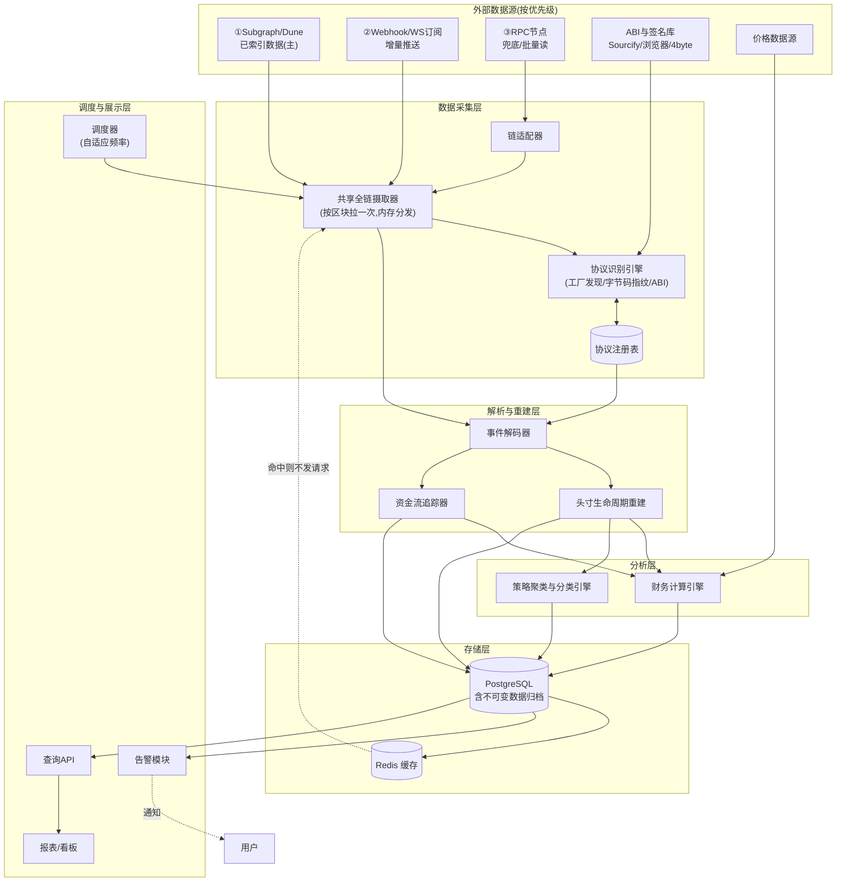
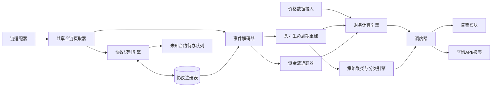
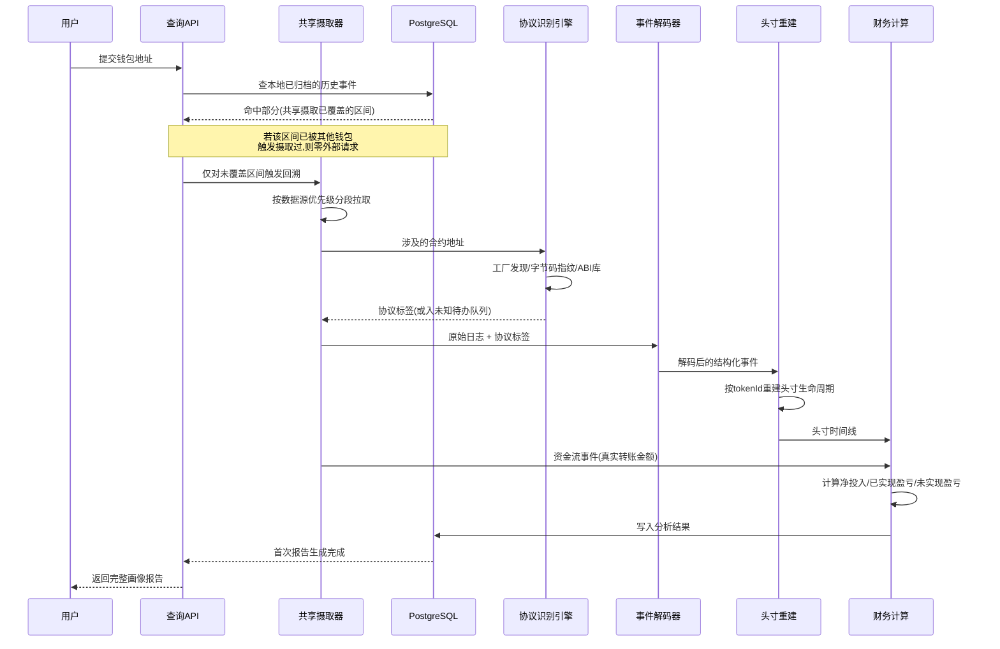
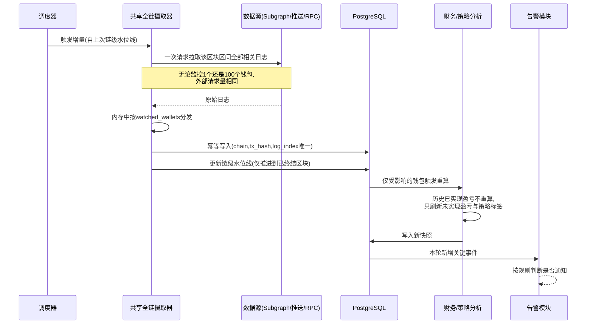
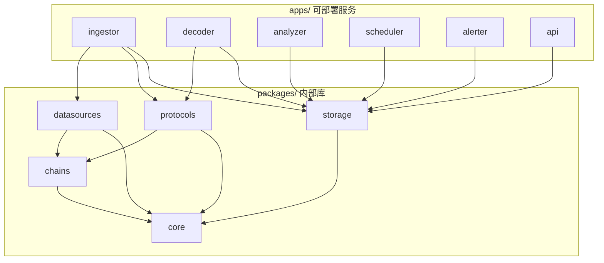

阅读说明：本文档在渲染 Mermaid 图的编辑器（VS Code、GitHub、Obsidian、Typora 等）中查看效果最佳。

> 同步自 Notion：[钱包链上行为分析系统设计方案](https://app.notion.com/p/3ba0eeec05a680aa9410ce95e86a4231)

# 钱包链上行为分析系统 · 技术设计方案

## 0. 文档定位
本方案把这次人工分析 0x05BBf9032F4c829E31A1f1b0B725d77329fAD6be 这个钱包的全过程(找地址→拉交易→识别协议→还原头寸生命周期→识别真实转账金额→算投入/盈亏/年化→归纳策略区间逻辑)固化成一套可复用、可持续运行的系统。目标是:给定任意钱包地址,系统能自动、持续地回答五个问题——这个钱包在和什么协议交互、具体做了什么操作、用的是什么策略、投入了多少钱、赚了/亏了多少。
设计基调:**分析系统,不是交易系统**。不需要毫秒级延迟,核心矛盾是数据覆盖面、协议识别准确率、资金计算的正确性(尤其是”伪装成 dust 的大额转账”这类坑),以及多钱包持续监控的可运维性。

## 1. 需求与目标

### 1.1 要回答的问题(验收标准)
对任意一个监控中的钱包,系统应能持续维护并展示:
1. **协议交互**:这个钱包历史上和哪些合约/协议交互过(PancakeSwap V3 Position Manager、Router、其他 DEX、借贷协议等),每个协议的交互频率和时间分布。
2. **操作还原**:每一次头寸的完整生命周期(开仓 tick 区间、加减仓、收手续费、平仓/销毁),以及非 LP 类操作(普通 swap、转账)。
3. **策略画像**:基于操作模式归纳出策略类型标签(如”窄区间高频调仓”、“宽区间被动 LP”、“套利/羊毛党”、“纯持有”),给出支撑这个判断的统计特征。
4. **资金投入**:任意时间窗口内,这个钱包净投入了多少本金(转入 - 转出,美元计价,包含被误判为 dust 的隐藏转账)。
5. **盈亏核算**:已实现盈亏、未实现盈亏(还锁在 NFT 头寸里的部分)、总盈亏、年化收益率,以及资金最终流向(是否转到交易所地址等)。

### 1.2 系统目标
- G1:支持同时监控多个钱包,新钱包接入成本低(填地址即可,不需要为每个钱包写定制代码)。
- G2:协议识别和事件解析要做成可扩展的”适配器”模式,而不是硬编码在业务逻辑里,方便后续加新链、新协议。
- G3:资金计算必须基于**链上事件日志的真实转账金额**,不能依赖任何摘要字段或”看起来是 0”的展示层数据——这是这次人工分析踩过的坑,必须写成硬约束。
- G4:支持增量更新(定期只拉新区块),避免每次全量重算。
- G5:支持告警(新开仓、大额转出、钱包从活跃转为休眠等),但告警规则本身要可配置,不是写死的阈值。
- G6:**外部请求量不随监控钱包数量线性增长**——采用共享全链摄取,请求成本是 O(区块数) 而非 O(钱包数 × 区块数),详见第 7 章。
- G7:**人工维护量有界**——协议识别靠工厂自动发现/字节码指纹/公开 ABI 库四层自动化兜底,人工只需为每个新协议配 2-3 条种子记录,以及处理未知合约待办队列的队头,详见 3.2。

### 1.3 非目标
- 不做交易执行,不碰私钥,系统只读不写链。
- 不追求实时(秒级)监控,分析场景下分钟到小时级的更新延迟可接受。
- 不在第一阶段做机器学习式的策略分类,先用规则引擎把可解释的统计特征跑通,ML 作为后续可选增强。
- 不负责链下真实价格数据源(如 QQQ 之类合成资产背后的现实世界报价)本身的准确性维护,系统只做接入和使用,数据源选择和校准是运营层面的事。

## 2. 总体架构

架构分五层:数据采集(把链上数据搬下来)、解析与重建(把原始事件变成”头寸”和”资金流”这种业务对象)、分析(算钱、贴标签)、存储、调度与展示(定期跑、出告警、出报表)。
三条核心设计原则:
1. **协议识别和解析插件化**——新增一个 DEX 或一条新链,只需要新写一个适配器,不改动下游的分析逻辑。
2. **共享全链摄取,而不是按钱包各扫各的**——每个区块区间只从数据源拉取一次,在内存里按 `watched_wallets` 分发给各个钱包。数据获取成本是 O(区块数) 而不是 O(钱包数 × 区块数),监控 100 个钱包和监控 1 个钱包的外部请求量基本一致,这决定了系统的横向扩展上限。
3. **数据源分优先级,RPC 是最后手段**——优先用已经索引好的 Subgraph/Dune(一次 GraphQL 查询顶几百次 `eth_getLogs`),其次用 Webhook/WebSocket 推送获取增量,只有前两者覆盖不到时才直接打 RPC。详见第 7 章。

## 3. 模块设计


### 3.1 数据采集子系统
| 模块 | 职责 | 关键设计点 |
| --- | --- | --- |
| 链适配器 | 封装不同链的 RPC 调用差异(BSC/以后可能的 ETH/Arbitrum 等),提供统一的 `get_logs`/`get_tx`/`get_block` 接口 | 每条链一个适配器实现同一接口,新增链不改上层代码 |
| 共享全链摄取器 | 按区块区间**一次性**拉取全部相关事件日志,在内存里按 `watched_wallets` 分发到各个钱包,而不是每个钱包独立发起扫描 | 数据源按 Subgraph → 推送订阅 → RPC 的优先级降级使用;已终结区块的数据落库后视为不可变,永不重拉(详见第 7 章) |
| 协议识别引擎 | 判断一个合约地址属于哪个协议、什么类型 | 见 3.2,四层自动识别,人工只兜底极少数长尾 |
| 协议注册表 | 存储”合约地址 → 协议名称/协议类型/ABI”的映射 | 表内容主要由识别引擎自动写入,不是人工维护的静态清单 |

### 3.2 协议识别子系统
这是决定系统”认不认识”一个协议的关键模块,也是最容易变成人工无底洞的地方。设计目标是**把人工工作量从”逐个合约录入”压缩到”每个新协议配 2-3 条种子记录”**,靠四层自动识别逐级兜底:
**第一层:工厂自动发现(覆盖绝大部分场景)**
Uniswap V3 系协议(含 PancakeSwap V3)都有 Factory 合约,每创建一个交易对会发出 `PoolCreated` 事件,里面带着新池子地址和两个 token 地址。所以人工**只需要注册一个 Factory 地址**,系统扫它的历史事件就能自动生成全量池子表,而且以后新上线的池子会自动收录,不需要任何人工干预。Position Manager、Router 同样是单一固定地址,一起作为种子录入即可。
这一条是把注册表规模从”几万条池子地址人工维护”降到”每个协议 2-3 条种子”的关键——BSC 上光 PancakeSwap V3 就有数万个池子,靠人工补是补不完的,但它们全都能从一个 Factory 推导出来。借贷类协议通常也有类似的市场注册中心合约,思路一致。
**第二层:字节码指纹聚类**
同一协议的所有池子部署的是同一份合约代码,runtime bytecode 的 hash 完全相同(用最小代理克隆模式的更是如此)。系统为每个已识别协议存一份字节码指纹,遇到未知地址先取它的 code hash 比对,命中就直接归类。这对那些没有明显工厂结构、或者工厂事件不完整的协议特别有效,也能自动识别出同一协议的分叉/复制版本。
**第三层:已验证 ABI 与公开签名库**
未命中前两层时,尝试从 Sourcify、区块浏览器的已验证合约接口自动拉取 ABI 和合约名;事件层面还可以用 topic0 到公开签名库(4byte / openchain 这类)反查事件签名。这一层拿到的信息粒度较粗(能确认”这是个 ERC20”、“这是个名为 XXX 的已验证合约”),但足以让报表不至于一片空白。
**关键:抓到的 ABI 和字节码指纹必须永久缓存**——合约代码部署后不可变,同一个地址的 ABI 一辈子只需要抓一次。
**第四层:未知合约待办队列(人工只处理队头)**
前三层都没命中的,标记为”未知合约 0x…“,不猜测、不强行归类,在报表里如实展示。同时把它推进一个**按”出现频次 × 涉及资金量”排序的待办队列**。实际分布通常是前 5% 的未知合约占了 95% 的资金量,人只需要处理队头的几个,长尾部分保持”未知”完全不影响主要结论。这样人工投入是有界的,而且优先花在真正影响结论的地方。
一个必须保留的语义约束:同名事件在不同协议语境下含义不同(比如 `Mint` 在 V3 pool 里是”添加流动性”,在 ERC721 里是”铸造 NFT”),事件解码必须结合协议类型判断,不能只按事件名匹配。

### 3.3 解析与重建子系统
| 模块 | 职责 | 关键设计点 |
| --- | --- | --- |
| 事件解码器 | 用协议注册表里的 ABI/事件签名,把原始日志解码成结构化事件 | 一个事件可能需要结合同一笔交易里的其他事件才能完整理解(比如 Multicall 里打包的 decreaseLiquidity + collect,要在交易级别聚合) |
| 头寸生命周期重建 | 把同一个 NFT tokenId 的 Mint→IncreaseLiquidity→DecreaseLiquidity→Collect→Burn 串成一条完整时间线 | 记录每个阶段的 tick 区间、流动性数量、时间戳,这是策略分类和盈亏计算的共同基础数据 |
| 资金流追踪器 | 识别钱包所有实际的代币转入/转出,还原真实美元金额 | **硬约束(对应 G3)**:必须解析事件日志里的真实 `amount` 字段,禁止依赖任何”原生代币数量为0就判定为无关紧要”的判断逻辑;需要支持递归追踪资金去向(钱包→中间地址→交易所地址这种链路) |

### 3.4 财务计算子系统
| 模块 | 职责 | 关键设计点 |
| --- | --- | --- |
| 价格数据接入 | 获取每笔资金流发生时点的代币美元价格 | 主流代币(USDT等)价格接近1可简化;非主流/合成资产(比如跟踪现实世界股票的代币)需要专门的价格映射逻辑,不能假设有稳定可靠的链上价格 oracle |
| 财务计算引擎 | 计算净投入、已实现盈亏、未实现盈亏(锁在存活 NFT 头寸里的价值)、年化收益率 | 年化只对已完成的资金周期做线性外推,不做复利外推(复利外推对这类策略没有实际意义,之前分析已经论证过);需要区分”资金还在钱包/头寸里”和”资金已经转出到外部地址”两种状态。**未实现盈亏所需的头寸当前流动性,一律从已入库的 Mint/Increase/Decrease 事件本地推导,不调链上 view 函数**(见 7.5) |

### 3.5 策略聚类与分类子系统
**设计取向:聚类优先,人工只负责给簇命名。**
传统做法是人工写规则和阈值(“平均区间宽度 \< 0.1% 且日均调仓 \> 10 次 → 窄区间高频做市”)。问题在于阈值需要人反复调,而且只能识别人已经想到的策略类型——出现新玩法时系统是瞎的,得等人发现并补规则。
改成先做**无监督聚类**:对每个钱包提取一组标准化特征向量,包括头寸区间宽度分布(均值/方差)、平均持仓时长、单位时间调仓频率、gas 支出占收益比例、资金进出的周期性、交互协议的集中度、是否存在向固定地址归集资金的模式等,然后跑聚类算法把钱包自动分堆。人工的工作降级为**确认并给每个簇起名字**(看几个代表性样本,判断这堆是”窄区间高频做市”还是”套利机器人”),新出现的策略模式会自动形成新簇被推到人面前,不需要人主动去发现。
命名后的簇标签落库,后续新钱包接入时直接按特征向量归入最近的簇,即时得到标签。规则引擎保留但降级为**辅助校验层**:对少数几个高置信度、语义明确的判定(比如”该钱包 100% 交互集中在单一 LP 协议”)用显式规则打硬标签,和聚类结果交叉验证,不一致时标记出来供人复核。
特征工程本身需要迭代,建议每个特征都记录其可解释含义,避免聚类结果变成无法向人解释的黑盒——分析系统的输出必须是能讲清楚为什么的。

### 3.6 调度与展示子系统
| 模块 | 职责 | 关键设计点 |
| --- | --- | --- |
| 调度器 | 触发共享全链摄取的增量扫描,以及各钱包分析结果的刷新 | 扫描进度按**链**记录(全链摄取的水位线),不是按钱包各记一份;支持自适应频率和休眠退避(见 7.6);新增钱包首次接入时单独触发一次全量回溯 |
| 告警模块 | 根据可配置规则(新开仓、大额转出、长期休眠后突然活跃等)触发通知 | 规则和财务计算/策略分类模块解耦,消费的是分析结果而不是原始事件 |
| 查询API/报表 | 对外提供按钱包查询画像的接口,生成人类可读的报告 | 报告结构对应 1.1 的五个问题,一个钱包一份”画像” |

## 4. 关键流程

### 4.1 新钱包接入与首次全量分析

首次接入的一个重要优化:**先查本地归档,只回溯没覆盖到的区间**。由于共享摄取会把区块区间的全量日志落库,新钱包的历史很可能已经被之前的摄取覆盖了一部分,这部分完全不需要重新请求外部数据源。

### 4.2 定期增量更新(共享摄取模式)

关键点:扫描水位线记录在**链**这一级,而不是每个钱包各记一份。只有本轮日志里实际出现过的钱包才触发下游重算,没动静的钱包完全不消耗计算资源。水位线只推进到已终结区块,未终结的尾部区块下轮重扫,以此处理链重组。

## 5. 数据源与可行性
这部分直接对应这次人工分析踩过的坑,列出来避免重复踩(请求量优化的具体手段见第 7 章):
区块浏览器的免费 API 在很多链上对完整历史数据有限制(比如 V1 已废弃、V2 免费层对部分链不开放),不能把它当作唯一数据源。更可靠的路径是优先用协议官方或社区维护的 Subgraph(GraphQL 查询,天然支持按池子/地址过滤历史事件),或者 Dune 这类已经解码好的数据平台(适合批量分析和回测),两者都不需要自己维护索引器。如果这两个都覆盖不到(比较冷门的合约或链),再退化到直接用 RPC 节点的 `eth_getLogs` 自己拉取和解码,注意大多数 RPC 提供商会限制单次查询的区块范围,需要做分段和限速控制。
Dune 这类平台的另一个价值是它维护了社区解码好的协议表和地址标签,可以直接作为协议注册表的**种子数据来源**导入,省掉大量从零开始的人工整理。
价格数据方面,主流稳定币可以直接按 1 美元近似,但如果钱包涉及非主流资产,尤其是像本次分析中遇到的”链上合成资产跟踪链下真实世界价格”的情况,不能假设链上池子报价就是真实价格(这正是之前分析里”脱钩/被反向收割”那个风险点的数据层面对应问题),需要设计上支持”链上池子价格”和”链下参考价格”两个独立字段,即使不用来做实时套利判断,至少用来核算真实盈亏时能做交叉验证。

## 6. 存储设计

### 6.1 核心表结构(节选)
```sql
-- 监控中的钱包
CREATE TABLE watched_wallets (
    id BIGSERIAL PRIMARY KEY,
    chain VARCHAR(20) NOT NULL,
    address VARCHAR(64) NOT NULL,
    label VARCHAR(100),
    last_scanned_block BIGINT DEFAULT 0,
    status VARCHAR(20) DEFAULT 'active',  -- active / dormant
    created_at TIMESTAMPTZ DEFAULT now(),
    UNIQUE(chain, address)
);

-- 协议注册表
CREATE TABLE protocol_registry (
    id BIGSERIAL PRIMARY KEY,
    chain VARCHAR(20) NOT NULL,
    contract_address VARCHAR(64) NOT NULL,
    protocol_name VARCHAR(100),
    protocol_type VARCHAR(50),  -- dex_pool / dex_router / position_manager / lending / unknown
    abi_ref VARCHAR(200),
    UNIQUE(chain, contract_address)
);

-- 解码后的事件(通用结构,payload存具体字段)
CREATE TABLE decoded_events (
    id BIGSERIAL PRIMARY KEY,
    chain VARCHAR(20) NOT NULL,
    tx_hash VARCHAR(80) NOT NULL,
    log_index INT NOT NULL,
    block_number BIGINT NOT NULL,
    block_time TIMESTAMPTZ NOT NULL,
    wallet_address VARCHAR(64) NOT NULL,
    contract_address VARCHAR(64) NOT NULL,
    protocol_type VARCHAR(50),
    event_name VARCHAR(50),  -- Mint / Burn / Collect / Swap / Transfer ...
    payload JSONB NOT NULL,  -- 解码后的具体字段,真实金额存在这里
    UNIQUE(chain, tx_hash, log_index)
);

-- 头寸生命周期
CREATE TABLE positions (
    id BIGSERIAL PRIMARY KEY,
    chain VARCHAR(20) NOT NULL,
    wallet_address VARCHAR(64) NOT NULL,
    protocol_name VARCHAR(100),
    token_id VARCHAR(80),  -- NFT tokenId,非NFT头寸可为空
    pool_address VARCHAR(64),
    tick_lower INT,
    tick_upper INT,
    opened_at TIMESTAMPTZ,
    closed_at TIMESTAMPTZ,
    status VARCHAR(20)  -- open / closed / empty_shell
);

-- 资金流(真实转账,已还原金额)
CREATE TABLE cashflows (
    id BIGSERIAL PRIMARY KEY,
    chain VARCHAR(20) NOT NULL,
    wallet_address VARCHAR(64) NOT NULL,
    tx_hash VARCHAR(80) NOT NULL,
    direction VARCHAR(10),  -- in / out
    token_address VARCHAR(64),
    amount_token NUMERIC(38, 18),
    amount_usd NUMERIC(20, 2),
    counterparty_address VARCHAR(64),
    block_time TIMESTAMPTZ
);

-- 分析结果快照(每次增量更新后写一条)
CREATE TABLE pnl_snapshots (
    id BIGSERIAL PRIMARY KEY,
    wallet_address VARCHAR(64) NOT NULL,
    snapshot_time TIMESTAMPTZ DEFAULT now(),
    net_invested_usd NUMERIC(20, 2),
    realized_pnl_usd NUMERIC(20, 2),
    unrealized_pnl_usd NUMERIC(20, 2),
    strategy_tags JSONB
);

-- 链级扫描水位线(共享摄取用,不再按钱包各记一份)
CREATE TABLE chain_cursors (
    chain VARCHAR(20) PRIMARY KEY,
    last_finalized_block BIGINT NOT NULL DEFAULT 0,
    updated_at TIMESTAMPTZ DEFAULT now()
);

-- 区块时间戳映射(不可变,懒加载写入,严禁全量回填,见 7.4)
CREATE TABLE blocks (
    chain VARCHAR(20) NOT NULL,
    block_number BIGINT NOT NULL,
    block_time TIMESTAMPTZ NOT NULL,
    PRIMARY KEY (chain, block_number)
);

-- 合约字节码指纹(协议识别第二层)
CREATE TABLE contract_fingerprints (
    id BIGSERIAL PRIMARY KEY,
    code_hash VARCHAR(80) NOT NULL UNIQUE,
    protocol_name VARCHAR(100),
    protocol_type VARCHAR(50),
    abi_ref VARCHAR(200),
    source VARCHAR(30)  -- factory / sourcify / explorer / manual
);

-- token 元数据(decimals/symbol不可变,永久缓存)
CREATE TABLE token_metadata (
    chain VARCHAR(20) NOT NULL,
    token_address VARCHAR(64) NOT NULL,
    symbol VARCHAR(50),
    decimals SMALLINT,
    PRIMARY KEY (chain, token_address)
);

-- 未知合约待办队列(按影响力排序,人工只处理队头)
CREATE TABLE unknown_contracts (
    id BIGSERIAL PRIMARY KEY,
    chain VARCHAR(20) NOT NULL,
    contract_address VARCHAR(64) NOT NULL,
    occurrence_count BIGINT DEFAULT 0,
    involved_usd NUMERIC(20, 2) DEFAULT 0,
    priority_score NUMERIC(20, 2),  -- 频次 × 金额,人工按此降序处理
    resolved BOOLEAN DEFAULT false,
    UNIQUE(chain, contract_address)
);
```

### 6.2 存储选型
| 数据类型 | 选型 | 理由 |
| --- | --- | --- |
| 结构化事件/头寸/资金流/分析结果 | PostgreSQL | 关系清晰(钱包-事件-头寸-资金流之间有明确外键关系),事务保证一致性,JSONB 字段兼顾解码payload的灵活性 |
| 不可变数据归档(已终结事件、区块时间戳、ABI、token元数据、字节码指纹) | PostgreSQL(独立表,只增不改) | 这类数据链上永远不会变,落库后所有查询本地命中,是压缩外部请求量的主要手段 |
| 链级扫描水位线/热点查询缓存 | Redis | 缓存最近查询过的报告结果和高频访问的元数据,减少重复计算与重复请求 |

## 7. 外部请求量控制策略
分析系统的主要成本不在计算,而在外部数据请求(RPC 调用配额、Subgraph 查询次数)。这一章集中说明把请求量压到最低的手段,是本方案的核心优化点。

### 7.1 共享全链摄取(最大杠杆)
每个区块区间只向数据源拉取一次日志,在内存里按 `watched_wallets` 分发。请求量是 O(区块数) 而不是 O(钱包数 × 区块数)。监控 1 个钱包和 100 个钱包,外部请求量基本相同,这是系统能扩到几百上千个监控钱包的前提。
对比:朴素的按钱包独立扫描方案,监控 100 个钱包就要把同一批区块重复请求 100 遍,请求量随监控规模线性膨胀,很快就会打满任何配额。

### 7.2 数据源优先级降级
按 ① Subgraph/Dune(已索引)→ ② Webhook/WS 推送 → ③ RPC `eth_getLogs` 的顺序降级使用。一次 GraphQL 查询能覆盖的数据量相当于几百次 `eth_getLogs`,而且不消耗 RPC 配额。RPC 只在前两者覆盖不到(冷门合约、冷门链、或需要读特定状态)时启用。
注意 RPC 提供商通常对单次 `eth_getLogs` 的区块跨度有上限,走到这一层时必须做分段和限速。

### 7.3 推送替代轮询
主流 RPC 服务商提供 Webhook 或 WebSocket 订阅,可以只在关注的地址真正产生交易时才推送。定时轮询在大部分时间是空跑——尤其监控列表里必然有大量长期休眠的钱包。改成推送后,休眠钱包的请求消耗直接降到零。
轮询保留为兜底,用于补齐推送可能漏掉的事件(定期做一次低频对账扫描)。

### 7.4 不可变数据只拉一次,永不重拉
链上有大量数据是永久不变的,拉过一次就该永久落库:
- 已终结区块的事件日志
- 区块号 → 时间戳映射(**必须单独建表**,否则每条事件都去查区块信息会是巨大浪费)
- token 的 `decimals`/`symbol`
- 合约的 ABI 与字节码
原则:全量回填在系统生命周期内**只应该发生一次**,之后所有对历史数据的访问都必须命中本地库。
> **重要约束:****`blocks`**** 表必须懒加载,严禁全量回填。**<br>BSC 出块 0.45 秒,一年约 7000 万个区块,全量灌进 `blocks` 表就是 3GB+ 的无用数据。正确做法是**只在解析到某条事件、需要它所在区块的时间戳时才按需写入**。实际有相关事件的区块一年通常只有一两百万个,占用几十 MB 量级。同理适用于任何”看起来可以预先拉全”的链上数据——按需拉取,不要预热。

### 7.5 从事件重建状态,不要调 view 函数
需要知道某个头寸的当前流动性时,直接调 Position Manager 的 `positions(tokenId)` 是最直观的写法,但如果该头寸的 Mint/Increase/Decrease 事件都已入库,这个值可以纯本地推导出来,一次请求都不用发。
**通用原则:凡是能从已有事件推导出来的状态,就不要再问链。** 这条在计算未实现盈亏、判断空壳头寸时收益最明显——否则每轮刷新都要对每个存活头寸发一次调用,请求量随头寸数量线性增长。

### 7.6 自适应扫描频率与休眠退避
活跃钱包高频刷新,休眠钱包指数退避(例如连续 30 天无动作后降到每天一次)。结合 7.1 的共享摄取,这一条主要作用于下游分析的触发频率和兜底轮询的节奏。
链重组处理只需重扫最近若干个未终结区块,已终结部分视为不可变,不参与重复拉取。

### 7.7 批量合并读调用
确实需要批量读取链上状态时(比如一次性核对一批 token 的元数据),用 Multicall 类合约把 N 次调用打包进 1 次请求;JSON-RPC 协议本身也支持数组形式的批量请求。这块通常能把请求数压缩一到两个数量级。

### 7.8 效果预期
上述手段叠加后,相比朴素实现:人工维护量从”持续录入数万条合约记录”降到”每个新协议配 2-3 条种子 + 偶尔确认聚类标签”;外部请求量在多钱包场景下可降低一到两个数量级,且不随监控钱包数量线性增长。具体数字见第 8 章容量估算。

## 8. 容量与成本估算
> 以下估算基于 2026 年 8 月的公开定价与 BSC 链参数,数字会随时间变化,落地前建议重新核对。

### 8.1 估算前提
| 参数 | 取值 | 说明 |
| --- | --- | --- |
| BSC 出块时间 | 0.45 秒 | Fermi 升级后;**每天约 19.2 万个区块**,比多数链快很多,估算时容易低估 |
| 监控钱包数 | 50 个 | 中等规模场景 |
| 单钱包活跃度 | 平均 20 笔交易/天 | 高频机器人可达数百笔/天,见 8.4 敏感性说明 |
| 单笔交易日志数 | 约 10 条 | LP 类操作(Multicall 打包)日志较多 |
| `eth_getLogs` 单次跨度 | 2000 区块 | 各家 RPC 限制不同,通常 2000–10000,取保守值 |

### 8.2 RPC 请求量
**日常增量扫描**:用 `eth_getLogs` 带 topic 过滤(把全部监控钱包地址放进 topic 数组做 OR 匹配),一次请求覆盖所有钱包:
- 19.2 万区块 ÷ 2000 = **约 96 次查询/天/过滤器组**
- 需要约 5 组过滤器(ERC20 Transfer 的 from/to 两个 topic 位置、ERC721 Transfer、协议特定事件等)
- 合计 **约 480 次/天 ≈ 1.5 万次/月**
按 Alchemy 的计费口径(`eth_getLogs` 约 75 CU/次)折算:**约 112 万 CU/月**。
**这个数字成立的前提是 7.1 的共享全链摄取。** 如果按朴素的”每个钱包各扫各的”,50 个钱包要乘以 50 倍 → 约 5600 万 CU/月,虽然还在免费额度内,但已经开始逼近,再扩几倍就会超。这是共享摄取设计价值最直观的体现。
**历史回填**是请求量的真正大头,但应该**走 Subgraph 而不是 RPC**:
- 纯 RPC 方式:一个两年历史的钱包约覆盖 1.4 亿个区块 → 约 35 万次查询 ≈ 2600 万 CU,一次性还扛得住但极其浪费
- Subgraph 方式:一次 GraphQL 查询分页返回上千条实体,一个钱包几千条历史事件只需几次查询,成本几乎可忽略
结论:**回填走 Subgraph,增量走 RPC/推送**,两边都停留在免费额度的零头。

### 8.3 存储容量
主要占用是 `decoded_events` 表(含 JSONB payload):
- 每天约 1 万条日志 × 约 800 字节 ≈ **8 MB/天**
- 加索引开销 → **约 4–5 GB/年**
其余表量级都很小:`positions` / `cashflows` / `pnl_snapshots` 合计一年不超过几百 MB;`blocks` 表在懒加载约束下(见 7.4)一年几十 MB;协议注册表、字节码指纹表是 MB 级。
**总计约 5 GB/年**(中等活跃度场景)。
可选的进一步压缩手段:`decoded_events` 按月分区;原始 `payload` 在已经派生出 `positions`/`cashflows` 之后可以只保留未识别协议的部分,已完全消化的事件删除 payload 只留结构化字段,能省掉大部分空间。

### 8.4 敏感性说明
存储量对**监控钱包的活跃度**高度敏感,对钱包数量反而不那么敏感:
- 如果监控的是本文档背景中那类高频 JIT 机器人(单个每天数百笔交易),单个钱包就可能贡献 1 GB/年以上,50 个这样的钱包会到 **20–50 GB/年**
- 如果监控的多是低频钱包,可能一年不到 1 GB
RPC 请求量则相反——受共享摄取保护,基本只跟**链的出块速度和扫描区块跨度**有关,跟钱包数量和活跃度都不敏感。

### 8.5 免费额度可行性
| 项目 | 免费额度 | 本方案需求 | 结论 |
| --- | --- | --- | --- |
| RPC(Alchemy) | 300M CU/月 | 约 1.1M CU/月 | **够**,余量约 250 倍 |
| RPC(Ankr) | 500M CU/天(公共层) | 约 0.04M CU/天 | **够**,余量极大 |
| Subgraph(The Graph) | 10 万查询/月 | 每钱包回填几次查询 | **够** |
| Dune | 2500 credits/月 | 仅一次性种子数据导入 | **够**(不可用于日常查询) |
| 托管 PostgreSQL 免费层 | 约 500 MB | 5–50 GB/年 | **不够** |
两个要点:
**Dune 的定位必须限制为一次性种子导入。** 2500 credits/月按查询复杂度扣减,不足以支撑常规链路。用它来导入协议地址标签、社区解码好的协议表作为注册表种子,之后就不再依赖。
**数据库自己跑,不要用免费托管层。** 主流托管 PostgreSQL 的免费层普遍在 500 MB 量级,和本方案 GB 级的年增量差了一到两个数量级。直接在本地机器(比如开发用的 MacBook)或最便宜的 VPS 上跑 Docker Postgres 即可,磁盘成本远低于为了迁就免费额度而做的各种妥协。这也和本方案的整体定位一致——分析系统没有延迟敏感场景,本地运行完全可行。

## 9. 技术选型
| 组件 | 语言/技术 | 理由 |
| --- | --- | --- |
| 共享摄取器、事件解码器、财务计算、策略聚类、调度器、API | Python | 这套系统没有延迟敏感场景,全部是批处理/分析型任务,Python 生态(web3.py/pandas/requests,以及聚类所需的 scikit-learn)开发效率最高,统一单一语言也降低维护成本 |
| 高并发批量拉取(未来监控规模大幅增长时) | 可选升级为 Go | 采用共享全链摄取后,请求量不随钱包数增长,Python 的异步 IO 通常已经够用;仅在扩到多链并行摄取出现瓶颈时再考虑,不是初期必需 |
| 报表/看板 | HTML + 轻量图表库,或直接生成 Markdown/PDF 报告 | 初期不需要复杂前端,能把 1.1 的五个问题清晰呈现即可 |
| 消息通知(告警) | 邮件/IM webhook 二选一即可 | 告警量级低,不需要引入消息队列 |

## 10. 代码仓库模块设计
采用 **Monorepo 单仓库**。这套系统各模块共享大量数据模型(事件、头寸、资金流)和数据库访问层,拆多仓会带来大量跨仓同步成本,收益却很低。而且技术栈统一为 Python,不存在多语言必须分仓的理由。

### 10.1 目录结构
```text
wallet-analyzer/
├── pyproject.toml                  # 统一依赖与工具链配置
├── docker-compose.yml              # 本地一键起 Postgres + Redis
├── README.md
│
├── packages/                       # 可复用的内部库(被 apps 依赖)
│   ├── core/                       # 领域模型与通用能力(不依赖任何外部服务)
│   │   ├── models/                 # 领域对象: Event / Position / Cashflow / Wallet
│   │   ├── types/                  # 枚举与值对象: ProtocolType / EventName / Chain
│   │   └── errors/                 # 统一异常定义
│   │
│   ├── storage/                    # 存储访问层(唯一直接碰 DB 的地方)
│   │   ├── repositories/           # 按聚合根划分的仓储: WalletRepo/EventRepo/PositionRepo...
│   │   ├── migrations/             # 数据库迁移脚本(Alembic)
│   │   └── cache/                  # Redis 封装
│   │
│   ├── chains/                     # 链适配器(每条链一个实现,统一接口)
│   │   ├── base.py                 # ChainAdapter 抽象接口: get_logs/get_block/multicall
│   │   ├── bsc.py
│   │   └── evm_common.py           # EVM 系通用实现,新增 EVM 链主要靠继承它
│   │
│   ├── datasources/                # 外部数据源接入(按 7.2 的优先级降级)
│   │   ├── base.py                 # DataSource 抽象接口 + 降级编排器
│   │   ├── subgraph.py             # ①已索引数据源(主)
│   │   ├── push.py                 # ②Webhook/WebSocket 推送
│   │   ├── rpc.py                  # ③RPC 兜底,含分段与限速
│   │   └── prices.py               # 价格数据接入
│   │
│   └── protocols/                  # 协议插件(新增协议只动这里)
│       ├── base.py                 # ProtocolPlugin 接口: 声明种子地址、事件语义、解析逻辑
│       ├── registry.py             # 插件注册与查找
│       ├── identification/         # 四层识别机制(见 3.2)
│       │   ├── factory_discovery.py    # 第一层: 工厂自动发现
│       │   ├── bytecode_fingerprint.py # 第二层: 字节码指纹
│       │   ├── abi_resolver.py         # 第三层: Sourcify/浏览器/签名库
│       │   └── unknown_queue.py        # 第四层: 未知合约待办队列
│       └── plugins/
│           ├── pancakeswap_v3.py   # 首个协议实现(含种子地址常量)
│           └── erc20.py
│
├── apps/                           # 可独立部署运行的服务
│   ├── ingestor/                   # 共享全链摄取器(7.1 的实现)
│   ├── decoder/                    # 事件解码 + 头寸重建 + 资金流追踪
│   ├── analyzer/                   # 财务计算 + 策略聚类
│   ├── scheduler/                  # 调度器(自适应频率、休眠退避)
│   ├── alerter/                    # 告警模块
│   └── api/                        # 查询 API + 报表生成
│
├── cli/                            # 运维与调试命令行入口
│   ├── add_wallet.py               # 接入新钱包并触发回填
│   ├── backfill.py                 # 手动指定区间回填
│   ├── resolve_unknown.py          # 处理未知合约待办队列队头
│   └── report.py                   # 生成单钱包画像报告
│
├── notebooks/                      # 特征探索与聚类调参(研究用,不进生产)
│
└── tests/
    ├── unit/
    ├── integration/
    └── fixtures/                   # 真实链上事件样本,作为回归基准
```

### 10.2 依赖方向

**依赖只能自上而下,严禁反向和跨层回指。** 三条硬约束:
1. `core` 是纯领域模型,不依赖任何其他包,也不碰数据库和网络——保证领域逻辑可以脱离基础设施单独测试。
2. `storage` 是**唯一**直接访问数据库的地方,`apps` 里不允许出现裸 SQL。这样加索引、改分区策略、换存储引擎时只需要动一个包。
3. `apps` 之间**不互相依赖**,只通过数据库和 Redis 交换状态。想拆成独立进程部署或合并成单进程跑,都不需要改代码。

### 10.3 扩展点设计
整套架构的可扩展性集中收敛到两个接口上,这是”加新链/新协议不改老代码”的落地保证:
**新增一条链** → 在 `packages/chains/` 下实现 `ChainAdapter` 接口。EVM 系的链继承 `evm_common.py` 通常只需覆盖少量差异(chain id、区块时间、RPC 特殊限制)。
**新增一个协议** → 在 `packages/protocols/plugins/` 下新增一个文件,实现 `ProtocolPlugin` 接口,声明三样东西:种子合约地址(Factory / Position Manager 等,通常 2–3 条,对应 3.2 第一层)、事件签名到业务语义的映射(比如声明本协议语境下 `Mint` 是”添加流动性”而非”铸造 NFT”)、以及头寸重建所需的特殊解析逻辑。
**下游的解码、财务计算、策略聚类全部不需要改动**——它们消费的是 `core/models` 里的统一领域对象,不感知具体协议。这一点应该在第 12 章第四阶段作为验收标准来验证。

### 10.4 部署形态
初期建议**单进程模式**:所有 `apps` 由一个调度主循环串起来跑,配合 `docker-compose` 起 Postgres + Redis,一台机器(包括 MacBook)就能完整运行。
随着监控规模增长,`ingestor` 通常是第一个需要独立出去持续运行的服务(尤其接入推送订阅后需要常驻),`api` 次之。由于 10.2 已经约束了 `apps` 之间无直接依赖,这个拆分不需要重构,只是改部署方式。

## 11. 局限与风险
协议识别虽然做了四层自动化,但**长尾始终存在**——没验证源码、没有工厂结构、字节码指纹也对不上的冷门合约只能标”未知”。设计上通过待办队列把人工投入控制在有界范围(只处理高影响力的队头),但”未知合约”这一类永远不会归零,报表必须如实展示这部分占比,让使用者知道结论的完整度。
数据源方面,依赖第三方 Subgraph/Dune 的可用性和数据完整性,这些平台的索引偶尔会有延迟或缺口。共享摄取模式下这个风险被放大了——一次拉取的缺口会同时影响所有钱包,所以必须有独立的数据完整性校验(比如定期抽样用 RPC 交叉验证某段区块的事件数),发现不一致时主动标记而不是静默产出错误结论。
聚类分类的风险在于**簇的可解释性**。如果特征工程做得不好,聚出来的簇可能没有清晰的业务含义,人无法命名。缓解办法是所有特征保持可解释,并且保留规则引擎作为交叉验证层。
其余固有风险:多签钱包/合约钱包(而不是普通外部账户)的行为模式和资金归属关系更复杂,识别和归因逻辑需要单独考虑;价格数据尤其是非主流/合成资产的历史价格,准确性直接影响盈亏可信度,应保留”数据来源”和”可信度”标记,而不是把所有价格当作同等可靠。

## 12. 分阶段落地建议
**第一阶段**:单链单协议(BSC + PancakeSwap V3)手动触发全量分析。重点是把协议识别的**第一层(工厂自动发现)** 跑通——只录 Factory 和 Position Manager 两个种子地址,验证能否自动展开出全量池子表,这是整个降本设计成立与否的关键验证。同时打通事件解码、头寸重建、资金流追踪、财务计算主链路,用这次人工分析过的钱包地址做准确性校验基准。
**第二阶段**:实现共享全链摄取 + 不可变数据归档(blocks / token_metadata / ABI 缓存),加调度器和增量更新,支持多钱包监控。这一阶段结束后应能实测验证”监控钱包数增加,外部请求量基本不变”。
**第三阶段**:补齐协议识别的第二、三、四层(字节码指纹、已验证 ABI 自动拉取、未知合约待办队列),接入推送订阅替代部分轮询,加告警模块和查询 API/报表。
**第四阶段**:扩展第二条链或第二个协议,验证适配器模式是否真的做到了”加新协议只需配种子地址,不改老代码”。**验收标准很明确**:新增协议时,代码改动应只发生在 `packages/protocols/plugins/` 下的新文件里(见 10.3);如果被迫改到了 `apps/` 或 `packages/core/`,说明抽象设计有问题,需要回头调整接口。
策略聚类贯穿各阶段迭代:前期样本少时先用简单规则出标签,样本积累到一定量(建议几十个钱包以上)再切到聚类,否则聚类没有意义。

## 13. 附录:核心术语
- **头寸生命周期**:一个 LP 仓位从 Mint(创建)到 Burn(销毁)之间,包括中间所有 IncreaseLiquidity/DecreaseLiquidity/Collect 操作的完整时间线。
- **空壳头寸(empty shell)**:流动性已经为0但 NFT 本身还没有被销毁的头寸,数量统计和展示时需要单独标记,避免误判为仍有资金投入。
- **已实现/未实现盈亏**:已实现指资金已经从头寸中撤出并计价确认的盈亏;未实现指还锁在存活头寸里、需要按当前价格估值的部分。
- **协议适配器**:把特定链或特定协议的事件结构/ABI 差异封装起来,对上层解析逻辑暴露统一接口的模块,是系统支持多链多协议扩展的核心机制。
- **共享全链摄取**:每个区块区间只向外部数据源请求一次,在内存中按监控列表分发给各钱包的采集模式,使外部请求量与监控钱包数量解耦。
- **工厂自动发现**:通过扫描协议 Factory 合约的 `PoolCreated` 类事件,自动展开出该协议下全部子合约地址的识别方式,把注册表维护从”逐个录入”降为”录一个种子”。
- **字节码指纹**:合约 runtime bytecode 的哈希值,同一协议部署的同类合约指纹相同,可用于自动归类未知地址。
